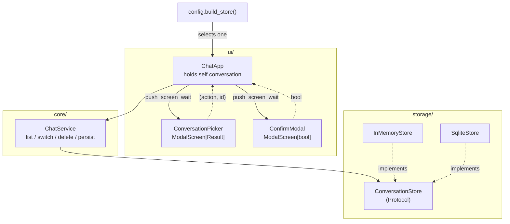
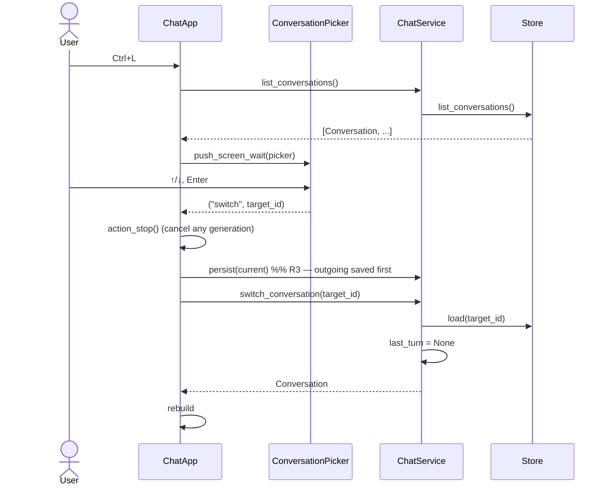
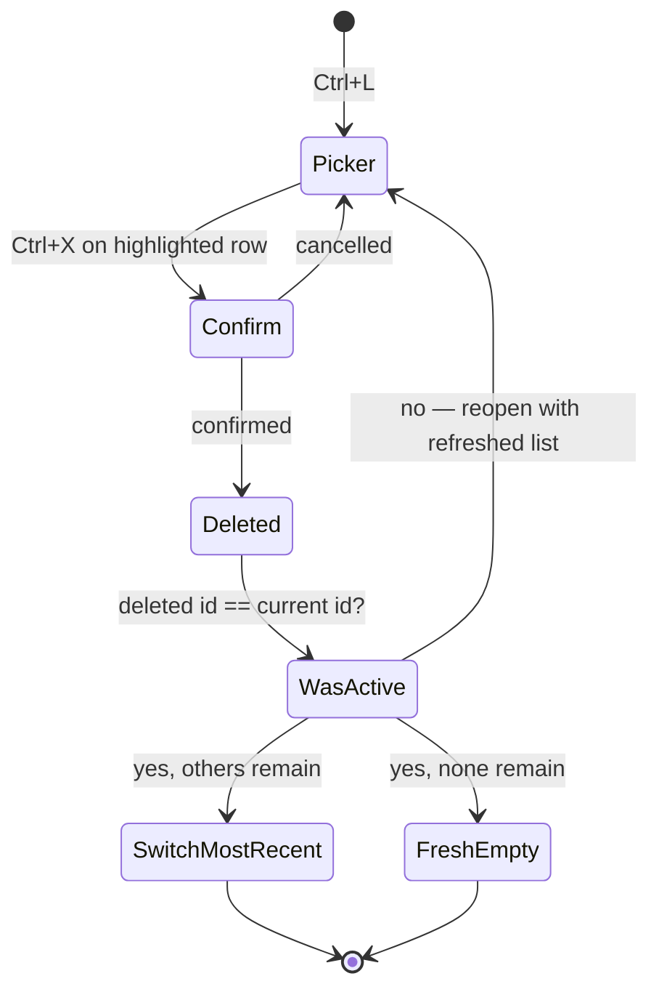

# feat: Conversation switching, overview, and durable storage

**Origin requirements:** `docs/requirements.md` (NFR set)
**Target repo:** this repo (`agentchat`)

---

## Summary

Today a conversation exists only as `ChatApp.conversation`, and the only way to
leave it is `Ctrl+N`, which abandons it. There is no way back. This plan adds
the missing half: a `SqliteStore` so conversations outlive the process, three
new `ChatService` methods for listing, switching, and deleting, and a modal
overview (`Ctrl+L`) that lists conversations and switches between them, with
deletion (`Ctrl+X`) behind a confirmation.

Nothing above the storage protocol learns that persistence changed —
`ConversationStore` already has the right shape, and only `config.py` names the
implementation.

---

## Problem Frame

`src/agentchat/core/chat.py` exposes `new_conversation()` and `stream_reply()`.
There is no `load`, no `switch`, no `delete` — the store protocol declares all
three (`src/agentchat/storage/base.py`), but nothing calls them. Concretely:

- **The active conversation is never in the store.** `ChatApp.__init__`
  constructs `Conversation()` directly (`src/agentchat/ui/app.py:45`), bypassing
  `ChatService.new_conversation()`, which is the only path that saves. The very
  first conversation of every session is invisible to `list_conversations()`.
- **`Ctrl+N` loses the old conversation.** `action_new_conversation` replaces
  `self.conversation` and clears the log. The old one stays in the store (if it
  ever got there) but has no route back.
- **Nothing survives restart.** `InMemoryStore` is the only implementation. Its
  own docstring calls this out: *"Correct shape, wrong lifetime — replaced by
  SQLite."*
- **No list surface exists.** The UI is header / log / statusbar / composer.
  There is no widget, screen, or binding that shows more than one conversation.

This blocks four origin requirements: NFR-U-03 (switch without corrupting the
conversation being left), NFR-S-01 (resume across restart), NFR-U-06
(confirmed removal), NFR-S-03 (inspectable durable format).

### Non-goals

Out of scope, and not touched by any unit here: adaptive RAG, sub-agent
deployment, the context-management elective beyond what already exists,
fine-tuned adapters, memory scoped to conversation *groups* (NFR-S-02 — the
`group_id` field stays reserved and unused), and history virtualisation
(NFR-U-02).

---

## Requirements

| ID | Requirement | Origin |
|---|---|---|
| R1 | `ChatService` can list the stored conversations, most-recently-updated first. | NFR-U-03 |
| R2 | `ChatService` can switch to an existing conversation by id, returning the authoritative `Conversation` object. | NFR-U-03 |
| R3 | Switching away from a conversation persists it first; no turn is lost. | NFR-U-03 |
| R4 | Conversations survive process restart in an inspectable format. | NFR-S-01, NFR-S-03 |
| R5 | The UI offers an overview of existing conversations and switches to a chosen one. | NFR-U-03, NFR-P-03 |
| R6 | The overview is reachable and usable while a generation is running. | NFR-U-04 |
| R7 | A conversation can be deleted from the overview, behind a confirmation. | NFR-U-06 |
| R8 | Deleting removes the conversation from the store completely, leaving no orphaned rows. | NFR-S-04 |
| R9 | A conversation restored from storage renders its full history, including which model produced each assistant turn. | NFR-U-01, NFR-FT-10 |
| R10 | Storage failure surfaces as a UI error, not a crash. | NFR-Q-02 |
| R11 | Storage I/O does not block the event loop. | NFR-U-04 |
| R12 | The store implementation is selectable by configuration. | NFR-Q-03 |

---

## Key Technical Decisions

**KTD1 — `ChatService` stays stateless about which conversation is active.**
`switch_conversation(id)` *returns* the `Conversation`; the UI keeps holding it
in `ChatApp.conversation` and keeps passing it to `stream_reply`. The
alternative — moving the active conversation into `ChatService` and dropping the
parameter from `stream_reply` — is a wider refactor that would rewrite six
tests in `tests/test_core.py` for no gain here. The requirement ("extend
`ChatService` to switch to an existing conversation") is met either way.

**KTD2 — `switch_conversation` is the single id-to-object resolution point.**
`InMemoryStore.save()` stores objects *by reference*, so `load()` returns the
same instance you already hold (`tests/test_core.py:114` asserts exactly this).
`SqliteStore.load()` returns a *fresh* instance. Any code that assumes identity
will hold one object while the store holds another, and turns will land on the
wrong one. Routing every switch through one method that returns the store's
object makes the two implementations behave identically at the call site.

**KTD3 — Empty conversations are never persisted.** `new_conversation()` builds
and returns without saving; a conversation enters the store the first time it is
persisted with at least one message. Without this, every app launch would leave
another empty *"New conversation"* row in the overview. `ChatService.persist()`
owns the rule and documents it.

**KTD4 — Two tables, not a JSON blob column.** `conversations` and `messages`
with a foreign key. More inspectable for the grader (NFR-S-03) than a blob, and
message rows stay queryable. Cost: `save()` rewrites a conversation's message
rows (delete-then-insert in one transaction). At this scale — tens of
conversations, hundreds of messages, one save per turn — that is irrelevant.

**KTD5 — `sqlite3` on a worker thread, not `aiosqlite`.** Every store method
wraps its synchronous body in `asyncio.to_thread` (R11). This avoids a new
dependency and keeps the module readable. Each call opens its own connection
inside the thread, which sidesteps SQLite's thread-affinity rules entirely;
connection setup is microseconds and this is not a hot path.

**KTD6 — `Ctrl+L` opens the overview, not `Ctrl+P`.** `Ctrl+P` is Textual's
`COMMAND_PALETTE_BINDING` (verified on textual 8.2.8). `Ctrl+L` is bound by
neither `App`, `Screen`, nor `Input`, so it reaches the app while the prompt has
focus.

**KTD7 — `Ctrl+X` deletes inside the picker, not globally.** `Input.BINDINGS`
includes `ctrl+x` (cut). The prompt `Input` holds focus almost all the time, so
a global `Ctrl+X` would be shadowed unless declared `priority=True` — which
would permanently remove cut-in-prompt. Inside the picker the `ListView` has
focus and nothing shadows it, and deleting the *highlighted* row is the better
affordance for an overview anyway. See Open Questions Q1 for the global variant.

**KTD8 — The picker is presentational; the app performs the work.** The modal
receives an already-loaded list and returns a `(action, conversation_id)`
result. All `await`-ing store work stays in `ChatApp`. This keeps the modal
synchronous and trivially testable, and keeps store access in one place.

---

## High-Level Technical Design

Directional guidance for review, not implementation specification.

### Component relationships



The UI never imports `SqliteStore`. `config.build_store()` is the only place it
is named, mirroring how `build_registry` already handles backends.

### Switching sequence



### Delete decision points



---

## Output Structure

```
src/agentchat/
  storage/
    sqlite.py        NEW — SqliteStore + row (de)serialisation
  ui/
    screens.py       NEW — ConversationPicker, ConfirmModal
tests/
  test_storage.py    NEW — SqliteStore round-trip, delete, ordering
  test_switching.py  NEW — ChatService list/switch/delete/persist
```

Modified: `src/agentchat/core/chat.py`, `src/agentchat/config.py`,
`src/agentchat/ui/app.py`, `src/agentchat/ui/app.tcss`,
`tests/test_app.py`, `README.md`.

---

## Implementation Units

### U1. `SqliteStore`

**Goal:** A durable `ConversationStore` implementation.
**Requirements:** R4, R8, R11
**Dependencies:** none
**Files:**
- `src/agentchat/storage/sqlite.py` (new)
- `tests/test_storage.py` (new)

**Approach:**

1. `SqliteStore(path: Path)` — creates parent directories, then runs schema
   setup once in `__init__` (synchronous; it happens before the event loop
   matters).
2. Schema:
   ```sql
   CREATE TABLE IF NOT EXISTS conversations (
     id TEXT PRIMARY KEY, title TEXT NOT NULL, group_id TEXT,
     created_at TEXT NOT NULL, updated_at TEXT NOT NULL);
   CREATE TABLE IF NOT EXISTS messages (
     id TEXT PRIMARY KEY,
     conversation_id TEXT NOT NULL REFERENCES conversations(id) ON DELETE CASCADE,
     ordinal INTEGER NOT NULL, role TEXT NOT NULL, content TEXT NOT NULL,
     created_at TEXT NOT NULL, model_id TEXT, metadata TEXT NOT NULL);
   CREATE INDEX IF NOT EXISTS idx_messages_conversation
     ON messages(conversation_id, ordinal);
   ```
3. Every protocol method wraps a private synchronous `_...` body in
   `await asyncio.to_thread(...)` (KTD5). Each `_` body opens its own
   `sqlite3.connect(self._path)` in a `with` block and sets
   `PRAGMA foreign_keys = ON` — the pragma is per-connection, and without it the
   `ON DELETE CASCADE` above is silently ignored, orphaning message rows (R8).
4. `save()` is an upsert on `conversations` (`INSERT ... ON CONFLICT(id) DO
   UPDATE`), then `DELETE FROM messages WHERE conversation_id = ?`, then a bulk
   insert with `ordinal = enumerate` index — all inside one transaction.
5. Timestamps serialise with `datetime.isoformat()` and parse with
   `datetime.fromisoformat()`. `core.models._now()` produces timezone-aware UTC;
   the round-trip must keep the tzinfo, or `sorted(..., key=updated_at)` in
   `list_conversations` raises on mixed aware/naive comparison.
6. `Message.metadata` serialises with `json.dumps` / `json.loads`, defaulting to
   `{}`. Note that `stream_reply` writes a `"context"` dict into it — plain
   ints/strings/lists, all JSON-safe.
7. Wrap `sqlite3.Error` in `agentchat.core.errors.StorageError` (R10 — the class
   already exists and is unused).
8. `list_conversations` hydrates messages fully. See Open Questions Q2.

**Patterns to follow:** `InMemoryStore` in `src/agentchat/storage/base.py` for
method signatures and the `sorted(..., reverse=True)` ordering contract. Module
docstring style per `AGENTS.md` — one or two sentences.

**Test scenarios** (`tests/test_storage.py`, all using `tmp_path`):
- Save a conversation with two messages, `load()` it back from a *new*
  `SqliteStore` instance on the same path: title, `group_id`, both message
  roles, contents, and `model_id` all match.
- A message's `metadata` dict round-trips including a nested `"context"` dict.
- `created_at` and `updated_at` round-trip as timezone-aware datetimes
  (`loaded.created_at.tzinfo is not None`).
- Messages come back in insertion order after a save that appended a third
  message to an existing two-message conversation.
- Saving the same conversation twice does not duplicate message rows — assert
  `len(loaded.messages) == 2`, and assert the raw row count via a direct
  `sqlite3` query.
- `load()` on an unknown id returns `None`.
- `list_conversations()` returns most-recently-updated first.
- `list_conversations("g1")` returns only conversations with that `group_id`.
- `delete()` removes the conversation *and* its message rows — assert via a
  direct `SELECT COUNT(*) FROM messages WHERE conversation_id = ?` that zero
  rows remain (R8).
- `delete()` on an unknown id is a no-op, not an error.
- Pointing `SqliteStore` at an unwritable path raises `StorageError`, not a bare
  `sqlite3.Error`.

**Verification:** `uv run pytest tests/test_storage.py` passes; opening the
generated `.db` with the `sqlite3` CLI shows readable rows.

---

### U2. Store selection through configuration

**Goal:** Choose the store implementation from the environment, the same way
backends are chosen.
**Requirements:** R12, R4
**Dependencies:** U1
**Files:** `src/agentchat/config.py`, `tests/test_app.py`

**Approach:**

1. Add `STORES = ("sqlite", "memory")` beside the existing `BACKENDS` tuple.
2. Add `Settings.store: str`, defaulting from `_env("STORE", "sqlite")`, lowered
   and stripped — mirroring the existing `backend` field exactly.
3. Add `build_store(settings) -> ConversationStore`: unknown value raises
   `ConfigurationError` with the same message shape `build_registry` uses;
   `"memory"` returns `InMemoryStore()`; `"sqlite"` returns
   `SqliteStore(settings.data_dir / "agentchat.db")`.
4. In `tests/test_app.py`, add `overrides.setdefault("store", "memory")` to
   `mock_settings()`. Without this every app test writes a real `./data/`
   database as a side effect.

**Patterns to follow:** `build_registry` / `_register_local` in
`src/agentchat/config.py` — same validation shape, same "single wiring point"
comment convention.

**Test scenarios** (add to `tests/test_core.py`):
- `build_store(Settings(store="memory"))` returns an `InMemoryStore`.
- `build_store(Settings(store="sqlite", data_dir=tmp_path))` returns a
  `SqliteStore` and creates the file's parent directory.
- `build_store(Settings(store="nope"))` raises `ConfigurationError`.

**Verification:** `uv run pytest` passes and leaves no `data/` directory behind.

---

### U3. `ChatService` switching API

**Goal:** The three missing service methods, plus the persist rule.
**Requirements:** R1, R2, R3, R8, KTD1–KTD3
**Dependencies:** none (build and test against `InMemoryStore`)
**Files:** `src/agentchat/core/chat.py`, `tests/test_switching.py` (new)

**Approach:**

1. `async def list_conversations(self, group_id=None) -> list[Conversation]` —
   delegates to the store.
2. `async def switch_conversation(self, conversation_id: str) -> Conversation`:
   - `conversation = await self.store.load(conversation_id)`
   - raise `StorageError(f"No conversation {conversation_id!r}")` if `None`
   - set `self.last_turn = None` before returning. `last_turn` describes the
     previous conversation's context decision and drives the status bar's
     `context: dropped N` badge; carrying it across a switch reports one
     conversation's trimming against another's.
3. `async def delete_conversation(self, conversation_id: str) -> None` —
   delegates to `store.delete`.
4. `async def persist(self, conversation: Conversation) -> None` — saves unless
   `not conversation.messages`. Docstring states the skip explicitly (KTD3);
   this is the method's whole reason for existing over calling `store.save`.
5. Change `new_conversation` to build and return **without** saving (KTD3), and
   change `stream_reply`'s `finally` block from `await self.store.save(...)` to
   `await self.persist(...)`.

**Execution note:** Write the tests for `switch_conversation` and `persist`
before the implementation — the `last_turn` reset and the empty-skip are both
rules that are easy to implement plausibly and wrongly.

**Patterns to follow:** existing `ChatService` methods — short, one concern
each, no UI or backend knowledge.

**Test scenarios** (`tests/test_switching.py`):
- `list_conversations()` on a fresh service returns `[]`.
- After two conversations each take one turn, `list_conversations()` returns
  both, most-recently-updated first.
- `new_conversation()` alone does **not** appear in `list_conversations()`; it
  appears after its first `stream_reply` completes (KTD3).
- `persist()` on a conversation with no messages leaves the store empty;
  `persist()` on one with messages stores it.
- `switch_conversation(id)` returns a conversation whose `messages` match what
  was stored.
- `switch_conversation` on an unknown id raises `StorageError`.
- `switch_conversation` sets `last_turn` to `None` when a prior turn had set it
  (drive one `stream_reply` first, assert `last_turn is not None`, switch,
  assert `is None`).
- Round trip: take a turn in A, switch to B, take a turn in B, switch back to A
  — A still holds exactly its own two messages and none of B's (this is the
  NFR-U-03 no-corruption case, and mirrors the existing
  `test_conversations_do_not_leak_into_each_other`).
- The same round-trip test parameterised over both `InMemoryStore` and
  `SqliteStore(tmp_path / "t.db")`, proving the reference-vs-copy difference in
  KTD2 does not change behaviour.
- `delete_conversation` removes it from `list_conversations()`.

**Verification:** `uv run pytest tests/test_switching.py` passes against both
store implementations.

---

### U4. App owns its conversation through the store

**Goal:** Fix the bypass at `app.py:45`, and be able to render a conversation
loaded from storage.
**Requirements:** R3, R9, R10
**Dependencies:** U2, U3
**Files:** `src/agentchat/ui/app.py`, `tests/test_app.py`

**Approach:**

1. In `__init__`, build the store through config:
   `self.chat = ChatService(self.registry, store=build_store(self.settings))`.
   Keep `self.conversation = Conversation()` as the initial value so attribute
   access before mount stays safe.
2. Make `on_mount` async and replace the placeholder conversation with
   `await self.chat.new_conversation()`. It is not saved (KTD3), so a launch
   that types nothing leaves no trace.
3. Add `async def _show_conversation(self, conversation) -> None`:
   - `log = self.query_one("#chat-log", VerticalScroll)`; `await log.remove_children()`
   - if `conversation.messages` is empty, mount the placeholder `Static` and
     return
   - otherwise mount one `MessageBubble(message, model_name=self._model_name_for(message))`
     per message, then `log.scroll_end(animate=False)`
4. Add `def _model_name_for(self, message) -> str | None`: `None` for non-assistant
   messages; otherwise `self.registry.info(message.model_id).name`, catching
   `ModelNotFoundError` and falling back to the raw `model_id` string. A
   conversation saved under the `local` backend and reopened under `mock` (or
   vice versa) carries model ids the registry does not know — `info()` raises,
   and an unhandled raise here would break rendering of an otherwise valid
   history.
5. Add `async def _switch_to(self, conversation_id: str) -> None`:
   - `self.action_stop()` first — a live generation holds `MessageBubble`
     widgets that `_show_conversation` is about to remove, and its `finally`
     block writes to them
   - `await self.chat.persist(self.conversation)` (R3)
   - `self.conversation = await self.chat.switch_conversation(conversation_id)`
   - `await self._show_conversation(self.conversation)`; `self._refresh_status()`;
     focus the prompt
   - wrap the service calls in `try/except AgentChatError` and `self.notify(...,
     severity="error")` on failure (R10)
6. Rewrite `action_new_conversation` to reuse the new helpers: stop, persist the
   outgoing conversation, `self.conversation = await self.chat.new_conversation()`,
   `await self._show_conversation(...)`, refresh, focus.

**Patterns to follow:** the existing `action_new_conversation` for the
stop → mutate → re-render → refresh → focus ordering; `_refresh_status` for
status-bar updates; `MessageBubble.__init__` already renders `message.content`
into its body, so historical bubbles need no extra call.

**Test scenarios** (add to `tests/test_app.py`):
- On mount, `app.conversation.id` differs from the pre-mount placeholder's id
  and the conversation is not yet in the store.
- After one turn, `Ctrl+N`, then `_switch_to(first_id)`: the log shows two
  `MessageBubble`s with the original user text.
- `_show_conversation` on a conversation whose assistant message has a
  `model_id` the registry does not know renders without raising, and the bubble
  header contains the raw id.
- `_show_conversation` on an empty conversation mounts the placeholder and no
  bubbles.
- Switching while a generation is running cancels it, and the partial reply is
  still present in the conversation that was left (assert on the object, not the
  widgets).
- `_switch_to` on an unknown id notifies an error and leaves
  `app.conversation` unchanged (patch the service to raise `StorageError`).
- The existing `test_new_conversation_clears_the_log` still passes.

**Verification:** `uv run pytest tests/test_app.py` passes; running
`AGENTCHAT_BACKEND=mock uv run agentchat`, taking a turn, quitting, and
relaunching leaves the conversation in `./data/agentchat.db`.

---

### U5. Conversation picker modal

**Goal:** `Ctrl+L` opens an overview of conversations and switches to the chosen
one.
**Requirements:** R5, R6
**Dependencies:** U4
**Files:**
- `src/agentchat/ui/screens.py` (new)
- `src/agentchat/ui/app.py`, `src/agentchat/ui/app.tcss`, `tests/test_app.py`

**Approach:**

1. `screens.py` defines a result type — a frozen dataclass or a
   `tuple[Literal["switch", "new", "delete"], str | None]`; pick one and use it
   consistently.
2. `class ConversationPicker(ModalScreen[PickerResult | None])`:
   - `__init__(self, conversations: list[Conversation], current_id: str | None)`
     — takes the already-loaded list (KTD8); performs no I/O
   - composes a `Vertical` containing a title `Static`, a `ListView` of one
     `ListItem` per conversation, and a hint line
     (`enter switch · ctrl+x delete · esc cancel`)
   - each `ListItem` shows the title plus a dim meta line
     (`f"{len(c.messages)} turns · {c.updated_at:%b %d %H:%M}"`), carries the
     conversation id as an attribute, and gets a `-current` class when it is the
     active one
   - a final `ListItem` for *"+ New conversation"*
   - `BINDINGS = [Binding("escape", "cancel", "Cancel")]`, whose action calls
     `self.dismiss(None)`. Without an explicit screen-level binding, Escape
     falls through to the app's `action_stop`
   - `on_mount` focuses the `ListView`, or arrow keys do nothing
   - `on_list_view_selected` dismisses with `("switch", id)` or `("new", None)`
   - empty list: mount a single "No saved conversations yet." `Static` instead
     of the `ListView`
3. In `app.py`, add `Binding("ctrl+l", "open_conversations", "Chats")` (KTD6)
   and:
   ```python
   @work
   async def action_open_conversations(self) -> None:
       while True:
           conversations = await self.chat.list_conversations()
           result = await self.push_screen_wait(
               ConversationPicker(conversations, self.conversation.id))
           ...
   ```
   Two constraints on this worker: `push_screen_wait` raises `NoActiveWorker`
   outside a worker context, so the `@work` decorator is required; and it must
   **not** use `group=_GENERATION_GROUP`, or opening the picker would cancel a
   running generation (R6). The bare `@work` default group is correct.
4. Handle `None` (cancelled) by returning; `("switch", id)` by calling
   `_switch_to` and returning; `("new", None)` by calling
   `action_new_conversation` and returning. The `while` loop exists for U6's
   delete case, which reopens the picker with a refreshed list.
5. Add `app.tcss` rules for `#picker` (centered, bordered, `width: 60`,
   `max-height: 80%`), `.picker__meta` (`color: $text-muted`), and
   `.picker__item.-current` (`color: $accent`).

**Patterns to follow:** existing `BINDINGS` list and `action_*` naming in
`app.py`; `app.tcss` uses `$accent` / `$text-muted` / `$panel` design tokens
throughout — stay on tokens, no literal colours.

**Test scenarios** (add to `tests/test_app.py`):
- `Ctrl+L` with saved conversations opens the picker — `app.screen` is a
  `ConversationPicker` — and it lists one item per stored conversation plus the
  "New conversation" row.
- Pressing Escape in the picker dismisses it, `app.screen` is the main screen
  again, and no generation was stopped.
- Arrow-down then Enter on another conversation switches to it:
  `app.conversation.id` equals that conversation's id and the log shows its
  messages.
- Selecting "+ New conversation" yields an empty log and a new
  `app.conversation.id`.
- `Ctrl+L` with an empty store opens the picker showing the empty-state text and
  no crash.
- `Ctrl+L` during a generation opens the picker and `app._generating` is still
  `True` afterwards (R6) — this is the regression guard for the `@work` group.
- The active conversation's row carries the `-current` class.

**Verification:** `uv run pytest tests/test_app.py` passes; manual run of
`AGENTCHAT_BACKEND=mock uv run agentchat` shows the picker centered and
navigable.

---

### U6. Delete from the picker, behind a confirmation

**Goal:** `Ctrl+X` in the picker deletes the highlighted conversation after
confirmation.
**Requirements:** R7, R8
**Dependencies:** U5
**Files:** `src/agentchat/ui/screens.py`, `src/agentchat/ui/app.py`,
`src/agentchat/ui/app.tcss`, `tests/test_app.py`

**Approach:**

1. Add `Binding("ctrl+x", "delete_highlighted", "Delete")` to
   `ConversationPicker`. The action reads the `ListView`'s highlighted item,
   ignores the "+ New conversation" row, and dismisses with
   `("delete", conversation_id)`.
2. Add `class ConfirmModal(ModalScreen[bool])` — a prompt `Static`, a "Delete"
   and a "Cancel" `Button`, `escape` bound to `dismiss(False)`, and the Cancel
   button focused on mount so an accidental Enter is safe (NFR-U-06).
3. In `action_open_conversations`, handle `("delete", id)` inside the loop:
   - `title` for the prompt comes from the list already in hand
   - `confirmed = await self.push_screen_wait(ConfirmModal(f"Delete “{title}”?"))`
   - if not confirmed, `continue` — the loop reopens the picker with the list
     unchanged
   - if confirmed, `await self.chat.delete_conversation(id)`, wrapped in
     `try/except AgentChatError` with an error notification (R10)
4. Deleting the **currently active** conversation needs an explicit rule.
   Implement exactly this: if `id == self.conversation.id`, re-list after the
   delete; switch to the most recent remaining conversation via `_switch_to`,
   or — if none remain — `await self.action_new_conversation()`. Then `return`
   (do not reopen the picker). Otherwise `continue`, reopening the refreshed
   list.
5. `_switch_to` calls `persist` on the outgoing conversation, which would
   resurrect a conversation that was just deleted. Guard: when the deleted id is
   the active one, clear `self.conversation` to a fresh unsaved
   `Conversation()` *before* calling `_switch_to`, or add an explicit
   `persist=False` path. Pick one and cover it with the test below.

**Execution note:** The delete-the-active-conversation path is the one likely to
regress. Write its test first.

**Patterns to follow:** `ConversationPicker` from U5 for modal structure and
dismissal; `self.notify(..., severity="error")` as already used in
`on_input_submitted`.

**Test scenarios** (add to `tests/test_app.py`):
- `Ctrl+X` on a highlighted, non-active conversation opens `ConfirmModal`;
  confirming removes it from `chat.list_conversations()` and the picker reopens
  without it.
- Cancelling the confirmation leaves the conversation in the store and reopens
  the picker with it still listed.
- `Ctrl+X` on the "+ New conversation" row does nothing — no `ConfirmModal`
  appears.
- Deleting the **active** conversation with others present switches to the most
  recent remaining one and closes the picker.
- Deleting the **active** conversation when it is the only one leaves the app on
  a fresh empty conversation with an empty log, and `list_conversations()`
  returns `[]` — specifically asserting the deleted conversation was **not**
  resurrected by a `persist` call (step 5).
- `ConfirmModal` opens with the Cancel button focused.
- A `StorageError` from `delete_conversation` surfaces as a notification and the
  app keeps running.

**Verification:** `uv run pytest` passes in full; a manual delete of the active
conversation followed by a restart shows it is gone from `./data/agentchat.db`.

---

### U7. Documentation

**Goal:** README reflects what now exists.
**Requirements:** NFR-Q-04
**Dependencies:** U6
**Files:** `README.md`

**Approach:** Add `Ctrl+L` and `Ctrl+X` to the Keys table (noting `Ctrl+X` is
picker-scoped). Add `AGENTCHAT_STORE` to Configuration and change
`AGENTCHAT_DATA_DIR`'s description from *"Durable state (not yet written)"* to
name `agentchat.db`. Add `storage/sqlite.py` and `ui/screens.py` to the Layout
tree. Move "Durable storage" and "Conversation list, switching and deletion"
from **Not yet built** into **What's in place**, and note in the latter that
`InMemoryStore` remains available via `AGENTCHAT_STORE=memory`. Update
`AGENTS.md`'s Layout block with the two new modules.

**Test expectation:** none — documentation only.

**Verification:** every key, variable, and path named in `README.md` exists in
the code.

---

## Verification Contract

1. `uv run pytest` passes with no GPU and leaves no `data/` directory behind.
2. `AGENTCHAT_BACKEND=mock uv run agentchat`: take a turn, `Ctrl+N`, take
   another turn, `Ctrl+L` — both conversations are listed and switching between
   them restores each history intact.
3. Quit and relaunch: `Ctrl+L` still lists both conversations (R4).
4. `Ctrl+L` opens while a reply is streaming, and the reply is still streaming
   after the picker closes (R6).
5. `Ctrl+X` on a conversation, confirm, restart — it is gone, and
   `sqlite3 data/agentchat.db "SELECT COUNT(*) FROM messages"` shows no orphans
   (R8).

## Definition of Done

All seven units landed; every test scenario above implemented and passing; the
five verification steps performed manually against the mock backend; `README.md`
and `AGENTS.md` updated.

---

## Scope Boundaries

### Deferred to Follow-Up Work

- Lazy hydration in `list_conversations` (see Q2).
- History virtualisation for very long conversations (NFR-U-02).
- Memory scoped to conversation *groups* (NFR-S-02) — `group_id` is plumbed
  through the schema and the store already, so this is additive.
- Renaming a conversation; the auto-title from the first user turn is all there
  is.
- Search or filtering in the picker.

### Not in scope

Adaptive RAG, sub-agent deployment, the context-management elective, and
fine-tuned adapters. None are touched by any unit here.

---

## Open Questions

**Q1 — Should `Ctrl+X` also work globally, outside the picker?**
Deleting the current conversation from the main screen would need
`priority=True` on the binding to beat `Input`'s cut action (KTD7), permanently
costing cut-in-prompt. Planned as picker-scoped. If you want it global too, U6
grows by roughly one action plus one test.

**Q2 — `list_conversations` hydrates every message.**
Fine at tens of conversations; wasteful once histories are long, since the
picker only renders titles and counts. The clean fix changes the store protocol
(a lightweight summary type, or a `hydrate: bool` flag), which is a wider change
than this plan warrants. Deferred, not forgotten — NFR-U-02 is the requirement
that will eventually force it.

**Q3 — What happens to `AGENTCHAT_SIMULATE_FAILURE` conversations?**
A conversation whose only assistant message errored still persists with an empty
assistant turn. Harmless, but it shows in the overview as a real conversation.
Left as-is; flagging in case the demo path cares.

---

## Risks

| Risk | Mitigation |
|---|---|
| Textual modal APIs drift between versions. | Pinned behaviour verified against the installed textual 8.2.8: `ModalScreen`, `App.push_screen_wait`, `ListView.Selected(list_view, item, index)` all present. |
| `push_screen_wait` raises `NoActiveWorker` if the action is not a worker. | Stated explicitly in U5 step 3, with a test that exercises the picker through the real binding. |
| A picker worker sharing `_GENERATION_GROUP` would silently kill generations. | U5 step 3 names the constraint; U5's test scenario asserts `_generating` survives opening the picker. |
| SQLite `ON DELETE CASCADE` is a no-op without a per-connection pragma, orphaning rows. | U1 step 3 sets it on every connection; U1 asserts the message row count after delete. |
| Naive/aware datetime mismatch breaks `list_conversations` sorting. | U1 step 5 and a dedicated round-trip test. |
| Deleting the active conversation resurrects it through `persist`. | Called out as U6 step 5 with a test that asserts the store is empty afterwards. |

---

## Sources & Research

- `docs/requirements.md` — NFR-U-01..08, NFR-S-01..04, NFR-Q-02/03/04.
- `src/agentchat/storage/base.py` — the `ConversationStore` protocol this plan
  implements against, unchanged.
- `src/agentchat/ui/app.py:45` — the direct `Conversation()` construction that
  U4 replaces.
- `tests/test_core.py:114` — `assert stored is conversation`, the in-memory
  identity assumption behind KTD2.
- Verified against installed textual 8.2.8: `App.COMMAND_PALETTE_BINDING` is
  `ctrl+p`; `Input.BINDINGS` includes `ctrl+x`, `ctrl+k`, `ctrl+u`, `ctrl+w` and
  `delete,ctrl+d`; `ctrl+l` is bound by none of `App`, `Screen`, or `Input`.
- No external/web research was run — the work is entirely local-pattern-driven
  against an existing protocol, and the framework facts above were read from the
  installed package rather than from docs.
