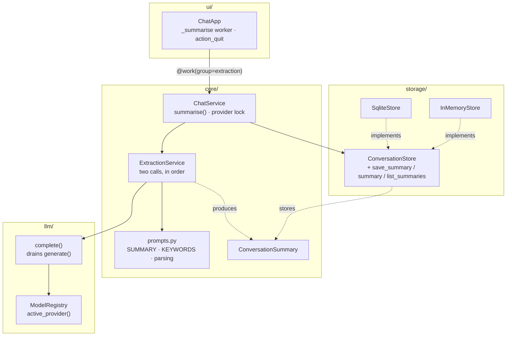
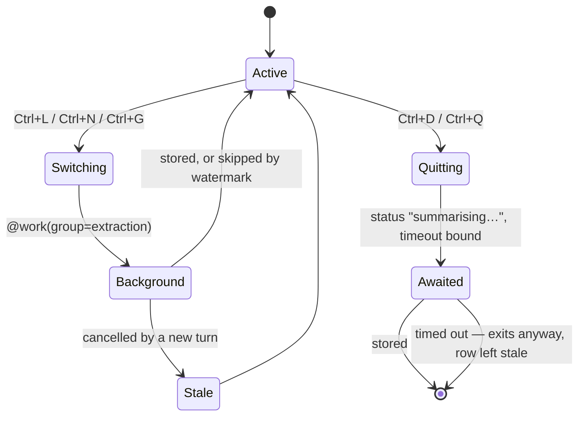

# feat: Lightweight conversation summaries and keywords, per group

**Origin requirements:** `docs/requirements.md` (NFR-S-02, NFR-S-04, NFR-CTX-01,
NFR-U-04, NFR-U-07, NFR-Q-02/03)
**Target repo:** this repo (`agentchat`), branch `feat/groups`
**Numbering:** 002–006 are taken by the memory-pipeline stage plans on
`feat/memory-pipeline`; this plan is 007 so the two branches can coexist.

---

## Summary

Every conversation gets one row of derived state: a dense summary of what it was
about, and up to five keywords. Both are produced by two LLM calls — summary
first, keywords from the summary — and persisted in a new
`conversation_summaries` table keyed by conversation and carrying the group id,
so a later feature can ask "what is this group about?" without reading a single
message.

Extraction fires when a conversation is left: switching away (`Ctrl+L`,
`Ctrl+N`, `Ctrl+G`) runs it on a background worker, and quitting awaits it
behind a `summarising…` status line with a bounded timeout.

Nothing renders the result. This plan builds the write path and the table; the
group overview and feeding summaries back into a prompt are separate work
against a table that will already be stable.

---

## Problem Frame

`Group` exists, membership is immutable, and `conversations.group_id` is NOT
NULL with a cascade (`docs/conversation-groups.md` Part 2). What does not exist
is anything that *scopes data by group* — the design extract says so outright:
*"This branch carries the group model and nothing that scopes by it."*

So NFR-S-02 ("memory MUST be scoped to groups of chats") has a container and no
contents. Concretely:

- **Nothing derived is stored per conversation.** `conversations` has `title`
  (auto-derived from the first 40 characters of the first user turn,
  `core/models.py:83-91`) and nothing else. A group of nine chats presents as
  nine truncated first-lines.
- **Nothing reads a conversation without reading every message of it.**
  `SqliteStore._list_conversations` hydrates all messages of every conversation
  in the group (Open Question Q2 of plan 001). Any group-level question today
  costs the whole group's message table.
- **There is no non-streaming call path.** `LLMProvider.generate` is an
  `AsyncIterator[str]` and `ChatService.stream_reply` is the only caller. A
  pipeline that wants one complete string has nowhere to get it.
- **`Ctrl+D` does not quit.** `Input.BINDINGS` binds `delete,ctrl+d` to
  `delete_right` (verified against installed textual 8.2.8), the prompt holds
  focus almost always, and the app's `Binding("ctrl+d", "quit", "Exit")` is not
  `priority=True`. Probed against the real app: Ctrl+D in the prompt deletes a
  character and the app keeps running. The trigger this feature is specified
  around is currently a no-op, so fixing it is in scope (U7).

### Non-goals

Out of scope, and not touched by any unit here: rendering summaries or keywords
anywhere in the UI; injecting them into a prompt or into `ContextStrategy`
(that is the recall half of NFR-S-02, and its own plan); group-level
consolidation and the `groups.last_consolidated_at` column reserved for it;
keyword search; the GUM-style fragment pipeline on `feat/memory-pipeline`;
adaptive RAG; sub-agents; fine-tuned adapters.

---

## Requirements

| ID | Requirement | Origin |
|---|---|---|
| R1 | A conversation can be reduced to a dense summary that weights user turns above assistant turns. | user spec; NFR-CTX-01 |
| R2 | Up to 5 keywords are derived **from the summary**, emitted in a parsable format, and parsed defensively. | user spec |
| R3 | Summary and keywords are produced by exactly two LLM calls, in that order. | user spec |
| R4 | Both prompts live in one file that holds prompts and nothing else. | user spec |
| R5 | Summary, keywords, group id and model provenance persist in an inspectable schema. | NFR-S-01, NFR-S-03, NFR-FT-10 |
| R6 | Extraction fires when a conversation is left — by switching, or by quitting. | user spec |
| R7 | Re-extraction is idempotent: one row per conversation, overwritten; a conversation with no new messages since its last summary is not re-summarised. | NFR-S-03 |
| R8 | Deleting a conversation or a group removes its summaries, leaving no orphans. | NFR-S-04 |
| R9 | Extraction on switch never blocks the UI, and never cancels or corrupts a running generation. | NFR-U-04 |
| R10 | Extraction on quit is visible and bounded — the app cannot appear to hang indefinitely. | NFR-U-07 |
| R11 | A provider failure or timeout during extraction leaves the conversation summary-less and the app running. | NFR-Q-02 |
| R12 | Extraction is switchable off, and its budget is configurable. | NFR-Q-03 |
| R13 | Summaries are readable per group without reading messages. | NFR-S-02 |

---

## Key Technical Decisions

**KTD1 — A separate table, not columns on `conversations`.**
`SqliteStore._save` runs on every streamed turn and rewrites the conversation
row plus all its message rows. Derived state has a different lifecycle (it moves
on exit, not on turn) and different provenance (which model produced it), so it
gets its own table with `conversation_id` as the primary key. One row per
conversation makes R7's "overwritten, never duplicated" a property of the schema
rather than of the code. `ON DELETE CASCADE` gives R8 for free.

**KTD2 — The reserved column names stay reserved.**
`docs/conversation-groups.md` § 1.1 names three columns owned by a downstream
feature: `groups.last_consolidated_at` and
`conversations.extracted_at` / `extracted_id`. Those belong to the fragment
pipeline on `feat/memory-pipeline`, whose watermark semantics are not these.
This plan touches none of them and adds no column to `conversations` or
`groups`, so the two features can land in either order.

**KTD3 — `group_id` is copied into the summary row, not JOINed.**
§ 1.1's rule: *derive what is mutable, copy what is immutable.* Membership is
chosen once and bound for life, so the copy cannot drift, and a group-scoped
read (R13) is a single indexed table scan.

**KTD4 — The watermark is a message count, not a hash or a timestamp.**
`covered_messages` records how many messages the summary was built from.
Messages within a conversation are append-only — `Conversation.add` appends and
nothing edits or removes a message — so `len(messages) == covered_messages`
means "nothing new to say" and is the whole of R7's skip rule. A content hash
would also catch edits, and there are none to catch; `updated_at` would not
survive a switch that changed nothing but touched the row.

**KTD5 — Extraction runs on the active model.**
`ExtractionService` takes the `ModelRegistry` and calls `active_provider()`, so
the resident provider is reused: no eviction, no second set of weights, no base
model swap on every conversation exit. The cost is that summary quality tracks
whichever model the user last cycled to with `Ctrl+O`, which is why
`model_id` is a column (R5) — a group whose summaries were written by three
models stays interpretable. A dedicated summarisation adapter (requirements
Open Decision #6) can be introduced later as one `model_id` argument.

**KTD6 — Extraction never inherits `GenerationOptions` from the chat.**
It builds its own: `temperature=0.0`, `thinking=False`, and its own
`max_tokens`. Temperature 0 takes `local.py`'s greedy branch (`do_sample` is
`options.temperature > 0`) so the same conversation summarises the same way
twice. `thinking=False` matters more than it looks: with the user's `Ctrl+T`
toggle on, Qwen3's reasoning preamble would be prepended to the reply, and the
reply *is* the summary — the trace would be stored as the summary text.

**KTD7 — Provider access is serialised, and extraction is the side that loses.**
`TransformersProvider` holds one `self._thread` and one `self._stop` event, and
`_settle()` sets `_stop` before starting a new run (`llm/local.py`). Two
concurrent `generate()` calls on one provider therefore kill each other. Two
mechanisms, at two levels:

- `ChatService` holds an `asyncio.Lock` that both `stream_reply` and
  `summarise` acquire. This is the correctness guarantee.
- `ChatApp` cancels the extraction worker group before starting a turn, so a
  user who types immediately after switching waits on nothing. The abandoned
  conversation stays un-summarised and is picked up the next time it is left —
  the watermark makes that free.

A user turn is never queued behind an extraction.

**KTD8 — Extraction does not reuse `ContextStrategy`.**
`RecencyWindowStrategy` keeps the most recent turns that fit and drops the
oldest. Summarisation wants the opposite bias — the whole arc, user turns
preserved, assistant turns sacrificed — so `prompts.render_transcript` does its
own budgeting against `estimate_tokens`. `ContextStrategy` belongs to the
context-management elective (NFR-CTX-01..05) and stretching it to serve two
consumers with opposite preferences would make it worse at both.

**KTD9 — A keyword parse failure does not discard the summary.**
The summary is the expensive artefact and stands alone; keywords are a
convenience derived from it. An unparseable second reply stores an empty keyword
list. The inverse — no summary — means no row at all, because the row's reason
for existing is the summary.

**KTD10 — `Ctrl+D` gets `priority=True`, costing delete-right in the prompt.**
The same trade plan 001 declined for `Ctrl+X` (KTD7 there), taken the other way
here because the spec names Ctrl+D as the exit and because a global quit key
that only works when the prompt has lost focus is a bug either way. What is lost
is `Input`'s `delete_right`; `Delete` still does it, and is the key most users
reach for. See Open Question Q1 for the alternative.

**KTD11 — The only awaitable pre-exit hook is `action_quit`.**
`App.exit()` is synchronous: it sets `_exit` and posts an `ExitApp` message
(verified in textual 8.2.8), so there is nowhere inside it to await two LLM
calls. `App.action_help_quit` (Ctrl+C) does not quit at all — it notifies which
key does. So overriding `async def action_quit` covers every route out of the
app: the app's `Ctrl+D` and textual's default `Ctrl+Q`.

---

## High-Level Technical Design

Directional guidance for review, not implementation specification.

### Component relationships



`ExtractionService` knows nothing about storage: it returns an object and
`ChatService` persists it. That keeps the two LLM calls outside any transaction
and keeps the extractor testable against a scripted provider alone.

### The two calls

```mermaid
sequenceDiagram
    participant CS as ChatService
    participant EX as ExtractionService
    participant P as Provider (active)
    participant S as Store

    CS->>CS: skip if no messages, or len(messages) == covered_messages
    CS->>CS: acquire provider lock
    CS->>EX: run(conversation)
    EX->>EX: render_transcript(messages, budget)
    EX->>P: complete(SUMMARY prompt)  temp=0, thinking=off
    P-->>EX: summary text
    EX->>P: complete(KEYWORDS prompt over the summary)
    P-->>EX: "a; b; c"
    EX->>EX: parse_keywords(...) → up to 5
    EX-->>CS: ConversationSummary
    CS->>S: save_summary(...)  upsert on conversation_id
```

### When it fires



Deleting the active conversation is deliberately *not* a trigger: the row would
cascade away immediately, and `_switch_to`'s existing guard already swaps in a
fresh unsaved `Conversation` first.

---

## Output Structure

```
src/agentchat/
  core/
    prompts.py       NEW — the two prompts, transcript rendering, keyword parsing
    extraction.py    NEW — ExtractionService: two calls, in order
tests/
  test_extraction.py             NEW — prompts, parsing, the pipeline, the service
  test_extraction_real_model.py  NEW — format survives Phi-4-mini and Qwen3-14B
```

Modified: `src/agentchat/core/models.py`, `src/agentchat/core/chat.py`,
`src/agentchat/storage/schema.py`, `src/agentchat/storage/base.py`,
`src/agentchat/storage/sqlite.py`, `src/agentchat/llm/base.py`,
`src/agentchat/config.py`, `src/agentchat/ui/app.py`, `tests/factories.py`,
`tests/conftest.py`, `tests/test_storage.py`, `tests/test_app.py`,
`README.md`, `AGENTS.md`.

---

## Implementation Units

### U1. `core/prompts.py` — the prompts and the pure functions around them

**Goal:** The two prompts, the transcript renderer, and the keyword parser — no
I/O, no provider, no store.
**Requirements:** R1, R2, R4
**Dependencies:** none
**Files:** `src/agentchat/core/prompts.py` (new),
`tests/test_extraction.py` (new)

**Approach:**

1. Module constants, and nothing else at module scope but the tuning numbers:
   - `SUMMARY_SYSTEM` / `SUMMARY_PROMPT` — one `{transcript}` field. The
     instruction states, in this order: summarise what the conversation is
     about; **weight the user's turns above the assistant's** — the user's turns
     are what the conversation is *for*, the assistant's are only evidence of
     what was asked; be dense and factual, no preamble, no "this conversation
     discusses"; target 3–5 sentences; write in the third person about topics,
     not about the participants.
   - `KEYWORDS_SYSTEM` / `KEYWORDS_PROMPT` — one `{summary}` field. Emit **at
     most 5** keywords, separated by `; `, on one line, nothing else — no
     numbering, no label, no trailing period. Prefer nouns and named entities.
   - `MAX_KEYWORDS = 5`, `KEYWORD_SEPARATOR = "; "`,
     `ASSISTANT_CHAR_CAP = 800`, `ELISION = "[… earlier turns omitted …]"`.
2. `def render_transcript(messages: Sequence[Message], *, budget: int) -> str`:
   - skip system messages and empty ones (`Message.is_empty`)
   - render each as `User: …` / `Assistant: …`, one blank line between
   - cap every assistant turn at `ASSISTANT_CHAR_CAP` characters, appending `…`
     when cut — a 4000-token reply contributes its shape, not its bulk
   - while `estimate_tokens(rendered) > budget`: drop the **oldest assistant**
     turn; when none are left, drop the oldest user turn. Insert `ELISION` once
     at the point of the first drop, so the model is not told the transcript is
     complete when it is not
   - never drop the most recent user turn, even if it alone exceeds the budget —
     truncate it instead. A summary of a conversation that omits its last
     question is wrong in the way that matters
3. `def parse_keywords(text: str, *, limit: int = MAX_KEYWORDS) -> tuple[str, ...]`,
   defensive because small models decorate:
   - strip whitespace, surrounding backticks and quotes
   - drop a leading `keywords:` label, case-insensitively
   - take the first line containing `;`; if no line does, take the first
     non-empty line and treat it as a single keyword candidate
   - split on `;`, and strip from each piece: whitespace, quotes, a leading
     `-`/`*`/`N.` bullet, a trailing `.`
   - drop empties, dedupe case-insensitively keeping the first spelling, cap at
     `limit`
   - return `()` when nothing survives — the caller decides what that means
     (KTD9)

Imports `Message` and `estimate_tokens` and nothing else from the package.

**Patterns to follow:** `core/context.py` for `estimate_tokens` and for the
"module docstring is one or two sentences" rule. Prompt text is plain
triple-quoted strings — this is the file a non-programmer edits, so no `.format`
gymnastics beyond the single named field each.

**Test scenarios** (`tests/test_extraction.py`):
- Both prompts contain their one format field and nothing else formattable
  (`string.Formatter().parse` finds exactly `{transcript}` / `{summary}`).
- `SUMMARY_PROMPT` mentions the user-over-assistant weighting — the one
  instruction R1 is about, pinned so a later reword cannot silently drop it.
- `render_transcript` labels turns by role and omits system messages.
- An assistant turn of 5000 characters is capped; the user turns are verbatim.
- A transcript over budget drops assistant turns before user turns, and the
  result contains `ELISION` exactly once.
- A single user turn larger than the whole budget is truncated, not dropped.
- `parse_keywords("a; b; c")` → three keywords.
- `parse_keywords("Keywords: alpha; beta")` → `("alpha", "beta")`.
- `parse_keywords("- a\n- b")` → `("a",)` (no `;`, so first line only) — pins
  the documented behaviour rather than a guess about it.
- Seven semicolon-separated keywords are capped at 5.
- `Alpha; alpha; ALPHA` dedupes to `("Alpha",)`.
- `parse_keywords("")` and `parse_keywords("I'm sorry, I can't help.")` → `()`
  and a one-element tuple respectively; neither raises.

**Verification:** `uv run pytest tests/test_extraction.py` passes with no
provider and no store in the picture.

---

### U2. `ConversationSummary`, its table, and the store surface

**Goal:** The row, its schema, and the three store methods, on both stores.
**Requirements:** R5, R7, R8, R13
**Dependencies:** none (parallel with U1)
**Files:** `src/agentchat/core/models.py`,
`src/agentchat/storage/schema.py`, `src/agentchat/storage/base.py`,
`src/agentchat/storage/sqlite.py`, `tests/factories.py`,
`tests/test_storage.py`

**Approach:**

1. In `core/models.py`, beside `Conversation`:
   ```python
   @dataclass
   class ConversationSummary:
       conversation_id: str
       group_id: str
       summary: str
       keywords: tuple[str, ...] = ()
       covered_messages: int = 0
       model_id: str | None = None
       created_at: datetime = field(default_factory=_now)
       updated_at: datetime = field(default_factory=_now)
   ```
   plus the two encoding helpers, so the `;`-joined column format is defined
   once and in the layer both stores already import:
   - `@property def keywords_text(self) -> str` — `KEYWORD_SEPARATOR.join`
   - `@staticmethod def split_keywords(text: str) -> tuple[str, ...]` — split on
     `;`, strip, drop empties. Deliberately *not* `prompts.parse_keywords`:
     that one cleans up after a model, this one reads back what we wrote.
     `storage/` importing `core/prompts` would also be a layer it has no
     business in.
2. Append to `SCHEMA` in `storage/schema.py`:
   ```sql
   CREATE TABLE IF NOT EXISTS conversation_summaries (
     conversation_id TEXT PRIMARY KEY
       REFERENCES conversations(id) ON DELETE CASCADE,
     group_id TEXT NOT NULL REFERENCES groups(id) ON DELETE CASCADE,
     summary TEXT NOT NULL, keywords TEXT NOT NULL,
     covered_messages INTEGER NOT NULL, model_id TEXT,
     created_at TEXT NOT NULL, updated_at TEXT NOT NULL);
   CREATE INDEX IF NOT EXISTS idx_summaries_group
     ON conversation_summaries(group_id);
   ```
   `CREATE TABLE IF NOT EXISTS` is correct here and the pre-groups refusal
   (`_refuse_pre_groups_database`) needs no counterpart: a database that has
   `conversations` and `groups` but no `conversation_summaries` is a valid
   older database of this same schema line, and gaining an empty derived table
   loses nothing. Do **not** extend the refusal to cover it.
3. Extend the `ConversationStore` protocol with three methods, documented as
   the derived-state surface:
   - `async def save_summary(self, summary: ConversationSummary) -> None` —
     upsert on `conversation_id`, preserving the original `created_at`
   - `async def summary(self, conversation_id: str) -> ConversationSummary | None`
   - `async def list_summaries(self, group_id: str) -> list[ConversationSummary]`
     — most-recently-updated first. **No consumer yet**; it is the read half of
     R13 and the reason the table carries `group_id`. Say so in the docstring
     rather than leaving a reader to wonder who calls it.
4. `SqliteStore`: three `asyncio.to_thread` wrappers over three `_` bodies, in
   the module's existing shape. The upsert is
   `ON CONFLICT(conversation_id) DO UPDATE SET summary=excluded.summary,
   keywords=excluded.keywords, covered_messages=excluded.covered_messages,
   model_id=excluded.model_id, updated_at=excluded.updated_at` — `created_at` is
   omitted from the SET list on purpose, so it keeps meaning "first summarised".
   Wrap `sqlite3.Error` in `StorageError` like every neighbour.
5. `InMemoryStore`: a `dict[str, ConversationSummary]`, and — as with
   `delete_group`'s hand-written cascade — `delete()` pops the conversation's
   summary and `delete_group()` pops every summary whose `group_id` matches.
   A stub that keeps orphans the real store cannot hold would let R8 break in
   every test using it.
6. `tests/factories.py`: `make_summary(**overrides)` beside the existing
   factories.

**Patterns to follow:** `_save_group` / `_list_groups` in `storage/sqlite.py`
for the to_thread + `closing(self._connect())` + `StorageError` shape;
`InMemoryStore.delete_group` for the by-hand cascade and its comment.

**Test scenarios** (add to `tests/test_storage.py`, parameterised over both
stores where the assertion is not SQL-specific):
- Round-trip: save a summary, read it back from a *new* `SqliteStore` on the
  same path — summary text, keyword tuple, `covered_messages`, `model_id` and
  both timezone-aware timestamps all match.
- Keywords containing a comma and non-ASCII survive the `;` encoding.
- An empty keyword tuple round-trips as `()`, not `("",)`.
- Saving twice leaves **one** row (assert via a direct
  `SELECT COUNT(*) FROM conversation_summaries`) with the second summary's text
  and the **first** save's `created_at`.
- `summary()` on an unknown conversation returns `None`.
- Deleting the conversation removes its summary row (direct `SELECT COUNT(*)`).
- Deleting the group removes its conversations *and* their summary rows — the
  two-hop cascade, which is the one R8 case the FKs could get wrong.
- `list_summaries("g1")` returns only `g1`'s, most-recently-updated first.
- `InMemoryStore` matches on all of the above that are not raw-SQL assertions,
  including both cascades.
- Saving a summary for a conversation that does not exist raises `StorageError`
  (the FK from the summary side).

**Verification:** `uv run pytest tests/test_storage.py` passes;
`sqlite3 <tmp>/agentchat.db ".schema conversation_summaries"` and a
`SELECT` show readable rows (NFR-S-03).

---

### U3. `complete()` and `ExtractionService`

**Goal:** The two calls, in order, over a provider — and no knowledge of
storage.
**Requirements:** R1, R2, R3, R11, KTD5, KTD6
**Dependencies:** U1
**Files:** `src/agentchat/llm/base.py`,
`src/agentchat/core/extraction.py` (new), `tests/factories.py`,
`tests/test_extraction.py`

**Approach:**

1. In `llm/base.py`, a module-level helper beside the protocol:
   ```python
   async def complete(
       provider: LLMProvider,
       messages: Sequence[Message],
       options: GenerationOptions | None = None,
   ) -> str:
       """Drain ``generate`` into one string, for callers that want a whole
       answer rather than a stream."""
   ```
   It belongs here rather than in `extraction.py`: it is a property of the
   provider boundary, and the next non-streaming consumer (a judge, a
   sub-agent) should not reimplement it.
2. `core/extraction.py`:
   ```python
   SUMMARY_MAX_TOKENS = 256
   KEYWORDS_MAX_TOKENS = 64
   #: Head-room for the instruction text around the transcript.
   PROMPT_OVERHEAD_TOKENS = 256

   class ExtractionService:
       def __init__(self, registry: ModelRegistry) -> None: ...
       async def run(self, conversation: Conversation) -> ConversationSummary
   ```
   `run` is the whole pipeline:
   - `provider = await self._registry.active_provider()` (KTD5)
   - `budget = provider.info.context_window - SUMMARY_MAX_TOKENS - PROMPT_OVERHEAD_TOKENS`,
     floored at a sane minimum
   - `transcript = render_transcript(conversation.messages, budget=budget)`
   - call 1: `[system=SUMMARY_SYSTEM, user=SUMMARY_PROMPT.format(transcript=…)]`
     with `GenerationOptions(temperature=0.0, max_tokens=SUMMARY_MAX_TOKENS,
     thinking=False)` (KTD6)
   - call 2: same shape over `KEYWORDS_*` with the **summary text** as input —
     the transcript is not in this prompt, which is the point of the two-step
     shape (R3)
   - `keywords = parse_keywords(reply_2)`
   - return a `ConversationSummary` with `covered_messages=len(conversation.messages)`,
     `group_id=conversation.group_id`, `model_id=provider.info.id`
   - the summary text is `.strip()`ed; if it is empty after stripping, raise
     `ExtractionError` — there is no row worth writing (KTD9's inverse)
   - `ProviderError` from either call propagates unchanged; no partial row is
     built and nothing is written (that is U4's job anyway)
3. `ExtractionError(AgentChatError)` in `core/errors.py`, so
   `except AgentChatError` at the UI boundary already covers it.
4. `tests/factories.py`: `scripted_provider(*replies, info=None)` — an
   `LLMProvider` that is always loaded and yields each canned reply in turn,
   recording the `messages` and `options` it was called with. Assertions about
   *which prompt got which input* need that record, and the mock backend
   (which echoes the last user turn) cannot supply it.

**Patterns to follow:** `ChatService.stream_reply` for how a provider is
obtained and options are threaded; `MockProvider` for the shape of a test
double that satisfies the protocol.

**Test scenarios** (`tests/test_extraction.py`):
- `complete()` joins a three-chunk stream into one string.
- `run()` makes **exactly two** calls, in order.
- Call 1 carries the rendered transcript; call 2 carries the **summary** and
  **not** the transcript (assert the transcript text is absent from call 2's
  messages) — the structural claim of R3.
- Both calls use `temperature == 0.0` and `thinking is False`, even when the
  conversation was generated with `thinking=True`.
- The returned summary carries `group_id`, `covered_messages == len(messages)`,
  and `model_id == provider.info.id`.
- A second reply of `"Keywords: a; b; c; d; e; f"` yields five keywords.
- A second reply the parser rejects yields a summary with `keywords == ()`
  (KTD9).
- A first reply of whitespace raises `ExtractionError`.
- A `ProviderError` on either call propagates and nothing is returned.
- A conversation long enough to exceed a 2048-window model's budget still
  produces a call whose estimated tokens are under the window (drive it through
  `mock-small`'s real `context_window`).

**Verification:** `uv run pytest tests/test_extraction.py` passes with no store
and no app.

---

### U4. `ChatService.summarise()` — the skip rule, the lock, the write

**Goal:** One awaitable that decides whether to extract, extracts, and persists.
**Requirements:** R5, R7, R11, KTD7
**Dependencies:** U2, U3
**Files:** `src/agentchat/core/chat.py`, `tests/test_extraction.py`

**Approach:**

1. `ChatService.__init__` gains `extractor: ExtractionService | None = None` and
   `self._provider_lock = asyncio.Lock()`. `None` means extraction is off, and
   `summarise` returns `None` immediately — that is how `AGENTCHAT_EXTRACTION`
   (U5) switches the feature off, with no flag threaded through the call sites.
2. ```python
   async def summarise(self, conversation: Conversation) -> ConversationSummary | None:
   ```
   In order:
   - no extractor, or `not conversation.messages` → `None`
   - `existing = await self.store.summary(conversation.id)`; if
     `existing is not None and existing.covered_messages == len(conversation.messages)`
     → `None` (R7/KTD4)
   - `async with self._provider_lock:` run the extractor
   - carry `existing.created_at` onto the new row if there was one, so
     "first summarised" survives an overwrite even in `InMemoryStore`
   - `await self.store.save_summary(summary)`; return it
   - The two LLM calls happen **outside** any store transaction, and the write
     is one call at the end.
3. `stream_reply` acquires the same lock around the generation it drives. Take
   care with the existing `finally`: the lock must be released after the last
   write to `reply.content`, and the `async with` has to wrap the whole
   generator body, not just the `async for`, or a cancelled consumer leaves it
   held. Because `stream_reply` is an async generator, verify by test that
   cancelling mid-stream releases the lock (scenario below) — this is the one
   place in the unit where a plausible implementation can be wrong.
4. `delete_conversation` needs no change: the cascade takes the summary (U2).

**Execution note:** Write the watermark-skip and the lock-release-on-cancel
tests before the implementation. Both are rules that are easy to implement
plausibly and wrongly, and the second one deadlocks the app rather than failing
loudly.

**Patterns to follow:** `ChatService.persist` — a method whose whole reason to
exist is one rule, stated in its docstring.

**Test scenarios** (`tests/test_extraction.py`, against `InMemoryStore` and
`SqliteStore(tmp_path)`):
- `summarise()` on a conversation with no messages stores nothing and returns
  `None`.
- `summarise()` on a two-message conversation stores a row readable through
  `store.summary()`.
- Called twice with no new messages, the extractor runs **once** (assert the
  scripted provider's call count) and the second call returns `None`.
- After a third message, `summarise()` runs again, overwrites the row,
  `covered_messages == 3`, and `created_at` is unchanged from the first row.
- A `ProviderError` from the extractor leaves **no** row and the exception
  reaches the caller (R11 — the UI is what turns it into a notification).
- `ChatService(registry, extractor=None).summarise(...)` returns `None` and
  touches no provider.
- A `stream_reply` cancelled mid-stream leaves the provider lock free: a
  following `summarise()` completes (this is the deadlock guard).
- `summarise()` and a `stream_reply` started concurrently do not interleave —
  the scripted provider records no overlapping call.

**Verification:** `uv run pytest tests/test_extraction.py` passes against both
stores.

---

### U5. Configuration

**Goal:** Extraction is switchable and its quit budget is tunable.
**Requirements:** R12
**Dependencies:** U3
**Files:** `src/agentchat/config.py`, `tests/conftest.py`, `tests/test_core.py`

**Approach:**

1. `Settings.extract_summaries: bool` from `_env_flag("EXTRACT_SUMMARIES", True)`
   — on by default, because a feature that has to be switched on is not
   demonstrable (NFR-Q-01).
2. `Settings.extraction_timeout: float` from
   `_env_float("EXTRACTION_TIMEOUT")` with a `30.0` default, in seconds — the
   bound U7 spends on quit.
3. `build_extractor(settings, registry) -> ExtractionService | None` beside
   `build_registry` / `build_store`: `None` when `extract_summaries` is false.
   Third wiring point, same shape as the other two, same "the only place X is
   named" comment.
4. `tests/conftest.py`: `mock_settings` gets
   `overrides.setdefault("extract_summaries", False)`. Extraction is off for the
   existing suite so no current test grows two silent LLM calls per switch;
   the tests that are *about* extraction pass `extract_summaries=True`
   explicitly. Same reasoning as the existing `store="memory"` default.

**Patterns to follow:** the `backend` / `store` fields and
`_require_choice`; `mock_settings`'s existing `setdefault` block and the
docstring that explains why each default is there.

**Test scenarios** (add to `tests/test_core.py`):
- `build_extractor(mock_settings(extract_summaries=True), registry)` returns an
  `ExtractionService`; with `False` it returns `None`.
- `AGENTCHAT_EXTRACT_SUMMARIES=0` in the environment produces
  `Settings().extract_summaries is False` (the flag parser already handles
  `0/false/no/off`).
- `AGENTCHAT_EXTRACTION_TIMEOUT=abc` raises `ConfigurationError`.

**Verification:** `uv run pytest` passes and the existing suite's behaviour is
unchanged.

---

### U6. Extraction on switching away

**Goal:** Leaving a conversation summarises it, in the background.
**Requirements:** R6, R9, R11
**Dependencies:** U4, U5
**Files:** `src/agentchat/ui/app.py`, `tests/test_app.py`

**Approach:**

1. `ChatApp.__init__` builds the extractor through config and passes it in:
   `ChatService(self.registry, store=build_store(...), extractor=build_extractor(...))`.
2. `_EXTRACTION_GROUP = "extraction"` beside `_GENERATION_GROUP`.
3. ```python
   @work(group=_EXTRACTION_GROUP, exclusive=True)
   async def _summarise(self, conversation: Conversation) -> None:
   ```
   - `try: await self.chat.summarise(conversation)` /
     `except AgentChatError as error:` → `self.notify(str(error),
     severity="warning")`. **Warning, not error**: a missing summary costs the
     user nothing they asked for, and a red toast on every switch while a model
     is misbehaving would be worse than the missing row (R11).
   - `except asyncio.CancelledError: raise` — cancellation is the designed path
     (KTD7), not a failure, and must not be reported.
   - Not in `_GENERATION_GROUP`: sharing it would make switching cancel a
     running generation, the exact regression plan 001's U5 guarded against
     (R9). `exclusive=True` within its own group so two fast switches leave one
     extraction, not two.
4. Call it from the two places a conversation is left, **after** the existing
   `await self.chat.persist(...)` and **before** the conversation object is
   replaced — pass the outgoing object explicitly, since `self.conversation` is
   about to point elsewhere:
   - `_switch_to` (Ctrl+L)
   - `_start_conversation` (Ctrl+N and Ctrl+G both route through it)
   Not from the delete paths: `on_conversation_picker_delete_requested` and
   `on_group_chooser_delete_requested` already swap in a fresh unsaved
   `Conversation`, and summarising rows that just cascaded away is work whose
   result is deleted before it lands.
5. At the top of `_turn`, `self.workers.cancel_group(self, _EXTRACTION_GROUP)`
   — a user who types immediately after switching never waits on a summary
   (KTD7). `cancel_group` does not await, which is exactly why the lock in U4
   exists.

**Patterns to follow:** `action_open_conversations`'s bare `@work` and the
comment explaining why it is not in the generation group; `_switch_to`'s
stop → persist → replace → render → refresh ordering.

**Test scenarios** (add to `tests/test_app.py`, with
`mock_settings(extract_summaries=True)`):
- One turn, then `Ctrl+N`: the outgoing conversation has a summary row in the
  store once the extraction worker finishes (`await
  app.workers.wait_for_complete()` or drive the worker directly).
- Switching away from an **empty** conversation writes nothing.
- Switching while a generation runs: the generation still completes (assert on
  the conversation's messages, not the widgets) — the R9 regression guard.
- Typing a new turn while an extraction is in flight: the turn's reply arrives
  intact and the abandoned conversation has **no** summary row (stale by
  design, KTD7). Use realistic mock timing
  (`mock_chunk_delay=None, mock_load_delay=None`) so there is a gap for the
  cancellation to land in.
- Deleting the active conversation from the picker writes no summary row for it.
- A `ProviderError` from the extractor surfaces as a warning notification and
  the app keeps running (patch the extractor to raise).
- With `extract_summaries=False`, switching writes nothing and starts no
  extraction worker.

**Verification:** `uv run pytest tests/test_app.py` passes;
`AGENTCHAT_BACKEND=mock AGENTCHAT_STORE=sqlite uv run agentchat`, one turn,
`Ctrl+N`, then
`sqlite3 data/agentchat.db "SELECT summary, keywords FROM conversation_summaries"`
shows one row.

---

### U7. Extraction on quit — and making `Ctrl+D` actually quit

**Goal:** Quitting summarises the current conversation, visibly and within a
bound.
**Requirements:** R6, R10, R11, KTD10, KTD11
**Dependencies:** U6
**Files:** `src/agentchat/ui/app.py`, `tests/test_app.py`, `README.md`

**Approach:**

1. **Fix the binding first, and test it before anything else in this unit.**
   `Binding("ctrl+d", "quit", "Exit", priority=True)`. Without `priority=True`
   the app's binding never fires while the prompt has focus, because
   `Input.BINDINGS` binds `delete,ctrl+d` to `delete_right` (textual 8.2.8,
   probed against the running app: Ctrl+D deleted a character and the app kept
   running). Note the cost in the README's key table: `Delete` still deletes
   forward in the prompt; `Ctrl+D` no longer does (KTD10).
2. Override the one awaitable chokepoint (KTD11):
   ```python
   async def action_quit(self) -> None:
       self.workers.cancel_group(self, _GENERATION_GROUP)
       await self._summarise_before_exit()
       await super().action_quit()
   ```
   Cancelling generation first frees the provider, so the summary is not
   waiting behind a reply the user is walking away from.
3. `_summarise_before_exit`:
   - return immediately when there is nothing to do — no extractor, or no
     messages — so a launch-and-quit stays instant
   - `self._refresh_status(busy="summarising…")`, reusing the existing `-busy`
     class; the status bar is already the place slow work is announced (R10,
     NFR-U-07)
   - `await asyncio.wait_for(self.chat.summarise(self.conversation),
     timeout=self.settings.extraction_timeout)`
   - `except TimeoutError:` → exit anyway, leaving the row stale; the watermark
     means the next exit from that conversation retries it. Do **not** notify:
     the app is one line of code from gone and a toast nobody can read is worse
     than silence. `except AgentChatError:` → same.
   - Cancel the extraction worker group first, so a background run started by an
     earlier switch is not holding the lock this call needs.
4. **Verify the awaited action repaints.** Actions run as tasks off the message
   pump, so awaiting inside `action_quit` should let the status line paint
   before the two calls start. If it does not, the fix is to post the status
   update and `await asyncio.sleep(0)` before the `wait_for` — check which is
   needed rather than assuming (Risks).

**Patterns to follow:** `_refresh_status(busy=…)` and the `-busy` class, already
used for `loading model…` and `generating…`; `action_stop`'s use of
`workers.cancel_group`.

**Test scenarios** (add to `tests/test_app.py`):
- **First:** Ctrl+D with the prompt focused and text in it quits the app and
  does not edit the text — the regression test for the bug this unit fixes.
- After one turn, `action_quit` stores a summary for the active conversation
  before the app exits.
- `action_quit` on a launch with no messages exits without calling the
  extractor.
- With the extractor patched to hang, `extraction_timeout=0.05` still exits, and
  no summary row exists.
- With the extractor patched to raise `ProviderError`, the app still exits.
- A generation running at quit is cancelled and the quit still completes.
- `Ctrl+Q` (textual's default) goes through the same path and also summarises —
  proof the hook is on the chokepoint and not on one key.

**Verification:** `uv run pytest tests/test_app.py` passes. Manually:
`AGENTCHAT_BACKEND=mock AGENTCHAT_STORE=sqlite uv run agentchat`, one turn,
`Ctrl+D` — the status line shows `summarising…`, the app exits, and the row is
in `data/agentchat.db`. Then on a GPU node with the real backend, confirm the
wait is bearable and tune `AGENTCHAT_EXTRACTION_TIMEOUT` if it is not.

---

### U8. Real-model format check

**Goal:** Evidence that the `;` contract survives contact with the two models
this project actually runs.
**Requirements:** R2
**Dependencies:** U3
**Files:** `tests/test_extraction_real_model.py` (new)

**Approach:** Two tests, skipped unless `AGENTCHAT_TEST_REAL_MODEL=1`, driving
a short hand-written three-turn conversation through `ExtractionService` on
`phi-4-mini` and on `qwen3-14b`. Assert loosely — a non-empty summary shorter
than the transcript, and `parse_keywords` returning between 1 and 5 keywords —
because the content is not deterministic across models and a strict assertion
here would be a test of the model, not of the code. Print both replies so a
cluster run doubles as a prompt-tuning readout.

This is the only check that `KEYWORDS_PROMPT` produces a parsable line rather
than a polite paragraph, and the parser (U1) is written defensively *because*
this test is expected to be informative rather than green by construction.

**Patterns to follow:** `tests/test_local.py`'s `AGENTCHAT_TEST_REAL_MODEL`
skip marker.

**Verification:** `AGENTCHAT_TEST_REAL_MODEL=1 uv run pytest
tests/test_extraction_real_model.py` on a GPU node.

---

### U9. Documentation

**Goal:** The repo describes what now exists.
**Requirements:** NFR-Q-04
**Dependencies:** U7
**Files:** `README.md`, `AGENTS.md`

**Approach:** README: add `AGENTCHAT_EXTRACT_SUMMARIES` and
`AGENTCHAT_EXTRACTION_TIMEOUT` to Configuration; note in the Keys table that
`Ctrl+D` is now a priority binding and no longer deletes forward in the prompt
(use `Delete`); add a short "Conversation summaries" paragraph saying what is
stored, when it is written, and that nothing reads it yet. `AGENTS.md`: add
`core/prompts.py` and `core/extraction.py` to the Layout block, with
`prompts.py` marked as the file to edit when tuning extraction quality — that
is the whole reason it is a separate module (R4).

**Test expectation:** none — documentation only.

**Verification:** every variable, key and path named in `README.md` exists in
the code.

---

## Verification Contract

1. `uv run pytest` passes with no GPU and leaves no `data/` directory behind.
2. `AGENTCHAT_BACKEND=mock AGENTCHAT_STORE=sqlite uv run agentchat`: take a
   turn, `Ctrl+N`, take another, `Ctrl+D`. Both conversations have a row in
   `conversation_summaries`; keywords are `;`-separated and at most five.
3. Re-open one of them (`Ctrl+L`), switch away without typing — the row's
   `updated_at` is unchanged (R7).
4. Add a turn to it, switch away — `covered_messages` grows, `created_at` does
   not move.
5. Delete a group with two summarised conversations, then
   `SELECT COUNT(*) FROM conversation_summaries` — zero remaining (R8).
6. `Ctrl+L` opens and a reply keeps streaming while a background extraction is
   in flight (R9).
7. On a GPU node: `uv run agentchat`, one turn, `Ctrl+D` — `summarising…` is
   visible, the app exits, and the stored summary reads like the conversation.
8. `AGENTCHAT_TEST_REAL_MODEL=1 uv run pytest tests/test_extraction_real_model.py`
   passes on both models.

## Definition of Done

All nine units landed; every test scenario above implemented and passing; the
eight verification steps performed, 7 and 8 on a GPU node; `README.md` and
`AGENTS.md` updated.

---

## Scope Boundaries

### Deferred to Follow-Up Work

- **Rendering summaries and keywords** — in the `Ctrl+L` overview, on the group
  header rows, or in a group detail screen. The read method
  (`list_summaries(group_id)`) ships here so that work is additive.
- **Recall** — putting a group's other summaries into a new conversation's
  prompt. This is the other half of NFR-S-02 and the interesting half; it needs
  a selection rule and touches `ContextStrategy`.
- **Group-level consolidation** — one paragraph per group rolled up from its
  conversation summaries, and the `groups.last_consolidated_at` column reserved
  for it (KTD2).
- **A summarisation adapter** — one `model_id` argument on
  `ExtractionService` away, once requirements Open Decision #6 settles.
- **Backfilling** existing conversations that were never summarised. Every
  conversation gets a summary the next time it is left, so the store fills in
  through use; a one-shot sweep is a convenience, not a requirement.

### Not in scope

Adaptive RAG, sub-agent deployment, the context-management elective, fine-tuned
adapters, and the fragment pipeline on `feat/memory-pipeline`. None are touched
by any unit here.

---

## Open Questions

**Q1 — `priority=True` on `Ctrl+D` costs `delete_right` in the prompt.**
KTD10 takes the trade because the spec names Ctrl+D as the exit. The
alternatives, if that is the wrong call: move the exit to `Ctrl+Q` (textual's
default, already working) and drop the `Ctrl+D` binding entirely; or keep the
binding non-priority and accept that Ctrl+D only exits when focus is off the
prompt, which is the current, confusing behaviour. Either way U7's `action_quit`
hook is unchanged — only the key that reaches it moves.

**Q2 — Should a summary be written for a conversation the user never returns to
after a crash?** No launch-time sweep is planned: the row is written on exit,
and `kill -9` or a timeout leaves it stale until the conversation is next left.
Given the store fills in through use, that seemed the lightweight reading. A
sweep on `on_mount` is roughly one worker plus one store query
(`conversations` left-joined against `conversation_summaries`) if it turns out
to matter for the demo.

**Q3 — Is 3–5 sentences the right summary length?** It is a guess, tunable in
one string in `prompts.py`. U8's cluster run is where that guess meets the two
real models; expect one round of prompt tuning after it, which is why the prompt
text is isolated in its own file (R4).

**Q4 — `render_transcript` caps assistant turns at 800 characters.** Chosen so a
long reply contributes its topic without its bulk, consistent with R1's
user-over-assistant weighting. Untested against a real conversation of any
length; adjust after U8.

---

## Risks

| Risk | Mitigation |
|---|---|
| Two concurrent `generate()` calls on one `TransformersProvider` kill each other via the shared `_stop` event. | KTD7: a lock in `ChatService` for correctness, `cancel_group` in the app for responsiveness. U4 tests that concurrent calls do not interleave. |
| `stream_reply` is an async generator; a lock acquired inside it leaks if the consumer is cancelled, deadlocking every later extraction. | Called out as U4 step 3 with a dedicated test that a cancelled stream leaves the lock free. |
| The `summarising…` status line never paints because `action_quit` blocks before a refresh. | U7 step 4: verify against the running app, with the `sleep(0)` fallback named. |
| `Ctrl+D` is shadowed by `Input.delete_right`, so the quit trigger silently does nothing. | Confirmed by probe, not assumed. U7 step 1 fixes it and its first test is the regression guard. |
| A small model answers the keyword prompt in prose, and keywords are empty everywhere. | Defensive parser (U1) with a documented fallback, KTD9 keeping the summary regardless, and U8 as the check that says whether it is actually happening. |
| Extraction doubles the LLM calls per session and slows the demo. | `AGENTCHAT_EXTRACT_SUMMARIES=0` switches it off; the watermark stops repeat work; the quit path is bounded by `AGENTCHAT_EXTRACTION_TIMEOUT`. |
| `conversation_summaries` collides with the schema on `feat/memory-pipeline` at merge time. | KTD2: no shared column and no shared table name; the reserved column names are left untouched. |
| A summary row outlives its conversation, breaking NFR-S-04. | Two FKs with `ON DELETE CASCADE`, `PRAGMA foreign_keys = ON` already set per connection, the by-hand cascade in `InMemoryStore`, and U2's two-hop cascade test. |

---

## Sources & Research

- `docs/requirements.md` — NFR-S-02/03/04, NFR-CTX-01, NFR-U-04/07,
  NFR-Q-01/02/03, and Open Decision #6 (a summarisation adapter as one of the
  two fine-tunes).
- `docs/conversation-groups.md` — § 1.1 (the reserved columns, and "copy what is
  immutable"), § 1.3 (membership is immutable, which is what makes KTD3 safe),
  § 1.4 (the group cascade this table joins), Part 2 ("nothing that scopes by
  it" — the gap this plan fills).
- `docs/plans/2026-08-10-001-feat-conversation-switching-plan.md` — KTD5 (sqlite
  on a worker thread), KTD7 (the priority-binding trade, taken the other way in
  KTD10), KTD8 (the UI performs the work), Q2 (full hydration in
  `list_conversations`).
- `src/agentchat/llm/local.py` — the single `_thread` / `_stop` pair and
  `_settle()`, which is why KTD7 exists; the `temperature > 0` greedy branch
  behind KTD6.
- `src/agentchat/core/context.py` — `estimate_tokens`, reused for budgeting;
  `RecencyWindowStrategy`'s bias, which is why KTD8 does not reuse it.
- `feat/memory-pipeline`'s stage-2 plan — read for overlap. It agrees on two
  points reached independently here: extraction takes the resident provider
  rather than loading its own, and an unparseable reply is "nothing worth
  saying" rather than a failure. Its fragment model is deliberately not adopted.
- Verified against installed textual 8.2.8: `Input.BINDINGS` binds
  `delete,ctrl+d` → `delete_right`; `App.BINDINGS` is `ctrl+q` → `quit` and
  `ctrl+c` → `help_quit`; `App.action_quit` is a coroutine that calls
  `self.exit()`; `App.exit()` is synchronous and only posts `ExitApp`, so
  `action_quit` is the only awaitable pre-exit hook (KTD11). The Ctrl+D
  shadowing was confirmed by driving the real `ChatApp` under `run_test()`, not
  read off the bindings list.
