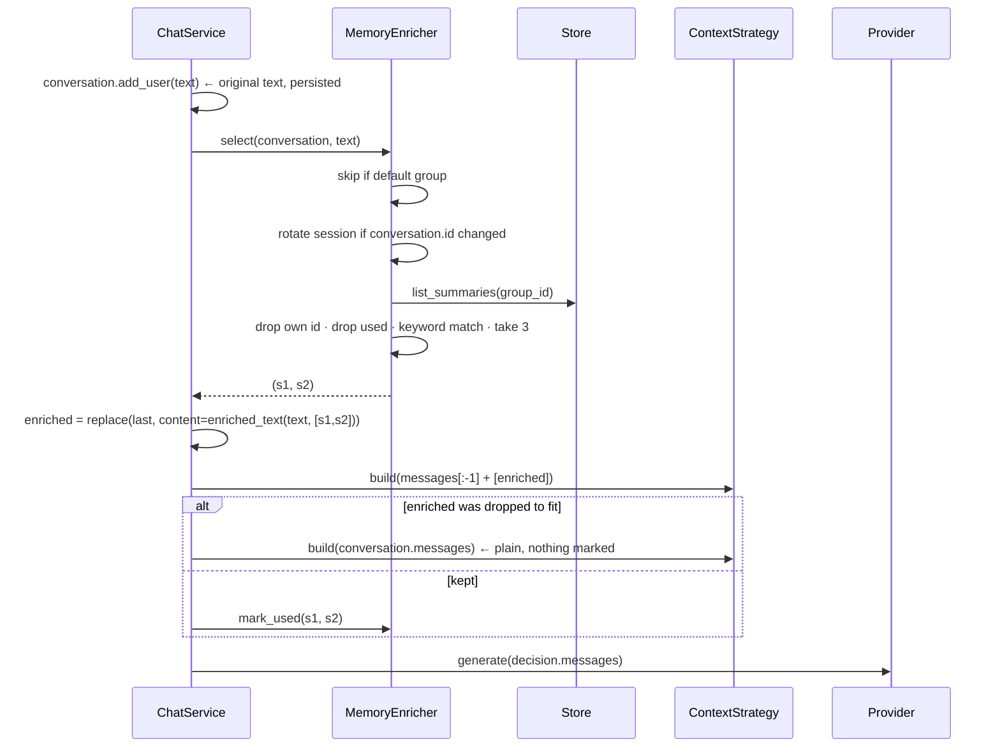
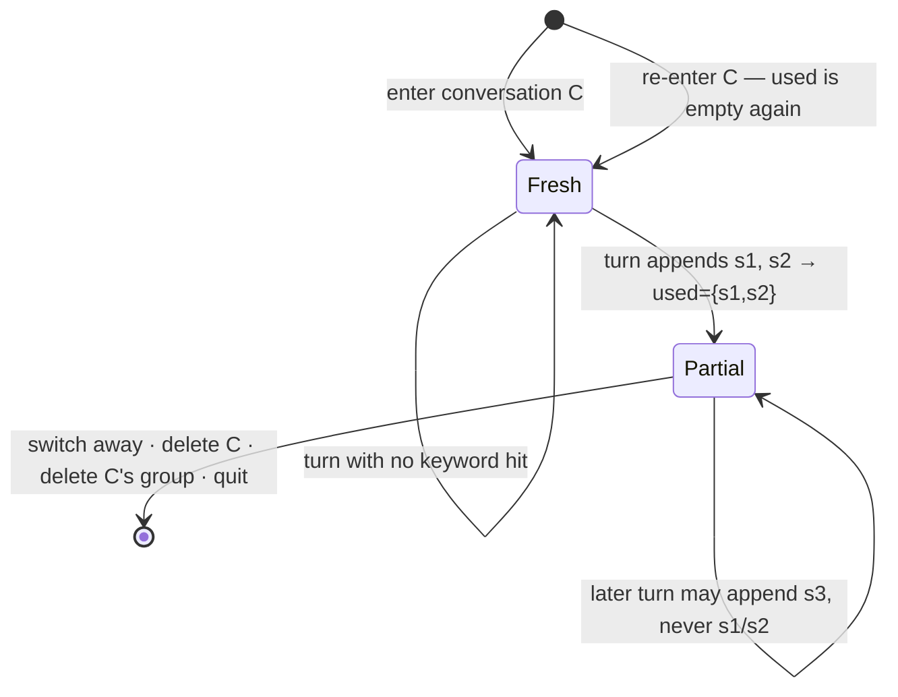

# feat: Enrich user messages with keyword-matched summaries from the group

**Origin requirements:** `docs/requirements.md` (NFR-S-02, NFR-CTX-02, NFR-CTX-03,
NFR-CTX-04, NFR-CTX-05, NFR-Q-03)
**Target repo:** this repo (`agentchat`), branch `feat/conversation-enrichment`
**Builds on:** plan 007 (`2026-08-12-007-feat-conversation-summaries-plan.md`),
which wrote `conversation_summaries` and left it with no consumer. This is that
consumer — the recall half of NFR-S-02.

---

## Summary

When the user sends a message in a **project** group, the summaries of the
group's *other* conversations are checked for keyword hits against the message
text. Up to three matching summaries are appended to the copy of the message
that goes to the model, behind a short explanation that these are extracted
notes from earlier conversations. Each summary is used **at most once per
session**, where a session is one uninterrupted visit to one conversation.

Nothing about this reaches the database. The enriched text exists only inside
the message list handed to the provider; `conversation.messages` keeps exactly
what the user typed. Under the user's bubble, a muted italic line —
`▸ enriched by 2 memories` — expands on click to show what was appended.

---

## Problem Frame

Plan 007 built the write path: every conversation, on exit, gets a dense summary
and up to five keywords in `conversation_summaries`, carrying `group_id`
(`storage/schema.py`). `list_summaries(group_id)` exists and its docstring says
outright there is no consumer yet (`storage/base.py:65-78`).

So NFR-S-02 has contents and no recall. Concretely:

- **`RecencyWindowStrategy` selects by recency alone** (`core/context.py:51-93`),
  which is exactly what NFR-CTX-03 says must not be the whole story.
- **Nothing crosses conversation boundaries.** A user who solved a problem in
  one chat and returns to it in another is starting from nothing, inside a group
  whose whole purpose is that they are related.
- **`Message.content` and `Message.metadata` are both persisted verbatim**
  (`storage/sqlite.py:189-210` deletes and re-inserts every message row on every
  turn). Any design that stores the enrichment on the `Message` writes it to
  disk on the same turn. This is the constraint the whole design is shaped
  around.

### Non-goals

Embedding or ranked retrieval (a keyword hit is the whole selection rule here);
group-level consolidation; keyword search as a user-facing feature; enrichment
in the default group; persisting which memories were used; a UI for editing or
deleting memories; recall across groups.

---

## Requirements

| ID | Requirement | Origin |
|---|---|---|
| R1 | A user message is matched against the keywords of every summary in its group except its own conversation's. | user spec |
| R2 | A match is case-insensitive, on the **whole keyword phrase**, at word boundaries — not a substring hit. | user spec |
| R3 | Matching summaries are appended to the message sent to the model, separated from the user's text by an explanation of what they are. | user spec |
| R4 | Each summary is appended at most **once per session** — never twice in one message, never in two messages of the same session. | user spec |
| R5 | A session is one uninterrupted visit to one conversation; switching conversations or leaving the app ends it, and re-entering starts a fresh one with every summary available again. | user spec |
| R6 | Nothing about the enrichment is written to the database — not the text, not the fact that it happened. | user spec |
| R7 | At most 3 summaries are appended to one message. | user spec (grilling round 2) |
| R8 | Enrichment does not run in the default group. | user spec (grilling round 1) |
| R9 | Enrichment cannot push the prompt over the model's context window, and cannot cost the user their own question. | NFR-CTX-04 |
| R10 | Recall is bounded by group membership and cannot leak across groups. | NFR-S-02, NFR-CTX-02 |
| R11 | The user can see that a turn was enriched, and with what. | NFR-CTX-05 |
| R12 | Enrichment is switchable off. | NFR-Q-03 |

---

## Key Technical Decisions

**KTD1 — The enrichment lives in a throwaway copy of the user `Message`, and
nowhere else.**
`ChatService.persist` runs in `stream_reply`'s `finally` on every turn
(`core/chat.py:142`) and `SqliteStore._save` rewrites every message row from the
in-memory list, `content` and `json.dumps(metadata)` alike. So "in memory but
not in the database" is only reachable if the enriched text never enters
`conversation.messages`. `stream_reply` builds
`messages[:-1] + [replace(last, content=enriched)]` and hands *that* to the
context strategy. `conversation.messages[-1].content` stays byte-identical to
what the user typed. R6 is then a property of the object graph, not of a rule
someone has to remember.

Corollary, stated because it is the tempting mistake: the enrichment must **not**
go into `reply.metadata`, which already carries the context decision
(`core/chat.py:125-130`) and is persisted as JSON.

**KTD2 — Enrich before trimming, so the enrichment is inside the budget.**
`RecencyWindowStrategy.build` costs every message by `estimate_tokens(m.content)`
(`core/context.py:69`). Appending after `build()` would mean the strategy budgets
one number and the provider receives another — an overflow on a small window
(NFR-CTX-04). Passing the enriched copy *into* `build()` costs it correctly and
lets the strategy evict older turns to make room, which is the right trade.

**KTD3 — If the enriched turn does not survive trimming, the turn is re-built
without it.**
The consequence of KTD2 is that the strategy may drop the enriched message
whole — it iterates in reverse and drops anything that does not fit
(`core/context.py:73-78`) — which would cost the user their actual question. So:
build the decision with the enriched copy; if that copy came back in
`decision.dropped`, rebuild the decision from `conversation.messages` and report
zero enrichments. Three lines, one test, and the guarantee is "enrichment can
never lose you your own message."

**KTD4 — A summary is spent when it is *sent*, not when it is matched.**
Marking happens after KTD3's fallback check, so a rolled-back enrichment is not
charged. After that point it is spent unconditionally: a stopped generation, a
provider error, or the enriched turn later being evicted by the recency window
does **not** hand the memory back. The simple rule is explainable; the
alternative needs eviction tracking for a case nobody will notice.

**KTD5 — The session ledger is keyed by conversation id, and there is only one.**
`MemoryEnricher` holds a single `EnrichmentSession(conversation_id, used)` and
replaces it whenever the id of the conversation being enriched differs from the
one it holds. That makes R5 self-healing across the two paths that swap the
active conversation *without* going through `ChatService.switch_conversation` —
deleting the active conversation (`ui/app.py:284`) and deleting its group
(`ui/app.py:236`) both install a fresh `Conversation` with a new id.
`switch_conversation` clears it explicitly as well (beside the existing
`last_turn = None`, `core/chat.py:87`), which covers the one case the id check
cannot see: re-selecting the *same* conversation from the picker, which is a new
visit and so a new session.

A dict keyed by id would be wrong — it would restore the ledger when the user
returns to a conversation, and R5 says a return is a fresh start.

**KTD6 — Word-boundary matching uses lookarounds, not `\b`.**
Keywords are model-authored and routinely start or end with a non-word
character: `prompts.py`'s own worked example emits `/upload endpoint`.
`\b/upload` never matches, because there is no word boundary between a space and
a `/`. `(?<!\w)…(?!\w)` does the intended thing for `/upload endpoint`, `S3`,
`boto3` and `Flask` alike. Internal whitespace in a phrase is matched as `\s+`
so a keyword does not miss across a line break.

**KTD7 — Selection under the cap is most-recently-updated first.**
The spec says order does not matter, but *which three* does once R7 bites.
`list_summaries(group_id)` already promises most-recently-updated first
(`storage/base.py:76-78`), so taking the first three matches in that order needs
no sort and gives the most recent context, which is the better guess.

**KTD8 — The prompt text lives in `core/prompts.py`.**
R4 of plan 007 — the file that holds prompts and nothing else — applies to the
explanation wrapped around the appended summaries too. `enrichment.py` decides
*which* summaries; `prompts.py` decides *what the model reads*. Tuning the
wording stays a one-file job for a non-programmer.

**KTD9 — The UI learns about the enrichment through `TurnResult`.**
The user bubble is mounted (`ui/app.py:406`) before `stream_reply` runs, so the
count cannot be known at construction time. `TurnResult` is the existing channel
for "what did this turn decide" and is already read at the first chunk to bind
the assistant message (`ui/app.py:423-424`). It gains an `enrichment` field and
the app calls `user_bubble.show_enrichment(...)` there. Matching stays in
`core/`; `ui/` stays a reader. The info line appears one chunk after the user's
text — imperceptible, and it costs no second computation.

**KTD10 — Accepted: enrichment leaks into the next extraction.**
The persisted transcript holds a bare user question and an assistant reply that
answers memories which are not there. When that conversation is next left,
`ExtractionService` re-summarises from `conversation.messages`
(`core/extraction.py:49`) and folds the other conversation's material into this
one's summary — which can then be injected into a third. Two-hop laundering,
compounding over a long session. Accepted as a known limitation of a
demonstrable recall mechanism, recorded here and in the README rather than
engineered around.

---

## High-Level Technical Design

### Component relationships

```mermaid
flowchart TD
    subgraph ui["ui/"]
        App["ChatApp._turn"]
        Bub["MessageBubble<br/>EnrichmentNote"]
    end
    subgraph core["core/"]
        CS["ChatService.stream_reply<br/>enrich → build → fallback → mark"]
        EN["enrichment.py<br/>MemoryEnricher · EnrichmentSession · match"]
        PR["prompts.py<br/>enriched_text()"]
        CX["ContextStrategy"]
    end
    subgraph storage["storage/"]
        St["ConversationStore.list_summaries(group_id)"]
    end

    App -->|user_text| CS
    CS --> EN
    EN --> St
    EN --> PR
    CS --> CX
    CS -.TurnResult.enrichment.-> App
    App --> Bub
```

### One enriched turn



### Session lifetime



---

## Output Structure

```
src/agentchat/
  core/
    enrichment.py    NEW — MemoryEnricher, EnrichmentSession, keyword matching
tests/
  test_enrichment.py NEW — matching, session rules, the service, the app path
```

Modified: `src/agentchat/core/prompts.py`, `src/agentchat/core/chat.py`,
`src/agentchat/config.py`, `src/agentchat/ui/app.py`,
`src/agentchat/ui/widgets.py`, `src/agentchat/ui/app.tcss`,
`tests/conftest.py`, `tests/factories.py`, `README.md`, `AGENTS.md`.

---

## Implementation Units

### U1. `core/prompts.py` — the wrapper text

**Goal:** The explanation the model reads around the appended summaries.
**Requirements:** R3
**Dependencies:** none
**Files:** `src/agentchat/core/prompts.py`, `tests/test_enrichment.py` (new)

**Approach:**

1. Add beside the extraction prompts:
   ```python
   ENRICHMENT_HEADER = """\
   ---
   The following notes were extracted from the user's earlier conversations in \
   this project. They are background that may or may not be relevant — the \
   user did not write them and cannot see them. Use them only where they help \
   answer the message above; do not mention them otherwise."""

   ENRICHMENT_BULLET = "- "
   ```
2. ```python
   def enriched_text(user_text: str, summaries: Sequence[ConversationSummary]) -> str:
   ```
   Returns `user_text` unchanged when `summaries` is empty. Otherwise
   `user_text`, a blank line, `ENRICHMENT_HEADER`, a blank line, then one
   bulleted line per summary (`summary.summary`, whitespace-collapsed).
   Import `ConversationSummary` from `core.models` — `prompts.py` already
   imports `Message` from there.

**Patterns to follow:** the existing triple-quoted prompt constants in this
file; the module docstring's promise that this file has no I/O.

**Test scenarios:**
- `enriched_text("hi", [])` returns `"hi"` exactly.
- With two summaries: the result starts with the user's text, contains both
  summary texts, and contains `ENRICHMENT_HEADER`.
- The header states the notes come from earlier conversations and that the user
  did not write them — pinned so a reword cannot silently turn them into
  something the model reads as the user's own words.

---

### U2. `core/enrichment.py` — matching and the session ledger

**Goal:** Given a conversation and a message, which summaries to append.
**Requirements:** R1, R2, R4, R5, R7, R8, R10, KTD5, KTD6, KTD7
**Dependencies:** U1
**Files:** `src/agentchat/core/enrichment.py` (new), `tests/test_enrichment.py`

**Approach:**

1. Module constants:
   ```python
   MAX_ENRICHMENTS = 3
   ```
2. Matching, pure and module-level:
   ```python
   @lru_cache(maxsize=512)
   def _pattern(keyword: str) -> re.Pattern[str]: ...

   def matches(text: str, summary: ConversationSummary) -> bool:
       """True if any of `summary`'s keywords appears in `text` as a whole
       phrase, ignoring case."""
   ```
   `_pattern` joins `re.escape`d whitespace-separated parts with `\s+` and wraps
   the result in `(?<!\w)` / `(?!\w)`, compiled `re.IGNORECASE` (KTD6). A
   summary with no keywords never matches — say so in the docstring, since
   `parse_keywords` returning `()` is a documented outcome (plan 007 KTD9).
3. ```python
   @dataclass
   class EnrichmentSession:
       conversation_id: str
       used: set[str] = field(default_factory=set)   # summary conversation ids
   ```
4. ```python
   class MemoryEnricher:
       def __init__(self, store: ConversationStore) -> None: ...
       async def select(self, conversation, user_text) -> tuple[ConversationSummary, ...]
       def mark_used(self, summaries: Sequence[ConversationSummary]) -> None
       def reset(self) -> None
   ```
   - `select` returns `()` immediately when `conversation.group_id ==
     DEFAULT_GROUP_ID` (R8) — no store query in the default group at all.
   - Rotate the session first: if the held session is `None` or its
     `conversation_id` differs, replace it with a fresh one (KTD5).
   - `await store.list_summaries(conversation.group_id)` on every call — the
     freshness decision, so a conversation summarised moments ago by the
     background worker is visible (`ui/app.py:365-392`).
   - Filter in order: drop `s.conversation_id == conversation.id`; drop
     `s.conversation_id in session.used`; keep `matches(user_text, s)`; take the
     first `MAX_ENRICHMENTS` (KTD7 — the store's order is already
     most-recently-updated first).
   - `mark_used` adds their `conversation_id`s to the current session.
     Deliberately separate from `select` so `ChatService` can roll back (KTD3/KTD4).
   - `reset` drops the session.

**Patterns to follow:** `ExtractionService` for a `core/` service that takes one
collaborator and holds no UI state; `storage/base.refuse_default_group` for
comparing against `DEFAULT_GROUP_ID` directly.

**Test scenarios** (`tests/test_enrichment.py`, `SqliteStore(tmp_path)`):
- `matches("we deployed to S3 today", summary(keywords=("S3",)))` is `True`;
  `"the class S3Bucket"` is `False` (no substring hits, R2).
- `"/upload endpoint"` as a keyword matches `"the /upload endpoint 500s"` — the
  case `\b` would miss (KTD6).
- Case-insensitive: keyword `"Flask"`, text `"flask"` → `True`.
- A keyword phrase split across a newline in the message still matches.
- A summary with `keywords=()` never matches.
- `select` in the default group returns `()` and performs **no** store query
  (assert with a store double that records calls, or `monkeypatch`).
- `select` excludes the current conversation's own summary even when its
  keywords hit.
- `select` returns only summaries of the conversation's own group, with
  summaries present in a second group whose keywords also hit (R10).
- Five matching summaries yield three, and they are the three most recently
  updated (R7, KTD7).
- After `mark_used`, a second `select` with the same text returns `()` (R4).
- `select` for a conversation with a different id resets the ledger — the
  previously used summary is offered again (R5/KTD5).
- `reset()` makes the previously used summary available again.

**Verification:** `uv run pytest tests/test_enrichment.py` passes with no app and
no provider.

---

### U3. `ChatService` — build the copy, guard the budget, spend the memory

**Goal:** One enriched turn, with `conversation.messages` untouched.
**Requirements:** R3, R6, R9, KTD1, KTD2, KTD3, KTD4, KTD9
**Dependencies:** U2
**Files:** `src/agentchat/core/chat.py`, `tests/test_enrichment.py`

**Approach:**

1. `TurnResult` gains
   `enrichment: tuple[ConversationSummary, ...] = ()` — what this turn actually
   sent, for the UI to render (KTD9).
2. `ChatService.__init__` gains `enricher: MemoryEnricher | None = None`, with
   the same "`None` switches the feature off" comment as `extractor`.
3. `switch_conversation`: `if self.enricher is not None: self.enricher.reset()`,
   beside the existing `self.last_turn = None` and for the same reason — the
   outgoing conversation's state must not describe the incoming one.
4. In `stream_reply`, after `add_user`/`autotitle` and **before** acquiring the
   provider lock:
   ```python
   selected = ()
   if self.enricher is not None:
       selected = await self.enricher.select(conversation, user_text)
   ```
   Then inside the lock, replacing the current single `build` call:
   ```python
   decision = self.context_strategy.build(
       self._prompt_messages(conversation, selected),
       context_window=provider.info.context_window,
   )
   if selected and self._enrichment_dropped(decision):
       selected = ()
       decision = self.context_strategy.build(
           conversation.messages, context_window=provider.info.context_window
       )
   if selected and self.enricher is not None:
       self.enricher.mark_used(selected)
   ```
   `_prompt_messages` returns `conversation.messages` unchanged when `selected`
   is empty, and otherwise
   `[*conversation.messages[:-1], replace(last, content=enriched_text(...))]`
   using `dataclasses.replace` (which copies `id`, so nothing downstream sees a
   new message). The last element **is** the user turn at this point: the
   assistant message is added afterwards.
   `_enrichment_dropped` tests identity — `any(m is enriched for m in
   decision.dropped)` — so hold the copy in a local.
5. `self.last_turn = TurnResult(message=reply, context=decision,
   enrichment=selected)`.
6. Leave `reply.metadata["context"]` exactly as it is. Add a one-line comment
   there saying the enrichment is deliberately absent because metadata is
   persisted (KTD1).

**Patterns to follow:** the existing `extractor is None` switch-off; the
comment style in `stream_reply` explaining *why* the lock wraps the whole body.

**Test scenarios** (`tests/test_enrichment.py`, scripted provider + `SqliteStore`):
- After an enriched turn, `conversation.messages[-2].content` (the user turn)
  equals the typed text exactly, and the reloaded conversation from a new
  `SqliteStore` on the same path has no trace of any summary text (R6 — this is
  the test that would have caught the `metadata` mistake, so assert on the
  reloaded message's `metadata` too).
- The provider's recorded call **does** contain both the typed text and the
  matched summary's text (R3).
- `last_turn.enrichment` names the summaries that were sent.
- No keyword hit → the provider's call is the plain text, `enrichment == ()`,
  and nothing is marked used.
- `ChatService(..., enricher=None)` never queries summaries and enriches
  nothing (R12's mechanism).
- Two turns in one session: a summary used on turn 1 is not appended on turn 2
  even though its keyword hits again (R4, end to end).
- One message hitting keywords of four summaries appends three (R7).
- **Budget guard (KTD3):** with a `mock-small`-sized window and summaries big
  enough that the enriched turn cannot fit, the provider's call contains the
  user's text, contains no summary text, `enrichment == ()`, and a following
  turn can still use those summaries (nothing was spent).
- `switch_conversation` resets the ledger: switch away and back, the same
  summary is offered again (R5).
- A `stream_reply` cancelled mid-stream still leaves the summary spent (KTD4)
  and — the plan-007 regression — leaves the provider lock free.

---

### U4. Configuration and wiring

**Goal:** Enrichment is assembled in one place and switchable off.
**Requirements:** R12
**Dependencies:** U3
**Files:** `src/agentchat/config.py`, `tests/conftest.py`, `tests/test_core.py`

**Approach:**

1. `Settings.enrich_messages: bool` from `_env_flag("ENRICH_MESSAGES", True)` —
   on by default, same reasoning as `extract_summaries` (a feature that has to
   be switched on is not demonstrable).
2. ```python
   def build_enricher(settings: Settings, store: ConversationStore) -> MemoryEnricher | None:
   ```
   beside `build_extractor`, `None` when the flag is off. Fourth wiring point,
   same shape and same "the only place X is named" comment.
3. `ChatApp.__init__` must hand the **same** store instance to both the service
   and the enricher, so lift it to a local:
   ```python
   store = build_store(self.settings)
   self.chat = ChatService(
       self.registry,
       store=store,
       extractor=build_extractor(self.settings, self.registry),
       enricher=build_enricher(self.settings, store),
   )
   ```
4. `tests/conftest.py`: `mock_settings` gets
   `overrides.setdefault("enrich_messages", False)`, and the docstring gains a
   sentence next to the extraction one. Off for the existing suite so no current
   test grows a `list_summaries` query per turn; the tests that are about
   enrichment pass `enrich_messages=True`.

**Test scenarios** (add to `tests/test_core.py`):
- `build_enricher(mock_settings(enrich_messages=True), store)` returns a
  `MemoryEnricher`; with `False`, `None`.
- `AGENTCHAT_ENRICH_MESSAGES=0` produces `Settings().enrich_messages is False`.

---

### U5. The info line

**Goal:** A muted, italic, click-to-expand note under the user's bubble.
**Requirements:** R11, KTD9
**Dependencies:** U3, U4
**Files:** `src/agentchat/ui/widgets.py`, `src/agentchat/ui/app.tcss`,
`src/agentchat/ui/app.py`, `tests/test_enrichment.py`

**Approach:**

1. `ui/widgets.py`, a small widget beside `MessageBubble`:
   ```python
   class EnrichmentNote(Static):
       """One line under a user turn: how many memories were appended, and —
       on click — which."""
   ```
   - `__init__(self, summaries: Sequence[ConversationSummary])`, `markup=False`
     (summary text is model output and may contain brackets — the same trap
     `MessageBubble` already avoids), `classes="bubble__memo"`.
   - `_collapsed` starts `True`. Collapsed text:
     `▸ enriched by {n} memor{y|ies}`. Expanded: the same line with `▾`, then
     one indented line per summary (whitespace-collapsed).
   - `def on_click(self, event: events.Click) -> None:` toggles and calls
     `event.stop()` — its own widget rather than a handler on the bubble, so a
     click anywhere else in the bubble does nothing.
2. `MessageBubble` gains one method:
   ```python
   def show_enrichment(self, summaries: Sequence[ConversationSummary]) -> None:
       """Mount the note under the body, once. Empty input and a second call
       are both no-ops."""
   ```
   Guard on an `self._note is not None` flag so the idempotency in step 4 is
   free. Mount with `self.mount(EnrichmentNote(summaries))` — after `_body`,
   which is what puts it under the text.
3. `app.tcss`, beside `.bubble__body`:
   ```css
   .bubble__memo {
       color: $text-muted;
       text-style: italic;
   }
   ```
4. `ui/app.py` `_turn`: keep the user bubble in a local
   (`user_bubble = MessageBubble(...)` before mounting), and where the first
   chunk already binds the assistant message:
   ```python
   if self.chat.last_turn is not None:
       bubble.bind_message(self.chat.last_turn.message)
       user_bubble.show_enrichment(self.chat.last_turn.enrichment)
   ```
   Repeat the `show_enrichment` call in the `finally` block, guarded by
   `self.chat.last_turn is not None` — a reply that errors or is stopped before
   its first chunk still spent the memories, so the note must still appear.
   `show_enrichment` is idempotent, which is what makes the double call safe.

**Patterns to follow:** `MessageBubble`'s eagerly-built children and the comment
explaining why (`ui/widgets.py:59-63`); `markup=False` everywhere model or user
text is rendered.

**Test scenarios** (`tests/test_enrichment.py`, through `app.run_test()` with
`mock_settings(enrich_messages=True)`):
- A turn that matches one summary mounts exactly one `EnrichmentNote` under the
  user bubble, reading `enriched by 1 memory`, and its text does **not** contain
  the summary body while collapsed.
- Clicking it (`await pilot.click(EnrichmentNote)`) reveals the summary text;
  clicking again hides it.
- A turn with no match mounts no note.
- Switching away and back rebuilds the log with **no** notes — the enrichment
  was never persisted (R6), and the same summary is available again (R5).
- With `enrich_messages=False`, a message whose keywords would hit mounts no
  note and the provider sees the plain text.
- Two conversations in the same project group: a turn in the second is enriched
  from the first (the end-to-end demo path).

**Verification:** `uv run pytest tests/test_enrichment.py tests/test_app.py`.

---

### U6. Documentation

**Goal:** The repo describes what now exists, including the limitation.
**Requirements:** NFR-Q-04
**Dependencies:** U5
**Files:** `README.md`, `AGENTS.md`

**Approach:** README: `AGENTCHAT_ENRICH_MESSAGES` in Configuration; a short
"Recalling earlier conversations" paragraph — what matches, that it is project
groups only, the cap of three, once-per-visit, that nothing is stored, and
KTD10's caveat that an enriched reply feeds the next summary. `AGENTS.md`: add
`core/enrichment.py` to the Layout block, with a note that the wording of the
injected block is tuned in `prompts.py`, not here.

**Verification:** every variable and path named in `README.md` exists in the code.

---

## Verification Contract

1. `uv run pytest` passes, and the pre-existing suite's behaviour is unchanged.
2. `AGENTCHAT_BACKEND=mock AGENTCHAT_STORE=sqlite uv run agentchat`: `Ctrl+G`,
   make a project group, take a turn about a distinctive topic, `Ctrl+N`, take a
   turn using one of the first conversation's keywords — the info line appears
   under the user bubble and expands on click.
3. In that same visit, use the keyword again — no second injection (R4).
4. `Ctrl+L` back and forth, use the keyword again — it is injected once more (R5).
5. `sqlite3 <data>/agentchat.db "SELECT content, metadata FROM messages WHERE
   role='user'"` — no summary text and no enrichment flag anywhere (R6).
6. Repeat step 2 in the default group — no enrichment (R8).
7. `AGENTCHAT_ENRICH_MESSAGES=0` — no info line, no behaviour change (R12).
8. On a GPU node with the real backend: an enriched turn produces a reply that
   uses the earlier conversation's material without quoting the injected block
   back at the user.

## Definition of Done

All six units landed; every test scenario implemented and passing; the eight
verification steps performed, 8 on a GPU node; `README.md` and `AGENTS.md`
updated.

---

## Scope Boundaries

### Deferred to follow-up work

- **Ranked or embedded selection** — a keyword hit is a coarse relevance signal;
  scoring by hit count, recency and length is the obvious next increment.
- **Enrichment in the default group**, if the group model ever gains a notion of
  an implicit project.
- **Showing which memories were available but unused**, for demoing the
  selection rule.
- **A memories overview** (`list_summaries` already backs it).

### Not in scope

Adaptive RAG, sub-agents, fine-tuned adapters, group consolidation, keyword
search, cross-group recall.

---

## Open Questions

**Q1 — Is three the right cap?** A guess, one constant in `enrichment.py`. Three
summaries at plan 007's `SUMMARY_MAX_TOKENS = 256` is ~768 tokens worst case,
about half of `mock-small`'s effective budget. If real summaries land nearer 100
tokens the cap could rise; KTD3's fallback is what keeps the guess safe either
way.

**Q2 — Should a keyword hit in the *middle* of a long message count as much as
one in a short one?** Currently yes — one hit anywhere is enough. A long
rambling message will match nearly everything in a mature group. If that shows
up in the demo, the cheapest fix is requiring two distinct keyword hits for
messages over some length, not a scoring model.

**Q3 — Does the model ever quote the injected block back at the user?** The
header tells it not to. Verification step 8 is where that meets a real model;
expect one round of tuning in `prompts.py`, which is why the text lives there.

---

## Risks

| Risk | Mitigation |
|---|---|
| The enrichment reaches the database via `Message.content` or `metadata`, because `_save` rewrites every row from memory every turn. | KTD1 — the enriched message is a `replace()` copy that never enters `conversation.messages`. U3's first test asserts on a *reloaded* conversation, including `metadata`. |
| The enriched turn is dropped whole by the recency window and the user's own question never reaches the model. | KTD3's rebuild-without-enrichment fallback, with a dedicated test at a small context window. |
| Generic model-authored keywords ("Python", "error") make almost every message match. | R8 keeps it out of the default junk-drawer group; R7 caps the damage at three; Q2 names the next lever. |
| The session ledger survives a conversation swap that bypasses `switch_conversation`, so a fresh conversation starts with memories already spent. | KTD5 — keyed by conversation id, so both delete paths self-heal; `switch_conversation` also resets explicitly. |
| The note never appears when a generation errors before its first chunk. | U5 step 4 calls `show_enrichment` from the `finally` as well; the method is idempotent. |
| An enriched reply is summarised and the memory spreads to a third conversation. | Accepted (KTD10), documented in the README rather than engineered around. |
| Enrichment adds a store round-trip to every user turn. | `list_summaries` is one indexed scan of a small table on a worker thread, and returns before the provider lock is taken; the default group skips the query entirely. |

---

## Sources & Research

- `docs/plans/2026-08-12-007-feat-conversation-summaries-plan.md` — the write
  path this consumes; KTD9 there (an unparseable keyword reply stores `()`) is
  why U2 documents the never-matches case.
- `src/agentchat/storage/sqlite.py:172-212` — `_save` deletes and re-inserts
  every message row with `content` and `json.dumps(metadata)`, which is the
  whole reason for KTD1.
- `src/agentchat/core/context.py:51-93` — `RecencyWindowStrategy` costs by
  `m.content` and drops in reverse, behind KTD2 and KTD3.
- `src/agentchat/core/chat.py:74-142` — `switch_conversation`'s `last_turn`
  reset (the model for KTD5) and `stream_reply`'s lock/`finally` shape.
- `src/agentchat/ui/app.py:236,284,396-437` — the two conversation swaps that
  bypass `switch_conversation`, and `_turn`'s mount-then-stream ordering behind
  KTD9.
- `src/agentchat/core/prompts.py:40-57` — the `/upload endpoint` keyword in the
  few-shot example, the concrete case behind KTD6's lookarounds.
- `docs/requirements.md` — NFR-S-02 (recall bounded by group), NFR-CTX-02/03/04/05.
