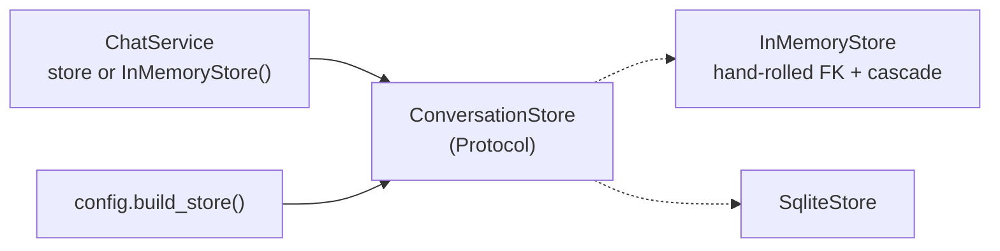
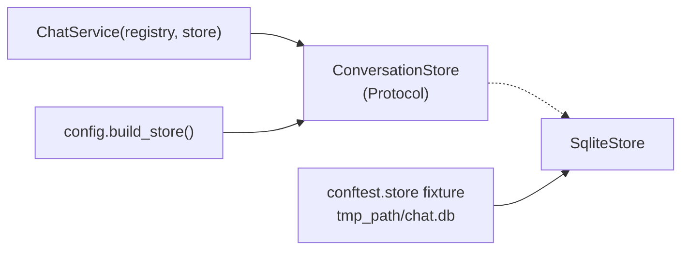

# refactor: Drop `InMemoryStore`; `SqliteStore` is the only store

**Origin:** design review of `ConversationStore` (2026-08-12)
**Target repo:** this repo (`agentchat`), branch `feat/groups`
**Numbering:** 002–006 are taken by the memory-pipeline stage plans on
`feat/memory-pipeline`; 007 is the conversation-summaries plan. This is 008.
**Sequencing:** must land **before** plan 007 is executed — see *Risks*.

---

## Summary

`ConversationStore` keeps two implementations. One of them,
`InMemoryStore` (`src/agentchat/storage/base.py:67-112`), hand-reimplements what
SQLite's foreign keys already do — the group-existence check and the
delete cascade — so that the fake does not permit what the real store forbids.
Its own comments say exactly that.

This plan deletes it. `SqliteStore` becomes the only implementation,
`ChatService` takes a store instead of inventing one, and tests get a
`tmp_path`-backed store fixture.

The `ConversationStore` protocol **stays**. It is where the behavioural contract
is written, it is what keeps `core` from naming `sqlite3`, and it is the seam a
future store would arrive through. What goes is the second implementation, not
the interface.

---

## Problem Frame

The usual justification for a fake store is fast, isolated tests. Both halves
were measured on this branch and neither holds:

- **Speed.** Flipping `conftest.mock_settings`' default from `store="memory"` to
  `store="sqlite"` and re-running `tests/test_app.py` (the 50-test UI suite,
  the heaviest user of the fake): **27.2s in-memory vs 28.0s sqlite**, identical
  pass/fail. The delta is noise.
- **Isolation.** Already solved without the fake. The autouse
  `_scrubbed_environment` fixture points `AGENTCHAT_DATA_DIR` at `tmp_path`
  (`tests/conftest.py:22-30`), and `_guard_real_database` fails any test that
  opens a store under the repo's real `./data` (`:33-47`). That work was done in
  `docs/todos/2026-08-10-001-isolate-tests-from-the-real-database.md`.

What the fake still costs:

- **Duplicated invariants.** `InMemoryStore.save` re-checks group existence by
  hand (`base.py:107-108`) and `delete_group` re-implements the FK cascade
  (`base.py:92-96`). Both carry comments explaining they exist only to keep the
  fake honest against the real store.
- **Three-place changes.** Every protocol addition is protocol + two
  implementations + parity tests. Plan 007 adds a third method trio
  (`save_summary` / `summary` / `list_summaries`) and specifies exactly those
  parity tests (`…-007-…-plan.md:449`, `:459`, `:476`).
- **A leaked implementation detail in `core`.** `ChatService.switch_conversation`'s
  docstring has to explain that `store.load` returns the same instance under one
  store and a fresh one under the other (`core/chat.py:66-70`). With one store
  that ambiguity disappears.

What the fake still buys, honestly stated: `ChatService(registry)` with no store
argument and no filesystem side effect (15 call sites), and the
`AGENTCHAT_STORE=memory` ephemeral run mode. Both have cheap replacements (U2,
U4).

### Non-goals

Not touched here: the `ConversationStore` protocol's method set; the SQLite
schema or any DDL; `storage/schema.py`; the summaries work of plan 007; the two
pre-existing `Ctrl+X` test failures on this branch (see *Risks*); any change to
what the app does at runtime.

---

## Requirements

| ID | Requirement | Origin |
|---|---|---|
| R1 | `InMemoryStore` no longer exists, and nothing imports it. | design review |
| R2 | The `ConversationStore` protocol survives unchanged, still typed at the `core` boundary. | AGENTS.md dependency rule |
| R3 | No test coverage is lost — every behaviour the in-memory tests asserted is asserted against `SqliteStore`. | design review |
| R4 | No test may write outside `tmp_path`; the real-database guard keeps working. | todo 001 |
| R5 | An ephemeral (throwaway) run of the app is still possible without editing code. | replaces `AGENTCHAT_STORE=memory` |
| R6 | A stale `AGENTCHAT_STORE=memory` in a developer's `.env` fails loudly, not silently. | upgrade safety |
| R7 | Docs describing storage no longer describe a store that does not exist. | README/AGENTS accuracy |

---

## Key Technical Decisions

**D1. Keep the protocol, drop the implementation.** A `Protocol` with one
implementation still earns its place here: the ordering promises, the I-1 guard,
and the cascade semantics are documented nowhere else (`base.py:31-64`), and
`core/chat.py` types against it so `core` never imports `sqlite3`. Deleting the
protocol too would be a second, separable decision with no benefit to this one.

**D2. `ChatService` requires a store.** Rather than defaulting to some other
store, the parameter becomes required. `config.build_store()` is then genuinely
"the only place stores are named" — its docstring's current claim
(`config.py:151`) is false today, because `chat.py:36` names one too.

**D3. Tests get a `store` fixture, not a helper function.** `conftest` exposes
`mock_settings` and `fast_registry` as plain functions, but a store needs
`tmp_path`, which is only reachable as a fixture. So `store` is a pytest
fixture — a new pattern in that file, justified by the dependency.

**D4. `SqliteStore(":memory:")` is not an option.** `_connect()` opens a fresh
connection per operation (`sqlite3.py:30-31`), so `:memory:` would hand every
call a new empty database. Substituting it would mean restructuring the store
around one long-lived connection — out of scope, and unnecessary once tests use
`tmp_path`.

**D5. `STORES` keeps one entry rather than being deleted.** `STORES = ("sqlite",)`
with `Settings.store` intact costs nothing and buys R6 for free: a leftover
`AGENTCHAT_STORE=memory` hits the existing `_require_choice` and raises
`ConfigurationError` naming the bad value. Deleting the setting outright would
make that env var silently ignored. See *Open Questions* Q1.

**D6. `AGENTCHAT_DATA_DIR=$(mktemp -d)` replaces `AGENTCHAT_STORE=memory`.** Same
practical effect — a run whose conversations do not outlive the machine's temp
sweep — with no code to carry.

---

## High-Level Technical Design

### Before



### After



The dependency direction is unchanged: `ui → core → storage`, with `core`
naming only the protocol.

---

## Output Structure

```
src/agentchat/
  config.py        STORES loses "memory"; build_store loses a branch
  core/chat.py     store becomes required; two docstrings retuned
  storage/base.py  InMemoryStore deleted; helpers and protocol stay
tests/
  conftest.py      new `store` fixture; mock_settings defaults to sqlite
  test_core.py     6 call sites; identity assertion replaced; build_store tests
  test_switching.py 9 call sites; the in-memory parity test folded away
  test_storage.py  the two in-memory-only tests deleted
README.md          storage bullets, layout line, env table row
AGENTS.md          layout line
docs/…-007-…-plan.md   7 references to InMemoryStore retired
```

---

## Implementation Units

### U1. `ChatService` takes a store

**Goal:** `core` stops constructing a store.

**Changes** (`src/agentchat/core/chat.py`):

1. `store: ConversationStore | None = None` → `store: ConversationStore`
   (still the second parameter, still keyword-usable).
2. `self.store = store or InMemoryStore()` → `self.store = store`.
3. Drop `InMemoryStore` from the import at `:17`.
4. Retune `switch_conversation`'s docstring (`:66-70`). The sentence contrasting
   the two stores' identity semantics becomes a statement about the one that
   remains: `store.load` returns a fresh instance, so callers must not compare
   what they hold against what they load by identity.

**Verification:** `uv run pytest tests/test_core.py tests/test_switching.py`
after U2. Type-check that no `| None` remains on the parameter.

---

### U2. A `store` fixture, and the 15 call sites

**Goal:** every `ChatService` in the suite gets an explicit, `tmp_path`-backed
store.

**Changes** (`tests/conftest.py`):

```python
@pytest.fixture
def store(tmp_path: Path) -> SqliteStore:
    """A throwaway durable store — the default for tests that need a
    ChatService and do not care where it persists."""
    return SqliteStore(tmp_path / "chat.db")
```

**Call sites**, each gaining a `store` parameter and passing `store=store`:

- `tests/test_switching.py`: `:14`, `:19`, `:33`, `:46`, `:55`, `:67`, `:80`,
  `:86`, `:103`
- `tests/test_core.py`: `:78`, `:93`, `:116`, `:134`, `:147`, `:159`

**The one real behavioural dependency.** Swapping the default store out and
running the full suite produced exactly **one** new failure —
`test_core.py:111`, `assert stored is conversation`. That assertion only holds
under by-reference storage, and it over-states what the test
(`test_stopping_mid_stream_keeps_the_partial_reply`) is about. Replace it with
the claim the name makes:

```python
    stored = await chat.store.load(conversation.id)
    assert stored is not None
    assert stored.messages[1].content == reply.content
```

**Also in `test_switching.py`:** `test_switch_round_trip_does_not_corrupt_conversations_in_memory`
(`:114-115`) is one half of a parity pair. Delete it; its sqlite twin at
`:118-119` keeps the coverage, and `_assert_round_trip_no_corruption` keeps its
`store` parameter for that single caller.

**Verification:** the two suites pass; no test in them refers to a store by
identity.

---

### U3. Delete `InMemoryStore`

**Goal:** one implementation.

**Changes:**

1. Delete `src/agentchat/storage/base.py:67-112`.
2. Module docstring (`:1`) — "protocol plus an in-memory implementation" no
   longer describes the file. It is now the protocol and the shared
   ordering/guard helpers.
3. `by_recency`, `by_default_first` and `refuse_default_group` all **stay** —
   `SqliteStore` imports all three (`sqlite.py:20`). Their docstrings say
   "every `ConversationStore` implementation's …", phrasing that only made sense
   with two. Retune each to state the contract rather than count the
   implementations.
4. Delete the two in-memory-only tests, `tests/test_storage.py:279-285` and
   `:287-…`.

**Coverage check — confirmed, not assumed.** Everything those two tests assert
is already asserted against `SqliteStore` in the same file:

| Behaviour | in-memory test | sqlite equivalent |
|---|---|---|
| I-1: unknown group is refused | `:279` | `:194` `test_saving_a_conversation_into_an_unknown_group_raises` |
| group delete cascades to conversations | `:287` | `:215` `test_deleting_a_group_cascades_to_its_conversations` |
| …and to their messages | — | `:234` `test_deleting_a_group_takes_its_messages_with_it` |
| default group is undeletable | `:287` | `:249` `test_the_default_group_cannot_be_deleted` |

**Verification:** `grep -rn InMemoryStore src/ tests/` returns nothing.

---

### U4. Configuration

**Goal:** the option is gone, and its removal is legible.

**Changes:**

1. `src/agentchat/config.py:40` — `STORES = ("sqlite", "memory")` → `("sqlite",)`.
2. `build_store` (`:150-155`) — drop the `if settings.store == "memory"` branch.
   The `_require_choice` call stays and now carries R6.
3. `tests/conftest.py:61` — `overrides.setdefault("store", "memory")` →
   `"sqlite"`. Safe by construction: `_scrubbed_environment` already redirects
   `DATA_DIR` to `tmp_path`, and this exact flip was measured against the UI
   suite with identical results (see *Problem Frame*).
4. `tests/conftest.py:43` — the guard's error message advises
   `Settings(store='memory')`. That advice is now wrong; leave only the
   `tmp_path`-based-path half.
5. `tests/test_core.py:167-169` — delete
   `test_build_store_memory_returns_in_memory_store`; add in its place a test
   that `Settings(store="memory")` raises `ConfigurationError`, pinning R6.

**Verification:** `uv run pytest tests/test_core.py -k build_store`;
`AGENTCHAT_STORE=memory uv run agentchat` exits with a `ConfigurationError`
naming `memory`.

---

### U5. Documentation

**Goal:** no doc describes a store that does not exist.

**Changes:**

1. `README.md:90` — the `AGENTCHAT_STORE` table row: `sqlite` is the only value.
2. `README.md:122` — layout line: `base.py  ConversationStore protocol + in-memory implementation`
   → the protocol and the shared ordering/guard helpers.
3. `README.md:148-149` — drop "`InMemoryStore` remains available with
   `AGENTCHAT_STORE=memory`"; if an ephemeral run is worth documenting, it is
   `AGENTCHAT_DATA_DIR=$(mktemp -d) uv run agentchat` (D6).
4. `AGENTS.md:34` — `storage/  ConversationStore protocol, in-memory and SQLite
   implementations` → protocol and its SQLite implementation.
5. `docs/plans/2026-08-12-007-feat-conversation-summaries-plan.md` — seven
   references (`:217`, `:449`, `:459`, `:476`, `:600`, `:621`, `:978`). That plan
   is `artifact_readiness: proposed`, so this is an edit to unexecuted work, not
   a rewrite of history: drop the `InMemoryStore` node from its component
   diagram, delete U2's in-memory sub-unit, and reduce its parity test
   scenarios to the sqlite half.
6. `docs/todos/2026-08-10-001-…md:74-77` — a **completed** todo. Leave it
   untouched; it is a record of a finished decision.

**Verification:** `grep -rni "in-memory\|InMemoryStore" README.md AGENTS.md docs/`
returns only the deliberate historical mentions in the completed todo (6).

---

## Verification Contract

- `uv run pytest` — the baseline at `37a31e8` is **2 failed, 114 passed, 1
  skipped**, the two failures being the pre-existing `Ctrl+X` ones
  (`test_ctrl_x_shows_inline_confirm_and_y_deletes`,
  `test_ctrl_x_in_the_chooser_deletes_the_group_and_its_conversations`).
  After this change: the same two failures, one fewer passing test
  (`test_switch_round_trip_does_not_corrupt_conversations_in_memory` and the two
  in-memory storage tests are deleted; U4 adds one back), and **no new failure** —
  specifically not `test_stopping_mid_stream_keeps_the_partial_reply`, which U2
  fixes deliberately.
- `grep -rn InMemoryStore src/ tests/` → no matches.
- `AGENTCHAT_BACKEND=mock uv run agentchat` starts, holds a conversation, and
  the conversation is present after a restart.
- `AGENTCHAT_STORE=memory` raises `ConfigurationError` rather than being ignored.
- No file is created under `./data/` during a test run.

---

## Definition of Done

1. `InMemoryStore` is deleted and unreferenced in `src/` and `tests/`.
2. `ChatService` cannot be constructed without a store.
3. The suite's failure set is unchanged except that `test_core.py:111`'s
   identity assertion is gone.
4. `STORES == ("sqlite",)` and `build_store` has one branch.
5. README and AGENTS describe one store; plan 007 no longer specifies a second.
6. `by_recency`, `by_default_first`, `refuse_default_group` retain their
   docstrings, retuned off the "every implementation" phrasing.

---

## Scope Boundaries

### Deferred to follow-up work

- Inlining `refuse_default_group` into `SqliteStore._delete_group`, its only
  remaining caller. Argued in Q2 — a judgment call, not a blocker.
- Restructuring `SqliteStore` around one long-lived connection (which would make
  `:memory:` viable). Unrelated to this plan; would be motivated by the
  per-operation `connect()` cost, not by testing.

### Not in scope

The protocol's method set; the schema; plan 007's feature work; the two
pre-existing `Ctrl+X` failures.

---

## Open Questions

**Q1. Keep `Settings.store` at all?** D5 keeps it with a single valid value, for
the loud-failure property (R6). The alternative is deleting `Settings.store` and
`STORES` and making `build_store` unconditional — less clutter, but
`AGENTCHAT_STORE=memory` in a `.env` would then be silently ignored, which is
the worse failure mode for a setting that used to change behaviour.
*Recommendation: keep, as specified. Revisit once nobody has a stale `.env`.*

**Q2. Inline `refuse_default_group`?** With `InMemoryStore` gone it has one
caller (`sqlite.py:107`). It is three lines. Keeping it in `base.py` puts the
guard next to the protocol clause it enforces (`base.py:50`), which is where a
reader looks for it; inlining trades that for one less indirection.
*Recommendation: keep it in `base.py`. Deferred, not blocking.*

**Q3. Is an ephemeral run mode worth documenting at all?** D6 offers
`AGENTCHAT_DATA_DIR=$(mktemp -d)`. If nobody used `AGENTCHAT_STORE=memory` for
that, the README bullet can simply go.

---

## Risks

| Risk | Mitigation |
|---|---|
| A test silently depends on by-reference storage and starts passing for the wrong reason. | Measured, not guessed: the whole suite was run against a throwaway-sqlite default and produced exactly one new failure, `test_core.py:111`. U2 fixes that one deliberately. |
| Coverage drops when the two in-memory tests are deleted. | U3's table maps each assertion to an existing `SqliteStore` test in the same file, all four verified present. |
| Plan 007 is executed first and re-introduces `InMemoryStore` in three places. | Sequencing is stated at the top of this plan; U5.5 edits 007 directly. 007 is still `proposed`, so nothing is being rewritten after the fact. |
| Tests start writing to the real `./data/agentchat.db` once the fake is gone. | Unchanged protections: `_scrubbed_environment` redirects `DATA_DIR`, `_guard_real_database` raises on any store opened under the real dir, and the `store` fixture is `tmp_path`-based. |
| Slower suite. | Measured at 27.2s vs 28.0s on the heaviest suite — within noise. |

---

## Sources & Research

- `src/agentchat/storage/base.py:31-112` — the protocol, the shared helpers, and
  the implementation being removed.
- `src/agentchat/storage/sqlite.py:20`, `:30-31`, `:107` — helper imports, the
  per-operation connection (D4), the guard's remaining caller (Q2).
- `src/agentchat/core/chat.py:32-36`, `:66-70` — the implicit default and the
  docstring that leaks it.
- `src/agentchat/config.py:40`, `:150-155` — `STORES` and `build_store`.
- `tests/conftest.py:22-47`, `:61` — the isolation fixtures that already do the
  job the fake was assumed to do.
- `docs/todos/2026-08-10-001-isolate-tests-from-the-real-database.md:67-82` —
  the completed work those fixtures came from.
- `docs/plans/2026-08-12-007-feat-conversation-summaries-plan.md` — the
  downstream plan this one must precede.
- Measurements on branch `feat/groups`, 2026-08-12. UI suite at `fd953e9`:
  27.2s (memory) vs 28.0s (sqlite), identical pass/fail. Full suite under a
  throwaway-sqlite default, run at both `fd953e9` and again at `37a31e8` after
  `f3296ef` added ~250 lines of tests: **3 failed / 113 passed / 1 skipped**
  both times, against a baseline of 2 failed / 114 passed / 1 skipped — i.e.
  exactly one new failure, `test_core.py:111`, at both revisions.
- `docs/conversation-groups.md` and plan 001 held traceability rows naming
  `InMemoryStore`; both were deleted by `37a31e8` ("rm outdated docks") during
  this plan's drafting, so no traceability doc needs editing.
