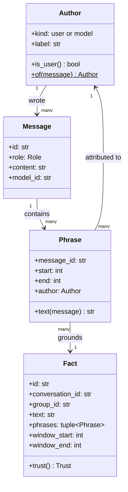
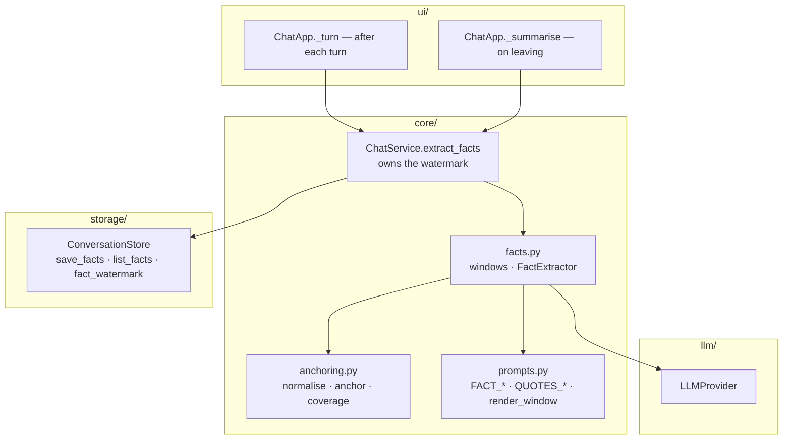
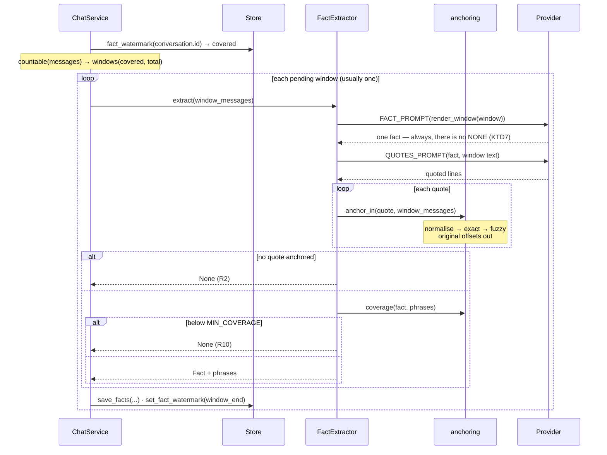
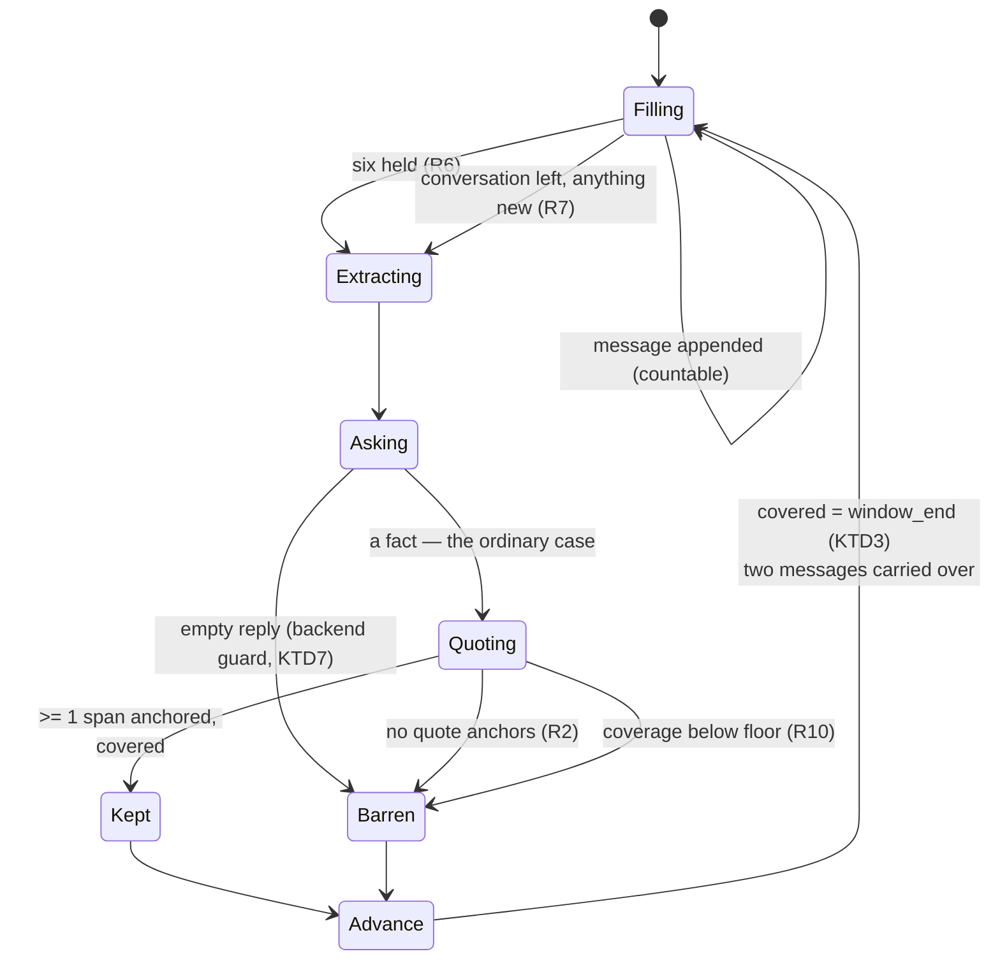

# feat: Grounded fact extraction — one span-anchored fact per sliding window

**Origin requirements:** `docs/requirements.md` (NFR-S-02, NFR-CTX-01, NFR-CTX-03,
NFR-CTX-05, NFR-Q-03, NFR-Q-04)
**Target repo:** this repo (`agentchat`), branch `feat/fact-extraction` off
`feat/conversation-enrichment`
**Builds on:** plan 007 (`conversation_summaries`, the write path) and plan 008
(`MemoryEnricher`, the read path). This plan replaces *what gets captured*. It
does **not** change what gets retrieved — `MemoryEnricher` keeps reading
`conversation_summaries` untouched. Moving recall onto facts is plan 010.

---

## Summary

Instead of compressing a conversation into one 3–5 sentence blob with five
keywords, extract **atomic facts**, each one anchored to verbatim spans of the
messages it came from.

A conversation is read through a **sliding window of six messages that steps
forward by four**. Messages are fed in as they are produced; when six are held,
that window is extracted — one fact, then the quotes supporting it — and the
four oldest are dropped, leaving two to open the next window. Extraction
therefore happens *during* the conversation, not only when it is left, and it
covers the last six messages rather than the whole transcript.

Every quote is located in an actual stored message **by code, not by trust** —
normalised match first, bounded fuzzy match second. A quote that cannot be
located is not evidence; a fact with no located quotes is discarded. Located
quotes become `Phrase` spans carrying the message and the author they came from,
so a fact's provenance is a chain the UI and the retrieval layer can both walk:

```
Fact → Phrase(span) → Message → Author
```

Only the user's turns and the default assistant's turns are fed into the window.
A specialist sub-agent's words are advice to the assistant, not something either
party said, and they are counted in neither the window nor the summary.

Nothing here changes an existing code path's behaviour. Facts land in three new
tables with no consumer, exactly as plan 007 shipped `conversation_summaries`
with no consumer.

---

## Problem Frame

The pipeline on `feat/conversation-enrichment` works end to end, and its two
halves each have a defect that the other cannot fix.

**The captured unit is too coarse to retrieve precisely.** One conversation
becomes one `ConversationSummary` with `keywords: tuple[str, ...]` capped at five
(`core/prompts.py:13`). A conversation covering three topics gets five tokens to
be findable by, and when one hits, `enriched_text` appends the whole blob
(`core/prompts.py:76-85`) — mostly material irrelevant to the current message.
Swapping the matcher for embeddings improves recall but leaves a multi-topic
conversation compressed into one undifferentiated point.

**Nothing in a summary is attributable.** `SUMMARY_SYSTEM` asks the model to
"weight the user's turns above the assistant's" (`core/prompts.py:24-31`) and
`ASSISTANT_CHAR_CAP = 800` trims long replies. Both are soft instructions to a
small local model, so neither is a guarantee. The stored summary is an
unattributed blob: there is no way to tell which parts the user stood behind and
which the model invented. KTD10 of plan 008 already records where that ends —
an enriched reply is re-summarised and one conversation's material launders into
another's memory.

**Re-extraction rewrites rather than appends, and only ever at the end.**
`ChatService.summarise` compares `existing.covered_messages` against
`len(conversation.messages)` (`core/chat.py:202-204`) and, when they differ,
re-summarises the entire transcript. Cost grows with conversation length; the
blob *churns* — a conversation that was about Flask becomes about deployment,
and the earlier content silently disappears from the rewrite; and because the
only trigger is leaving the conversation, a long session captures nothing at all
until it ends.

### Non-goals

Embedded or ranked retrieval; changing `MemoryEnricher`; retiring
`conversation_summaries`; a licence/justification entity; cross-message
coreference resolution beyond the window; a facts browser UI; editing or
deleting individual facts; fact consolidation across conversations.

---

## Requirements

| ID | Requirement | Origin |
|---|---|---|
| R1 | Every fact is grounded in one or more **phrases**, each of which is a span located in a stored message by deterministic code. | user spec |
| R2 | A fact whose quotes cannot be located is discarded, not stored ungrounded. | user spec |
| R3 | Each phrase records which message it came from and which author wrote it. | user spec |
| R4 | An author is the user or a specific model id; a fact's trust tier is derived from the authors of its phrases. | user spec |
| R5 | Extraction runs over a sliding window of `WINDOW_SIZE` messages stepping `WINDOW_STEP`, and each window yields **at most one** fact. | user spec |
| R6 | A window is extracted while the conversation is still open, as soon as it is full. | user spec |
| R7 | Leaving a conversation extracts a partial window, if it holds anything not yet extracted. | user spec |
| R8 | Reopening a conversation resumes the window from its last two extracted messages, so four new messages fill it. | user spec |
| R9 | Only user turns and the default assistant's turns are counted or shown — a specialist sub-agent's output is in neither the window nor the summary. | user spec |
| R10 | A fact must actually be supported by its phrases — a long claim quoting a fragment is rejected. | user spec (grilling round 2) |
| R11 | Extraction is incremental and append-only: every window is paid for at most once, and no stored fact is ever rewritten. | NFR-CTX-01 |
| R12 | The reason a fact holds, when the text states one, is part of the fact rather than a separate entity. | user spec (grilling round 3) |
| R13 | Facts are scoped to a group and are removed with their conversation. | NFR-S-02, NFR-CTX-02 |
| R14 | Fact extraction is switchable off, and off means no LLM calls at all. | NFR-Q-03 |
| R15 | Fact extraction does not change what any existing feature does. | derived |

---

## Key Technical Decisions

**KTD1 — One fact per window; there is no extraction cycle.**
An earlier iteration of this design ran a *cycle* over the whole window: ask for
one more fact, mark its spans as consumed, ask again, and stop on the first of
four brakes (a `NONE` sentinel, repeated duplicates, a round that anchored
nothing, a hard round cap). It is dropped entirely, along with `mark_consumed`,
the `⟦ ⟧` markers, `MAX_ROUNDS` and the strike counter.

The cycle existed to squeeze several facts out of one large window, and it paid
for that with the only unbounded loop in the app, three deterministic brakes to
contain it, and a prompt that fed the model progressively more marked-up text —
increasingly out of distribution, and the most likely source of *fabricated*
facts in the whole design. The sliding window gets the same coverage a different
way: a small window over six messages, stepping four, asks for one fact often
rather than many facts once. Six messages is roughly one topic, so "the most
important thing stated here" is a question a 3.8B model can answer; "the *fifth*
most important thing left in this text, ignoring what is bracketed" is not.

What remains per window is exactly two calls — fact, then quotes — with no loop
around them. Termination is not a property that needs defending any more; it is
arithmetic.

**KTD2 — The queue is derived from a persisted watermark, not held in memory.**
The window is described as a queue: messages are pushed in, extraction fires at
six, the four oldest are popped. Implementing it as an actual queue object would
mean live state that has to survive a conversation switch, an app restart, a
cancelled worker and a crash — and that state would be a second source of truth
about a list the store already holds.

So the queue is a *view*. The store keeps one integer per conversation,
`covered_messages`: how many of the conversation's countable messages some
window has already been extracted from. Everything else is arithmetic on the
message list:

```
queue          = countable[max(0, covered - WINDOW_CARRY):]
next window    = [start, start + WINDOW_SIZE)  when that many are available
after a window  covered = window_end           and the next start is covered - WINDOW_CARRY
```

with `WINDOW_CARRY = WINDOW_SIZE - WINDOW_STEP = 2`. Push, full, pop-four all
fall out of it, and so does R8 without a line of code of its own: reopening a
conversation recomputes `start = covered - 2`, which *is* "feed the last two
persisted messages back in". A crash mid-window costs the window, not the
bookkeeping.

```
countable   m0  m1  m2  m3  m4  m5  m6  m7  m8  m9
window 1   [m0  m1  m2  m3  m4  m5]                  → covered = 6
window 2                   [m4  m5  m6  m7  m8  m9]  → covered = 10
```

**KTD3 — The watermark advances on *every* extracted window, including barren
ones.**
A window that produced no fact — the quotes did not anchor, or coverage rejected
the claim (the only two ways that happens, KTD7) — still moves `covered` to its
end.
The window's content cannot change, so re-running it would buy the same nothing
at the same price. This is the property that makes the cadence affordable and it
is the direct replacement for the old cycle's brakes: the cost ceiling is now
"two calls per four new messages", enforced by the watermark rather than by a
loop guard.

The corollary is that the watermark moves only after the facts of that window
are committed, and one window at a time — `ChatService` saves and advances per
window, so a cancelled backlog keeps every window it finished.

**KTD4 — Only user turns and the default assistant's turns are countable.**
`countable(messages)` drops `system` messages, empty ones, and any message
authored by a specialist sub-agent. It is the unit for the window, for the
watermark, and for what gets rendered into both the fact prompt and the summary
transcript.

The sub-agent pipeline is shipped, and it already makes this true structurally:
a specialist never speaks to the user, and its answer is never a `Message`. It
answers a restated task in a context holding none of the conversation
(`delegation.py:214-221`), its answer reaches the model appended to a
*throwaway copy* of the user's turn (`chat.py:239-263`), and the only thing
persisted is a provenance block on the default reply,
`metadata["subagent"]["answer"]` (`chat.py:207-214`). So `conversation.messages`
contains no specialist turn to exclude, and — because anchoring only ever
searches `message.content` — a specialist's words are not quotable either. R9
holds by construction rather than by filtering.

`countable` therefore filters what is actually there: `system` messages and
empty ones. What earns it a name and a KTD is the *invariant* it stands for —
nothing that a specialist wrote is ever counted, rendered, or anchored — which
is currently maintained by three separate design decisions in two other files,
none of which announce that this plan depends on them. U5 pins it with a test
that a consulted turn's window holds only the visible turns and that the
specialist's answer text anchors nowhere; if a later change does start appending
specialist turns, that test fails instead of the facts quietly acquiring an
author nobody talked to.

Note the asymmetry this leaves, and it is the right one: the default assistant's
reply *is* countable and quotable even when a specialist shaped it, because
those are the assistant's own words to the user, produced by the model
`Author.of` names. The advisor's raw text is out; the reply it informed is in.

**KTD5 — A `Phrase` is a span, but the model is never asked for one.**
`Phrase` stores `(message_id, start, end)` and derives its text by slicing the
message. Storing the quoted string instead would mean the stored evidence can
drift from the source it claims to quote, and would make the "is this really in
the message" property an assertion rather than a fact about the data. As spans,
R1 holds by construction, and a later UI can render a phrase as a highlight in
the original turn rather than as a detached blockquote.

**The offsets are computed, not reported.** The model is asked for *text* — copy
the wording that supports this fact — and `anchor()` finds where that text sits
in `message.content`. Asking a model for `start` and `end` directly would be
asking it to count characters, which it cannot do: it does not see characters at
all, it sees tokens, and the numbers it would produce are fluent-sounding
fiction. Every offset in this design is produced by Python's `str.find` and
`SequenceMatcher` over real strings. No prompt in `prompts.py` mentions an index,
an offset, or a line number, and none may — U3 pins that.

This is also what makes `MAX_QUOTES` several short quotes rather than one span
per fact: quoting is the one thing the model is asked to do here, and it is
asked to do it in the format it is actually good at.

**KTD6 — Anchoring runs against the original message text, always, and is
normalise-then-fuzzy.**
This is the load-bearing decision of the whole plan, and KTD5 is why: the model
is asked to *reproduce* text, and reproduction is not copying. Nothing in a
decoder transports a substring from the prompt to the output — the quote is
re-generated token by token, so it comes back through the model's own
preferences. In practice that means collapsed whitespace, silently fixed typos,
a swapped pronoun, re-casing, a snip mid-word, and — because the tokenizer's
vocabulary has favourites — substituted punctuation: `'` for `’`, `-` for `—`,
`...` for `…`, a plain space for a non-breaking one, a precomposed `é` for a
decomposed one. A strict `quote in message.content` rejects a large share of
*correct* extractions on those alone, and the failure is silent — you get fewer
facts, not an error.

So `core/anchoring.py` normalises both sides — casefold, collapse whitespace
runs to one space, fold the punctuation and Unicode variants the tokenizer
trades in — while keeping an index map back to the original offsets, tries an
exact match on the normalised form, and falls back to a bounded fuzzy window
search with a similarity floor. The returned span is in **original**
coordinates, and it is searched for only within the window's own messages — a
quote that matches text from outside the window is not evidence for this
window's fact.

The division of labour is the point: the model supplies *what* was said, and
code supplies *where* it is. Neither is asked to do the other's job.

**KTD7 — The model is never asked whether a window has a fact in it. There is
no judge and no `NONE`.**
Both earlier designs gave the extractor a way out: a `NONE` sentinel it could
return instead of a fact, few-shot with a worked negative example, parsed by an
`is_no_fact` helper. It is gone — the constant, the parser, the example and the
open question about splitting it into its own Y/N call.

Declining is the single thing a small model is worst at. Models are
completionist; asked for a fact they produce a fact, and the sentinel is
obeyed exactly when it is least needed. Building a gate out of that is the same
mistake as building one out of `is_duplicate` (KTD12): unreliable model
judgement in the write path, with a deterministic filter already sitting
downstream of it. The filters are the gate. A fact must quote text that
*anchors* in a real message (R2) and must *cover* what it claims (R10) — both
computed, neither negotiable, and together they reject the things a `NONE`
would have caught, except that they reject them for a checkable reason.

The cost of dropping it is honest and small: every window now runs both calls,
where a declining window used to run one. And a window with nothing much in it
— six messages of "thanks, that worked" — no longer yields nothing; it yields a
thin fact that happens to be true, anchored and attributed. That is a retrieval
problem, not a write problem, and Q2 records watching its volume.

What survives is a guard, not a gate: an empty or whitespace-only reply from
the fact call produces no fact, the way `ExtractionService` refuses an empty
summary. That is defensiveness against a backend hiccup, and it is not
something the prompt invites the model to use.

**KTD8 — The author is denormalised onto the phrase row.**
`Author` is a frozen value object (`kind`, `label`) derived from a `Message` —
`user`, or the specific model id that produced an assistant turn. It gets no
table: two kinds of author over a handful of model ids is not a relation worth
normalising in a prototype.

It is written onto `fact_phrases` rather than joined from `messages` at read
time, because the retrieval layer's central query is *"facts whose phrases are
user-authored"* and that must not require a join to `messages` to answer. It
also pins the author as it was when the fact was extracted, which is the honest
record.

The payoff, and the reason `Author` is a class rather than a string: a fact's
trust tier falls out of its phrases without being separately declared. A fact
grounded only in user-authored phrases is one the user stood behind. One grounded
only in assistant-authored phrases is a model assertion nobody confirmed.
`Fact.trust` computes this; nothing stores it.

**KTD9 — Authorship establishes who wrote the text, not that anything was
asserted — and nothing in this plan closes that gap.**
A user-authored phrase is not automatically a user claim: questions (*"is
Postgres 14 still supported?"*), hypotheticals (*"what if we moved to Redis?"*),
and the user quoting the assistant back are all user-authored and assert
nothing. Anchoring cannot see the difference, coverage cannot either, and with
KTD7's decline path gone the prompt has no way to refuse such a window — asked
for a fact, the model will restate the question as *"the user asked whether
Postgres 14 is still supported"*, which anchors cleanly and covers well.

Earlier drafts carried this as a requirement, enforced by a negative few-shot
and a test. That requirement is withdrawn rather than left standing on a
mechanism that does not exist. What replaces it is a plainly documented meaning
for `trust`: **`trust == "user"` means the user wrote these words, not that the
user asserted this claim.** `FACT_SYSTEM` still steers toward what the text
establishes, but as a preference under forced output, not a prohibition with an
escape hatch.

That is a real limitation and it lands on plan 010, which is where a fact is
chosen for injection and where the difference between "the user said this" and
"the user asked this" starts to matter. Say so in its handover note rather than
letting it discover the distinction in production.

**KTD10 — There is no `Licence` entity; the reason lives inside the fact text.**
An earlier iteration had `Licence` as a first-class sibling of `Fact`, with its
own phrases and a 1:1 cardinality. Dropped: the cardinality was wrong — plenty
of facts arrive with no stated reason (*"I use Postgres 14."*), and forcing
exactly one makes the model invent one, which is precisely the hallucination the
anchoring exists to prevent. The trust job it was doing is subsumed by the author
cascade (KTD8). And it doubled the per-window call count.

What it was uniquely carrying — *why* a fact holds, which is what distinguishes a
durable fact from a contingent one — survives as prose inside the fact,
grounded by the same phrase set. `"Postgres 14, because the client's ops team
refuses to upgrade"` is one fact, one extraction, reason preserved (R12).

**KTD11 — Support is checked deterministically, not scored by the model.**
The open question after anchoring is how well a phrase *represents* its fact — a
25-word claim quoting four words is over-claiming even though the four words
anchor perfectly. The obvious fix is a model call scoring support 0–9. It is the
wrong fix: small models do not discriminate at that granularity, they cluster on
7 and 8, and it is a third call per window.

`coverage()` is a pure function, and a deliberately dumb one: take the fact's
significant tokens, take the tokens of everything it quoted, and return the
share of the first that appears in the second. Below `MIN_COVERAGE` the fact is
rejected. Worked:

```
fact    "runs Postgres 14 in production and won't upgrade, because the
         client's ops team forbids it"
tokens  {runs, postgres, 14, production, upgrade, because, client, team, forbids}

quotes  ["Postgres 14"]                      → 2/9 = 0.22  rejected
quotes  ["we run Postgres 14 in production", "the client's ops team won't
         let us upgrade"]                    → 6/9 = 0.67  kept
```

The second one scores 0.67 rather than 1.0 even though it fully supports the
fact: `runs` does not match `run` (no stemming), and `because` and `forbids`
are the extractor's own words for a relation the quote expresses differently.
That is why `MIN_COVERAGE` is 0.4 and not 0.8 — a well-grounded fact is a
paraphrase, and paraphrases lose half their vocabulary.

The direction is the mechanism: the denominator is the *fact's* tokens, so a
long quote is never penalised and a long claim on a short quote always is —
which is exactly the over-claiming asymmetry, and nothing else. It costs
nothing, and it is testable without a model. Q3 records the stronger
structural alternative (extract spans first, generate the fact from the spans
alone) for if this proves insufficient.

**KTD12 — Nothing is deduplicated at write time; a duplicate fact is stored.**
The cycle needed `is_duplicate` as brake 2 — it had to fire, or the loop ran
forever. With the cycle gone, the only duplication left is the one the overlap
creates: consecutive windows share `WINDOW_CARRY` messages, so a fact stated in
the carried pair can be offered twice. That is a cheap problem, and the obvious
filter is a worse one.

Any write-time check is a bag of words — small models rephrase, so string
equality catches nothing — and a bag of words cannot see negation: with
`not`, `no` and `n't` all below any workable token-length floor, *"Postgres 14
is supported"* and *"Postgres 14 is not supported"* are the same set. The errors
are also asymmetric. A duplicate that gets through costs one row, and plan 010's
retrieval collapses it at read time anyway. A false positive silently discards a
real fact that nothing will ever re-extract, because KTD3 has already moved the
watermark past its window — and the facts most exposed to it are corrections,
the ones where the conversation changed its mind.

So: no `is_duplicate`, no `DEDUP_LOOKBACK`, no read of prior facts before an
extraction. `FactExtractor.extract` sees one window and nothing else, which also
keeps it a pure function of its input for testing. Deduplication is a retrieval
concern and belongs to plan 010, where it can compare a candidate against what
is *already in the context window* rather than against a token bag, and where a
wrong call costs a spare line in a prompt rather than a fact.

Facts are **appended**, never rewritten. That is the property the summary
pipeline lacks, and it is what makes extraction cost proportional to what is new
rather than to conversation length (R11).

**KTD13 — Facts cascade-delete with their conversation.**
`ConversationStore.delete`'s docstring already requires it ("Must also remove any
derived state", `storage/base.py:61-63`), and the design makes it a necessity
rather than a convention: a fact's grounding *is* its phrases' messages. Delete
the messages and the fact is no longer verifiable, so keeping it would leave
exactly the unattributable residue this plan exists to remove. `facts` carries
`ON DELETE CASCADE` to `conversations`, and `fact_phrases` to `facts`.

**KTD14 — Two triggers, one worker group, one lock.**
Fact extraction now fires at a different cadence from summarisation: after every
turn (whenever a window came up full), and again when the conversation is left
(the partial flush, R7). Summarisation keeps its single on-leave trigger and its
own `ExtractionService`, unchanged, because `MemoryEnricher` still reads its
output and R15 says nothing existing may change.

Both run in `_EXTRACTION_GROUP` and both take `ChatService._provider_lock`, so
the app's existing cancellation contract covers the new trigger for free: a new
user turn already cancels that group before generating (`ui/app.py:414`), which
now means a mid-conversation fact run yields the provider to the user's turn.
KTD3's watermark is what makes that cancellation free — the abandoned window is
simply extracted later, at the next full window or by the exit flush.

---

## High-Level Technical Design

### Static model



`Phrase → Author` is a direct edge as well as a transitive one through
`Message`, because the author is denormalised onto the phrase row (KTD8).
`window_start`/`window_end` are indices into the conversation's *countable*
messages (KTD4) and replace the cycle's `round_index`: with one fact per window
there is no within-window ordering left to record, and a fact's position in the
conversation is the useful thing instead.

`Trust` is not stored. It is derived:

| `Fact.trust()` | when |
|---|---|
| `USER` | every phrase is user-authored |
| `MIXED` | phrases from both kinds |
| `MODEL` | every phrase is model-authored |

### Component relationships



### One window



### Window lifecycle



Every path reaches `Advance`: a window is paid for exactly once whatever it
produced.

---

## Output Structure

```
src/agentchat/
  core/
    anchoring.py     NEW — normalise, anchor, coverage (pure)
    facts.py         NEW — countable/windows (pure) + FactExtractor (one window)
tests/
  test_anchoring.py  NEW — the pure functions, no model, no store
  test_facts.py      NEW — windowing, one window against ScriptedProvider,
                     the cadence through ChatService, and persistence
```

Modified: `src/agentchat/core/models.py` (Author, Phrase, Fact, Trust),
`src/agentchat/core/prompts.py`, `src/agentchat/core/chat.py`,
`src/agentchat/core/errors.py`, `src/agentchat/storage/schema.py`,
`src/agentchat/storage/base.py`, `src/agentchat/storage/sqlite.py`,
`src/agentchat/config.py`, `src/agentchat/ui/app.py`, `tests/conftest.py`,
`tests/factories.py`, `README.md`, `AGENTS.md`.

---

## Implementation Units

### U1. `core/models.py` — Author, Phrase, Fact

**Goal:** The static model as dataclasses, with trust derived rather than stored.
**Requirements:** R1, R3, R4, R12
**Dependencies:** none
**Files:** `src/agentchat/core/models.py`, `tests/test_facts.py` (new)

**Approach:**

1. Beside `Role`:
   ```python
   Trust = Literal["user", "mixed", "model"]
   ```
2. ```python
   @dataclass(frozen=True)
   class Author:
       """Who wrote a message: the user, or the specific model that produced
       an assistant turn."""
       kind: Literal["user", "model"]
       label: str

       @property
       def is_user(self) -> bool: ...

       @staticmethod
       def of(message: Message) -> "Author": ...
   ```
   `of` maps `role == "user"` to `Author("user", "user")` and anything else to
   `Author("model", message.model_id or "unknown")`. A `system` message never
   reaches extraction (`countable` drops it, as `render_transcript` already
   does), so it needs no case — say so in the docstring rather than inventing a
   third kind.
3. ```python
   @dataclass(frozen=True)
   class Phrase:
       """A span of one message, in that message's original coordinates."""
       message_id: str
       start: int
       end: int
       author: Author

       def text(self, message: Message) -> str: ...
   ```
   `text` slices `message.content[self.start:self.end]` and asserts
   `message.id == self.message_id` — a `Phrase` sliced against the wrong message
   is a bug that should be loud, not a wrong quote shown to a user.
4. ```python
   @dataclass
   class Fact:
       id: str = field(default_factory=_new_id)
       conversation_id: str = ""
       group_id: str = ""
       text: str = ""
       phrases: tuple[Phrase, ...] = ()
       #: The half-open range of *countable* message indices this fact was
       #: extracted from — its position in the conversation, and the unit the
       #: watermark counts in.
       window_start: int = 0
       window_end: int = 0
       model_id: str | None = None
       created_at: datetime = field(default_factory=_now)

       @property
       def trust(self) -> Trust: ...

       @property
       def message_ids(self) -> tuple[str, ...]: ...
   ```
   `trust` returns `"user"` when every phrase is user-authored, `"model"` when
   none is, `"mixed"` otherwise. A `Fact` with no phrases cannot exist (R2), so
   `trust` may assume `self.phrases` is non-empty — assert it.

**Patterns to follow:** `ConversationSummary`'s shape (derived state, carries
`group_id` so it is readable without loading the conversation, `model_id` for
provenance); `Group.is_project()` as the precedent for a single method that is
the only place a `kind` is branched on.

**Test scenarios:**
- `Author.of` on a user message, and on an assistant message with and without
  `model_id`.
- `Phrase.text` returns the exact slice; against a different message it raises.
- `trust` for all-user, all-model and mixed phrase sets.
- `window_start`/`window_end` survive a round trip through the store (U4).

---

### U2. `core/anchoring.py` — the deterministic half

**Goal:** Locate a model's quote in a real message, and judge support, without a
model.
**Requirements:** R1, R2, R10, KTD6, KTD11
**Dependencies:** U1
**Files:** `src/agentchat/core/anchoring.py` (new), `tests/test_anchoring.py` (new)

**Approach:**

1. Constants:
   ```python
   #: Similarity a fuzzy window must reach to count as the same quote.
   FUZZY_FLOOR = 0.85
   #: Share of a fact's significant tokens that must appear in its phrases.
   #: Low on purpose: a fact is a paraphrase, not a copy, so even a
   #: well-grounded one shares under half its wording with its quotes.
   MIN_COVERAGE = 0.4
   #: Tokens shorter than this carry no signal — the cheap stand-in for a
   #: stopword list. Tokens containing a digit are kept at any length.
   MIN_TOKEN_LENGTH = 4
   #: Characters a tokenizer routinely trades for a plainer equivalent when it
   #: re-generates a quote (KTD6). Folded on both sides so the trade is a
   #: no-op rather than a mismatch.
   PUNCTUATION_FOLD = {
       "\u2018": "'", "\u2019": "'", "\u201a": "'", "\u201b": "'",
       "\u201c": '"', "\u201d": '"', "\u201e": '"',
       "\u2010": "-", "\u2011": "-", "\u2012": "-", "\u2013": "-",
       "\u2014": "-", "\u2015": "-", "\u2212": "-",
       "\u2026": "...",
       "\u200b": "", "\u200c": "", "\u200d": "", "\u00ad": "",
   }
   ```
   Written as escapes, not literals: half of these are invisible or
   indistinguishable in a diff, and a fold table nobody can review is a fold
   table nobody can correct. Non-breaking and thin spaces need no entry —
   `str.isspace()` is true for them, so the whitespace rule below already folds
   them to a plain space.
2. ```python
   def normalise(text: str) -> tuple[str, list[int]]:
       """Text folded to the form quotes are compared in — casefolded,
       whitespace runs collapsed to one space, tokenizer-substituted
       punctuation folded to its plain equivalent, combining marks dropped —
       and a map from each folded index back to its index in `text`."""
   ```
   Walk `text` **once, character by character**, and for each character emit its
   folded form while appending that character's original index once per emitted
   character:
   - a whitespace run — anything `str.isspace()` accepts, so non-breaking and
     thin spaces included — emits one `" "`, recording the run's first index;
     a leading run emits nothing;
   - a character in `PUNCTUATION_FOLD` emits its replacement (which may be
     empty, or three characters for `…`);
   - a combining mark (`unicodedata.combining(ch)` is non-zero) emits nothing,
     so a decomposed `é` and a precomposed one both fold to `e`;
   - anything else emits `ch.casefold()`.

   Two things to say in comments, because both are easy to "fix" wrongly.
   `str.casefold` and the fold table can change length (`ß` → `ss`, `…` →
   `...`), so the map must carry one entry per **emitted** character to stay
   total. And the fold must be applied per character during the walk — running
   `unicodedata.normalize("NFKC", text)` over the whole string first is the
   obvious shortcut and it silently destroys the index map, because every
   expansion or contraction shifts every offset after it, and the result is
   spans that slice the wrong bytes out of a real message.
3. ```python
   def anchor(quote: str, message: Message) -> tuple[int, int] | None:
       """`quote`'s span in `message.content`, in original coordinates, or
       `None` if it is not there. Exact on the normalised form first, then one
       bounded fuzzy pass at `FUZZY_FLOOR`."""
   ```
   - Normalise both. Empty normalised quote → `None`.
   - `norm_message.find(norm_quote)`; on a hit, map start and end−1 back through
     the index map and return `(start, end_index + 1)`.
   - Otherwise seed candidates with
     `SequenceMatcher(None, norm_quote, norm_message).find_longest_match(...)`.
     Take the window of `len(norm_quote)` characters around the match's position
     in `norm_message`, clipped to bounds, and compute
     `SequenceMatcher(None, norm_quote, window).ratio()`. Return the mapped span
     when the ratio is at or above `FUZZY_FLOOR`, else `None`.
   - One seeded window, not a slide over every offset: quotes are short and
     messages are short, but an O(n·m) slide over every message of every window
     is the kind of thing that only shows up on a real transcript. Say so in a
     comment.
4. ```python
   def anchor_in(quote: str, messages: Sequence[Message]) -> tuple[Message, tuple[int, int]] | None:
       """The best anchor for `quote` across `messages` — highest similarity,
       ties broken toward the most recent message."""
   ```
   Iterate in order, keep the best; an exact hit short-circuits. Callers pass
   the window's messages and nothing else (KTD6).
5. ```python
   def significant(text: str) -> set[str]:
       """Casefolded tokens worth comparing: at least `MIN_TOKEN_LENGTH`
       characters, or containing a digit at any length."""

   def coverage(fact_text: str, quotes: Sequence[str]) -> float:
       """Share of `fact_text`'s significant tokens that also appear in
       `quotes` — how much of what the fact claims is actually in the evidence
       it cited. `1.0` when the fact has no significant tokens: a fact too
       short to measure is not rejected on that basis."""
   ```
   Tokenise on non-alphanumeric runs; `len(fact_tokens & quote_tokens) /
   len(fact_tokens)`. Note the direction in a comment, because it is the whole
   point: the denominator is the **fact's** tokens, so evidence that says more
   than the fact costs nothing, and a fact that says more than its evidence is
   what the floor catches (KTD11).

   The digit clause is not decoration. `MIN_TOKEN_LENGTH = 4` would otherwise
   drop `14`, `3`, `2026`, `40M` — and versions, quantities and dates are
   exactly the claims where being wrong matters and where a model is most
   likely to drift a digit. With them counted, a fact saying `Postgres 15`
   against a quote saying `Postgres 14` loses a token instead of scoring the
   same as a correct one.

   No stopword list — `MIN_TOKEN_LENGTH` is the cheap stand-in. It is a leaky
   one (`that`, `with`, `from`, `been` all survive it) and the leak inflates
   coverage, so the filter errs toward keeping a fact rather than dropping one,
   which is the safe direction for the same reason as KTD12. Record that as the
   reason in the module docstring rather than reaching for a curated list.

   These two are the module's whole public surface alongside `anchor`. There is
   deliberately no `is_duplicate` here (KTD12): comparing facts is a retrieval
   problem, and this module only ever compares a fact against *its own* quotes.

**Patterns to follow:** `core/prompts.py`'s "pure functions, no I/O, no provider"
module contract; `parse_keywords`' defensive posture toward model output.

**Test scenarios** (`tests/test_anchoring.py`, no model, no store):
- Exact quote anchors, and `content[start:end] == quote`.
- Quote differing only in whitespace (`"the  /upload\nendpoint"` vs
  `"the /upload endpoint"`) anchors, and the returned span covers the original
  text including its newline.
- Quote differing only in case anchors.
- **Tokenizer substitutions, each one separately** (KTD6), and each on the
  *exact* path, not the fuzzy one — a fold that only works because the fuzzy
  floor forgives it is not a fold: the message has `don’t`, `—`, `…` and a
  non-breaking space, the quote comes back with `don't`, `-`, `...` and a plain
  space, and `content[start:end]` returns the message's original characters.
- A quote with a precomposed `é` anchors against a message holding the
  decomposed form, and vice versa.
- Quote with one substituted character anchors via the fuzzy path.
- Quote with an added clause the message does not contain returns `None`.
- A quote absent entirely returns `None`.
- A quote at index 0, and one running to the last character, both map back
  correctly (off-by-one guard on the `end_index + 1`).
- `anchor_in` across three messages picks the one containing the quote; when two
  contain it, the later one wins.
- `coverage("uses Postgres 14 because the client refuses to upgrade",
  ["Postgres 14"])` is low; with the full sentence quoted it is `1.0`.
- Coverage is **directional**: extra material in the quotes does not lower it —
  the same fact against `["we use Postgres 14 because the client refuses to
  upgrade, and the migration window is booked for March"]` is still `1.0`.
- `coverage` of a fact with no significant tokens is `1.0`.
- **Digits count:** `coverage("runs Postgres 15", ["we run Postgres 14"])` is
  below the floor, while `coverage("runs Postgres 14", ["we run Postgres 14"])`
  is `1.0` — the one case `MIN_TOKEN_LENGTH` alone would score identically.
- `significant` drops sub-`MIN_TOKEN_LENGTH` tokens and casefolds, and splits on
  punctuation — the one behaviour `coverage` is built on.

**Verification:** `uv run pytest tests/test_anchoring.py` — fast, no fixtures
beyond `make_message`.

---

### U3. `core/prompts.py` — the fact and quote prompts

**Goal:** The two prompts one window runs, and the window renderer they read.
**Requirements:** R5, R12, KTD7, KTD9
**Dependencies:** U1
**Files:** `src/agentchat/core/prompts.py`, `tests/test_facts.py`

**Approach:**

1. Constants beside the existing ones:
   ```python
   MAX_QUOTES = 4
   ```
2. `FACT_SYSTEM` — one fact from a short extract of a conversation, stating:
   - emit exactly one short factual statement — the most important thing the
     text *establishes*;
   - prefer what the text states over what it asks: when the extract is mostly
     questions, state the smallest true thing it establishes rather than
     inflating it into a larger claim (KTD9). This is a preference, not a
     prohibition — there is no way to answer "nothing" (KTD7), and pretending
     otherwise in the prompt only teaches the model to invent an escape;
   - when the text states *why* something holds, include the reason in the same
     sentence (KTD10/R12);
   - no preamble, no numbering, no quotation marks.

   Few-shot, two worked examples: one plain fact, one fact-with-reason. There is
   deliberately **no** third example answering `NONE` — that sentinel is gone
   along with the judge (KTD7), and re-adding a worked negative here would
   reintroduce it through the back door.

   Say "the text below is a short extract from the middle of a conversation",
   so a window that opens mid-topic is not read as an incoherent whole. Nothing
   in this prompt mentions consumed spans or markers any more (KTD1).
3. `FACT_PROMPT` — `"Text:\n\n{text}\n\nFact:"`.
4. `QUOTES_SYSTEM` — quote the text supporting a given fact:
   - copy the supporting wording **verbatim** from the text, one quote per
     line, at most `MAX_QUOTES` — the words themselves, never a description of
     where they are, and never a position, index or line number (KTD5);
   - each quote must be long enough to identify uniquely;
   - do not paraphrase, do not add words, do not fix typos — this instruction is
     what the anchoring is trying to hold the model to, and the fuzzy path
     (KTD6) is what forgives it when it does not.

   One worked example.
5. `QUOTES_PROMPT` — `"Text:\n\n{text}\n\nFact: {fact}\n\nQuotes:"`.
6. ```python
   def parse_quotes(text: str, *, limit: int = MAX_QUOTES) -> tuple[str, ...]:
   ```
   One quote per non-empty line; strip bullets, numbering and surrounding
   quotation marks; drop empties and duplicates; cap at `limit`. Mirror
   `parse_keywords`' defensive shape and its "returns `()` and the caller
   decides" contract.
7. ```python
   def render_window(messages: Sequence[Message], *, budget: int) -> str:
   ```
   Like `render_transcript`, but **without** `ASSISTANT_CHAR_CAP` truncation:
   a capped assistant turn would put text in the prompt that does not exist in
   any message, and every one of those characters is a quote that can never
   anchor. Drop whole assistant turns oldest-first to fit the budget instead.
   Reuse `_label`, `_render`, `estimate_tokens` and `ELISION`.

   Add a comment saying why the cap is absent here but kept in
   `render_transcript` — this is exactly the kind of divergence a later reader
   would "fix".
8. `render_transcript` takes its messages through `countable` too (U5 step 1),
   so a specialist turn could never reach a summary either (R9). No behaviour
   changes today: nothing currently appends such a message.

**Patterns to follow:** the file's existing triple-quoted constants; the module
docstring's promise of no I/O — `render_window` is pure.

**Test scenarios** (in `tests/test_facts.py`):
- `parse_quotes` on a clean two-line reply; on a bulleted reply; on a reply with
  a `Quotes:` label; on empty input (`()`).
- `render_window` includes no `…` truncation marker for a long assistant turn,
  and drops the turn whole when the budget demands.
- **`FACT_SYSTEM` offers the model no way out.** Assert it contains neither
  `NONE` nor any other sentinel, and that no worked example answers with one —
  pinned, because re-adding a negative example is the most natural way to
  accidentally rebuild the judge KTD7 removed.
- **No prompt asks the model for a position.** Assert that neither
  `QUOTES_SYSTEM` nor `QUOTES_PROMPT` contains `index`, `offset`, `position`,
  `character` or `line number` — the one instruction that would make the model
  count characters it cannot see, and a plausible-looking thing for a later
  editor to add when quotes anchor badly (KTD5). The fix for bad anchoring is
  in `anchoring.py`, never in the prompt.
- `parse_quotes` on a reply that *does* volunteer a position — `"lines 2-3: the
  /upload endpoint"` — keeps the quoted words and is not derailed by the
  prefix... or, if that proves fiddly, the quote simply fails to anchor and the
  fact is dropped, which is the safe direction. Decide it with the test.

---

### U4. Storage — three tables, append-only

**Goal:** Facts and phrases persist, scoped by group, cascading on delete.
**Requirements:** R3, R11, R13, KTD8, KTD13
**Dependencies:** U1
**Files:** `src/agentchat/storage/schema.py`, `src/agentchat/storage/base.py`,
`src/agentchat/storage/sqlite.py`, `tests/test_storage.py`

**Approach:**

1. `schema.py`, appended to `SCHEMA`:
   ```sql
   CREATE TABLE IF NOT EXISTS facts (
     id TEXT PRIMARY KEY,
     conversation_id TEXT NOT NULL
       REFERENCES conversations(id) ON DELETE CASCADE,
     group_id TEXT NOT NULL REFERENCES groups(id) ON DELETE CASCADE,
     text TEXT NOT NULL,
     window_start INTEGER NOT NULL, window_end INTEGER NOT NULL,
     model_id TEXT, created_at TEXT NOT NULL);
   CREATE INDEX IF NOT EXISTS idx_facts_group ON facts(group_id);
   CREATE INDEX IF NOT EXISTS idx_facts_conversation ON facts(conversation_id);

   CREATE TABLE IF NOT EXISTS fact_phrases (
     fact_id TEXT NOT NULL REFERENCES facts(id) ON DELETE CASCADE,
     ordinal INTEGER NOT NULL,
     message_id TEXT NOT NULL,
     start INTEGER NOT NULL, "end" INTEGER NOT NULL,
     author_kind TEXT NOT NULL, author_label TEXT NOT NULL,
     PRIMARY KEY (fact_id, ordinal));

   CREATE TABLE IF NOT EXISTS fact_extraction_state (
     conversation_id TEXT PRIMARY KEY
       REFERENCES conversations(id) ON DELETE CASCADE,
     covered_messages INTEGER NOT NULL, updated_at TEXT NOT NULL);
   ```
   Three notes for the implementer. `end` is a SQLite keyword — quote it in
   every statement that names it. `fact_extraction_state.covered_messages`
   counts **countable** messages (KTD4), not rows in `messages`, and so is not
   comparable with `conversation_summaries.covered_messages`, which counts all
   of them — say so in a schema comment, since the two columns share a name.
   And `fact_phrases.message_id` deliberately carries **no** FK to `messages`:
   `SqliteStore._save` deletes and re-inserts every message row on every turn
   (`storage/sqlite.py:189-210`), so an FK would cascade every fact in the
   conversation away on the next turn. The cascade that matters — losing the
   conversation loses its facts (KTD13) — is carried by `facts.conversation_id`.
   State this in a schema comment too; it is the single most damaging thing a
   later reader could "correct".
2. `storage/base.py` — four methods on the protocol, beside the summary block:
   ```python
   async def save_facts(self, facts: Sequence[Fact]) -> None:
       """Append `facts` and their phrases in one transaction. Existing facts
       for the conversation are left alone — facts are never rewritten (R11)."""

   async def list_facts(self, group_id: str) -> list[Fact]:
       """Newest first, then by `window_start`. Nothing in this plan calls it
       — plan 010 does, and U4's tests do."""

   async def fact_watermark(self, conversation_id: str) -> int:
       """How many of the conversation's countable messages have been
       extracted from; `0` if never."""

   async def set_fact_watermark(self, conversation_id: str, covered: int) -> None: ...
   ```
   Extend the existing "derived state" comment block to say facts have no
   consumer yet either, and that plan 010 is the one that gives them one.
3. `storage/sqlite.py` — the four bodies, each `asyncio.to_thread`-offloaded and
   wrapped in `StorageError`, matching the summary methods exactly.
   `_list_facts` does one `SELECT` per table and groups phrases by `fact_id` in
   Python rather than issuing N+1 queries.

**Patterns to follow:** `_save_summary`/`_list_summaries` for the method shape,
the `closing(self._connect()) as conn, conn` idiom, and `_summary_from_row` as
the precedent for a module-level row mapper.

**Test scenarios** (add to `tests/test_storage.py`):
- Save two facts with phrases; `list_facts` returns them with phrases intact, in
  order, with `Author` reconstructed.
- `list_facts` is scoped to the group — a fact in another group is absent (R13).
- Deleting the conversation removes its facts and their phrases (query
  `fact_phrases` directly to prove the second cascade fired).
- Deleting the group removes its conversations' facts.
- **Saving the conversation again does not remove its facts** — the regression
  the missing FK exists to prevent. Save a conversation, save facts, add a
  message, save the conversation again, assert the facts are still there.
- `save_facts` twice appends rather than replaces.
- `fact_watermark` is `0` for an unknown conversation; round-trips after
  `set_fact_watermark`.
- `save_facts([])` is a no-op and opens no transaction that fails.

---

### U5. `core/facts.py` — the window and the two calls

**Goal:** The pure window arithmetic, and one window's extraction.
**Requirements:** R1, R2, R5, R9, R10, R12
**Dependencies:** U2, U3, U4
**Files:** `src/agentchat/core/facts.py` (new), `src/agentchat/core/errors.py`,
`tests/test_facts.py`

**Approach:**

1. The pure half — no provider, no store, and the part every windowing test
   drives directly:
   ```python
   #: Messages held before a window is extracted.
   WINDOW_SIZE = 6
   #: Messages dropped afterwards — so consecutive windows overlap by
   #: WINDOW_SIZE - WINDOW_STEP.
   WINDOW_STEP = 4
   WINDOW_CARRY = WINDOW_SIZE - WINDOW_STEP

   def countable(messages: Sequence[Message]) -> list[Message]:
       """The turns the window and the summary are built from: the user's and
       the assistant's, in order, dropping `system` and empty ones.

       A sub-agent's answer is not among them and needs no filtering — it is
       never a `Message` at all, only `metadata["subagent"]` on the reply it
       informed (KTD4)."""

   def windows(covered: int, total: int, *, flush: bool = False) -> tuple[tuple[int, int], ...]:
       """The half-open ranges of countable indices still to extract.

       Full windows only, unless `flush` — then a final short window covers
       whatever is left past `covered` (R7). Empty when nothing is due."""
   ```
   `windows` is the whole queue (KTD2): start at `max(0, covered - WINDOW_CARRY)`,
   emit `[s, s + WINDOW_SIZE)` while it fits in `total`, step `s` by
   `WINDOW_STEP`; then, when `flush` and `total > covered`, emit `[s, total)`.
   The `total > covered` guard is what stops an exit with no new messages from
   re-extracting the two carried ones.

   Do **not** add a speculative "was this authored by a specialist?" predicate:
   there is no such message and no field that would carry the answer, so it
   would be a branch no data can enter and no test can cover. The invariant is
   defended by the test instead (KTD4).
2. Constants for the calls, each with a one-line comment saying what it protects:
   ```python
   FACT_MAX_TOKENS = 96
   QUOTES_MAX_TOKENS = 128
   PROMPT_OVERHEAD_TOKENS = 384
   MIN_WINDOW_BUDGET = 256
   ```
   Reuse `extraction.py`'s `_EXTRACTION_OPTIONS_BASE` posture:
   `temperature=0.0, thinking=False`, same two reasons (reproducibility, and a
   reasoning preamble would be stored as the fact).
3. `core/errors.py`: `class FactExtractionError(AgentChatError)` beside
   `ExtractionError`.
4. ```python
   class FactExtractor:
       def __init__(self, registry: ModelRegistry) -> None: ...

       async def extract(self, messages: Sequence[Message]) -> Fact | None:
           """One window in, at most one fact out. `None` when nothing the
           model claimed could be grounded — no quote anchored, or the claim
           outran its quotes — which is a normal outcome, not an error. The
           model is not consulted about whether the window has a fact in it
           (KTD7); only the anchoring and coverage checks can return `None`.

           `messages` is one window's countable messages, and is the *only*
           input: nothing already stored is consulted (KTD12). `conversation_id`,
           `group_id` and the window bounds are filled in by the caller."""
   ```
   Knows nothing about storage, exactly as `ExtractionService` does not — the
   caller persists and moves the watermark, which keeps the LLM calls outside
   any transaction.
5. The body, in order, with no loop anywhere in it:
   - `budget` as in `extraction.py`: context window minus the larger of the two
     `MAX_TOKENS` minus `PROMPT_OVERHEAD_TOKENS`, floored at `MIN_WINDOW_BUDGET`;
     `working = render_window(messages, budget=budget)`.
   - fact call → strip the reply; empty → `None`. This is the backend guard of
     KTD7, not a decline path: there is no sentinel to test for, and the reply
     is otherwise taken at face value and sent to the quotes call.
   - quotes call → `parse_quotes`.
   - for each quote, `anchor_in(quote, messages)` → `Phrase(message.id, start,
     end, Author.of(message))`.
   - no phrases → `None` (R2).
   - `coverage(reply, [p.text(msg) for p in phrases]) < MIN_COVERAGE` → `None`
     (R10).
   - otherwise `Fact(text=reply, phrases=..., model_id=provider.info.id)`.
6. Wrap provider calls so a backend failure raises `FactExtractionError` rather
   than escaping as a bare backend exception, matching `ExtractionError`'s role.

**Patterns to follow:** `ExtractionService` — a `core/` service taking one
collaborator, returning objects, persisting nothing; its comment explaining why
temperature is 0.

**Test scenarios** (`tests/test_facts.py`):

*`windows` and `countable`, pure, no fixtures:*
- `windows(0, 5)` is empty; `windows(0, 6)` is `((0, 6),)`; `windows(0, 9)` is
  `((0, 6),)` — the second window is not yet full.
- `windows(6, 10)` is `((4, 10),)` — the carry, i.e. R8's "two old messages plus
  four new ones".
- `windows(6, 7)` is empty, and with `flush=True` is `((4, 7),)` (R7).
- `windows(6, 6, flush=True)` is empty — leaving without adding anything
  extracts nothing, even though two messages sit in the queue.
- `windows(0, 13)` is `((0, 6), (4, 10))`, and with `flush=True` is
  `((0, 6), (4, 10), (8, 13))` — assert the exact tuple: a backlog is drained
  oldest-first at the same step, never merged into one big window.
- `countable` drops a `system` message and an empty one, and **keeps** an
  assistant reply carrying a `metadata["subagent"]` block — the reply is the
  assistant's own turn (KTD4).
- **R9, the invariant:** build a window whose assistant reply carries a
  `metadata["subagent"]` block with a distinctive sentence in its `answer`.
  `render_window` of that window contains none of that sentence, and
  `anchor_in(sentence, window)` is `None` — so no fact can be grounded in the
  specialist's words. This is the test that fails if a later change starts
  appending specialist turns.

*One window, `ScriptedProvider`:*
- **Happy path:** fact then quotes → a `Fact` whose phrases' `text()` matches the
  real message content.
- **Empty reply:** the fact call returns `""` or whitespace → `None`, and
  exactly one provider call was made (the quotes call must not run). The
  backend guard of KTD7 — and note in the test's name that this is *not* a
  decline path, so nobody reads it as one and builds a sentinel back on top.
- **No sentinel is honoured:** a fact call answering `"NONE"` produces a fact
  *about* that reply attempt — i.e. it is passed to the quotes call like any
  other string, and is then dropped by anchoring because `NONE` quotes nothing.
  Pins that the word carries no special meaning any more (KTD7).
- **R2:** quotes that are pure invention → `None`.
- **R10:** a long fact quoting two words → `None`.
- **KTD6 end to end:** the scripted quote differs from the message by case and
  whitespace and still anchors, with `phrase.text(message)` returning the
  message's original casing.
- **KTD9, the withdrawn requirement:** a window of nothing but user questions,
  with a model scripted to restate one as *"the user asked whether …"*, yields
  a `Fact` — it anchors and it covers, so nothing rejects it. Asserted as the
  *documented* behaviour, because it is the consequence of dropping the judge
  and someone will otherwise read it as a bug.
- Authors: a fact quoting a user turn has `trust == "user"`; one quoting both
  has `"mixed"`.
- A backend error inside `extract` surfaces as `FactExtractionError`.

**Verification:** `uv run pytest tests/test_facts.py` — no GPU, no real model.

---

### U6. `ChatService` and wiring — the cadence

**Goal:** Windows are extracted as they fill and when the conversation is left,
and the whole thing is switchable off.
**Requirements:** R5, R6, R7, R8, R11, R14, R15, KTD3, KTD14
**Dependencies:** U5
**Files:** `src/agentchat/core/chat.py`, `src/agentchat/config.py`,
`src/agentchat/ui/app.py`, `tests/conftest.py`, `tests/test_core.py`,
`tests/test_facts.py`, `tests/test_app.py`

**Approach:**

1. `ChatService.__init__` gains `fact_extractor: FactExtractor | None = None`,
   with the same "`None` switches it off" comment as `extractor` and `enricher`.
2. ```python
   async def pending_fact_windows(
       self, conversation: Conversation, *, flush: bool = False
   ) -> tuple[tuple[int, int], ...]:
       """Which windows `extract_facts` would run — `()` when there is
       nothing to do. The UI's cheap probe: one indexed row read, no
       provider, so a turn that fills no window starts no visible work."""
   ```
3. ```python
   async def extract_facts(
       self, conversation: Conversation, *, flush: bool = False
   ) -> tuple[Fact, ...]:
       """Extract and persist one fact per window that is due. `flush` also
       extracts a partial window, which is what leaving a conversation does
       (R7). `()` when there is no extractor and when nothing is due."""
   ```
   - `None` extractor or no messages → `()`.
   - `items = countable(conversation.messages)`;
     `covered = await self.store.fact_watermark(conversation.id)`;
     `windows(covered, len(items), flush=flush)` → `()` if empty.
   - For **each** window, in order:
     - `async with self._provider_lock:` around
       `self._fact_extractor.extract(items[start:end])`, for the
       reason already documented on the lock (`core/chat.py:53-56`). Acquired
       per window, not around the loop, so a backlog never holds the provider
       against the user's next turn for longer than one window.
     - `await self.store.save_facts([fact])` when there is one, then
       `set_fact_watermark(conversation.id, end)` — **always**, fact or not
       (KTD3). Per window, so a cancelled backlog keeps what it finished.
4. `config.py`:
   ```python
   extract_facts: bool = field(default_factory=lambda: _env_flag("EXTRACT_FACTS", True))
   ```
   with the same "on by default — a feature that has to be switched on is not
   demonstrable" comment, and
   ```python
   def build_fact_extractor(settings: Settings, registry: ModelRegistry) -> FactExtractor | None:
   ```
   beside `build_extractor`. Fifth wiring point, same shape.
5. `ui/app.py`, the two triggers (KTD14):
   - Pass `fact_extractor=build_fact_extractor(...)` into `ChatService`.
   - **After a turn.** At the end of `_turn`, once the reply is persisted, call
     a new `_maybe_extract_facts(conversation)`. It returns immediately when
     `chat.fact_extractor is None`; otherwise it awaits
     `chat.pending_fact_windows(conversation)` and starts the worker only if
     that is non-empty, raising the status indicator the same way
     `_maybe_summarise` does. Probing before starting is what keeps the
     indicator from blinking after every single turn.
   - **On leaving.** `_maybe_summarise` (called from `_start_conversation` and
     `_switch_to`) widens its guard to
     `if self.chat.extractor is None and self.chat.fact_extractor is None: return`,
     and its worker calls `await self.chat.extract_facts(conversation,
     flush=True)` **before** `await self.chat.summarise(conversation)` — inside
     the same `try`, so the existing `CancelledError` / `AgentChatError`
     handling covers both unchanged. Facts first: it is the flush that would
     otherwise be lost, and it is bounded by one short window.
   - Same in `_summarise_before_exit`, inside the existing `wait_for` so one
     timeout still bounds the whole pre-exit phase, and with its guard widened
     the same way.
   - Both live in `_EXTRACTION_GROUP`, so `_turn`'s existing
     `cancel_group(_EXTRACTION_GROUP)` keeps the provider for the user's turn.
   `FactExtractionError` is an `AgentChatError`, so the warning-toast path needs
   no change.
6. `tests/conftest.py`: `mock_settings` gets
   `overrides.setdefault("extract_facts", False)`, with a sentence in the
   docstring next to the extraction and enrichment ones, for the same reason —
   the existing suite must not grow LLM calls per turn.

**Test scenarios:**
- (`tests/test_core.py`) `build_fact_extractor` returns a `FactExtractor` when
  the flag is on and `None` when off; `AGENTCHAT_EXTRACT_FACTS=0` yields
  `Settings().extract_facts is False`.
- (`tests/test_facts.py`) A six-message conversation extracts one fact and the
  watermark lands at `6`; the same conversation at five messages extracts
  nothing and makes **no provider call** (R5's cadence, asserted on call count).
- Ten messages extract two facts, from windows `(0, 6)` and `(4, 10)`, and the
  stored `window_start`/`window_end` say so.
- A barren window still moves the watermark, and re-running makes no provider
  call (KTD3).
- `flush=True` on a conversation with seven countable messages extracts `(4, 7)`;
  a second `flush=True` with nothing added returns `()` and makes no call (R7).
- **R8:** save a conversation with the watermark at 6, reload it, append four
  messages, and `extract_facts` runs exactly one window `(4, 10)` — the two
  carried messages are in it.
- **R11:** a second run never rewrites the first run's facts (compare ids and
  text before and after).
- **R9:** a conversation whose turns were all consulted (every reply carries a
  `metadata["subagent"]` block) advances the window by its visible turns only —
  six messages, one window, exactly as an unconsulted conversation.
- `ChatService(..., fact_extractor=None).extract_facts(...)` returns `()` and
  touches neither provider nor store (R14).
- (`tests/test_app.py`) with `extract_facts=True, extract_summaries=False`:
  three exchanges in one conversation produce a fact **without leaving it**
  (R6); leaving produces the flush; the status indicator behaves as it does
  today, and shows nothing on a turn that fills no window.
- **R15:** the existing suite passes untouched, and a run with
  `extract_facts=True, extract_summaries=True` still writes a
  `ConversationSummary` and still enriches.

---

### U7. Documentation

**Goal:** The repo describes what now exists and what it does not yet feed.
**Requirements:** NFR-Q-04
**Dependencies:** U6
**Files:** `README.md`, `AGENTS.md`

**Approach:** README: `AGENTCHAT_EXTRACT_FACTS` in Configuration, and a short
"What gets remembered" section — facts rather than summaries, one fact per six
messages as the conversation goes on, every fact anchored to a quote in a real
message, the author chain, that a specialist's advice is not part of it, that
facts have no consumer until recall moves onto them, and that summary extraction
still runs beside it. `AGENTS.md`: add `core/facts.py` and `core/anchoring.py`
to the Layout block, with a line saying the fact and quote prompts are tuned in
`prompts.py` like the others, that `anchoring.py` is pure and must stay that way,
and that the window arithmetic in `facts.py` is pure too — the queue is derived
from the stored watermark, never held in memory.

**Verification:** every variable and path named in `README.md` exists in the code.

---

## Verification Contract

1. `uv run pytest` passes and the pre-existing suite's behaviour is unchanged
   (R15).
2. `AGENTCHAT_BACKEND=mock AGENTCHAT_EXTRACT_FACTS=1 uv run agentchat`: take
   three exchanges in a project group **without leaving the conversation**, then
   `sqlite3 <data>/agentchat.db "SELECT text, window_start, window_end FROM
   facts"` — a row exists, covering `0..6` (R6). Two exchanges produce none.
3. Take two more exchanges and check again: a second row covering `4..10` (R5,
   the step and the overlap).
4. `sqlite3 <data>/agentchat.db "SELECT f.text, p.message_id, p.start, p.\"end\",
   p.author_kind FROM facts f JOIN fact_phrases p ON p.fact_id = f.id"` — every
   fact has at least one phrase (R2), and for each row the substring of that
   message between `start` and `end` reads as real text from the conversation
   (R1). Check three by hand.
5. Take one more exchange and leave the conversation: a third row appears from
   the partial window (R7), and the earlier rows are unchanged (R11). Reopen it,
   take two exchanges, and confirm the next window starts two messages before
   the first new one (R8) — read `window_start` against
   `SELECT COUNT(*) FROM messages WHERE conversation_id = …`.
6. `AGENTCHAT_EXTRACT_FACTS=0` — no fact rows, no behaviour change (R14).
7. **On a GPU node with the real backend**, write a turn containing a typographic
   apostrophe, an em dash and an ellipsis (`the client’s ops team won’t
   upgrade — not before Q3…`) and confirm a fact anchors to it. This is the
   property no mock can test: whether the real tokenizer's substitutions are the
   ones `PUNCTUATION_FOLD` covers (KTD6). Read the stored span back and compare
   it against the message's original characters, not against the model's reply.
8. On the same node, the two model-dependent properties of the prompts.
   A conversation stating a constraint with a reason produces a fact carrying
   the reason (R12). And — the judgement call this plan defers to the machine —
   run a window of nothing but questions and pleasantries, then **read what it
   produced**. Every window yields a fact now (KTD7), so the question is not
   whether it produced one but whether what it produced is tolerable: grounded
   and trivial (*"the user asked about Postgres 14 support"*) is the expected
   outcome and is fine; ungrounded or invented is a coverage/anchoring failure
   and belongs in Q3. This is Q2's evidence.
9. On the same node, a long conversation: watch the status indicator between
   turns, confirm typing immediately after a turn is never blocked behind an
   extraction (KTD14), and confirm the fact count is one per window — with the
   judge gone it should be, minus whatever anchoring and coverage reject. A
   materially lower count means the filters are rejecting far more than
   expected, which is Q3 and Q4, not Q1.
10. Trigger a specialist consultation (`@ask_chef …`), then check the window
    accounting: the specialist's answer appears in no fact text and in no phrase,
    and the watermark advanced by the visible turns only (R9).
11. Delete the conversation from the picker; `SELECT COUNT(*) FROM fact_phrases`
    drops to zero for its facts (R13).

## Definition of Done

All seven units landed; every test scenario implemented and passing; the eleven
verification steps performed, 7 to 9 on a GPU node; `README.md` and `AGENTS.md`
updated.

---

## Scope Boundaries

### Deferred to follow-up work

- **Plan 010 — recall on facts.** `MemoryEnricher` reads `list_facts(group_id)`
  instead of `list_summaries`, retrieves by hybrid FTS5 + embedding rather than
  keyword regex, weights by `trust` and recency (`window_start`, not the
  `round_index` an earlier draft of this plan would have given it), and dedupes
  against what is still in the live context window rather than a once-per-session
  ledger. Retiring `conversation_summaries` belongs there, not here.

  It inherits two things this plan deliberately does not solve, and should be
  written knowing both: the store contains **duplicates**, because nothing
  dedupes at write time (KTD12); and it contains **facts about questions**,
  because nothing rejects them and `trust == "user"` means only that the user
  wrote the words (KTD9). Both are read-time problems there, where a wrong call
  costs a line in a prompt rather than a fact.
- **A facts view** — `list_facts` backs it, and the phrase spans make
  "show me where this came from" a highlight rather than a quote.
- **Editing or deleting a fact**, once there is a view.
- **Consolidating facts across conversations in a group.**

### Not in scope

Adaptive RAG, sub-agents, fine-tuned adapters, cross-group recall, coreference
resolution beyond the window, a licence/justification entity (KTD10), and
extracting more than one fact from a window (KTD1).

---

## Open Questions

**Q1 — Are six and four the right size and step?** They encode a bet that six
messages is about one topic and that a fact is worth extracting every two
exchanges. If step 9 shows facts arriving too sparsely, the step comes down
(more windows, more calls); if consecutive facts keep restating each other the
overlap is doing more harm than the coreference it buys — nothing filters that
now (KTD12) — and the carry comes down instead. Two constants, both in `facts.py`, and `windows` is pure so the
change is a table-driven test away from proven.

**Q2 — How thin are the facts from a window that establishes nothing?** With no
decline path (KTD7), every window produces a claim, and a window of pleasantries
produces a claim about pleasantries. The bet is that these are *grounded* and
therefore harmless — they anchor, they carry a trust tier, and plan 010 can rank
them below anything substantive.

What would falsify it is not their existence but their share: if most of what a
real conversation stores is *"the user thanked the assistant"*, then recall is
being asked to filter at read time what should not have been written, and the
answer is a fact *quality* signal — most likely coverage's floor raised, since
a thin fact typically quotes little — rather than reinstating a judge the model
cannot operate. Step 8 is the evidence, and it is a reading exercise, not a
count.

**Q3 — Is `coverage` strong enough?** It catches a long claim quoting a fragment.
It does not catch a fact that shares vocabulary with its quotes while asserting
something they do not support. The structural fix is to invert the window — quote
first, then generate the fact *from the quotes alone*, so the fact cannot assert
what the quotes do not contain. It costs no extra call, but picking salient spans
without knowing the target fact is a harder task for a small model, and the fact
step loses the surrounding context it needs to resolve *"yes, that one"*. Worth
trying only if step 8 shows over-claiming.

**Q4 — Is `FUZZY_FLOOR = 0.85` right?** Too high and correct quotes are silently
dropped (facts vanish, no error). Too low and a paraphrase anchors to text that
does not support it, which is worse — it is the exact failure this design exists
to prevent. If it needs tuning, tune it **down** only with a test that a genuine
paraphrase still fails to anchor.

**Q5 — Should the window be counted in messages or tokens?** Six messages is
crude: two long assistant turns can be most of the budget, and `render_window`
then drops turns the watermark has already counted as covered. Tokens would be
better; messages are what the watermark counts and what the user's mental model
of "the last six messages" is, and mixing units is worse than a coarse one.

**Q6 — Should a fact record the *window* or the messages it quoted?** Both are
stored (`window_start`/`window_end`, and `fact_phrases.message_id`), which is
redundant. The window bounds are kept because they are the only record of what
the model was *looking at* when it wrote the fact — the phrases only say what it
ended up quoting, and the difference is what tells you whether a thin fact came
from a thin window or from a rich one badly read.

---

## Risks

| Risk | Mitigation |
|---|---|
| Mid-conversation extraction makes the user wait: the fact run holds the provider lock when the next turn wants it. | Facts run in `_EXTRACTION_GROUP`, which `_turn` already cancels before generating (KTD14), and the lock is acquired per window rather than per run. The cancelled window costs nothing because the watermark only advances on a committed window (KTD3). |
| A fast typist cancels every fact run, so nothing is ever extracted while the conversation is live. | The backlog is derived from the watermark, not lost with the worker: `windows()` returns every window still due, and the exit flush drains whatever is left. Worst case the cadence degrades to the on-leave behaviour this plan started from. |
| The two-message overlap yields the same fact twice, so the store fills with near-duplicate rows. | Accepted, deliberately (KTD12): a duplicate row is cheap, plan 010 dedupes at read time against the live context window, and every write-time filter considered would sometimes discard a real fact instead — permanently, since the watermark has already moved past its window. Q1 records shrinking the carry if the volume is worse than expected. |
| An FK from `fact_phrases.message_id` to `messages.id` deletes every fact on the next turn, because `_save` re-inserts every message row. | The FK is deliberately absent, with the reason in a schema comment, and U4 has a regression test that saving the conversation again leaves the facts intact. |
| The two `covered_messages` columns count different things — countable messages for facts, all messages for summaries — and someone compares them. | Named in a schema comment and in `fact_watermark`'s docstring; `countable` is the only way facts count anything, and U6 tests a conversation containing a message the two columns disagree about. |
| The fuzzy anchor accepts a paraphrase, so a fact is "grounded" in text that does not support it. | `FUZZY_FLOOR` at 0.85 with a test that an added clause fails to anchor; Q4 forbids lowering it without that test. |
| Anchoring rejects most real quotes, so the pipeline quietly produces almost no facts. | Normalisation before matching (KTD6) covers the deviations a re-generated quote actually shows — whitespace, case, tokenizer punctuation, combining marks — and U2 tests each one separately on the *exact* path, so a regression names which one broke rather than spending the fuzzy budget silently. What is left over is what `FUZZY_FLOOR` is for. |
| A later editor "fixes" weak grounding by asking the model for character offsets, which it cannot count. | KTD5 states the division of labour, and U3 asserts no prompt contains `index`, `offset`, `position`, `character` or `line number`. |
| Facts are extracted from text that no message contains, because the renderer truncated an assistant turn. | `render_window` drops whole turns instead of capping them (U3 step 7), and the divergence from `render_transcript` is commented at both sites. |
| Running fact and summary extraction together roughly triples per-conversation LLM cost on a local model, now partly *during* the conversation. | Accepted for this plan: recall still depends on summaries (R15). The cost is bounded and predictable — two calls per four new messages, every window, since dropping the judge (KTD7) also dropped the one-call path a declining window used to take — and it no longer grows with conversation length the way re-summarisation does. Plan 010 retires summaries and their cost. `AGENTCHAT_EXTRACT_FACTS=0` is the escape hatch meanwhile. |
| The model extracts questions and hypotheticals as facts, since authorship alone cannot distinguish them and nothing rejects them (KTD9). | **Not mitigated — accepted.** The requirement that forbade it is withdrawn along with the decline path it depended on (KTD7). What is mitigated is the *misreading*: `trust == "user"` is documented as "the user wrote these words", U5 pins the behaviour as expected rather than as a bug, and plan 010's handover names it as the distinction recall has to make. Step 8 measures how often it happens. |
| A specialist's words are captured as something the user or the assistant said. | Structurally impossible today: a specialist's answer is never a `Message`, and anchoring only searches `message.content` (KTD4). The exposure is that this depends on three decisions in `delegation.py` and `chat.py` that do not know this plan relies on them — so U5 pins the invariant with a test, and verification step 10 checks it against a real consultation. |
| A fact loses its grounding when its conversation is deleted, leaving unattributable residue — the thing this plan exists to remove. | Facts cascade with the conversation (KTD13), tested at both levels in U4. |

---

## Sources & Research

- `docs/plans/2026-08-12-007-feat-conversation-summaries-plan.md` — the summary
  write path this plan replaces the *contents* of; its KTD9 (an unparseable reply
  loses keywords, not the summary) is the precedent for `parse_quotes` returning
  `()` rather than raising.
- `docs/plans/2026-08-12-008-feat-message-enrichment-plan.md` — KTD10 there
  (enrichment leaks into the next extraction, two-hop laundering) is the concrete
  harm that provenance is meant to make impossible.
- `src/agentchat/core/delegation.py:214-221` and
  `src/agentchat/core/chat.py:207-214,239-263` — the shipped sub-agent pipeline
  (plan 011, commit `bd2501e`): a specialist answers a restated task, its answer
  is injected into a throwaway copy of the user's turn, and only a provenance
  block is persisted. This is why no specialist turn exists to exclude, and why
  the exclusion is an invariant to pin rather than a filter to write (KTD4).
- `src/agentchat/core/extraction.py:41-82` — the budget arithmetic, the
  temperature-0/thinking-off posture, and the "returns an object, the caller
  persists" contract that `FactExtractor` copies.
- `src/agentchat/core/prompts.py:16-31,88-126` — `ASSISTANT_CHAR_CAP` and
  `render_transcript`'s truncation, which `render_window` must not inherit; and
  `parse_keywords` as the model for `parse_quotes`' defensiveness.
- `src/agentchat/storage/sqlite.py:189-210` — `_save` deletes and re-inserts
  every message row every turn, the reason `fact_phrases` carries no FK to
  `messages`.
- `src/agentchat/core/chat.py:53-56,195-212` — the provider lock's documented
  scope and `summarise`'s watermark check, the shape `extract_facts` mirrors
  per window.
- `src/agentchat/ui/app.py:150-171,358-392,409-414` — the extraction worker, its
  cancellation handling, the pre-exit timeout, and `_turn`'s
  `cancel_group(_EXTRACTION_GROUP)` that makes the new mid-conversation trigger
  safe.
- `docs/requirements.md` — NFR-S-02 (memory scoped to groups), NFR-CTX-01
  (compression), NFR-CTX-03 (selection by relevance), NFR-CTX-05 (observable).
