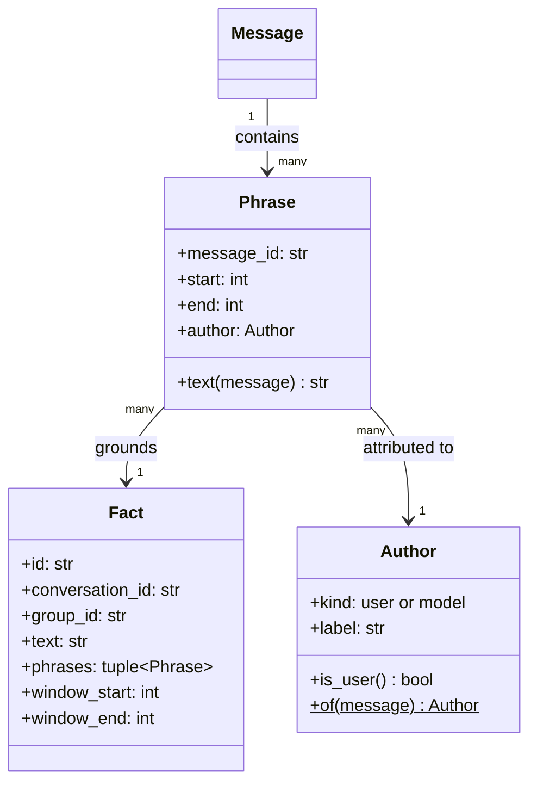

# feat: Grounded fact extraction — one span-anchored fact per sliding window

**Origin requirements:** `docs/requirements.md` (NFR-S-02, NFR-CTX-01, NFR-CTX-03,
NFR-CTX-05, NFR-Q-03, NFR-Q-04)
**Target repo:** this repo (`agentchat`), branch `feat/fact-extraction` off
`feat/conversation-enrichment`
**Builds on:** plans 007 (`conversation_summaries`) and 008 (`MemoryEnricher`).
Nothing here changes what is retrieved — `MemoryEnricher` keeps reading
`conversation_summaries` untouched, and facts land in three new tables with no
consumer. Moving recall onto facts is plan 010.

---

## What this builds

A conversation is read through a **sliding window of six messages stepping
four**. When a window is full it is extracted — one LLM call for a fact, one for
the quotes supporting it — and the four oldest messages drop out, leaving two to
open the next window. Extraction happens *during* the conversation, and again on
leaving if anything unextracted is left over.

```
countable   m0  m1  m2  m3  m4  m5  m6  m7  m8  m9
window 1   [m0  m1  m2  m3  m4  m5]                  → covered = 6
window 2                   [m4  m5  m6  m7  m8  m9]  → covered = 10
```

Each quote is located in a real stored message by code — normalised match first,
bounded fuzzy match second. A quote that cannot be located is not evidence; a
fact with no located quotes is discarded. Located quotes become `Phrase` spans
carrying the message and author they came from:

```
Fact → Phrase(span) → Message → Author
```

## Requirements

| ID | Requirement |
|---|---|
| R1 | Every fact is grounded in one or more phrases, each a span located in a stored message by deterministic code. |
| R2 | A fact whose quotes cannot be located is discarded, not stored ungrounded. |
| R3 | Each phrase records which message it came from and which author wrote it. |
| R4 | An author is the user or a specific model id, recorded per phrase. |
| R5 | Windows slide `WINDOW_SIZE` / `WINDOW_STEP` over countable messages, and each window yields at most one fact. |
| R6 | A window is extracted while the conversation is open, as soon as it is full. |
| R7 | Leaving a conversation extracts a partial window if it holds anything not yet extracted. |
| R8 | Reopening a conversation resumes from the last `WINDOW_CARRY` extracted messages. |
| R9 | Only user turns and the default assistant's turns are counted or rendered — never a specialist sub-agent's output. |
| R10 | A fact must be supported by its phrases: a long claim quoting a fragment is rejected. |
| R11 | Extraction is incremental and append-only — every window is paid for at most once, and no stored fact is rewritten. |
| R12 | The reason a fact holds, when the text states one, is part of the fact text. |
| R13 | Facts are scoped to a group and are removed with their conversation. |
| R14 | Fact extraction is switchable off, and off means no LLM calls at all. |
| R15 | Fact extraction does not change what any existing feature does. |

---

## Design

### Data model



`Author` is denormalised onto the phrase row so *"facts whose phrases are
user-authored"* needs no join to `messages`, and so the author is pinned as it
was when the fact was extracted.

Nothing derives a trust tier from it here. Authorship records who *wrote* the
words, which is not who *asserted* the claim — a question and a hypothetical are
user-authored too — so any ranking built on it belongs to plan 010, where the
consumer knows what it is ranking for.

### The window

`covered_messages`, one integer per conversation in the store, is the whole
queue. Everything else is arithmetic on the message list:

```
queue        = countable[max(0, covered - WINDOW_CARRY):]
next window  = [start, start + WINDOW_SIZE)   when that many are available
after one    covered = window_end
```

with `WINDOW_SIZE = 6`, `WINDOW_STEP = 4`, `WINDOW_CARRY = 2`. Push, full,
pop-four all fall out of it, and so does R8: reopening recomputes
`start = covered - 2`, which is "feed the last two persisted messages back in".

Two rules make the cadence affordable and cancellation-safe:

- **The watermark advances on every extracted window, including barren ones.**
  A window that produced nothing cannot change, so re-running it buys the same
  nothing at the same price.
- **Save and advance one window at a time**, so a cancelled backlog keeps every
  window it finished.

### One window's extraction

Two calls, no loop, no judge:

1. fact call over the rendered window; an empty reply yields no fact.
2. quotes call for that fact → `parse_quotes`.
3. each quote → `anchor_in(quote, window_messages)` → `Phrase`.
4. no phrase anchored → no fact (R2).
5. `coverage(fact, quote_texts) < MIN_COVERAGE` → no fact (R10).

The model is never asked whether the window contains a fact, and never asked
where text is. It supplies *what* was said; anchoring supplies *where*. Every
window therefore produces a claim, and anchoring and coverage are the only
things that can reject it — which means a window of pleasantries yields a thin
but grounded fact rather than nothing.

Facts are never deduplicated at write time. Consecutive windows overlap by two
messages, so duplicates are expected; a duplicate costs one row, where a
write-time filter that fires wrongly costs a fact permanently — the watermark
has already moved past its window. Plan 010 dedupes at read time.

### Where it runs

`ChatService.extract_facts(conversation, flush=False)` owns the watermark and
persistence; `FactExtractor` sees one window and nothing else. Two triggers,
both in the existing `_EXTRACTION_GROUP` worker and both taking
`ChatService._provider_lock`:

- after each turn, when a window came up full (R6);
- on leaving the conversation, with `flush=True`, before summarisation (R7).

`_turn` already cancels `_EXTRACTION_GROUP` before generating, so a
mid-conversation extraction yields the provider to the user's next turn.

---

## Output Structure

```
src/agentchat/
  core/
    anchoring.py     NEW — normalise, anchor, anchor_in, significant, coverage
    facts.py         NEW — countable, windows, FactExtractor
tests/
  test_anchoring.py  NEW — the pure functions, no model, no store
  test_facts.py      NEW — windowing, one window, the cadence, persistence
```

Modified: `core/models.py`, `core/prompts.py`, `core/chat.py`, `core/errors.py`,
`storage/schema.py`, `storage/base.py`, `storage/sqlite.py`, `config.py`,
`ui/app.py`, `tests/conftest.py`, `tests/factories.py`, `README.md`, `AGENTS.md`.

---

## Implementation Units

### U1. `core/models.py` — Author, Phrase, Fact

**Requirements:** R1, R3, R4, R12 · **Depends on:** nothing

```python
@dataclass(frozen=True)
class Author:
    kind: Literal["user", "model"]
    label: str

    @property
    def is_user(self) -> bool: ...

    @staticmethod
    def of(message: Message) -> "Author": ...
        # user → Author("user", "user"); anything else →
        # Author("model", message.model_id or "unknown")

@dataclass(frozen=True)
class Phrase:
    """A span of one message, in that message's original coordinates."""
    message_id: str
    start: int
    end: int
    author: Author

    def text(self, message: Message) -> str: ...

@dataclass
class Fact:
    id: str = field(default_factory=_new_id)
    conversation_id: str = ""
    group_id: str = ""
    text: str = ""
    phrases: tuple[Phrase, ...] = ()
    #: Half-open range of countable message indices this came from.
    window_start: int = 0
    window_end: int = 0
    model_id: str | None = None
    created_at: datetime = field(default_factory=_now)

    @property
    def message_ids(self) -> tuple[str, ...]: ...
```

`Phrase.text` asserts `message.id == self.message_id` — a phrase sliced against
the wrong message must be loud, not a wrong quote shown to a user.

Follow `ConversationSummary`'s shape: carries `group_id` so it is readable
without loading the conversation, and `model_id` for provenance.

**Tests:** `Author.of` for user / assistant / assistant without `model_id`;
`Phrase.text` returns the exact slice and raises against another message.

---

### U2. `core/anchoring.py` — locating a quote

**Requirements:** R1, R2, R10 · **Depends on:** U1

```python
FUZZY_FLOOR = 0.85          # similarity a fuzzy window must reach
MIN_COVERAGE = 0.4          # share of a fact's tokens that must be quoted
MIN_TOKEN_LENGTH = 4        # cheap stand-in for a stopword list
PUNCTUATION_FOLD = {        # what a tokenizer trades when it re-generates text
    "‘": "'", "’": "'", "‚": "'", "‛": "'",
    "“": '"', "”": '"', "„": '"',
    "‐": "-", "‑": "-", "‒": "-", "–": "-",
    "—": "-", "―": "-", "−": "-",
    "…": "...",
    "​": "", "‌": "", "‍": "", "­": "",
}

def normalise(text: str) -> tuple[str, list[int]]: ...
def anchor(quote: str, message: Message) -> tuple[int, int] | None: ...
def anchor_in(quote: str, messages: Sequence[Message]) -> tuple[Message, tuple[int, int]] | None: ...
def significant(text: str) -> set[str]: ...
def coverage(fact_text: str, quotes: Sequence[str]) -> float: ...
```

**`normalise`** walks `text` once, character by character, emitting the folded
form and appending that character's original index once per *emitted*
character:

- a whitespace run (anything `str.isspace()` accepts) emits one `" "` recording
  the run's first index; a leading run emits nothing;
- a character in `PUNCTUATION_FOLD` emits its replacement (possibly empty, or
  three characters for `…`);
- a combining mark (`unicodedata.combining(ch)`) emits nothing, so decomposed
  and precomposed `é` fold alike;
- anything else emits `ch.casefold()`.

**`anchor`** normalises both sides (empty quote → `None`), tries
`norm_message.find(norm_quote)` and maps the hit back through the index map,
returning `(start, end_index + 1)`. Otherwise it seeds one candidate with
`SequenceMatcher(...).find_longest_match(...)`, scores the `len(norm_quote)`
window around it with `.ratio()`, and returns the mapped span at or above
`FUZZY_FLOOR`. One seeded window, not a slide over every offset.

**`anchor_in`** keeps the best match across the window's messages, ties broken
toward the most recent; an exact hit short-circuits.

**`significant`** tokenises on non-alphanumeric runs and keeps tokens of at
least `MIN_TOKEN_LENGTH` characters **or containing a digit** — versions, dates
and quantities are where a drifted digit matters most.

**`coverage`** is `len(fact_tokens & quote_tokens) / len(fact_tokens)`, and
`1.0` when the fact has no significant tokens:

```
fact    "runs Postgres 14 in production and won't upgrade, because the
         client's ops team forbids it"
tokens  {runs, postgres, 14, production, upgrade, because, client, team, forbids}

["Postgres 14"]                                    → 2/9 = 0.22  rejected
["we run Postgres 14 in production",
 "the client's ops team won't let us upgrade"]     → 6/9 = 0.67  kept
```

**Pitfalls**

- The denominator is the **fact's** tokens. Quotes saying more than the fact
  cost nothing; a fact saying more than its quotes is what the floor catches.
- Do **not** `unicodedata.normalize("NFKC", text)` the whole string before the
  walk. Every expansion shifts every later offset and the index map silently
  starts slicing the wrong bytes out of real messages. Fold per character.
- Folds change length (`ß` → `ss`, `…` → `...`), so the map must carry one
  entry per emitted character to stay total.
- `MIN_COVERAGE` is low because a fact is a paraphrase: `runs` does not match
  `run`, and connectives are the extractor's own words. 0.8 would reject good
  facts.
- Lower `FUZZY_FLOOR` only alongside a test that a genuine paraphrase still
  fails to anchor. Too high loses facts silently; too low grounds a fact in
  text that does not support it, which is worse.
- `anchor_in` is only ever passed the window's own messages.

**Tests** (`tests/test_anchoring.py`, no model, no store): exact quote, and
`content[start:end] == quote`; whitespace-only difference (span covers the
original newline); case-only difference; each `PUNCTUATION_FOLD` substitution
separately and on the **exact** path, not the fuzzy one; precomposed vs
decomposed `é`; one substituted character via the fuzzy path; an added clause
→ `None`; an absent quote → `None`; quotes at index 0 and at the last character
(off-by-one); `anchor_in` picks the containing message, later wins on a tie;
the two `coverage` rows above; coverage is directional (extra quote material
does not lower it); `coverage("runs Postgres 15", ["we run Postgres 14"])` is
below the floor; a fact with no significant tokens is `1.0`.

---

### U3. `core/prompts.py` — the fact and quote prompts

**Requirements:** R5, R9, R12 · **Depends on:** U1

1. `MAX_QUOTES = 4`.
2. `FACT_SYSTEM` — one fact from a short extract of a conversation:
   - emit exactly one short factual statement, the most important thing the
     text *establishes*;
   - prefer what the text states over what it asks: when the extract is mostly
     questions, state the smallest true thing rather than inflating it;
   - when the text states *why* something holds, include the reason in the same
     sentence (R12);
   - no preamble, no numbering, no quotation marks.

   Two worked examples: one plain fact, one fact-with-reason. Say "the text
   below is a short extract from the middle of a conversation" so a window
   opening mid-topic is not read as an incoherent whole.
3. `FACT_PROMPT` — `"Text:\n\n{text}\n\nFact:"`.
4. `QUOTES_SYSTEM` — copy the supporting wording **verbatim**, one quote per
   line, at most `MAX_QUOTES`; each long enough to identify uniquely; do not
   paraphrase, add words or fix typos. One worked example.
5. `QUOTES_PROMPT` — `"Text:\n\n{text}\n\nFact: {fact}\n\nQuotes:"`.
6. `parse_quotes(text, *, limit=MAX_QUOTES) -> tuple[str, ...]` — one quote per
   non-empty line; strip bullets, numbering, surrounding quotation marks; drop
   empties and duplicates; cap at `limit`. Mirror `parse_keywords`' defensive
   shape and its "returns `()`, the caller decides" contract.
7. `render_window(messages, *, budget) -> str` — like `render_transcript` but
   **without** `ASSISTANT_CHAR_CAP`; drop whole assistant turns oldest-first to
   fit instead. Reuse `_label`, `_render`, `estimate_tokens`, `ELISION`.
8. `render_transcript` takes its messages through `countable` (U5), so a
   specialist turn can never reach a summary either (R9).

**Pitfalls**

- No prompt may ask for an index, offset, position or line number. The model
  cannot count characters it never sees; the fix for bad anchoring is in
  `anchoring.py`. Comment this at `QUOTES_SYSTEM`.
- No sentinel, and no worked example answering one. A truncating cap and a
  "say NONE if there is nothing" escape are the two things most likely to be
  re-added here; the first puts text in the prompt that exists in no message
  and so can never anchor, the second rebuilds a gate the model cannot operate.
- Comment why the cap is absent here but kept in `render_transcript`, at both
  sites — it reads as an oversight otherwise.

**Tests** (in `tests/test_facts.py`): `parse_quotes` on a clean two-line reply,
a bulleted reply, a `Quotes:`-labelled reply, empty input; `render_window`
emits no `…` truncation marker and drops a long turn whole when the budget
demands; `FACT_SYSTEM` contains no sentinel and no example answering one;
neither quote prompt contains `index`, `offset`, `position`, `character` or
`line number`.

---

### U4. Storage — three tables, append-only

**Requirements:** R3, R11, R13 · **Depends on:** U1

```sql
CREATE TABLE IF NOT EXISTS facts (
  id TEXT PRIMARY KEY,
  conversation_id TEXT NOT NULL REFERENCES conversations(id) ON DELETE CASCADE,
  group_id TEXT NOT NULL REFERENCES groups(id) ON DELETE CASCADE,
  text TEXT NOT NULL,
  window_start INTEGER NOT NULL, window_end INTEGER NOT NULL,
  model_id TEXT, created_at TEXT NOT NULL);
CREATE INDEX IF NOT EXISTS idx_facts_group ON facts(group_id);
CREATE INDEX IF NOT EXISTS idx_facts_conversation ON facts(conversation_id);

CREATE TABLE IF NOT EXISTS fact_phrases (
  fact_id TEXT NOT NULL REFERENCES facts(id) ON DELETE CASCADE,
  ordinal INTEGER NOT NULL,
  message_id TEXT NOT NULL,
  start INTEGER NOT NULL, "end" INTEGER NOT NULL,
  author_kind TEXT NOT NULL, author_label TEXT NOT NULL,
  PRIMARY KEY (fact_id, ordinal));

CREATE TABLE IF NOT EXISTS fact_extraction_state (
  conversation_id TEXT PRIMARY KEY
    REFERENCES conversations(id) ON DELETE CASCADE,
  covered_messages INTEGER NOT NULL, updated_at TEXT NOT NULL);
```

```python
async def save_facts(self, facts: Sequence[Fact]) -> None: ...
async def list_facts(self, group_id: str) -> list[Fact]: ...
async def fact_watermark(self, conversation_id: str) -> int: ...
async def set_fact_watermark(self, conversation_id: str, covered: int) -> None: ...
```

Bodies match the summary methods exactly: `asyncio.to_thread`-offloaded, wrapped
in `StorageError`, `closing(self._connect()) as conn, conn`, a module-level row
mapper beside `_summary_from_row`. `_list_facts` issues one `SELECT` per table
and groups phrases in Python, not N+1 queries.

**Pitfalls**

- `end` is a SQLite keyword — quote it in every statement that names it.
- `fact_phrases.message_id` carries **no** FK to `messages`. `SqliteStore._save`
  deletes and re-inserts every message row on every turn
  (`storage/sqlite.py:189-210`), so an FK would cascade every fact in the
  conversation away on the next turn. The cascade that matters is carried by
  `facts.conversation_id`. State this in a schema comment — it is the single
  most damaging thing a later reader could "correct".
- `fact_extraction_state.covered_messages` counts **countable** messages, not
  rows in `messages`, so it is not comparable with
  `conversation_summaries.covered_messages` despite the shared name. Say so in
  a schema comment and in `fact_watermark`'s docstring.

**Tests** (add to `tests/test_storage.py`): round-trip two facts with phrases
and reconstructed `Author`; group scoping (R13); deleting the conversation
removes facts *and* phrases (query `fact_phrases` directly); deleting the group
removes its conversations' facts; **saving the conversation again leaves its
facts intact** — the regression the missing FK exists to prevent; `save_facts`
twice appends; `fact_watermark` is `0` when unknown and round-trips;
`save_facts([])` is a no-op.

---

### U5. `core/facts.py` — the window and the two calls

**Requirements:** R1, R2, R5, R9, R10, R12 · **Depends on:** U2, U3, U4

```python
WINDOW_SIZE = 6
WINDOW_STEP = 4
WINDOW_CARRY = WINDOW_SIZE - WINDOW_STEP

FACT_MAX_TOKENS = 96
QUOTES_MAX_TOKENS = 128
PROMPT_OVERHEAD_TOKENS = 384
MIN_WINDOW_BUDGET = 256

def countable(messages: Sequence[Message]) -> list[Message]:
    """The turns the window and the summary are built from: the user's and the
    assistant's, in order, dropping `system` and empty ones."""

def windows(covered: int, total: int, *, flush: bool = False) -> tuple[tuple[int, int], ...]:
    """Half-open ranges of countable indices still to extract. Full windows
    only, unless `flush` — then a final short window covers whatever is left
    past `covered`."""

class FactExtractor:
    def __init__(self, registry: ModelRegistry) -> None: ...
    async def extract(self, messages: Sequence[Message]) -> Fact | None: ...
```

`windows` starts at `max(0, covered - WINDOW_CARRY)`, emits
`[s, s + WINDOW_SIZE)` while it fits in `total`, steps `s` by `WINDOW_STEP`,
then — when `flush` and `total > covered` — emits `[s, total)`.

`extract` runs the five steps of *One window's extraction*, with the budget
computed as in `extraction.py` (context window minus the larger `MAX_TOKENS`
minus `PROMPT_OVERHEAD_TOKENS`, floored at `MIN_WINDOW_BUDGET`) and
`temperature=0.0, thinking=False` for both calls. It knows nothing about
storage; the caller persists and moves the watermark. `core/errors.py` gains
`FactExtractionError(AgentChatError)`, and provider failures are wrapped in it.

**Pitfalls**

- `total > covered` in the flush branch is what stops leaving a conversation
  twice from re-extracting the two carried messages.
- A specialist's answer is never a `Message` — it lives in the default reply's
  `metadata["subagent"]` (`core/chat.py:207-214`) — so `countable` needs no
  predicate for it, and one would be a branch no data can enter. Defend R9 with
  the test below instead.
- The empty-reply check is a backend guard, not a decline path. Do not grow it
  into sentinel parsing.

**Tests** (`tests/test_facts.py`):

*Pure:* `windows(0, 5)` empty, `windows(0, 6) == ((0, 6),)`,
`windows(0, 9) == ((0, 6),)`; `windows(6, 10) == ((4, 10),)` (R8);
`windows(6, 7)` empty and `((4, 7),)` with `flush=True` (R7);
`windows(6, 6, flush=True)` empty; `windows(0, 13, flush=True) ==
((0, 6), (4, 10), (8, 13))` — a backlog drains oldest-first at the same step.
`countable` drops `system` and empty messages and **keeps** an assistant reply
carrying a `metadata["subagent"]` block.

*One window, `ScriptedProvider`:* happy path — phrases' `text()` matches the
real message content; empty fact reply → `None` after exactly one provider call;
quotes that are pure invention → `None` (R2); a long fact quoting two words →
`None` (R10); a scripted quote differing by case and whitespace still anchors,
with `phrase.text(message)` returning the original casing; a window of nothing
but questions yields a fact restating a question — documented behaviour, not a
bug; a fact quoting both a user turn and an assistant turn carries an `Author`
of each kind; a backend error surfaces as `FactExtractionError`.

*R9:* a window whose assistant reply carries a `metadata["subagent"]` block with
a distinctive sentence — `render_window` contains none of that sentence and
`anchor_in(sentence, window)` is `None`. This fails if a later change starts
appending specialist turns.

---

### U6. `ChatService` and wiring — the cadence

**Requirements:** R5, R6, R7, R8, R11, R14, R15 · **Depends on:** U5

1. `ChatService.__init__` gains `fact_extractor: FactExtractor | None = None`,
   `None` switching it off as `extractor` and `enricher` already do.
2. ```python
   async def pending_fact_windows(self, conversation, *, flush=False) -> tuple[tuple[int, int], ...]:
       """Which windows `extract_facts` would run. The UI's cheap probe: one
       indexed row read, no provider."""

   async def extract_facts(self, conversation, *, flush=False) -> tuple[Fact, ...]:
       """Extract and persist one fact per due window. `()` when there is no
       extractor and when nothing is due."""
   ```
   `extract_facts` computes `countable(conversation.messages)`, reads
   `fact_watermark`, derives `windows(...)`, and for **each** window: takes
   `_provider_lock` around `extract(items[start:end])`, saves the fact if there
   is one, then sets the watermark to `end`.
3. `config.py`: `extract_facts: bool = field(default_factory=lambda:
   _env_flag("EXTRACT_FACTS", True))` and `build_fact_extractor(settings,
   registry)` beside `build_extractor` — fifth wiring point, same shape.
4. `ui/app.py`:
   - pass `fact_extractor=build_fact_extractor(...)` into `ChatService`;
   - at the end of `_turn`, `_maybe_extract_facts(conversation)` — returns
     immediately when the extractor is `None`, otherwise awaits
     `pending_fact_windows` and starts the worker only when it is non-empty,
     raising the status indicator as `_maybe_summarise` does;
   - widen `_maybe_summarise`'s guard to `if self.chat.extractor is None and
     self.chat.fact_extractor is None: return`, and have its worker call
     `extract_facts(conversation, flush=True)` **before** `summarise(...)`,
     inside the same `try`;
   - same in `_summarise_before_exit`, inside the existing `wait_for`.
5. `tests/conftest.py`: `mock_settings` gets
   `overrides.setdefault("extract_facts", False)`, documented beside the
   extraction and enrichment switches.

**Pitfalls**

- Set the watermark even when the window produced no fact, or every later run
  re-pays for the same barren window.
- Take the lock per window, not around the backlog, so a long backlog never
  holds the provider against the user's next turn.
- Probe with `pending_fact_windows` before starting the worker, or the status
  indicator blinks after every single turn.
- Facts flush **before** the summary on leaving: the flush is the part that
  would otherwise be lost, and it is bounded by one short window.
- `FactExtractionError` is an `AgentChatError`, so the existing warning-toast
  path needs no change.

**Tests:** `build_fact_extractor` on/off and `AGENTCHAT_EXTRACT_FACTS=0`
(`test_core.py`). In `test_facts.py`: six messages → one fact, watermark `6`,
while five messages make **no provider call**; ten messages → two facts from
`(0, 6)` and `(4, 10)`; a barren window still advances the watermark and a
re-run makes no provider call; `flush=True` at seven messages extracts `(4, 7)`
and a second flush with nothing added returns `()`; reload at watermark `6`,
append four, and exactly `(4, 10)` runs (R8); a second run never rewrites the
first's facts (R11); a fully-consulted conversation advances by its visible
turns only (R9); `fact_extractor=None` touches neither provider nor store
(R14). In `test_app.py`: with `extract_facts=True, extract_summaries=False`,
three exchanges produce a fact **without leaving** the conversation (R6),
leaving produces the flush, and the indicator shows nothing on a turn that
fills no window. R15: the existing suite passes untouched, and both extractors
on still writes a `ConversationSummary` and still enriches.

---

### U7. Documentation

**Depends on:** U6

`README.md`: `AGENTCHAT_EXTRACT_FACTS` in Configuration, and a short "What gets
remembered" section — one fact per six messages as the conversation goes on,
each anchored to a quote in a real message, the author chain, that a
specialist's advice is not part of it, that facts have no consumer until recall
moves onto them, and that summary extraction still runs beside it.

`AGENTS.md`: add `core/facts.py` and `core/anchoring.py` to the Layout block —
the fact and quote prompts are tuned in `prompts.py` like the others,
`anchoring.py` is pure and must stay that way, and the window arithmetic is
derived from the stored watermark, never held in memory.

**Verification:** every variable and path named in `README.md` exists.

---

## Verification

1. `uv run pytest` passes and the pre-existing suite is unchanged (R15).
2. `AGENTCHAT_BACKEND=mock AGENTCHAT_EXTRACT_FACTS=1 uv run agentchat`: three
   exchanges in a project group **without leaving**, then `sqlite3 <data>/agentchat.db
   "SELECT text, window_start, window_end FROM facts"` — one row covering `0..6`
   (R6). Two exchanges produce none.
3. Two more exchanges → a second row covering `4..10` (R5).
4. `SELECT f.text, p.message_id, p.start, p.\"end\", p.author_kind FROM facts f
   JOIN fact_phrases p ON p.fact_id = f.id` — every fact has a phrase (R2), and
   the substring of that message between `start` and `end` reads as real text
   (R1). Check three by hand.
5. One more exchange, then leave: a third row from the partial window (R7),
   earlier rows unchanged (R11). Reopen, take two exchanges, confirm the next
   window starts two messages before the first new one (R8).
6. `AGENTCHAT_EXTRACT_FACTS=0` — no fact rows, no behaviour change (R14).
7. **GPU node, real backend:** a turn containing `’`, `—` and `…` produces a
   fact that anchors to it, and the stored span matches the message's original
   characters. Only a real tokenizer exercises `PUNCTUATION_FOLD`.
8. Same node: a conversation stating a constraint with a reason produces a fact
   carrying the reason (R12). Then run a window of pleasantries and **read what
   it stored** — grounded and trivial is expected; ungrounded means anchoring or
   coverage is failing.
9. Same node, long conversation: the fact count is one per window minus what
   the filters reject, and typing immediately after a turn is never blocked
   behind an extraction.
10. Trigger `@ask_chef …`: the specialist's answer appears in no fact and no
    phrase, and the watermark advanced by the visible turns only (R9).
11. Delete the conversation from the picker; its `fact_phrases` rows are gone
    (R13).

## Definition of Done

Seven units landed, every test scenario passing, the eleven verification steps
performed (7–9 on a GPU node), `README.md` and `AGENTS.md` updated.

## Not in scope

Retrieval on facts, a facts view, editing or deleting a fact, cross-conversation
consolidation (all plan 010 or later). Adaptive RAG, fine-tuned adapters,
cross-group recall, coreference resolution beyond the window, and extracting
more than one fact from a window.
