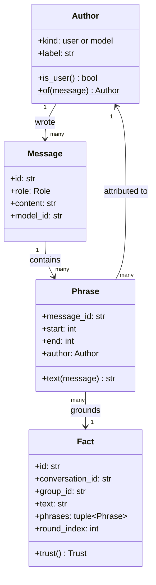
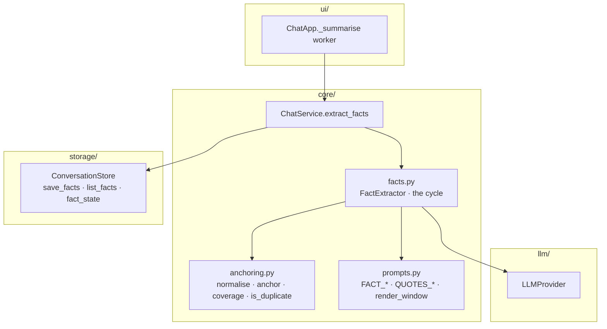
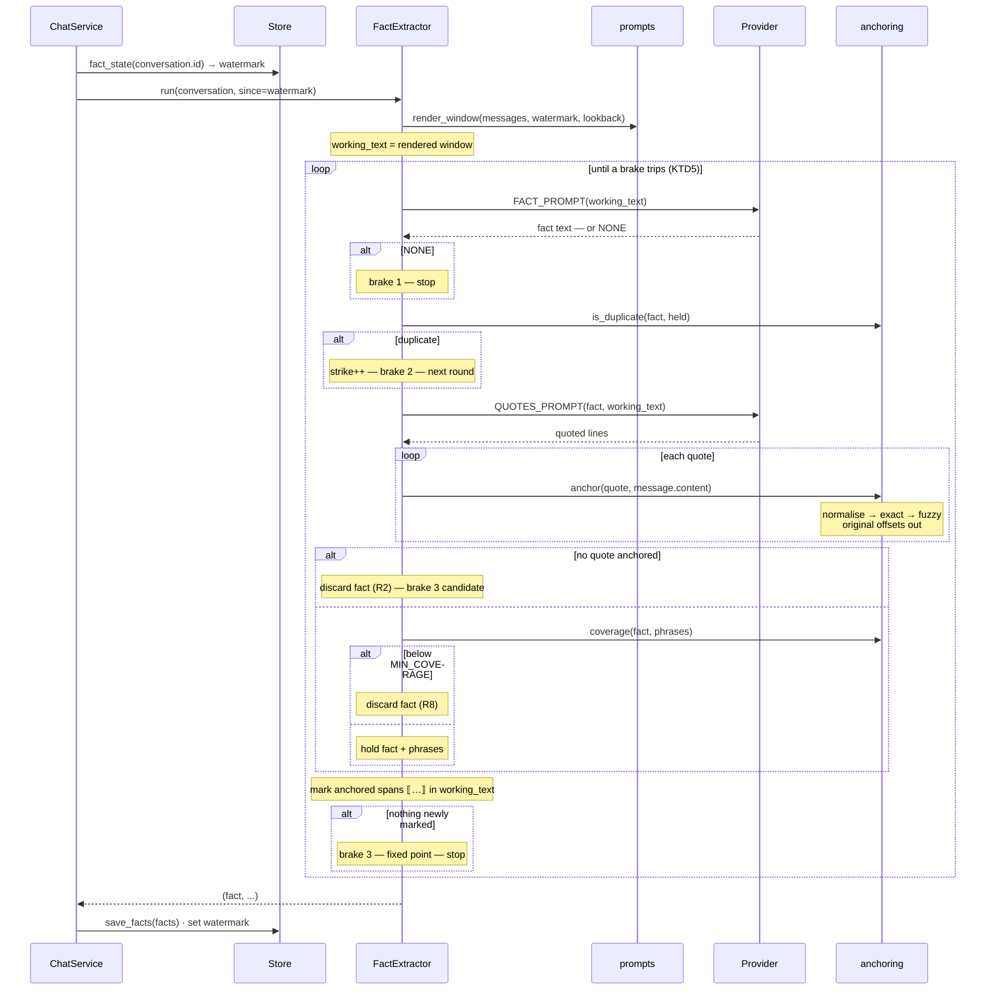
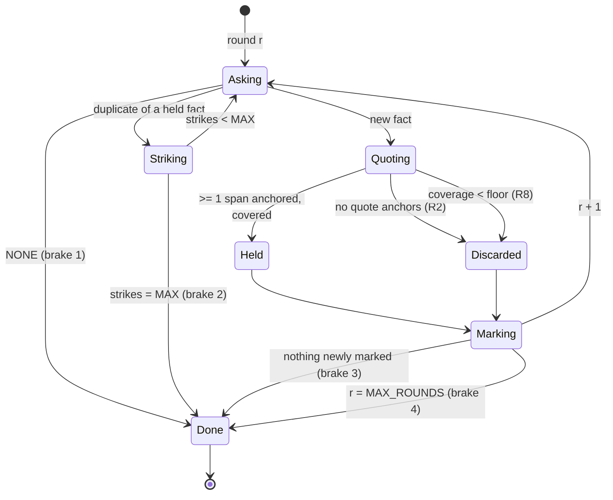

# feat: Grounded fact extraction — span-anchored facts with author provenance

**Origin requirements:** `docs/requirements.md` (NFR-S-02, NFR-CTX-01, NFR-CTX-03,
NFR-CTX-05, NFR-Q-03, NFR-Q-04)
**Target repo:** this repo (`agentchat`), branch `feat/fact-extraction` off
`feat/conversation-enrichment`
**Builds on:** plan 007 (`conversation_summaries`, the write path) and plan 008
(`MemoryEnricher`, the read path). This plan replaces *what gets captured*. It
does **not** change what gets retrieved — `MemoryEnricher` keeps reading
`conversation_summaries` untouched. Moving recall onto facts is plan 010.

---

## Summary

Instead of compressing a conversation into one 3–5 sentence blob with five
keywords, extract **atomic facts**, each one anchored to verbatim spans of the
messages it came from.

A cycle runs over a window of messages. Each round asks the model for one more
important fact, then asks it to quote the text supporting that fact. Every quote
is then located in an actual stored message **by code, not by trust** — normalised
match first, bounded fuzzy match second. A quote that cannot be located is not
evidence; a fact with no located quotes is discarded. Located quotes become
`Phrase` spans carrying the message and the author they came from, so a fact's
provenance is a chain the UI and the retrieval layer can both walk:

```
Fact → Phrase(span) → Message → Author
```

The round's anchored spans are then **marked** in the working text — not deleted —
and the cycle repeats until the model says `NONE`, until it starts repeating
itself, or until a hard round cap.

Nothing here changes an existing code path's behaviour. Facts land in three new
tables with no consumer, exactly as plan 007 shipped `conversation_summaries`
with no consumer.

---

## Problem Frame

The pipeline on `feat/conversation-enrichment` works end to end, and its two
halves each have a defect that the other cannot fix.

**The captured unit is too coarse to retrieve precisely.** One conversation
becomes one `ConversationSummary` with `keywords: tuple[str, ...]` capped at five
(`core/prompts.py:13`). A conversation covering three topics gets five tokens to
be findable by, and when one hits, `enriched_text` appends the whole blob
(`core/prompts.py:76-85`) — mostly material irrelevant to the current message.
Swapping the matcher for embeddings improves recall but leaves a multi-topic
conversation compressed into one undifferentiated point.

**Nothing in a summary is attributable.** `SUMMARY_SYSTEM` asks the model to
"weight the user's turns above the assistant's" (`core/prompts.py:24-31`) and
`ASSISTANT_CHAR_CAP = 800` trims long replies. Both are soft instructions to a
small local model, so neither is a guarantee. The stored summary is an
unattributed blob: there is no way to tell which parts the user stood behind and
which the model invented. KTD10 of plan 008 already records where that ends —
an enriched reply is re-summarised and one conversation's material launders into
another's memory.

**Re-extraction rewrites rather than appends.** `ChatService.summarise` compares
`existing.covered_messages` against `len(conversation.messages)`
(`core/chat.py:202-204`) and, when they differ, re-summarises the entire
transcript. Cost grows with conversation length, and the blob *churns*: a
conversation that was about Flask becomes about deployment, and the earlier
content silently disappears from the rewrite.

### Non-goals

Embedded or ranked retrieval; changing `MemoryEnricher`; retiring
`conversation_summaries`; a licence/justification entity; cross-message
coreference resolution beyond a fixed lookback; a facts browser UI; editing or
deleting individual facts; fact consolidation across conversations.

---

## Requirements

| ID | Requirement | Origin |
|---|---|---|
| R1 | Every fact is grounded in one or more **phrases**, each of which is a span located in a stored message by deterministic code. | user spec |
| R2 | A fact whose quotes cannot be located is discarded, not stored ungrounded. | user spec |
| R3 | Each phrase records which message it came from and which author wrote it. | user spec |
| R4 | An author is the user or a specific model id; a fact's trust tier is derived from the authors of its phrases. | user spec |
| R5 | Extraction runs as a cycle: each round yields at most one fact, then repeats over the same text with that fact's spans marked as consumed. | user spec |
| R6 | The cycle always terminates, and does so without relying on the model's cooperation alone. | user spec (grilling round 3) |
| R7 | Questions, hypotheticals and requests are not facts. | user spec (grilling round 3) |
| R8 | A fact must actually be supported by its phrases — a long claim quoting a fragment is rejected. | user spec (grilling round 2) |
| R9 | Extraction is incremental: a re-run covers only messages past the watermark, and never rewrites a stored fact. | NFR-CTX-01 |
| R10 | The reason a fact holds, when the text states one, is part of the fact rather than a separate entity. | user spec (grilling round 3) |
| R11 | Facts are scoped to a group and are removed with their conversation. | NFR-S-02, NFR-CTX-02 |
| R12 | Fact extraction is switchable off, and off means no LLM calls at all. | NFR-Q-03 |
| R13 | Fact extraction does not change what any existing feature does. | derived |

---

## Key Technical Decisions

**KTD1 — There is no `Licence` entity; the reason lives inside the fact text.**
An earlier iteration of this design had `Licence` as a first-class sibling of
`Fact`, with its own phrases and a 1:1 cardinality. Dropped, for three reasons.
The cardinality was wrong — plenty of facts arrive with no stated reason
(*"I use Postgres 14."*), and forcing exactly one makes the model invent one,
which is precisely the hallucination the anchoring exists to prevent. The trust
job it was doing is subsumed by the author cascade (KTD7). And it doubled the
per-round call count for a feature whose main cost risk is call count.

What it was uniquely carrying — *why* a fact holds, which is what distinguishes a
durable fact from a contingent one — survives as prose inside the fact,
grounded by the same phrase set. `"Postgres 14, because the client's ops team
refuses to upgrade"` is one fact, one extraction, reason preserved (R10).

**KTD2 — A `Phrase` is a span, not a copy of the text.**
`Phrase` stores `(message_id, start, end)` and derives its text by slicing the
message. Storing the quoted string instead would mean the stored evidence can
drift from the source it claims to quote, and would make the "is this really in
the message" property an assertion rather than a fact about the data. As spans,
R1 holds by construction, and a later UI can render a phrase as a highlight in
the original turn rather than as a detached blockquote.

**KTD3 — Anchoring runs against the original message text, always, and is
normalise-then-fuzzy.**
This is the load-bearing decision of the whole plan. Small local models do not
quote verbatim: they collapse whitespace, silently fix typos, swap a pronoun,
re-case, and snip mid-word. A strict `quote in message.content` rejects a large
share of *correct* extractions, and the failure is silent — you get fewer facts,
not an error.

So `core/anchoring.py` normalises both sides (casefold, collapse whitespace
runs to one space) while keeping an index map back to the original offsets,
tries an exact match on the normalised form, and falls back to a bounded fuzzy
window search with a similarity floor. The returned span is in **original**
coordinates.

Critically, anchoring never runs against the marked-up working text of KTD4 —
only against `message.content` as stored. The working text exists solely to
shape the next prompt; the offsets it would produce would be meaningless.

**KTD4 — Mark consumed spans, do not delete them.**
The tempting version of the cycle deletes each round's phrases from the text, so
the input shrinks monotonically and termination is guaranteed. It also shreds the
text: by round three the model is extracting facts from sentence fragments with
holes in them, which is out of distribution and — worse than merely unhelpful —
a source of *fabricated* facts that were never in the original.

Instead the working text keeps every character and wraps consumed spans in
`⟦…⟧`. The text stays grammatical, the model gets a positional signal (much
easier than reasoning against an abstract list of prior facts), and "did this
round consume anything new?" stays checkable, which is one of the four brakes in
KTD5.

**KTD5 — Termination rests on four independent brakes, only one of which is the
model's judgement.**
A model asked "is there more?" against text that never shrinks will keep saying
yes; models are completionist and agreeable. So the cycle stops on the **first**
of:

1. the extractor returns the `NONE` sentinel;
2. `MAX_DUPLICATE_STRIKES` rounds have produced a fact that duplicates one
   already held (the real failure mode — not finding nothing, but rephrasing the
   same thing);
3. a round anchored no new spans, so the next round's input would be byte-identical
   to this one's — a fixed point, and looping on it cannot produce anything new;
4. `MAX_ROUNDS`.

Brake 3 is the one that would otherwise hang the app: a round whose quotes all
fail to anchor changes nothing, and without it the cycle re-asks the same
question of the same text forever.

**KTD6 — The judge is merged into the extractor via a `NONE` sentinel.**
A separate Y/N judge call is more reliable at declining than an extractor is at
returning nothing — models hate producing empty output. But the judge's cost is
not its one output token, it is a **second prefill of the entire working text
every round**, which is the dominant term. Merging halves the per-round prefill.

So: one call, few-shot, with a worked negative example that answers `NONE`, and
the deterministic brakes of KTD5 as the safety net for when it will not say
`NONE`. If verification shows the model never declines, splitting the judge back
out is a localised change to `facts.py` and `prompts.py` — recorded as Q2.

**KTD7 — The author is denormalised onto the phrase row.**
`Author` is a frozen value object (`kind`, `label`) derived from a `Message` —
`user`, or the specific model id that produced an assistant turn. It gets no
table: two kinds of author over a handful of model ids is not a relation worth
normalising in a prototype.

It is written onto `fact_phrases` rather than joined from `messages` at read
time, because the retrieval layer's central query is *"facts whose phrases are
user-authored"* and that must not require a join to `messages` to answer. It
also pins the author as it was when the fact was extracted, which is the honest
record.

The payoff, and the reason `Author` is a class rather than a string: a fact's
trust tier falls out of its phrases without being separately declared. A fact
grounded only in user-authored phrases is one the user stood behind. One grounded
only in assistant-authored phrases is a model assertion nobody confirmed.
`Fact.trust` computes this; nothing stores it.

**KTD8 — Authorship establishes who wrote the text, not that anything was
asserted.**
This is the gap KTD1 opened by removing `Licence`, and it must be closed in the
prompt because no amount of anchoring can close it. A user-authored phrase is not
automatically a user claim: questions (*"is Postgres 14 still supported?"*),
hypotheticals (*"what if we moved to Redis?"*), and the user quoting the
assistant back are all user-authored and assert nothing. `FACT_SYSTEM` carries an
explicit negative few-shot for this, and U2 has a test that a transcript of
nothing but questions yields no facts (R7).

**KTD9 — The window is incremental with a bounded lookback, and dedup absorbs
the overlap.**
A run covers messages past `covered_messages`, plus `LOOKBACK_MESSAGES` before
it. The lookback exists because a user turn past the watermark routinely resolves
against one before it (*"yes, do that one"*), and a window that starts exactly at
the watermark cannot ground such a fact at all. The cost is that facts already
extracted from the lookback region may be re-extracted; the duplicate check of
KTD5 brake 2 is what makes that harmless, and it is cheaper than the alternative
of anchoring-scope bookkeeping per message.

Facts are **appended**, never rewritten. That is the property the summary
pipeline lacks, and it is what makes re-extraction cost proportional to what is
new rather than to conversation length (R9).

**KTD10 — Support is checked deterministically, not scored by the model.**
The open question after anchoring is how well a phrase *represents* its fact — a
25-word claim quoting four words is over-claiming even though the four words
anchor perfectly. The obvious fix is a model call scoring support 0–9. It is the
wrong fix: small models do not discriminate at that granularity, they cluster on
7 and 8, and it is a third call per round.

`coverage()` is a pure function: the share of the fact's significant tokens
(length ≥ 4, casefolded) that also appear in its phrases. Below `MIN_COVERAGE`
the fact is rejected. It is a crude instrument that catches the crude failure,
costs nothing, and is testable without a model. Q3 records the stronger
structural alternative (extract spans first, generate the fact from the spans
alone) for if this proves insufficient.

**KTD11 — Facts cascade-delete with their conversation.**
`ConversationStore.delete`'s docstring already requires it ("Must also remove any
derived state", `storage/base.py:61-63`), and the design makes it a necessity
rather than a convention: a fact's grounding *is* its phrases' messages. Delete
the messages and the fact is no longer verifiable, so keeping it would leave
exactly the unattributable residue this plan exists to remove. `facts` carries
`ON DELETE CASCADE` to `conversations`, and `fact_phrases` to `facts`.

**KTD12 — Fact extraction runs beside summary extraction, in the same worker,
under the same lock.**
`ExtractionService` stays exactly as it is, because `MemoryEnricher` still reads
its output and R13 says nothing existing may change. `ChatService` gains a
sibling `extract_facts()` and `ui/app.py`'s existing `_summarise` worker calls
both in sequence. One worker, one `_provider_lock` acquisition per phase, one
status indicator — the app's cancellation and shutdown behaviour is inherited
rather than re-derived. The cost of running both is real and is stated in Risks;
retiring summaries belongs to plan 010, when recall no longer depends on them.

---

## High-Level Technical Design

### Static model



Two departures from the diagram as drawn in discussion, both deliberate:
`Licence` is gone (KTD1), and `Phrase → Author` is a direct edge as well as a
transitive one through `Message`, because the author is denormalised onto the
phrase row (KTD7).

`Trust` is not stored. It is derived:

| `Fact.trust()` | when |
|---|---|
| `USER` | every phrase is user-authored |
| `MIXED` | phrases from both kinds |
| `MODEL` | every phrase is model-authored |

### Component relationships



### One extraction cycle



### Round lifecycle



---

## Output Structure

```
src/agentchat/
  core/
    anchoring.py     NEW — normalise, anchor, coverage, is_duplicate (pure)
    facts.py         NEW — Author/Phrase/Fact consumers: FactExtractor, the cycle
tests/
  test_anchoring.py  NEW — the pure functions, no model, no store
  test_facts.py      NEW — the cycle against ScriptedProvider, and persistence
```

Modified: `src/agentchat/core/models.py` (Author, Phrase, Fact, Trust),
`src/agentchat/core/prompts.py`, `src/agentchat/core/chat.py`,
`src/agentchat/core/errors.py`, `src/agentchat/storage/schema.py`,
`src/agentchat/storage/base.py`, `src/agentchat/storage/sqlite.py`,
`src/agentchat/config.py`, `src/agentchat/ui/app.py`, `tests/conftest.py`,
`tests/factories.py`, `README.md`, `AGENTS.md`.

---

## Implementation Units

### U1. `core/models.py` — Author, Phrase, Fact

**Goal:** The static model as dataclasses, with trust derived rather than stored.
**Requirements:** R1, R3, R4, R10
**Dependencies:** none
**Files:** `src/agentchat/core/models.py`, `tests/test_facts.py` (new)

**Approach:**

1. Beside `Role`:
   ```python
   Trust = Literal["user", "mixed", "model"]
   ```
2. ```python
   @dataclass(frozen=True)
   class Author:
       """Who wrote a message: the user, or the specific model that produced
       an assistant turn."""
       kind: Literal["user", "model"]
       label: str

       @property
       def is_user(self) -> bool: ...

       @staticmethod
       def of(message: Message) -> "Author": ...
   ```
   `of` maps `role == "user"` to `Author("user", "user")` and anything else to
   `Author("model", message.model_id or "unknown")`. A `system` message never
   reaches extraction (`render_window` drops it, as `render_transcript` already
   does), so it needs no case — say so in the docstring rather than inventing a
   third kind.
3. ```python
   @dataclass(frozen=True)
   class Phrase:
       """A span of one message, in that message's original coordinates."""
       message_id: str
       start: int
       end: int
       author: Author

       def text(self, message: Message) -> str: ...
   ```
   `text` slices `message.content[self.start:self.end]` and asserts
   `message.id == self.message_id` — a `Phrase` sliced against the wrong message
   is a bug that should be loud, not a wrong quote shown to a user.
4. ```python
   @dataclass
   class Fact:
       id: str = field(default_factory=_new_id)
       conversation_id: str = ""
       group_id: str = ""
       text: str = ""
       phrases: tuple[Phrase, ...] = ()
       #: Which round of the cycle produced this — the extraction order, which
       #: is also a usable importance ranking (round 1 outranks round 5).
       round_index: int = 0
       model_id: str | None = None
       created_at: datetime = field(default_factory=_now)

       @property
       def trust(self) -> Trust: ...

       @property
       def message_ids(self) -> tuple[str, ...]: ...
   ```
   `trust` returns `"user"` when every phrase is user-authored, `"model"` when
   none is, `"mixed"` otherwise. A `Fact` with no phrases cannot exist (R2), so
   `trust` may assume `self.phrases` is non-empty — assert it.

**Patterns to follow:** `ConversationSummary`'s shape (derived state, carries
`group_id` so it is readable without loading the conversation, `model_id` for
provenance); `Group.is_project()` as the precedent for a single method that is
the only place a `kind` is branched on.

**Test scenarios:**
- `Author.of` on a user message, and on an assistant message with and without
  `model_id`.
- `Phrase.text` returns the exact slice; against a different message it raises.
- `trust` for all-user, all-model and mixed phrase sets.
- `round_index` survives a round trip through the store (asserted in U4).

---

### U2. `core/anchoring.py` — the deterministic half

**Goal:** Locate a model's quote in a real message, and judge support, without a
model.
**Requirements:** R1, R2, R8, KTD3, KTD10
**Dependencies:** U1
**Files:** `src/agentchat/core/anchoring.py` (new), `tests/test_anchoring.py` (new)

**Approach:**

1. Constants:
   ```python
   #: Similarity a fuzzy window must reach to count as the same quote.
   FUZZY_FLOOR = 0.85
   #: Share of a fact's significant tokens that must appear in its phrases.
   MIN_COVERAGE = 0.4
   #: Jaccard overlap above which two facts are the same fact.
   DUPLICATE_THRESHOLD = 0.8
   #: Tokens shorter than this carry no signal for coverage or duplication.
   MIN_TOKEN_LENGTH = 4
   ```
2. ```python
   def normalise(text: str) -> tuple[str, list[int]]:
       """Casefolded text with whitespace runs collapsed to one space, and a
       map from each normalised index to its index in `text`."""
   ```
   Walk `text` once. Emit `" "` for a run of whitespace (recording the index of
   the run's first character), else the casefolded character (recording its
   index). Leading whitespace emits nothing. The map has one entry per emitted
   character.
   Note in a comment: `str.casefold` can change length for some characters
   (e.g. `ß` → `ss`); emit one map entry per *emitted* character so the mapping
   stays total.
3. ```python
   def anchor(quote: str, message: Message) -> tuple[int, int] | None:
       """`quote`'s span in `message.content`, in original coordinates, or
       `None` if it is not there. Exact on the normalised form first, then one
       bounded fuzzy pass at `FUZZY_FLOOR`."""
   ```
   - Normalise both. Empty normalised quote → `None`.
   - `norm_message.find(norm_quote)`; on a hit, map start and end−1 back through
     the index map and return `(start, end_index + 1)`.
   - Otherwise seed candidates with
     `SequenceMatcher(None, norm_quote, norm_message).find_longest_match(...)`.
     Take the window of `len(norm_quote)` characters around the match's position
     in `norm_message`, clipped to bounds, and compute
     `SequenceMatcher(None, norm_quote, window).ratio()`. Return the mapped span
     when the ratio is at or above `FUZZY_FLOOR`, else `None`.
   - One seeded window, not a slide over every offset: quotes are short and
     messages are short, but an O(n·m) slide inside a five-round loop over every
     message in a window is the kind of thing that only shows up on a real
     transcript. Say so in a comment.
4. ```python
   def anchor_in(quote: str, messages: Sequence[Message]) -> tuple[Message, tuple[int, int]] | None:
       """The best anchor for `quote` across `messages` — highest similarity,
       ties broken toward the most recent message."""
   ```
   Iterate in order, keep the best; an exact hit short-circuits.
5. ```python
   def significant(text: str) -> set[str]:
       """Casefolded tokens of at least `MIN_TOKEN_LENGTH` characters."""

   def coverage(fact_text: str, quotes: Sequence[str]) -> float:
       """Share of `fact_text`'s significant tokens present in `quotes`.
       `1.0` when the fact has no significant tokens — a fact too short to
       measure is not rejected on that basis."""

   def is_duplicate(fact_text: str, held: Sequence[str]) -> bool:
       """True if `fact_text`'s significant tokens overlap any held fact's by
       at least `DUPLICATE_THRESHOLD` (Jaccard)."""
   ```
   Tokenise on non-alphanumeric runs. No stopword list — `MIN_TOKEN_LENGTH` is
   the cheap stand-in, and a curated list is a dependency and a tuning surface
   this does not need. Record that as the reason in the module docstring.

**Patterns to follow:** `core/prompts.py`'s "pure functions, no I/O, no provider"
module contract; `parse_keywords`' defensive posture toward model output.

**Test scenarios** (`tests/test_anchoring.py`, no model, no store):
- Exact quote anchors, and `content[start:end] == quote`.
- Quote differing only in whitespace (`"the  /upload\nendpoint"` vs
  `"the /upload endpoint"`) anchors, and the returned span covers the original
  text including its newline.
- Quote differing only in case anchors.
- Quote with one substituted character anchors via the fuzzy path.
- Quote with an added clause the message does not contain returns `None`.
- A quote absent entirely returns `None`.
- A quote at index 0, and one running to the last character, both map back
  correctly (off-by-one guard on the `end_index + 1`).
- `anchor_in` across three messages picks the one containing the quote; when two
  contain it, the later one wins.
- `coverage("uses Postgres 14 because the client refuses to upgrade",
  ["Postgres 14"])` is low; with the full sentence quoted it is `1.0`.
- `coverage` of a fact with no tokens ≥ 4 characters is `1.0`.
- `is_duplicate` is `True` for a reworded restatement, `False` for a genuinely
  different fact in the same domain.

**Verification:** `uv run pytest tests/test_anchoring.py` — fast, no fixtures
beyond `make_message`.

---

### U3. `core/prompts.py` — the fact and quote prompts

**Goal:** The two prompts the cycle runs, and the window renderer they read.
**Requirements:** R5, R7, R10, KTD4, KTD6, KTD8
**Dependencies:** U1
**Files:** `src/agentchat/core/prompts.py`, `tests/test_facts.py`

**Approach:**

1. Constants beside the existing ones:
   ```python
   NO_MORE_FACTS = "NONE"
   CONSUMED_OPEN, CONSUMED_CLOSE = "⟦", "⟧"
   MAX_QUOTES = 4
   ```
2. `FACT_SYSTEM` — one fact per call, stating:
   - emit exactly one short factual statement, or the literal `NONE`;
   - text inside `⟦ ⟧` has already been captured; do not restate it;
   - a question, a request, or a hypothetical is **not** a fact (KTD8);
   - when the text states *why* something holds, include the reason in the same
     sentence (KTD1/R10);
   - no preamble, no numbering, no quotation marks.

   Few-shot, three worked examples: one plain fact; one fact-with-reason; one
   whose window contains only questions and marked-up spans, answering `NONE`.
   The third is the one that makes brake 1 reachable — it is not optional
   decoration.
3. `FACT_PROMPT` — `"Text:\n\n{text}\n\nFact:"`.
4. `QUOTES_SYSTEM` — quote the text supporting a given fact:
   - copy spans **verbatim** from the text, one per line, at most `MAX_QUOTES`;
   - each span must be long enough to identify uniquely, and must not include
     the `⟦ ⟧` markers;
   - do not paraphrase, do not add words, do not fix typos — this instruction is
     what the anchoring is trying to hold the model to, and the fuzzy path
     (KTD3) is what forgives it when it does not.

   One worked example.
5. `QUOTES_PROMPT` — `"Text:\n\n{text}\n\nFact: {fact}\n\nQuotes:"`.
6. ```python
   def parse_quotes(text: str, *, limit: int = MAX_QUOTES) -> tuple[str, ...]:
   ```
   One quote per non-empty line; strip bullets, numbering, surrounding quotation
   marks and the markers; drop empties and duplicates; cap at `limit`. Mirror
   `parse_keywords`' defensive shape and its "returns `()` and the caller
   decides" contract.
7. ```python
   def is_no_more_facts(reply: str) -> bool:
       """True if the model declined to produce another fact."""
   ```
   Casefolded, stripped of punctuation and markup; true when the reply is empty
   or equals `NONE`, and also when it *begins* with it — small models append
   explanations to sentinels.
8. ```python
   def render_window(messages: Sequence[Message], *, budget: int) -> str:
   ```
   Like `render_transcript`, but **without** `ASSISTANT_CHAR_CAP` truncation:
   a capped assistant turn would put text in the prompt that does not exist in
   any message, and every one of those characters is a quote that can never
   anchor. Drop whole assistant turns oldest-first to fit the budget instead.
   Reuse `_label`, `_render`, `estimate_tokens` and `ELISION`.

   Add a comment saying why the cap is absent here but kept in
   `render_transcript` — this is exactly the kind of divergence a later reader
   would "fix".
9. ```python
   def mark_consumed(text: str, spans: Sequence[tuple[int, int]]) -> str:
       """`text` with each span wrapped in `⟦ ⟧`, applied right-to-left so
       earlier offsets stay valid."""
   ```
   Overlapping spans are merged before wrapping.

**Patterns to follow:** the file's existing triple-quoted constants; the module
docstring's promise of no I/O — `render_window` and `mark_consumed` are pure.

**Test scenarios** (in `tests/test_facts.py`):
- `parse_quotes` on a clean two-line reply; on a bulleted reply; on a reply with
  a `Quotes:` label; on empty input (`()`).
- `is_no_more_facts` for `"NONE"`, `"none."`, `"NONE — the text has no further
  facts"`, `""`; and `False` for a real fact.
- `render_window` includes no `…` truncation marker for a long assistant turn,
  and drops the turn whole when the budget demands.
- `mark_consumed` with two non-adjacent spans, with adjacent spans, and with
  overlapping spans (merged, not doubly wrapped).
- `FACT_SYSTEM` contains a worked example whose answer is `NONE` — pinned, so a
  reword cannot remove the only demonstration that declining is allowed.
- `FACT_SYSTEM` states that questions are not facts — pinned for the same reason
  (KTD8).

---

### U4. Storage — three tables, append-only

**Goal:** Facts and phrases persist, scoped by group, cascading on delete.
**Requirements:** R3, R9, R11, KTD7, KTD11
**Dependencies:** U1
**Files:** `src/agentchat/storage/schema.py`, `src/agentchat/storage/base.py`,
`src/agentchat/storage/sqlite.py`, `tests/test_storage.py`

**Approach:**

1. `schema.py`, appended to `SCHEMA`:
   ```sql
   CREATE TABLE IF NOT EXISTS facts (
     id TEXT PRIMARY KEY,
     conversation_id TEXT NOT NULL
       REFERENCES conversations(id) ON DELETE CASCADE,
     group_id TEXT NOT NULL REFERENCES groups(id) ON DELETE CASCADE,
     text TEXT NOT NULL, round_index INTEGER NOT NULL,
     model_id TEXT, created_at TEXT NOT NULL);
   CREATE INDEX IF NOT EXISTS idx_facts_group ON facts(group_id);
   CREATE INDEX IF NOT EXISTS idx_facts_conversation ON facts(conversation_id);

   CREATE TABLE IF NOT EXISTS fact_phrases (
     fact_id TEXT NOT NULL REFERENCES facts(id) ON DELETE CASCADE,
     ordinal INTEGER NOT NULL,
     message_id TEXT NOT NULL,
     start INTEGER NOT NULL, "end" INTEGER NOT NULL,
     author_kind TEXT NOT NULL, author_label TEXT NOT NULL,
     PRIMARY KEY (fact_id, ordinal));

   CREATE TABLE IF NOT EXISTS fact_extraction_state (
     conversation_id TEXT PRIMARY KEY
       REFERENCES conversations(id) ON DELETE CASCADE,
     covered_messages INTEGER NOT NULL, updated_at TEXT NOT NULL);
   ```
   Two notes for the implementer. `end` is a SQLite keyword — quote it in every
   statement that names it. And `fact_phrases.message_id` deliberately carries
   **no** FK to `messages`: `SqliteStore._save` deletes and re-inserts every
   message row on every turn (`storage/sqlite.py:189-210`), so an FK would
   cascade every fact in the conversation away on the next turn. The cascade
   that matters — losing the conversation loses its facts (KTD11) — is carried by
   `facts.conversation_id`. State this in a schema comment; it is the single
   most damaging thing a later reader could "correct".
2. `storage/base.py` — three methods on the protocol, beside the summary block:
   ```python
   async def save_facts(self, facts: Sequence[Fact]) -> None:
       """Append `facts` and their phrases in one transaction. Existing facts
       for the conversation are left alone — facts are never rewritten (R9)."""

   async def list_facts(self, group_id: str) -> list[Fact]:
       """Newest first, then by `round_index`."""

   async def fact_watermark(self, conversation_id: str) -> int:
       """How many of the conversation's messages have been extracted from;
       `0` if never."""

   async def set_fact_watermark(self, conversation_id: str, covered: int) -> None: ...
   ```
   Extend the existing "derived state" comment block to say facts have no
   consumer yet either, and that plan 010 is the one that gives them one.
3. `storage/sqlite.py` — the four bodies, each `asyncio.to_thread`-offloaded and
   wrapped in `StorageError`, matching the summary methods exactly.
   `_list_facts` does one `SELECT` per table and groups phrases by `fact_id` in
   Python rather than issuing N+1 queries.

**Patterns to follow:** `_save_summary`/`_list_summaries` for the method shape,
the `closing(self._connect()) as conn, conn` idiom, and `_summary_from_row` as
the precedent for a module-level row mapper.

**Test scenarios** (add to `tests/test_storage.py`):
- Save two facts with phrases; `list_facts` returns them with phrases intact, in
  order, with `Author` reconstructed.
- `list_facts` is scoped to the group — a fact in another group is absent (R11).
- Deleting the conversation removes its facts and their phrases (query
  `fact_phrases` directly to prove the second cascade fired).
- Deleting the group removes its conversations' facts.
- **Saving the conversation again does not remove its facts** — the regression
  the missing FK exists to prevent. Save a conversation, save facts, add a
  message, save the conversation again, assert the facts are still there.
- `save_facts` twice appends rather than replaces.
- `fact_watermark` is `0` for an unknown conversation; round-trips after
  `set_fact_watermark`.
- `save_facts([])` is a no-op and opens no transaction that fails.

---

### U5. `core/facts.py` — the cycle

**Goal:** The extraction loop, with all four brakes.
**Requirements:** R1, R2, R5, R6, R7, R8, R9, R10
**Dependencies:** U2, U3, U4
**Files:** `src/agentchat/core/facts.py` (new), `src/agentchat/core/errors.py`,
`tests/test_facts.py`

**Approach:**

1. Constants, each with a one-line comment saying what it protects:
   ```python
   MAX_ROUNDS = 5
   MAX_DUPLICATE_STRIKES = 2
   LOOKBACK_MESSAGES = 2
   FACT_MAX_TOKENS = 96
   QUOTES_MAX_TOKENS = 128
   PROMPT_OVERHEAD_TOKENS = 384
   MIN_WINDOW_BUDGET = 256
   ```
   Reuse `extraction.py`'s `_EXTRACTION_OPTIONS_BASE` posture:
   `temperature=0.0, thinking=False`, same two reasons (reproducibility, and a
   reasoning preamble would be stored as the fact).
2. `core/errors.py`: `class FactExtractionError(AgentChatError)` beside
   `ExtractionError`.
3. ```python
   class FactExtractor:
       def __init__(self, registry: ModelRegistry) -> None: ...

       async def run(self, conversation: Conversation, *, since: int = 0) -> tuple[Fact, ...]:
           """Extract facts from `conversation`'s messages from `since`
           onward, plus `LOOKBACK_MESSAGES` before it for reference. Returns
           `()` when the window holds nothing extractable — an empty result is
           a normal outcome, not an error."""
   ```
   Knows nothing about storage, exactly as `ExtractionService` does not — the
   caller persists and moves the watermark, which keeps the LLM calls outside
   any transaction.
4. The loop, in `run`:
   - `window = conversation.messages[max(0, since - LOOKBACK_MESSAGES):]`,
     dropping `system` and empty messages. `()` if the window is empty.
   - `budget` as in `extraction.py`: context window minus the larger of the two
     `MAX_TOKENS` minus `PROMPT_OVERHEAD_TOKENS`, floored at `MIN_WINDOW_BUDGET`.
   - `working = render_window(window, budget=budget)`.
   - For `round_index` in `range(MAX_ROUNDS)`:
     - fact call → `is_no_more_facts(reply)` → **break** (brake 1);
     - `is_duplicate(reply, [f.text for f in held])` → `strikes += 1`; break at
       `MAX_DUPLICATE_STRIKES` (brake 2); `continue` otherwise;
     - quotes call → `parse_quotes`;
     - for each quote, `anchor_in(quote, window)` → `Phrase(message.id, start,
       end, Author.of(message))`;
     - no phrases → discard the fact (R2), mark nothing;
     - `coverage(reply, [p.text(msg) for p in phrases]) < MIN_COVERAGE` → discard
       (R8), but **do** mark the spans: the model has demonstrated that this text
       supports a claim it already made, and leaving it unmarked is the most
       likely way to loop on it;
     - otherwise hold `Fact(..., round_index=round_index, model_id=provider.info.id)`;
     - map each phrase's span into the **working text** coordinates and
       `mark_consumed`; if nothing new was marked, **break** (brake 3).
   - Return `tuple(held)`.
5. Mapping a message-coordinate span into working-text coordinates: `run` builds
   the working text itself, so it knows each message's offset within it. Keep a
   `dict[str, int]` of `message_id → offset of that message's content in the
   rendered text`, built alongside the render. Have `render_window` return the
   text only, and compute offsets with a single `str.find` of each message's
   content in the rendered text — the render inserts nothing *inside* a
   message's content, so the first occurrence at or after the previous message's
   offset is the right one. Comment that ordering assumption; it is what keeps
   two identical messages from both mapping to the first one.
6. Wrap provider calls so a backend failure raises `FactExtractionError` rather
   than escaping as a bare backend exception, matching `ExtractionError`'s role.

**Patterns to follow:** `ExtractionService` — a `core/` service taking one
collaborator, returning objects, persisting nothing; its comment explaining why
temperature is 0.

**Test scenarios** (`tests/test_facts.py`, `ScriptedProvider` throughout — the
cycle is a state machine and must be tested as one):
- **Happy path:** two rounds of (fact, quotes) then `NONE`. Two facts, each with
  anchored phrases whose `text()` matches the real message content, `round_index`
  0 and 1.
- **Brake 1:** first fact call answers `NONE` → `()`, and exactly one provider
  call was made (the quotes call must not run).
- **Brake 2:** the model returns the same fact reworded three times → the cycle
  stops after `MAX_DUPLICATE_STRIKES`, holding one fact.
- **Brake 3:** quotes that anchor nowhere → the fact is discarded, nothing is
  marked, and the cycle stops rather than re-asking the identical prompt. Assert
  on the provider call count, which is the only thing that distinguishes "stopped"
  from "looped".
- **Brake 4:** a model that always yields a fresh anchorable fact → exactly
  `MAX_ROUNDS` rounds.
- **R2:** a fact whose quotes are pure invention is absent from the result.
- **R8:** a long fact quoting two words is absent, and the run still terminates.
- **KTD4:** the working text handed to round 2 contains `⟦`, and round 2's prompt
  contains the full original sentence (marked, not removed).
- **KTD3 end to end:** the scripted quote differs from the message by case and
  whitespace and still anchors, with `phrase.text(message)` returning the
  message's original casing.
- **R7:** a window of nothing but user questions, with a model scripted to answer
  `NONE`, yields `()`. (The prompt is what makes a real model behave this way;
  this test pins the plumbing, and verification step 6 covers the model.)
- **KTD9:** `run(conversation, since=4)` on a six-message conversation renders a
  window starting at message 2, and a phrase may anchor in message 2.
- Authors: a fact quoting a user turn has `trust == "user"`; one quoting both
  has `"mixed"`.
- A backend error inside `run` surfaces as `FactExtractionError`.

**Verification:** `uv run pytest tests/test_facts.py` — no GPU, no real model.

---

### U6. `ChatService` and wiring

**Goal:** Facts are extracted where summaries already are, and switchable off.
**Requirements:** R9, R12, R13, KTD12
**Dependencies:** U5
**Files:** `src/agentchat/core/chat.py`, `src/agentchat/config.py`,
`src/agentchat/ui/app.py`, `tests/conftest.py`, `tests/test_core.py`,
`tests/test_facts.py`

**Approach:**

1. `ChatService.__init__` gains `fact_extractor: FactExtractor | None = None`,
   with the same "`None` switches it off" comment as `extractor` and `enricher`.
2. ```python
   async def extract_facts(self, conversation: Conversation) -> tuple[Fact, ...]:
       """Extract and persist facts for the messages added since the last run.
       `()` when there is no extractor, no messages, or nothing new."""
   ```
   - `None` extractor or no messages → `()`.
   - `watermark = await self.store.fact_watermark(conversation.id)`;
     `watermark >= len(conversation.messages)` → `()` (R9's watermark, mirroring
     `summarise`'s existing check at `core/chat.py:202-204`).
   - `async with self._provider_lock:` around `self._fact_extractor.run(...)`,
     for the reason already documented on the lock (`core/chat.py:53-56`).
   - `await self.store.save_facts(facts)`, then
     `set_fact_watermark(conversation.id, len(conversation.messages))`.
   - Move the watermark **even when `facts` is empty**: a window that yielded
     nothing will yield nothing again, and not moving it means every subsequent
     run re-pays for the same barren window.
3. `config.py`:
   ```python
   extract_facts: bool = field(default_factory=lambda: _env_flag("EXTRACT_FACTS", True))
   ```
   with the same "on by default — a feature that has to be switched on is not
   demonstrable" comment, and
   ```python
   def build_fact_extractor(settings: Settings, registry: ModelRegistry) -> FactExtractor | None:
   ```
   beside `build_extractor`. Fifth wiring point, same shape.
4. `ui/app.py`: pass `fact_extractor=build_fact_extractor(self.settings, self.registry)`
   into `ChatService`. In `_maybe_summarise`, widen the guard to
   `if self.chat.extractor is None and self.chat.fact_extractor is None: return`.
   In the `_summarise` worker, call `await self.chat.extract_facts(conversation)`
   after `await self.chat.summarise(conversation)` — inside the same `try`, so
   the existing `CancelledError` / `AgentChatError` handling covers both
   unchanged. Do the same in `_summarise_before_exit`, inside the existing
   `wait_for` so one timeout still bounds the whole pre-exit phase.
   `FactExtractionError` is an `AgentChatError`, so the warning-toast path needs
   no change.
5. `tests/conftest.py`: `mock_settings` gets
   `overrides.setdefault("extract_facts", False)`, with a sentence in the
   docstring next to the extraction and enrichment ones, for the same reason —
   the existing suite must not grow LLM calls per switch.

**Test scenarios:**
- (`tests/test_core.py`) `build_fact_extractor` returns a `FactExtractor` when
  the flag is on and `None` when off; `AGENTCHAT_EXTRACT_FACTS=0` yields
  `Settings().extract_facts is False`.
- (`tests/test_facts.py`) `extract_facts` persists facts and moves the
  watermark; a second call with no new messages returns `()` and makes **no**
  provider call.
- Adding two messages and re-running extracts only from the new window, and the
  first run's facts are still present (R9, append-only).
- A barren window still moves the watermark — assert the second run makes no
  provider call.
- `ChatService(..., fact_extractor=None).extract_facts(...)` returns `()` and
  touches neither provider nor store (R12).
- (`tests/test_app.py`) with `extract_facts=True, extract_summaries=False`, a
  conversation switch produces facts in the store; the status indicator behaves
  as it does today.
- **R13:** the existing suite passes untouched, and a run with
  `extract_facts=True, extract_summaries=True` still writes a
  `ConversationSummary` and still enriches.

---

### U7. Documentation

**Goal:** The repo describes what now exists and what it does not yet feed.
**Requirements:** NFR-Q-04
**Dependencies:** U6
**Files:** `README.md`, `AGENTS.md`

**Approach:** README: `AGENTCHAT_EXTRACT_FACTS` in Configuration, and a short
"What gets remembered" section — facts rather than summaries, every fact anchored
to a quote in a real message, the author chain, that facts have no consumer until
recall moves onto them, and that summary extraction still runs beside it.
`AGENTS.md`: add `core/facts.py` and `core/anchoring.py` to the Layout block,
with a line saying the fact and quote prompts are tuned in `prompts.py` like the
others, and that `anchoring.py` is pure and must stay that way.

**Verification:** every variable and path named in `README.md` exists in the code.

---

## Verification Contract

1. `uv run pytest` passes and the pre-existing suite's behaviour is unchanged
   (R13).
2. `AGENTCHAT_BACKEND=mock AGENTCHAT_EXTRACT_FACTS=1 uv run agentchat`: take a
   turn in a project group, `Ctrl+N` to leave it, then
   `sqlite3 <data>/agentchat.db "SELECT text, round_index FROM facts"` — rows
   exist.
3. `sqlite3 <data>/agentchat.db "SELECT f.text, p.message_id, p.start, p.\"end\",
   p.author_kind FROM facts f JOIN fact_phrases p ON p.fact_id = f.id"` — every
   fact has at least one phrase (R2), and for each row the substring of that
   message between `start` and `end` reads as real text from the conversation
   (R1). Check three by hand.
4. Take two more turns in the same conversation and leave again — `facts` has
   *more* rows and the originals are unchanged (R9).
5. `AGENTCHAT_EXTRACT_FACTS=0` — no fact rows, no behaviour change (R12).
6. **On a GPU node with the real backend**, the two model-dependent properties:
   a conversation of nothing but questions produces no facts or only facts about
   what the user *stated* (R7/KTD8); and a conversation stating a constraint with
   a reason produces a fact carrying the reason (R10).
7. On the same node, a conversation long enough to need several rounds: the cycle
   terminates, and the reason it terminated is visible in the fact count
   (fewer than `MAX_ROUNDS` means the model declined; exactly `MAX_ROUNDS` means
   brake 4 caught it, which is Q1's signal).
8. Delete the conversation from the picker; `SELECT COUNT(*) FROM fact_phrases`
   drops to zero for its facts (R11).

## Definition of Done

All seven units landed; every test scenario implemented and passing; the eight
verification steps performed, 6 and 7 on a GPU node; `README.md` and `AGENTS.md`
updated.

---

## Scope Boundaries

### Deferred to follow-up work

- **Plan 010 — recall on facts.** `MemoryEnricher` reads `list_facts(group_id)`
  instead of `list_summaries`, retrieves by hybrid FTS5 + embedding rather than
  keyword regex, weights by `trust` and `round_index`, and dedupes against what
  is still in the live context window rather than a once-per-session ledger.
  Retiring `conversation_summaries` belongs there, not here.
- **A facts view** — `list_facts` backs it, and the phrase spans make
  "show me where this came from" a highlight rather than a quote.
- **Editing or deleting a fact**, once there is a view.
- **Consolidating facts across conversations in a group.**

### Not in scope

Adaptive RAG, sub-agents, fine-tuned adapters, cross-group recall, coreference
resolution beyond `LOOKBACK_MESSAGES`, a licence/justification entity (KTD1).

---

## Open Questions

**Q1 — Is `MAX_ROUNDS = 5` a cap or a target?** If verification step 7 shows real
conversations hitting exactly five facts, the cap is truncating rather than
bounding and should rise. If they stop at two, the extractor is declining early
and `FACT_SYSTEM`'s framing is the lever. One constant, one prompt.

**Q2 — Will the model actually say `NONE`?** KTD6 bets that a few-shot negative
example is enough and leans on brakes 2–4 when it is not. If step 7 shows the
cycle never stopping on brake 1, split the judge back out as a separate Y/N call
— `facts.py` and `prompts.py` only, and the plan's four brakes mean the failure
mode meanwhile is wasted calls, not wrong data.

**Q3 — Is `coverage` strong enough?** It catches a long claim quoting a fragment.
It does not catch a fact that shares vocabulary with its quotes while asserting
something they do not support. The structural fix is to invert the round — quote
first, then generate the fact *from the quotes alone*, so the fact cannot assert
what the quotes do not contain. It costs no extra call, but picking salient spans
without knowing the target fact is a harder task for a small model, and the fact
step loses the surrounding context it needs to resolve *"yes, that one"*. Worth
trying only if step 6 shows over-claiming.

**Q4 — Is `FUZZY_FLOOR = 0.85` right?** Too high and correct quotes are silently
dropped (facts vanish, no error). Too low and a paraphrase anchors to text that
does not support it, which is worse — it is the exact failure this design exists
to prevent. If it needs tuning, tune it **down** only with a test that a genuine
paraphrase still fails to anchor.

**Q5 — Should the lookback be messages or tokens?** `LOOKBACK_MESSAGES = 2` is
crude: two long assistant turns can be most of the budget. Tokens would be
better; messages are what the watermark already counts, and mixing units is worse
than a coarse unit.

---

## Risks

| Risk | Mitigation |
|---|---|
| The cycle never terminates and the extraction worker hangs, blocking the provider lock and every later turn. | Four independent brakes (KTD5), three of them deterministic. Brake 3 specifically covers the "quotes never anchor, text never changes" fixed point. U5 tests each brake by asserting on provider call count. |
| An FK from `fact_phrases.message_id` to `messages.id` deletes every fact on the next turn, because `_save` re-inserts every message row. | The FK is deliberately absent, with the reason in a schema comment, and U4 has a regression test that saving the conversation again leaves the facts intact. |
| The fuzzy anchor accepts a paraphrase, so a fact is "grounded" in text that does not support it. | `FUZZY_FLOOR` at 0.85 with a test that an added clause fails to anchor; Q4 forbids lowering it without that test. |
| Anchoring rejects most real quotes, so the pipeline quietly produces almost no facts. | Normalisation before matching (KTD3) covers the common model deviations; U2 tests each deviation separately, so a regression names which one broke. |
| Facts are extracted from text that no message contains, because the renderer truncated an assistant turn. | `render_window` drops whole turns instead of capping them (U3 step 8), and the divergence from `render_transcript` is commented at both sites. |
| Running fact and summary extraction together roughly quadruples per-switch LLM cost on a local model. | Accepted for this plan: recall still depends on summaries (R13), and both run in the existing background worker with the existing timeout. Plan 010 retires summaries and the cost with them. `AGENTCHAT_EXTRACT_FACTS=0` is the escape hatch meanwhile. |
| The model extracts questions and hypotheticals as facts, since authorship alone cannot distinguish them (KTD8). | An explicit negative few-shot in `FACT_SYSTEM`, pinned by a test that the instruction is present, and verification step 6 against a real model. |
| A fact loses its grounding when its conversation is deleted, leaving unattributable residue — the thing this plan exists to remove. | Facts cascade with the conversation (KTD11), tested at both levels in U4. |

---

## Sources & Research

- `docs/plans/2026-08-12-007-feat-conversation-summaries-plan.md` — the summary
  write path this plan replaces the *contents* of; its KTD9 (an unparseable reply
  loses keywords, not the summary) is the precedent for `parse_quotes` returning
  `()` rather than raising.
- `docs/plans/2026-08-12-008-feat-message-enrichment-plan.md` — KTD10 there
  (enrichment leaks into the next extraction, two-hop laundering) is the concrete
  harm that provenance is meant to make impossible.
- `src/agentchat/core/extraction.py:41-82` — the budget arithmetic, the
  temperature-0/thinking-off posture, and the "returns an object, the caller
  persists" contract that `FactExtractor` copies.
- `src/agentchat/core/prompts.py:16-31,88-126` — `ASSISTANT_CHAR_CAP` and
  `render_transcript`'s truncation, which `render_window` must not inherit; and
  `parse_keywords` as the model for `parse_quotes`' defensiveness.
- `src/agentchat/storage/sqlite.py:189-210` — `_save` deletes and re-inserts
  every message row every turn, the reason `fact_phrases` carries no FK to
  `messages`.
- `src/agentchat/core/chat.py:53-56,195-212` — the provider lock's documented
  scope and `summarise`'s watermark check, both mirrored by `extract_facts`.
- `src/agentchat/ui/app.py:150-171,358-392` — the extraction worker, its
  cancellation handling and the pre-exit timeout that `extract_facts` slots into
  unchanged.
- `docs/requirements.md` — NFR-S-02 (memory scoped to groups), NFR-CTX-01
  (compression), NFR-CTX-03 (selection by relevance), NFR-CTX-05 (observable).
