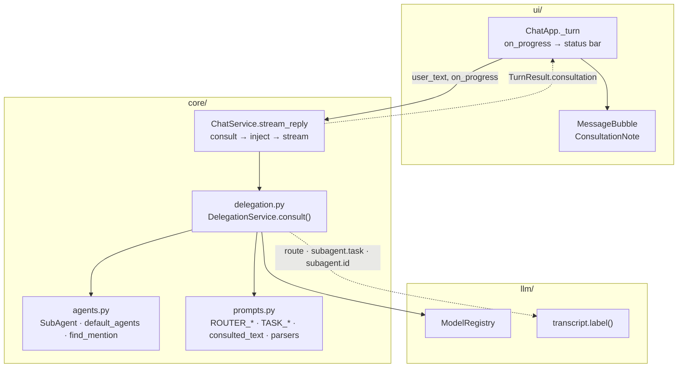
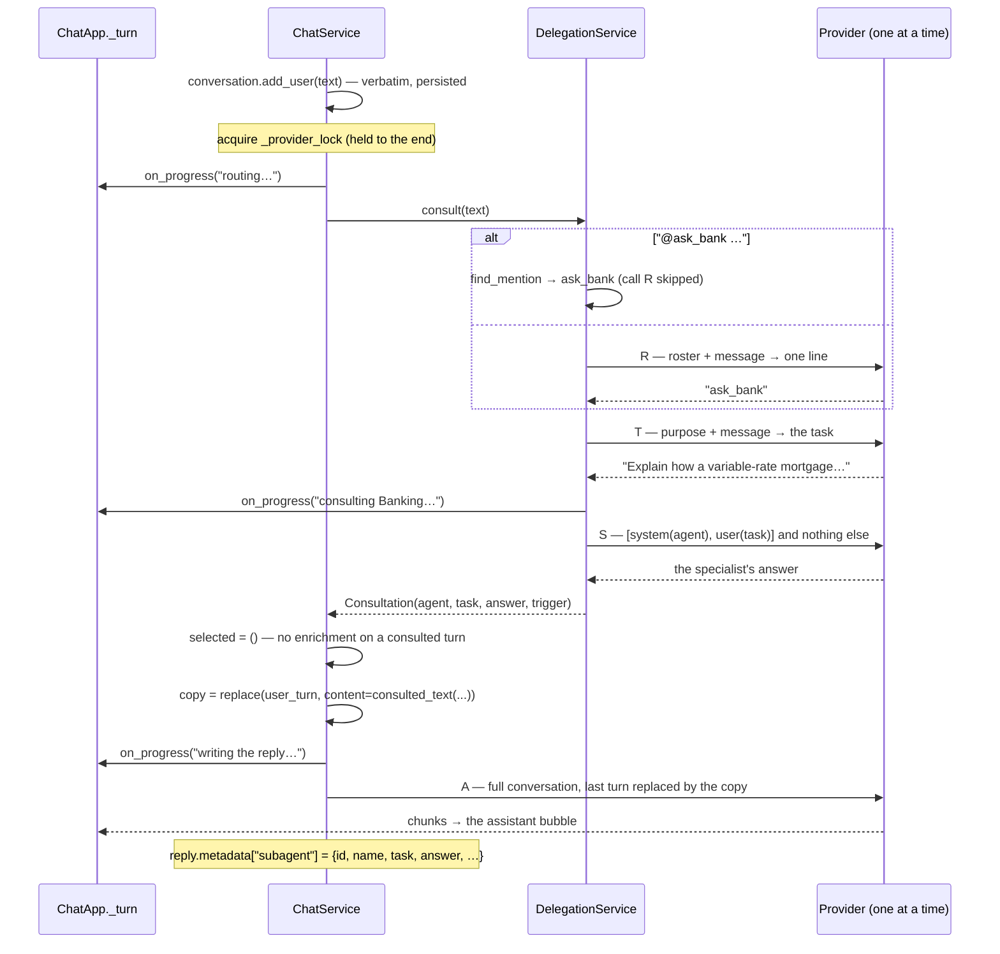
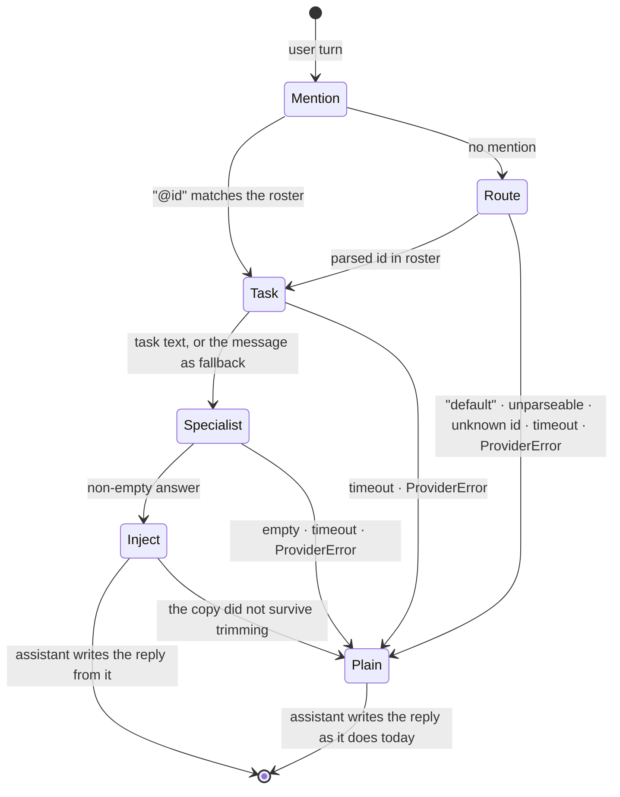

# feat: Consult a specialist sub-agent and fold its answer into the assistant's reply

**Origin requirements:** `docs/requirements.md` (NFR-SUB-01, NFR-SUB-02,
NFR-SUB-03, NFR-SUB-04, NFR-SUB-05, NFR-CTX-02, NFR-CTX-04, NFR-CTX-05,
NFR-U-04, NFR-U-07, NFR-Q-01, NFR-Q-03)
**Target repo:** this repo (`agentchat`), branch `feat/subagents`
**Builds on:** the LLM I/O transcript (`llm/transcript.py`, commit `08b0caf`),
whose `label()` contextvar is how each of this pipeline's four calls becomes
separately inspectable; and plan 008's `_prompt_messages` copy-the-user-turn
mechanism, which the specialist's answer reuses as its injection path.

---

## Summary

Before a user turn is answered, the active model is asked **one** question:
which assistant should take this — `default`, or one of the registered
specialists? That is **call R**. If it names a specialist, the model is asked a
second question: what exactly should that specialist be told to do? That is
**call T**. The specialist then answers in a context containing nothing but its
own system prompt and that task — **call S**. Its answer comes back to the
controlling model, appended to a throwaway copy of the user's turn, and the
controlling model writes the reply the user actually reads — **call A**.

The specialist never speaks to the user. It answered a *restated* task and has
no idea what the user already knows, what was ruled out three turns ago, or what
language the conversation is in; the controlling model has all of that and
nothing else does. So the specialist is an advisor to the assistant, not a
second voice in the chat.

Everything else follows from two facts: the models are weak (Phi-4-mini is
3.8B), and only one is resident at a time. So routing is a nearest-match over
concrete descriptions rather than an abstract "should I delegate?" judgement;
every reply is parsed defensively and every failure degrades to a normal turn;
and "concurrent sub-agents" means *queued behind `ChatService._provider_lock`*,
not parallel on the GPU.

Under the assistant's bubble, a muted italic line — `▸ answered with help from
Banking` — expands on click to show the task that was sent and the specialist's
own words. Unlike plan 008's enrichment, this **is** written to the database:
`Message.metadata` already advertises itself as the home for sub-agent ids, and
the specialist's raw answer is otherwise invisible the moment the turn scrolls
away.

---

## Problem Frame

`docs/requirements.md` elects sub-agent deployment (A.7) and nothing in the repo
implements it: `grep -riE "sub_?agent|delegat|router"` over `src/` and `tests/`
returns nothing. The pieces it would be built from all exist and all point the
same way:

- **`Message.metadata` is documented as "Free-form provenance: retrieved
  sources, sub-agent ids, context decisions"** (`core/models.py:51`) — the slot
  was reserved and never filled.
- **`ChatService` already runs multi-call LLM pipelines behind one lock.**
  `ExtractionService.run` is two sequential calls at temperature 0 with
  defensively-parsed output (`core/extraction.py:41-82`); `summarise` and
  `stream_reply` share `_provider_lock` because `TransformersProvider` kills one
  `generate()` when a second starts on it (`core/chat.py:53-56`,
  `llm/local.py:183`).
- **`_prompt_messages` already appends model-authored material to a throwaway
  copy of the user's turn** (`core/chat.py:185-198`) — the exact mechanism the
  specialist's answer needs, including the "did it survive trimming?" fallback
  around it (`chat.py:143-151`).
- **`prompts.parse_keywords` exists because small models decorate their output**
  (`core/prompts.py:152-155`). Call R's output has the same problem in a harsher
  form: a decorated keyword list loses keywords, a decorated agent name routes a
  turn to nobody.
- **`transcript.label()`** (`llm/transcript.py:61-73`) makes each call in a
  pipeline separately greppable in `llm.jsonl` — already used as
  `extraction.summary` / `extraction.keywords`. A four-call turn is unreviewable
  without it.

What is *not* in place is the resource story. `ModelRegistry` keeps exactly one
base model resident and evicts on switch (`llm/registry.py:69-88`), and both
registered checkpoints are full base models (`llm/local.py:396-430`) — Qwen3-14B
alone is ~29 GB of an A100's 40 GB. So NFR-SUB-02's "continue without waiting"
and NFR-SUB-05's "concurrent sub-agents" cannot mean two generations at once,
and a roster of specialists cannot mean a roster of models (KTD10). This is the
constraint the whole plan is shaped around.

### Non-goals

Parallel generation; batched multi-adapter inference; LoRA adapters per agent
(NFR-FT-08/09 — the roster is prompt-differentiated in this increment);
per-agent base models (KTD10); sub-agents that call sub-agents; sub-agents with
tools of their own; a UI for authoring the roster; retrieval inside a sub-agent
(that is the RAG elective); routing that reads more than the current message.

---

## Requirements

| ID | Requirement | Origin |
|---|---|---|
| R1 | Which sub-agent handles a turn — if any — is decided by the model at runtime, not by a hardcoded rule or a keyword table. | NFR-SUB-01 |
| R2 | The decision is a single N+1-way choice over the roster **including** an explicit `default` entry — not a yes/no gate followed by a second "who" call. | user spec |
| R3 | The task the sub-agent receives is authored by the model (call T), not the user's message forwarded verbatim. | NFR-SUB-01 |
| R4 | A sub-agent's context contains its own system prompt and the task, and nothing else — no parent messages, no group memories. | NFR-CTX-02 |
| R5 | The specialist's answer is returned to the controlling model, which writes the user-facing reply. The specialist's text is never streamed to the user as the turn. | user spec |
| R6 | At most one sub-agent runs per turn. | NFR-SUB-03 |
| R7 | A sub-agent cannot delegate. Depth is 1 and is enforced structurally, not by a counter. | NFR-SUB-03 |
| R8 | Routing, task authoring, and the specialist's own answer are each bounded in time and length; none can hold a turn open indefinitely or overflow the controlling model's window. | NFR-SUB-03, NFR-CTX-04 |
| R9 | Any failure — unparseable reply, timeout, provider error, unknown agent, empty answer — degrades to a normal turn. It never raises into the turn and never blanks the reply. | NFR-SUB-04 |
| R10 | No two generations run against a provider concurrently, whatever the dispatch mode. | NFR-SUB-05 |
| R11 | The UI stays interactive throughout, and every phase over ~1s is named in the status bar while it runs. | NFR-U-04, NFR-U-07 |
| R12 | The user can see that a specialist was consulted, which one, with what task, and what it answered — during the turn and after a restart. | NFR-CTX-05, NFR-D-07 |
| R13 | `@<agent_id> …` at the start of a message forces that agent and skips call R. `@default` forces no consultation. | user spec, NFR-Q-01 |
| R14 | Consultation is switchable off, and the dispatch mode is configurable. | NFR-Q-03 |
| R15 | In background mode the controlling model answers without waiting for the specialist, whose contribution arrives later as a follow-up turn — still in the assistant's voice. | NFR-SUB-02 |

---

## Key Technical Decisions

**KTD1 — One N+1-way routing call, not a Y/N gate plus a "who".**
"Does this need a specialist?" is an abstract judgement and abstract judgements
are what a 3.8B model is worst at. "Which of these descriptions best matches this
message?" is nearest-match, which it can do. A gate also costs two calls to learn
less: after a `yes` you still have to ask who, and a `who` that disagrees with
the gate has no principled resolution. One call, one line of output.

**KTD2 — `default` is a roster entry with its own trigger description, not the
absence of a choice.**
This is what makes KTD1 work: the model never reasons about delegation, it picks
the closest of N+1 concrete purposes. `default` is a reserved id that renders
into the roster and resolves to no `SubAgent`, so "chose default" and "chose
nothing parseable" collapse into the same `None` return and the same code path.

**KTD3 — Call T exists because the sub-agent cannot see the conversation.**
It is tempting to skip it and forward the user's message. Two things break if you
do. R3 fails on its face — a pass-through task is not model-defined, which is
the specific wording NFR-SUB-01 is graded against. And R4's isolation becomes
useless in practice: a message like "and what about the second one?" carries no
meaning outside the conversation, so *something* has to restate it. Call T is
that restatement, which makes it the mechanism of isolation rather than
bureaucracy in front of it. Its system prompt says outright that the specialist
cannot see the conversation.

**KTD4 — The specialist reports to the assistant, not to the user.**
Its answer is appended to a throwaway copy of the user's turn and the
controlling model writes the reply (call A). The specialist answered a
*restated* task: it does not know what the user already knows, what was ruled
out three turns ago, what language the conversation is in, or that the last two
replies were bullet lists. The controlling model knows all of it and the
specialist knows none of it, so the specialist advises and the assistant speaks.
The cost is honest and is the largest single cost in this plan — a consulted
turn is four sequential generations on one GPU (R, T, S, A). It buys one voice,
one place where conversation context is applied, and a reply that can *correct*
a specialist that misread its task rather than handing the user its mistake
verbatim.

**KTD5 — One turn is one acquisition of `_provider_lock`.**
All four calls need the provider, so all four happen inside `stream_reply`'s
existing `async with self._provider_lock` block, in sequence. That is the entire
answer to R10 and NFR-SUB-05: concurrency is queueing, and it is already
implemented. The cost is a longer lock hold, which delays a background
summarisation by one turn — cheaper than any alternative that needs a second
resident model.

**KTD6 — Depth is structural: a sub-agent is never handed a roster.**
`DelegationService._agent_messages(...)` returns exactly
`[system(agent.system_prompt), user(task)]`. There is no roster in that list, no
tool description, and no `DelegationService` reachable from it, so a sub-agent
cannot delegate — not because a counter says so but because it has nothing to
delegate *with*. R6 is structural in the same way: `consult()` returns one
`Consultation | None`, so "at most one" is a type, not a check.

**KTD7 — Every consultation failure degrades to a normal turn, at one catch
site.**
`DelegationService.consult()` is the single entry point: it routes, writes the
task, runs the specialist, and returns `Consultation | None`. Unparseable router
output, an unlisted id, a timeout, a `ProviderError`, an empty specialist
answer — all return `None` from that one method, and `stream_reply` then takes
exactly the path it takes today. R9 is a property of one method rather than a
rule spread over call sites. The failure stays visible in `llm.jsonl` under the
`route` / `subagent.task` / `subagent.<id>` labels and in `agentchat.log` as a
warning. `asyncio.CancelledError` is deliberately **not** caught — Escape must
still stop the turn.

**KTD8 — The consultation is persisted, specialist's answer included.**
This is the deliberate inverse of plan 008's KTD1. Enrichment had to stay out of
the database because it is not something the user said; a consultation is
provenance for a reply that was partly written from it, `Message.metadata`
already names sub-agent ids as its purpose (`core/models.py:51`), and `_save`
rewriting `json.dumps(metadata)` every turn is here a feature. KTD4 makes this
sharper than it would otherwise be: the specialist's own words never appear in
the chat log, so if they are not in `metadata` the only record that the reply had
a source at all is a line in `llm.jsonl` that no user will read.

**KTD9 — Defensive parsing now; constrained decoding later.**
Restricting the first token to the roster's ids would make an invalid route
impossible, but it needs new surface on `LLMProvider` (a logit processor or a
`choices` option), which `ui → core → llm` would then have to carry for one
feature. `parse_agent_id` — same posture as `parse_keywords`, plus
`stop=("\n",)` and `max_tokens=8` — costs nothing new and is measurable. If the
router misroutes in the demo, Open Question Q2 is the escalation and it is
additive.

**KTD10 — A sub-agent is a system prompt plus an isolated context. The weights
are the same.**
`SubAgent` has no `model_id` and every call in a turn runs on whatever model is
active. What distinguishes a specialist is what it was told to be and what it is
allowed to see — which is the whole of R4 and most of what the roster is for.
Running specialists on their own weights is a later task, and it belongs to the
adapter work (NFR-FT-08/09) rather than here: `ModelInfo.base_model_id` already
anticipates a swap that is cheap because the base stays resident, whereas today
a second base model means evict, load ~29 GB, generate, evict, load back — twice
per turn under KTD4, since the turn both opens and closes on the controlling
model.

**KTD11 — Progress is pushed through an `on_progress` callback, because three
calls happen before the first chunk.**
`ui/app.py:_turn` learns everything else at the first streamed chunk
(`app.py:429-435`), but calls R, T and S produce no chunk and together can run
for tens of seconds on a 14B. `stream_reply` gains an optional
`on_progress: Callable[[str], None]`, and the app passes
`lambda text: self._refresh_status(busy=text)`. A plain callable keeps the
dependency direction intact — `core` never imports `ui` — and the same hook is
what the RAG elective's judge/rewriter phases will need.

**KTD12 — One injected block per turn: a consulted turn is not enriched.**
Group summaries and a specialist's answer would otherwise be appended to the
same user-turn copy, doubling the overflow risk that plan 008's KTD3 fallback
exists to absorb — on the turn that has already spent three generations getting
there. So when `consult()` returns a `Consultation`, `selected` is cleared
before `mark_used` is reached. Nothing is lost permanently: plan 008's KTD4
spends a memory on *send*, not on *match*, so the rollback path already exists
and the next unconsulted turn is offered the same summaries. Q3 revisits
allowing both behind a priority ladder.

**KTD13 — The `@mention` override skips call R only, never calls T, S or A.**
Forcing the agent is a routing override, not a consultation override: the task
is still model-authored and the answer still comes back to the assistant, so R3,
R4 and R5 hold identically on the manual path. That also makes the override a
usable *test* of the rest of the pipeline in the demo, rather than a bypass of
it.

**KTD14 — The mention is never stripped, anywhere.**
Stripping it from the prompt copy would mean a second variant of
`_prompt_messages`; stripping it from `conversation.messages` would edit what the
user typed. A leading `@ask_bank` is a few tokens of harmless noise in call T's
input, and leaving it in place keeps the persisted message byte-identical to the
keystrokes — the same invariant plan 008 protects for a different reason.

**KTD15 — A background consultation whose conversation has been left is
abandoned.**
`switch_conversation` loads a *fresh* `Conversation` instance (`chat.py:82-88`),
so a worker holding the old instance would persist a message list the user's
current instance does not have, and the next persist of *that* instance would
delete the delivered row. Rather than reconcile two instances, the worker checks
that the conversation is still current before delivering and drops the result
otherwise, and the UI cancels the worker group on switch. Losing a follow-up the
user walked away from is the cheap failure; silently deleting a delivered one is
not.

---

## High-Level Technical Design

### Component relationships



### One consulted turn (inline mode)



### The decision, and where it can fail



---

## Output Structure

```
src/agentchat/
  core/
    agents.py        NEW — SubAgent, default_agents(), find_mention()
    delegation.py    NEW — DelegationService.consult() → Consultation | None
tests/
  test_delegation.py NEW — parsing, routing, isolation, bounds, UI, background
```

Modified: `src/agentchat/core/prompts.py`, `src/agentchat/core/chat.py`,
`src/agentchat/core/errors.py`, `src/agentchat/config.py`,
`src/agentchat/ui/app.py`, `src/agentchat/ui/widgets.py`,
`src/agentchat/ui/app.tcss`, `tests/conftest.py`, `tests/factories.py`,
`README.md`, `AGENTS.md`.

---

## Implementation Units

### U1. `core/agents.py` — the roster

**Goal:** What a sub-agent *is*, which ones ship, and how a mention resolves.
**Requirements:** R2, R13, KTD2, KTD10
**Dependencies:** none
**Files:** `src/agentchat/core/agents.py` (new), `tests/test_delegation.py` (new)

**Approach:**

1. ```python
   #: The roster entry that means "no specialist". Rendered into the router
   #: prompt like any other, but resolves to no `SubAgent`.
   DEFAULT_AGENT_ID = "default"

   @dataclass(frozen=True)
   class SubAgent:
       id: str
       name: str
       #: The trigger phrase shown to the router — what this agent is *for*,
       #: in the words a user would use, not a personality blurb.
       purpose: str
       system_prompt: str
   ```
   No `model_id` (KTD10): every agent runs on whatever model is active.
2. `def default_agents() -> tuple[SubAgent, ...]` — the catalogue, shaped like
   `llm/local.default_models()` and for the same reason (one place names them).
   Three entries, enough to prove an N-way choice rather than a binary one:
   `ask_chef` (cooking), `ask_bank` (personal banking), `ask_tutor` (explaining a
   concept step by step).
   Every `system_prompt` carries two sentences that are load-bearing rather than
   decorative: the agent cannot see the conversation the task came from and must
   answer only what the task states (R4 from the sub-agent's own side), and it is
   writing for another assistant rather than for the end user, so it should be
   dense and skip pleasantries (KTD4 — its output is prompt material, not prose
   anyone reads).
3. ```python
   def find_mention(text: str, agents: Sequence[SubAgent]) -> str | None:
       """The `@id` a message opens with, if it names a roster entry or
       `default`. Returns the id — including `DEFAULT_AGENT_ID`, which the
       caller reads as "consult nobody"."""
   ```
   Matches only at the start of the stripped text, case-insensitively, on a
   word boundary. Returns `None` for `@nobody`, so a typo falls through to
   normal routing rather than failing the turn. Does not modify `text` (KTD14).

**Patterns to follow:** `llm/base.ModelInfo` for a frozen descriptive dataclass
with a catalogue function beside it; `core/models.DEFAULT_GROUP_ID` for a
reserved id constant that other modules compare against directly.

**Test scenarios:**
- `default_agents()` ids are unique, none is `DEFAULT_AGENT_ID`, and every entry
  has a non-empty `purpose` and `system_prompt`.
- Every `system_prompt` states both that the agent cannot see the conversation
  and that it is answering for another assistant — asserted on a phrase each, so
  a reword that drops either instruction fails.
- `find_mention("@ask_bank what's my rate?", roster)` → `"ask_bank"`;
  `"@AsK_BaNk hi"` → `"ask_bank"`; `"@default hi"` → `"default"`;
  `"@nobody hi"` → `None`; `"mail me @ask_bank"` → `None` (not at the start);
  `"@ask_bankruptcy hi"` → `None` (word boundary).
- `find_mention` returns the id without altering the input text.

---

### U2. `core/prompts.py` — calls R and T, the injection, and the parsers

**Goal:** The prompt text for routing and task authoring, the block the
specialist's answer arrives in, and defensive readers for both replies.
**Requirements:** R1, R2, R3, R5, KTD1, KTD2, KTD4, KTD9
**Dependencies:** U1
**Files:** `src/agentchat/core/prompts.py`, `tests/test_delegation.py`

**Approach:**

1. `roster_text(agents) -> str` — one line per entry, `default` first:
   ```
   default — general conversation, coding, writing, and anything not clearly covered below
   ask_chef — cooking, recipes, ingredients, kitchen technique, meal planning
   ```
2. `ROUTER_SYSTEM` — reply with exactly one name from the list and nothing else;
   no explanation, no punctuation; `default` when no specialist clearly fits.
   Carries a worked example in the same shape as `KEYWORDS_SYSTEM`
   (`prompts.py:40-57`), using an agent (`ask_vet`) that is **not** in the
   shipped roster, so the example cannot be copied as an answer.
   `ROUTER_PROMPT` — `Assistants:\n\n{roster}\n\nMessage:\n\n{message}\n\nName:`.
3. `TASK_SYSTEM` — you write the task for a specialist; one or two sentences;
   address the specialist directly; **they cannot see the conversation, so
   restate every detail they need**; do not answer the question yourself.
   `TASK_PROMPT` — `Specialist: {name} — {purpose}\n\nMessage:\n\n{message}\n\nTask:`.
4. `CONSULTATION_HEADER` and `consulted_text(user_text, agent, task, answer)` —
   the direct analogue of `ENRICHMENT_HEADER`/`enriched_text` (`prompts.py:66-85`),
   and deliberately the same shape so one reader understands both. The header
   states: a specialist was consulted; it was given only the task shown and
   could not see this conversation; use its answer where it helps, correct it
   where it does not fit what the user actually asked, and answer in your own
   voice. It does **not** tell the model to hide the consultation — the note in
   the UI is what discloses it, so the prose can go either way.
5. ```python
   def parse_agent_id(text: str, *, agent_ids: Sequence[str]) -> str | None:
       """The agent id in a router reply, or `None` for `default` and for
       anything that cannot be read as a listed id."""
   ```
   Strips the decoration `parse_keywords` already anticipates (backticks,
   quotes, a `Name:` label, bullets, a trailing period), takes the first
   non-empty line, lowercases, then: exact id match → id with a common prefix
   dropped (`ask_bank` ← `bank`) → the first id occurring in the line as a whole
   word. `default`, an unlisted name, or nothing → `None`. Never raises.
6. ```python
   def parse_task(text: str, *, fallback: str) -> str:
   ```
   Strip, drop a leading `Task:` label, collapse whitespace, cap at
   `TASK_CHAR_CAP` on a word boundary, and return `fallback` when nothing
   survives. Same posture as KTD9 of plan 007: losing the authored task costs
   phrasing, not the turn.

**Patterns to follow:** the triple-quoted constants and the "no I/O in this
file" promise in the module docstring; `enriched_text` for the injection shape;
`parse_keywords` for the tolerance level. Keep the file's stated role intact —
this is where a non-programmer tunes routing and consultation quality, so
`delegation.py` must contain no prompt text.

**Test scenarios:**
- `_format_fields(ROUTER_PROMPT) == {"roster", "message"}` and
  `_format_fields(TASK_PROMPT) == {"name", "purpose", "message"}`, matching the
  existing prompt-field tests in `test_extraction.py`.
- `roster_text` puts `default` first and emits one line per agent.
- `ROUTER_SYSTEM`'s example names no id from `default_agents()`.
- `TASK_SYSTEM` states the specialist cannot see the conversation (pinned — it
  is the load-bearing sentence of KTD3).
- `CONSULTATION_HEADER` states that the specialist could not see the
  conversation and that the assistant may correct it (pinned — the two clauses
  KTD4 rests on).
- `consulted_text` puts the user's text first, then the header, then the task
  and the answer, and both the task and the answer appear in full.
- `parse_agent_id` accepts `ask_bank`, `ask_bank.`, a backtick-fenced
  `ask_bank`, `Name: ask_bank`, `- ask_bank`, `"ask_bank\nBecause the user…"`,
  `"I would route this to ask_bank"`, and `bank`.
- It returns `None` for `"default"`, `"Default."`, `""`, `"none of these"`,
  `"ask_vet"` (not in the roster), and for a reply naming two agents it returns
  the **first** — deterministic, so a rambling reply routes reproducibly.
- `parse_task("Task: Explain X.", fallback="…")` → `"Explain X."`;
  `parse_task("   ", fallback="original")` → `"original"`; an 8 000-character
  reply is capped and not cut mid-word.

---

### U3. `core/delegation.py` — routing, task, and the specialist call

**Goal:** From a user message to a `Consultation | None`, with every failure
already handled.
**Requirements:** R1, R3, R4, R6, R7, R8, R9, R13, KTD3, KTD6, KTD7, KTD10, KTD13
**Dependencies:** U1, U2
**Files:** `src/agentchat/core/delegation.py` (new),
`src/agentchat/core/errors.py`, `tests/test_delegation.py`

**Approach:**

1. `core/errors.py` gains `class DelegationError(AgentChatError)`, beside
   `ExtractionError`.
2. Module constants:
   ```python
   ROUTE_MAX_TOKENS = 8       # one name and nothing else
   TASK_MAX_TOKENS = 96
   #: The specialist's answer becomes prompt material for the reply, so its
   #: length is a context-budget decision, not a quality one.
   ANSWER_MAX_TOKENS = 512
   #: Temperature 0, thinking off, for all three. Thinking on would put a
   #: reasoning preamble where the name is supposed to be — and would inject
   #: one verbatim into the reply's prompt.
   _CONSULTATION_OPTIONS_BASE = dict(temperature=0.0, thinking=False)
   ```
3. ```python
   @dataclass(frozen=True)
   class Consultation:
       agent: SubAgent
       task: str
       answer: str
       trigger: Literal["router", "mention"]
   ```
4. ```python
   class DelegationService:
       def __init__(self, registry: ModelRegistry,
                    agents: Sequence[SubAgent] | None = None,
                    *, timeout: float = 60.0) -> None

       async def consult(self, user_text: str,
                         on_progress: Callable[[str], None] | None = None
                         ) -> Consultation | None:
           """Route `user_text`, write the task, and run the specialist.
           `None` means answer normally — including whenever anything went
           wrong."""
   ```
   The single entry point (KTD7). Internally three private steps:
   - `_route`: `find_mention` first — `DEFAULT_AGENT_ID` returns `None` with no
     LLM call at all; a roster id skips call R and sets `trigger="mention"`
     (KTD13). Otherwise `on_progress("routing…")` and call R inside
     `transcript.label("route")`, with
     `GenerationOptions(max_tokens=ROUTE_MAX_TOKENS, stop=("\n",),
     **_CONSULTATION_OPTIONS_BASE)` through `llm.base.complete`, then
     `parse_agent_id`.
   - `_write_task`: call T inside `transcript.label("subagent.task")`,
     `max_tokens=TASK_MAX_TOKENS`, `parse_task(..., fallback=user_text)`.
   - `_run_agent`: `on_progress(f"consulting {agent.name}…")`, then call S
     inside `transcript.label(f"subagent.{agent.id}")` over
     `_agent_messages(agent, task)` with `max_tokens=ANSWER_MAX_TOKENS`. An
     empty answer raises `DelegationError` — there is nothing to inject, so the
     turn is better off plain.
   - The whole body runs under `asyncio.wait_for(..., self._timeout)` (R8) and
     is wrapped in `except (AgentChatError, TimeoutError): return None` with a
     `log.warning`. `asyncio.CancelledError` is not caught (KTD7).
   - `consult` takes `user_text`, not the `Conversation`: the router reads the
     current message only, which keeps this method trivially testable and makes
     the isolation boundary impossible to cross by accident. (Q1 revisits it.)
5. ```python
   def _agent_messages(self, agent: SubAgent, task: str) -> list[Message]:
       return [Message(role="system", content=agent.system_prompt),
               Message(role="user", content=task)]
   ```
   Two messages, no roster, no history — this method *is* R4 and R7 (KTD6).
   Private, because nothing outside this class has a reason to build a
   specialist's context.

**Patterns to follow:** `ExtractionService` — a `core/` service holding a
registry and no UI state, whose `run` is a sequence of `complete()` calls with
parsed output; `extraction.py`'s `with llm_transcript.label(...)` blocks.

**Test scenarios** (`ScriptedProvider` from `factories.py`, registered in a
`ModelRegistry` as `test_extraction.py` does):
- Router replies `"ask_bank"`, T replies a task, S replies an answer →
  `Consultation` with all three fields and `trigger="router"`, from **three**
  recorded calls in that order.
- Call 1 contains every roster id and the user's message; call 2 contains the
  chosen agent's `purpose`; call 3 contains **only** the agent's system prompt
  and the task — asserted by checking that no other roster id, no roster line,
  and none of the user's original wording beyond the task appears in it (R4).
- Router replies `"default"` → `None` after **one** call (T and S unreached).
- `"@ask_chef how long do I boil this"` → `None` router call; two calls total
  (T then S); `trigger == "mention"` (KTD13).
- `"@default hello"` → `None` with **zero** calls.
- Router replies garbage → `None`; router names an unlisted agent → `None`.
- Call T returns empty → `consultation.task == user_text` (the fallback), and
  the specialist is still consulted.
- Call S returns empty or whitespace → `None` (nothing to inject).
- A provider raising `ProviderError` on any of the three calls → `None`, no
  exception.
- A provider that sleeps past `timeout=0.05` → `None` within the timeout.
- `asyncio.CancelledError` from the provider propagates out of `consult`.
- Every call uses `temperature=0.0` and `thinking=False`, asserted on
  `RecordedCall.options` — the specialist's answer is prompt material, and a
  `<think>` preamble in it would be injected verbatim.

**Verification:** `uv run pytest tests/test_delegation.py` passes with no app,
no store, and no GPU.

---

### U4. `ChatService` — inject the answer, then write the reply

**Goal:** A consulted turn reads as one assistant voice, records where its
material came from, and cannot break an unconsulted turn.
**Requirements:** R5, R8, R9, R10, R11, R12, KTD4, KTD5, KTD8, KTD11, KTD12
**Dependencies:** U3
**Files:** `src/agentchat/core/chat.py`, `tests/test_delegation.py`

**Approach:**

1. `TurnResult` gains `consultation: Consultation | None = None`.
2. `ChatService.__init__` gains `delegator: DelegationService | None = None`,
   with the same "`None` switches the feature off" comment as `extractor` and
   `enricher`.
3. `stream_reply` gains `on_progress: Callable[[str], None] | None = None`
   (KTD11), documented as "called with a short phase label whenever the turn
   enters a phase that produces no output yet".
4. Inside the existing `async with self._provider_lock:`, after
   `provider = await self.registry.active_provider()`:
   ```python
   consultation = None
   if self.delegator is not None:
       consultation = await self.delegator.consult(user_text, on_progress)
   if consultation is not None:
       selected = ()          # KTD12 — nothing enriched, nothing spent
   ```
5. `_prompt_messages` takes the consultation as a third argument and grows one
   branch. It already builds "the conversation with its last message replaced by
   a copy"; the only change is which text goes into the copy:
   ```python
   if consultation is not None:
       content = consulted_text(last.content, consultation.agent,
                                consultation.task, consultation.answer)
   elif selected:
       content = enriched_text(last.content, selected)
   else:
       return conversation.messages
   ```
   The two are mutually exclusive by KTD12, so the existing
   "did the copy survive trimming?" check (`chat.py:143-151`) needs no new
   shape — only a wider condition (`if (selected or consultation) and …`) and,
   in the rollback, `consultation = None` beside `selected = ()`.
   That rollback is R8's context half: `ANSWER_MAX_TOKENS` bounds the block, and
   if it still does not fit, the user keeps their own question and the turn is
   answered plainly.
6. Before streaming: `on_progress("writing the reply…")`, then today's code
   unchanged — the reply is generated by the active model from
   `decision.messages` under `transcript.label("chat")`. **Nothing about call A
   is special**, which is the point of KTD4: there is one place a user-facing
   reply is produced and consultation only changes what is in its prompt.
7. Provenance (KTD8), beside the existing `reply.metadata["context"]`:
   ```python
   if consultation is not None:
       reply.metadata["subagent"] = {
           "id": ..., "name": ..., "task": ..., "answer": ...,
           "trigger": ..., "mode": "inline",
       }
   ```
   Written only when the block actually reached the model, so the rollback in
   step 5 leaves no metadata claiming a source the reply never saw.
8. `self.last_turn = TurnResult(..., consultation=consultation)`.

**Patterns to follow:** the existing `extractor is None` / `enricher is None`
switch-offs; the comment above `_provider_lock` explaining why it wraps the
whole body; `reply.metadata["context"]`'s shape; plan 008's KTD3 rollback, which
this generalises rather than replaces.

**Test scenarios** (`ScriptedProvider` + `SqliteStore(tmp_path)`):
- A consulted turn makes **four** calls; the fourth contains the whole
  conversation, the specialist's answer, and `CONSULTATION_HEADER`.
- The streamed reply is call A's text — the specialist's answer is **not**
  streamed to the consumer (R5, the assertion this whole revision exists for).
- `conversation.messages[-2].content` (the user turn) is byte-identical to what
  was typed: the consultation lives only in the copy (plan 008's KTD1
  mechanism, reused).
- `last_turn.consultation.agent.id == "ask_bank"` and `.answer` is the
  specialist's text.
- Reloading from a **new** `SqliteStore` on the same path yields
  `metadata["subagent"]` with the task and the answer intact (KTD8) — the mirror
  image of plan 008's "nothing persisted" test.
- Router says `default` → exactly the pre-existing behaviour: two calls (route +
  reply), no `subagent` key, `last_turn.consultation is None`.
- `ChatService(..., delegator=None)` makes no routing call at all.
- With enrichment on and a keyword that hits: a consulted turn appends no
  summaries and marks none used; a following unconsulted turn still receives
  them (KTD12).
- **Budget guard:** with a `mock-small`-sized window and an answer large enough
  that the consulted copy cannot fit, the reply's prompt contains the user's
  text and no consultation block, `last_turn.consultation is None`, and no
  `subagent` metadata is written — the specialist ran and was discarded, which
  is wasteful but never costs the user their question.
- `on_progress` receives `routing…`, `consulting …`, `writing the reply…` in
  order on a consulted turn, and `routing…`, `writing the reply…` on a plain one.
- Escape mid-stream leaves the partial reply in history, the lock free, and the
  metadata intact — plan 007's regression, on the new branch.

---

### U5. Configuration and wiring

**Goal:** Consultation is assembled in one place, switchable off, and its mode
externalised.
**Requirements:** R14, R8
**Dependencies:** U4
**Files:** `src/agentchat/config.py`, `tests/conftest.py`, `tests/test_core.py`

**Approach:**

1. ```python
   #: `inline` consults before answering, so the reply is written with the
   #: specialist's answer in hand; `background` answers immediately and folds
   #: the specialist's answer into a follow-up turn (U7).
   DISPATCH_MODES = ("inline", "background")
   ```
2. `Settings` gains `subagents: bool` (`_env_flag("SUBAGENTS", True)` — on by
   default, same reasoning as `extract_summaries`), `subagent_dispatch: str`
   (`_env("SUBAGENT_DISPATCH", "inline")`), and `subagent_timeout: float`
   (default `60.0`, the bound on calls R, T and S together — three generations,
   so materially larger than `extraction_timeout`'s 30).
3. ```python
   def build_delegator(settings: Settings, registry: ModelRegistry) -> DelegationService | None:
   ```
   beside `build_extractor`/`build_enricher`: `_require_choice` on the dispatch
   mode, `None` when `subagents` is off. Fifth wiring point, same shape and the
   same "the only place X is named" comment.
4. `ui/app.py` passes `delegator=build_delegator(self.settings, self.registry)`.
5. `tests/conftest.py`: `mock_settings` gets
   `overrides.setdefault("subagents", False)`, with a sentence in the docstring
   beside the extraction and enrichment ones — off for the existing suite so no
   current test grows three silent LLM calls per turn.

**Test scenarios** (`tests/test_core.py`):
- `build_delegator(mock_settings(subagents=True), registry)` returns a
  `DelegationService`; with `False`, `None`.
- `AGENTCHAT_SUBAGENTS=0` → `Settings().subagents is False`.
- `AGENTCHAT_SUBAGENT_DISPATCH=sideways` raises `ConfigurationError` naming both
  valid modes.
- The service built by `build_delegator` carries `settings.subagent_timeout`.

---

### U6. The UI: progress and the consultation note

**Goal:** A consulted turn is legible while it happens and after a restart —
including the specialist's own words, which appear nowhere else.
**Requirements:** R11, R12, R13, KTD11
**Dependencies:** U4, U5
**Files:** `src/agentchat/ui/app.py`, `src/agentchat/ui/widgets.py`,
`src/agentchat/ui/app.tcss`, `tests/test_delegation.py`

**Approach:**

1. `widgets.py`: lift the collapse/expand behaviour `EnrichmentNote` already has
   into a small `CollapsibleNote(Static)` base — `_header_text()` and
   `_detail_lines()` as the two hooks, `on_click` and `markup=False` in the base
   — and add:
   ```python
   class ConsultationNote(CollapsibleNote):
       """One line under a reply written with a specialist's help: which one,
       and — on click — the task it was given and what it answered."""
   ```
   Collapsed: `▸ answered with help from Banking`. Expanded: the same line, then
   the task, then the specialist's answer, each indented and
   whitespace-collapsed. `EnrichmentNote`'s existing tests are the regression net
   for the refactor; its rendered text must not change.
   KTD8 is what makes this possible after a restart, and KTD4 is what makes it
   necessary: this note is the *only* place the specialist's words are visible.
2. `MessageBubble` gains
   ```python
   def show_consultation(self, consultation) -> None:
   ```
   idempotent and a no-op on `None`, mounted under the body exactly like
   `show_enrichment`. No header change: the turn *was* written by the assistant
   on the active model, so `Assistant · Qwen3-14B` stays accurate and the note
   carries the attribution.
3. `app.tcss`: `ConsultationNote` reuses `.bubble__memo`; no new rule.
4. `ui/app.py` `_turn`:
   - pass `on_progress=lambda text: self._refresh_status(busy=text)` into
     `stream_reply` (KTD11). `_refresh_status` already takes `busy`.
   - at the first chunk, beside the existing `bind_message` /
     `show_enrichment`: `bubble.show_consultation(self.chat.last_turn.consultation)`.
   - repeat it in the `finally`, guarded the same way and for the same reason as
     `show_enrichment` — a reply that errors before its first chunk was still
     consulted, and three generations were still spent.
5. `_show_conversation` must rebuild the note after a restart. `MessageBubble`
   already receives the `Message`; give it a small reader
   ```python
   def _consultation_note_from(metadata: dict) -> ... | None
   ```
   in `widgets.py` (or have `ConsultationNote` accept the persisted dict
   directly, which avoids reconstructing a `SubAgent` from storage), and mount
   it for any message whose metadata carries a `subagent` block. This is the
   only thing that makes R12 survive a restart, and it works because of KTD8.
6. Discoverability for R13: the roster is listed in the README, and an unknown
   `@mention` silently falls through to normal routing (U1) rather than erroring
   — a typo costs the override, not the turn.

**Patterns to follow:** `EnrichmentNote`/`show_enrichment` end to end — this is
deliberately the same feature shape on the same bubble; `markup=False`
everywhere model text is rendered.

**Test scenarios** (through `app.run_test()` with
`mock_settings(subagents=True)` and a scripted registry):
- A consulted turn mounts exactly one `ConsultationNote` under the assistant
  bubble reading `answered with help from …`; collapsed it contains neither the
  task nor the answer; after `pilot.click(ConsultationNote)` it contains both.
- The bubble's header is unchanged from an ordinary assistant turn.
- An unconsulted turn mounts no note.
- Switching away and back rebuilds the log **with** the note (persisted — the
  opposite assertion to the enrichment suite's).
- `@ask_chef …` typed into the prompt consults without a routing call.
- With `subagents=False`, a message that would route mounts no note and makes
  one generation.
- The status bar shows `routing…`, `consulting …`, `writing the reply…` during a
  consulted turn (assert via a recording `on_progress` at the service level plus
  one UI smoke assertion — the status bar is a `Static`, so its text is
  readable).
- The existing `test_enrichment.py` suite still passes unchanged (the
  `CollapsibleNote` refactor).

---

### U7. Background dispatch — answer now, fold it in later

**Goal:** The controlling model does not wait for the specialist.
**Requirements:** R15, R10, R9, KTD15
**Dependencies:** U6
**Files:** `src/agentchat/core/chat.py`, `src/agentchat/core/prompts.py`,
`src/agentchat/core/delegation.py`, `src/agentchat/ui/app.py`,
`tests/test_delegation.py`

**Approach:**

1. Split `DelegationService.consult` so the decision and the specialist's run
   are separately callable: `decide(user_text, on_progress) -> Pending | None`
   (calls R and T) and `run(pending) -> Consultation | None` (call S). `consult`
   becomes `decide` then `run`, so inline mode is unchanged and background mode
   uses the halves.
2. `prompts.py`: `awaiting_text(user_text, agent, task)` — the user turn with a
   short block appended stating that a specialist has been asked, naming the
   task, and instructing the model to answer what it can now and **not** to
   invent the specialist's reply. Same injection mechanism, same file, same
   throwaway-copy path as `consulted_text`.
3. `chat.py`, background mode: calls R and T run inside the lock as usual; the
   turn then streams from the active model with the awaiting block injected,
   records `metadata["subagent"] = {..., "mode": "background",
   "status": "pending"}`, and sets
   `TurnResult.pending = PendingConsultation(agent, task, conversation.id)`.
4. ```python
   async def deliver(self, conversation: Conversation, pending: PendingConsultation) -> Message | None:
       """Run the deferred specialist, then have the assistant write a
       follow-up turn from its answer. `None` when the conversation moved on
       (KTD15)."""
   ```
   Returns `None` immediately if `conversation.id != pending.conversation_id`.
   Otherwise takes `_provider_lock` — which the parent's own generation still
   holds, so the specialist starts when the reply finishes and R10 needs no new
   machinery — runs call S, injects `consulted_text` into a copy of the *last
   user turn*, runs call A again, appends the result as an assistant `Message`
   with `metadata["subagent"]["status"] = "delivered"`, persists, and returns it.
   Note the cost: a background turn is **five** generations, not four. KTD4 is
   what makes the fifth necessary — the specialist still does not talk to the
   user, so someone has to write the follow-up.
5. `ui/app.py`: a `_SUBAGENT_GROUP` worker started from `_turn`'s `finally` when
   `last_turn.pending` is set. On completion it mounts a bubble **only** if
   `self.conversation.id` still matches; the group is cancelled in `_switch_to`,
   `_start_conversation`, and `action_quit`, beside the existing
   `_EXTRACTION_GROUP` cancellations. A `_pending_count` drives a
   `waiting on Banking…` status line, in the same shape as
   `_summarising_count`/`_SUMMARISING_STATUS` — and for the same reason (two
   deliveries can overlap in flight).
6. Errors and timeouts: caught in the worker, surfaced with
   `notify(..., severity="warning")` — a missing follow-up costs the user
   something they can ask for again, but must not be a red toast or a crash
   (R9), matching `_summarise`'s existing judgement call.

**Test scenarios:**
- With `subagent_dispatch="background"`: the turn's streamed reply comes from
  the active model, the prompt it saw contains the awaiting block and **not** a
  specialist answer, and `metadata["subagent"]["status"] == "pending"`.
- The specialist's call happens **after** the parent's generation finished —
  assert on `RecordedCall.started`/`finished` ordering, which is what
  `ScriptedProvider` records for exactly this kind of question.
- After delivery the conversation has one more assistant message whose metadata
  carries the specialist's answer and `status == "delivered"`, and whose content
  is call A's text, not the specialist's; it survives a reload.
- `deliver` against a conversation with a different id returns `None` and
  appends nothing (KTD15).
- In the app: the delivered reply mounts as its own bubble with its own note;
  switching conversations mid-flight cancels the worker and mounts nothing.
- `inline` remains the default — the whole U1–U6 suite runs unchanged.

**Verification:** `uv run pytest tests/test_delegation.py tests/test_app.py`.

---

### U8. Documentation

**Goal:** The repo describes the pipeline, its roster, and its cost.
**Requirements:** NFR-Q-04
**Dependencies:** U7
**Files:** `README.md`, `AGENTS.md`

**Approach:** README: `AGENTCHAT_SUBAGENTS`, `AGENTCHAT_SUBAGENT_DISPATCH`,
`AGENTCHAT_SUBAGENT_TIMEOUT` under Configuration; a "Consulting a specialist"
section listing the shipped roster with its `@ids`, describing the four calls in
as many sentences, stating plainly that the specialist advises the assistant and
never speaks to the user, that a consulted turn costs four generations (five in
background mode), and naming the `route` / `subagent.task` / `subagent.<id>` /
`chat` labels to grep for in `llm.jsonl`. `AGENTS.md`: add `core/agents.py` and
`core/delegation.py` to the Layout block, and extend the `prompts.py` note — it
is now "extraction, enrichment **and consultation** prompt text", and routing
quality is tuned there, not in `delegation.py`.

**Verification:** every variable, id, and label named in `README.md` exists in
the code.

---

## Verification Contract

1. `uv run pytest` passes and the pre-existing suite's behaviour is unchanged.
2. `AGENTCHAT_BACKEND=mock AGENTCHAT_SUBAGENTS=1 uv run agentchat` — the mock
   backend echoes rather than routes, so this run verifies the *machinery*: the
   status bar cycles through the phases, no turn is lost, nothing crashes.
3. On a GPU node, `AGENTCHAT_SUBAGENTS=1 uv run agentchat`: "how long should I
   braise short ribs?" routes to `ask_chef`; "what does APR actually mean?"
   routes to `ask_bank`; "who won the 1998 world cup?" routes to `default`.
4. On a routed turn the reply reads as the assistant's own — it does not open
   with "The Chef says" and is not the specialist's text pasted through. Expand
   the note: the specialist's answer is visibly *related to* but not identical
   to the reply. This is the acceptance test for KTD4 and the only one a
   unit test cannot make.
5. Ask a follow-up that only makes sense in context ("and the other one?") right
   after a consulted turn — the reply uses the conversation, which is the whole
   argument for the specialist reporting to the assistant.
6. `@ask_bank hi` consults with one fewer call in `llm.jsonl`;
   `@default what should I cook` answers without consulting; `@nope hi` routes
   normally.
7. `grep '"label":"route"' <data>/logs/llm.jsonl | tail -1` shows the roster in
   the prompt and a bare agent name as the output; the `subagent.<id>` request
   contains **only** the agent's system prompt and the task — the isolation
   check, done on real output rather than in a test double; the following `chat`
   request contains the conversation *and* the consultation block.
8. `sqlite3 <data>/agentchat.db "SELECT metadata FROM messages WHERE role='assistant'"`
   shows the `subagent` block with the specialist's answer; restarting the app
   shows the note still under the reply and still expandable.
9. Press Escape mid-reply on a consulted turn: the bubble marks stopped, the
   note is still there, and the next turn works (the lock was released).
10. `AGENTCHAT_SUBAGENT_DISPATCH=background`: the reply arrives immediately
    without the specialist's material, and a follow-up assistant turn appears
    afterwards. Switch conversations while one is in flight — nothing is
    delivered, nothing is corrupted, and the conversation you left is intact.
11. `AGENTCHAT_SUBAGENTS=0` — no notes, no routing calls in `llm.jsonl`, and
    identical behaviour to `main`.

## Definition of Done

All eight units landed; every test scenario implemented and passing; the eleven
verification steps performed, 3–10 on a GPU node; `README.md` and `AGENTS.md`
updated.

---

## Scope Boundaries

### Deferred to follow-up work

- **U7 (background dispatch) is the droppable unit.** NFR-SUB-02 is extra credit
  treated as SHOULD; U1–U6 satisfy every MUST in A.7 on their own, U7 adds the
  largest share of the concurrency risk, and under KTD4 it costs a fifth
  generation. If the schedule tightens, ship inline dispatch and say so.
- **Specialists on their own weights**, via LoRA adapters over a shared resident
  base (NFR-FT-08/09). An adapter swap does not pay KTD10's two base-model
  loads, and `ModelInfo.base_model_id` already anticipates it. `SubAgent` gains
  one optional field and `DelegationService` one context manager when that
  lands; nothing else in this plan moves.
- **Constrained decoding for call R** (Q2).
- **Fan-out to N specialists on one message** (VNFR-06) — the mechanism is
  `consult()` returning a tuple and `consulted_text` taking a sequence, which is
  why the header is written to read sensibly with more than one block.
  Deliberately not now: R6 is a MUST and one-per-turn is how it is met
  structurally.
- **A user-editable roster** (a JSON file under `data_dir`), once the roster
  stops being three demo agents.

### Not in scope

Adaptive RAG; fine-tuning; group consolidation; sub-agent tools; a sub-agent
that reads the conversation.

---

## Open Questions

**Q1 — Should call R see the previous turn?** It sees only the current message.
"And what about the second one?" is then unroutable and falls to `default` —
which is the safe failure, and under KTD4 also a mild one, since the assistant
answers with full context either way. Adding the previous user turn to
`ROUTER_PROMPT` is a two-line change if the demo shows follow-ups being
misrouted; the cost is prefill on every turn and a router that can be dragged
off-topic by history.

**Q2 — Is defensive parsing enough for a 3.8B router?** KTD9 bets that it is,
and step 3 of the Verification Contract is where the bet is settled. If
Phi-4-mini routes poorly, the escalation is a `choices: tuple[str, ...]` option
on `GenerationOptions` implemented as a logit processor in `local.py`, making an
invalid route unrepresentable. That is additive and does not disturb U1–U8.

**Q3 — Should a consulted turn also be enriched?** KTD12 says no, on budget
grounds. If the demo shows a project group where the memories would clearly have
helped a consulted turn, the change is a priority ladder in `_prompt_messages`:
try both blocks, fall back to the consultation alone, then to plain — dropping
enrichment first because three generations were already spent on the
consultation. Three extra lines and one test; deferred only because two injected
blocks on one user turn is the configuration most likely to trip the trimming
fallback in the demo.

**Q4 — Is a system-prompted specialist "another LLM"?** KTD10 removed per-agent
models because under KTD4 they cost two base-model swaps per turn. What is left
is a distinct agent with its own system prompt and a genuinely isolated context,
invoked by a model-authored decision with a model-authored task — which is the
substance of NFR-SUB-01's "calls upon another LLM to *do* a certain task", but
not its most literal reading. The adapter work is what closes the gap properly.
If a cross-model handoff is needed for the demo before then, background mode is
where a swap is affordable, because nothing is blocking on it.

---

## Risks

| Risk | Mitigation |
|---|---|
| A consulted turn is four sequential generations on one GPU and feels dead. | KTD11's progress callback names each phase as it runs; `ROUTE_MAX_TOKENS = 8`, `TASK_MAX_TOKENS = 96` and `ANSWER_MAX_TOKENS = 512` keep R, T and S short next to the reply; an unconsulted turn pays one extra call, not three; the whole feature is one env var away from off. |
| The assistant ignores the specialist's answer, and three generations bought nothing. | `CONSULTATION_HEADER` is in `prompts.py` precisely so this is tuned without touching logic; verification step 4 is where it is judged, and Q3's ladder is the fallback if the block is competing with enrichment for attention. |
| The assistant parrots the specialist verbatim, which is the design the user rejected arriving by the back door. | The header instructs it to answer in its own voice and to correct what does not fit; verification step 4 checks reply and answer are not identical; the note shows both, so a parroting model is immediately visible rather than plausible. |
| The specialist answers without context and produces something generic or wrong. | KTD3 — call T's whole job is to restate the question standalone; the agents' own system prompts repeat it from the other side; and under KTD4 a wrong specialist answer is something the assistant can override rather than something the user is handed. |
| Consultation leaks parent context and breaks NFR-CTX-02. | `_agent_messages` builds exactly two messages (KTD6); U3 asserts that no other roster id and none of the user's wording beyond the task appears in the specialist's recorded call; verification step 7 checks it against real output in `llm.jsonl`. |
| The consultation block overflows the window and costs the user their question. | `ANSWER_MAX_TOKENS` bounds it before it is ever built, and plan 008's KTD3 rollback — widened, not rewritten — drops it and rebuilds the turn plain; U4's budget-guard test pins the behaviour at a small window. |
| A second generation starts on a provider while one is running, and `TransformersProvider` kills the first. | KTD5 — all four calls are inside the one `_provider_lock` acquisition; U7's `deliver` takes the same lock and therefore queues behind the parent rather than racing it. |
| A background delivery writes into a conversation the user has left, and a later persist deletes it. | KTD15 — the delivery is abandoned unless the conversation is still current, and the worker group is cancelled on every switch path. |
| The `CollapsibleNote` refactor changes what the enrichment note renders. | The existing `test_enrichment.py` assertions on the note's exact text are the regression net, and U6 requires them to pass unchanged. |
| "Another LLM" is read literally by the grader and a prompt-differentiated agent does not satisfy it. | Named openly in Q4 rather than buried; the adapter follow-up is the real answer, and background mode is the cheap interim if a cross-model handoff must be shown. |

---

## Sources & Research

- `docs/requirements.md` §A.7 — NFR-SUB-01..05, the five requirements this plan
  exists to meet, plus NFR-CTX-02 (isolation), NFR-CTX-04 (no overflow),
  NFR-U-07 (progress for anything over a second), NFR-FT-08/09 (the adapter path
  this defers).
- `src/agentchat/core/chat.py:116-198` — `stream_reply`'s lock/`finally` shape,
  the `_prompt_messages` copy mechanism the consultation block reuses, the
  trimming-rollback this widens, and the `transcript.label` scoping comment;
  KTD4, KTD5 and KTD12 all land here.
- `src/agentchat/core/prompts.py:40-57,66-85,152-182` — `KEYWORDS_SYSTEM`'s
  worked example (the shape `ROUTER_SYSTEM` copies), `ENRICHMENT_HEADER` /
  `enriched_text` (the shape `consulted_text` copies), and `parse_keywords`'
  tolerance level (the shape `parse_agent_id` copies).
- `src/agentchat/core/extraction.py:41-82` — the multi-call, temperature-0,
  defensively-parsed pipeline this one is modelled on, including its "an
  unparseable reply loses the keywords, not the summary" judgement, which KTD7
  generalises.
- `src/agentchat/core/models.py:51` — `metadata` documented as the home for
  sub-agent ids, behind KTD8.
- `src/agentchat/llm/registry.py:69-88` — one resident base model, evict on
  switch; the cost model behind KTD10 and the reason NFR-SUB-02 cannot mean
  parallelism.
- `src/agentchat/llm/local.py:183,260-262,396-430` — `_settle()` killing an
  in-flight generation (KTD5), the existing `stop_strings` support call R uses,
  and the two checkpoints with their real memory footprints.
- `src/agentchat/llm/transcript.py:61-73` — `label()`, which makes a four-call
  turn reviewable; verification steps 6 and 7 are built on it.
- `src/agentchat/ui/app.py:404-453` — `_turn`'s mount-then-stream ordering, the
  first-chunk hook, and the `finally` that plan 008's KTD9 already uses; KTD11
  exists because that hook is too late for three of the four calls.
- `src/agentchat/ui/widgets.py:53-78,140-146` — `EnrichmentNote` and
  `show_enrichment`, which U6 generalises rather than copies.
- `docs/plans/2026-08-12-008-feat-message-enrichment-plan.md` — KTD1 there
  ("nothing reaches the database") is deliberately inverted by KTD8 here; its
  KTD3 (rebuild without the injection if it did not survive trimming) is
  widened rather than replaced; its KTD4 (spend on *send*, not on *match*) is
  what makes KTD12 a two-line change.
