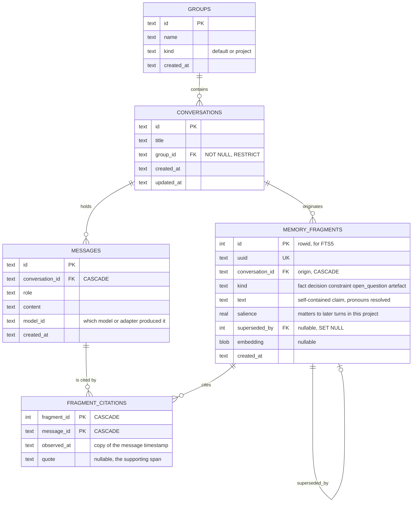
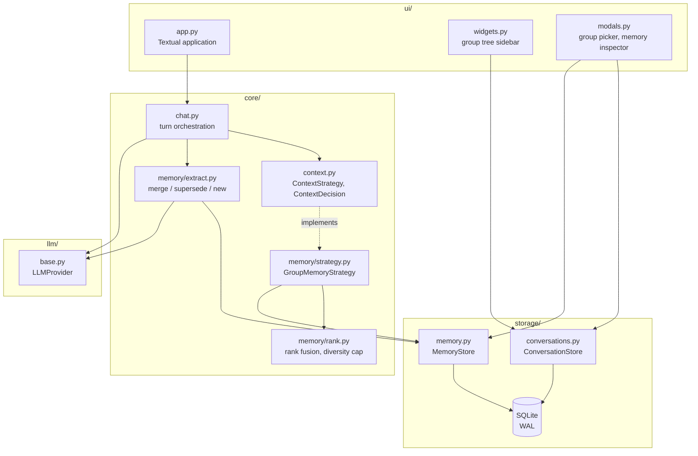
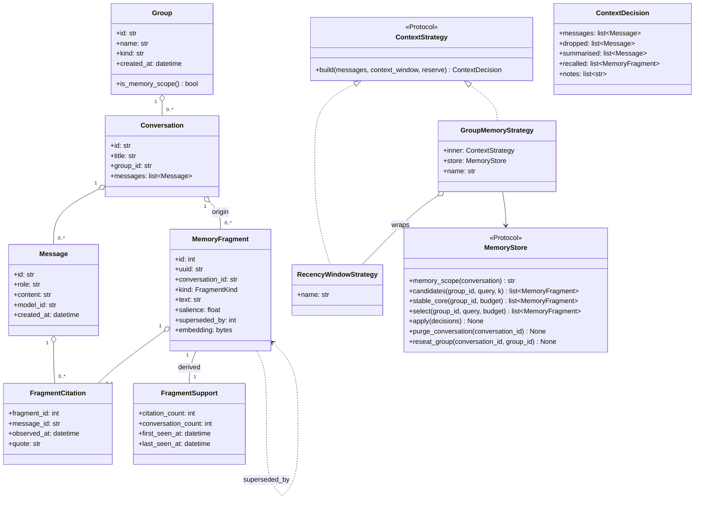
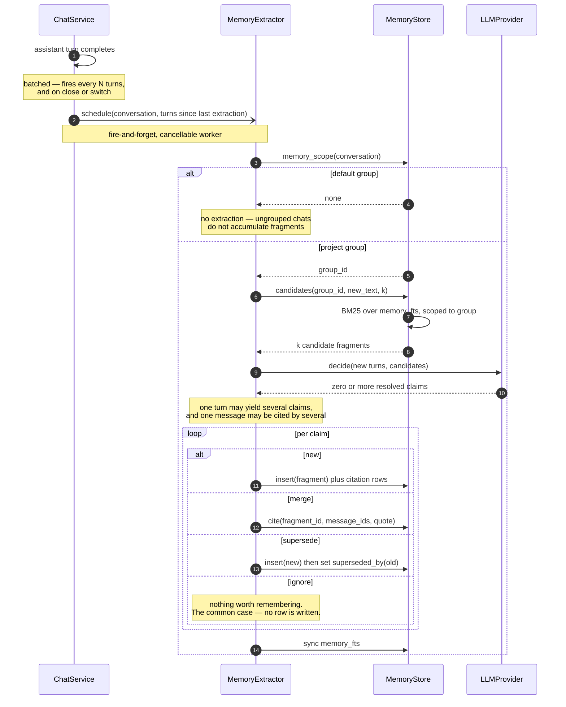
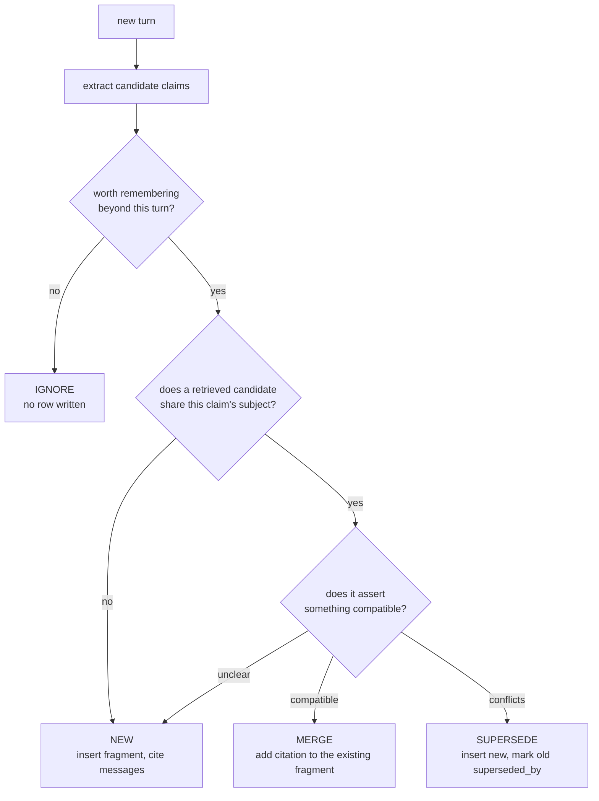
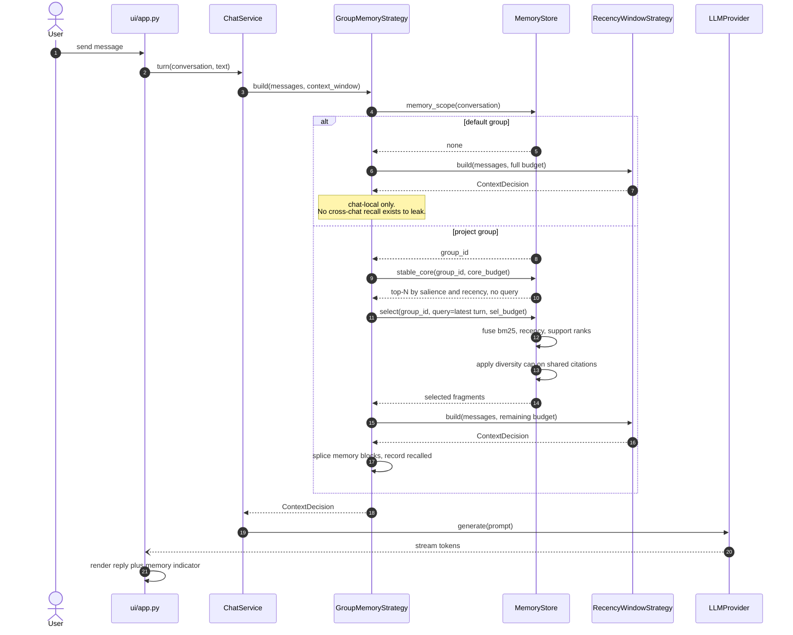
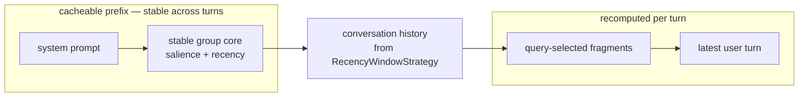
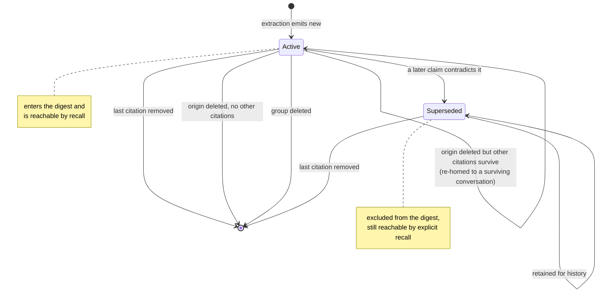
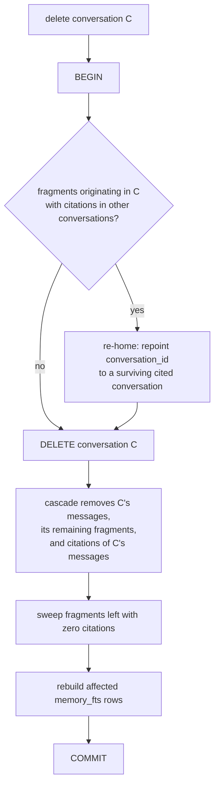
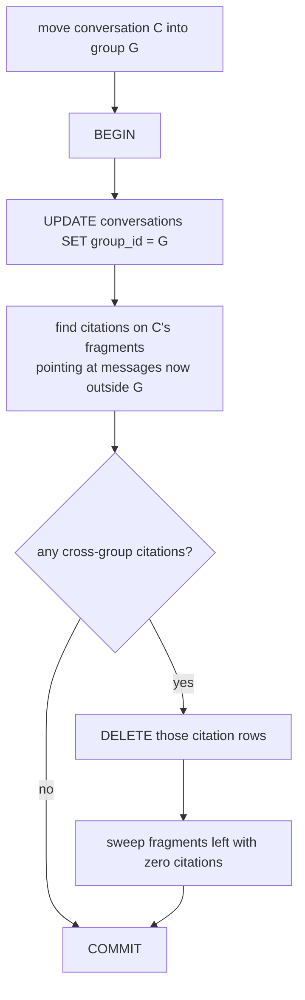

# Memory & Groups — implementation model

**Status: v3 — write path aligned with the GUM pipeline (Shaikh et al., UIST '25).**
**Stage: prototype, single user. Schema changes are free; see "Relationship to plan 001".**

Scope: the **chat memory mechanism** (NFR-S-02) and the **grouping** it is scoped
by (NFR-CTX-02). This is memory over the user's own conversations.

Explicitly *not* in scope, and not to be merged into these tables:

- **Persona extraction** — mining communication signals (Enron, `corpus/`) for what
  a message reveals about its sender and receiver. Different input, keyed by
  person, outlives every group. See `system_vision.md`.
- **Adaptive RAG** (NFR-RAG-\*) — retrieval over user-provided documents through a
  judge/rewriter loop. Memory shares its *primitives* (SQLite, FTS5, embeddings,
  rank fusion) but not its pipeline: an always-on, every-turn memory lookup must
  not pay for a judge loop.

## How to work with this file

Same protocol as `system_vision.md`. Report deltas, not full states — a few rough
sentences are enough and the model gets redrafted around them. ⏸ marks
"deliberately not deciding yet"; § 7 is the list. Every redraft gets a changelog
entry.

## Relationship to plan 001

`2026-08-10-001-feat-conversation-switching-plan.md` shipped `SqliteStore` with
`conversations.group_id TEXT` — nullable, no FK, no `groups` table — and deferred
memory scoping to follow-up work. This model supersedes that schema.

**No migration path is written, deliberately.** This is a prototype with a single
user, so the schema is free to change: the resolution is to drop the development
database and recreate it, not to version and migrate it. There is no
`PRAGMA user_version` and none is proposed. If that stops being true — a second
user, or data anyone minds losing — this is the first thing that has to change.

Two knock-on corrections to shipped code:

- `conversations.group_id` becomes NOT NULL with an FK to `groups`, so the
  database cannot represent a state I-1 forbids.
- `ConversationStore.list_conversations(group_id=None)` currently overloads null to
  mean "every conversation". That is the nullable ambiguity I-1 exists to remove;
  the unfiltered case wants its own method rather than a null argument.

---

# 1 — Static models

## 1.1 Data model



`FRAGMENT_CITATIONS` is an **associative entity resolving a many-to-many**: one
message can support many fragments, and one fragment can cite many messages. The
composite primary key means a given pair appears at most once.

Both directions carry meaning and they are not the same signal:

| Direction | Reading |
|---|---|
| many messages → one fragment | the claim was **corroborated** — stronger evidence |
| one message → many fragments | the message was **dense** — richer turn, not stronger claims |

Only the first feeds ranking. § 6 explains why the second must not.

Renamed from `fragment_sources` in v2. "Source" reads as an entity — the thing
being cited — which is what made the old class diagram look like fragment
ownership. "Citation" reads as the edge it is. Revert if you prefer the old name;
nothing else depends on it.

Plus a derived view and an FTS index, which carry no state of their own:

| Object | Purpose |
|---|---|
| `fragment_support` (view) | `citation_count`, `conversation_count`, `first_seen_at`, `last_seen_at` — aggregated from `fragment_citations` |
| `memory_fts` (FTS5) | external-content index over `memory_fragments.text`, BM25 ranking |

**Two modelling rules the diagram encodes.**

*Derive what is mutable, copy what is immutable.* `group_id` is **not** on the
fragment — group membership changes on every move, so a copy would drift, and
deriving it by JOIN makes moving a chat a single-row UPDATE. `observed_at` **is**
copied onto the citation row — a message timestamp never changes, so the copy is
safe, and it keeps ranking queries off the `messages` table.

*Origin versus evidence.* `conversation_id` is the conversation where the claim
first appeared. It fixes the group and owns the cascade. `fragment_citations` is
every message supporting the claim, possibly in other conversations of the same
group — that cross-conversation corroboration is the signal worth having, and
§ 2.4 / § 2.5 handle what it costs.

## 1.2 Module placement

Dependency direction stays one-way: `ui → core → llm/storage`. Nothing new
crosses it.



`memory/` is a new package under `core/`. It is the only place that knows what a
fragment is; `chat.py` sees a `ContextStrategy` and a fire-and-forget extractor.

## 1.3 Domain and protocol model



`FragmentCitation` hangs off **both** `MemoryFragment` and `Message` — that pair of
edges is the many-to-many. Neither parent owns it.

`superseded_by`, `embedding`, `quote` and `model_id` are nullable; Mermaid has no
notation for it. `ContextDecision.recalled` is the one addition to the existing
dataclass — without it the UI cannot show what memory contributed, which
NFR-CTX-05 asks for.

---

# 2 — Dynamic models

## 2.1 Write path — extraction

Runs **after** the assistant turn completes and **off** the reply path. Memory
extraction must never sit between the user pressing Enter and the first token.



One LLM call resolves every claim. New, merge and supersede are the same judgement
over the same candidates, so splitting them into separate passes would multiply
the cost for nothing.

### When extraction runs

Extraction is **batched over a configurable number of turns**
(`AGENTCHAT_MEMORY_EXTRACT_EVERY`, turns since the last run) rather than firing on
every turn. Per-turn extraction pays an LLM call for turns that usually carry no
durable claim; too large a batch makes the extractor hold many claims at once and
delays recall of things just said.

A counter alone is not sufficient — it loses the tail. Extraction must **also flush
on conversation switch and on close**, or the last N-1 turns before you navigate
away are never extracted. The counter is an optimisation; the flush is what makes
the invariant "every turn in a project group is eventually extracted" true.

Batching does not weaken provenance: the many-to-many in § 1.1 lets a claim drawn
from a five-turn window cite every message that supports it.

### What the four outcomes are decided on

Extraction is two steps. First, pull candidate **claims** out of the new turn.
Then resolve each claim against the fragments BM25 retrieved from the same group.
The branch is per claim — a turn can produce several, or none at all.



Merge and supersede both require a **subject match** and differ only on whether
the predicates agree. "Database choice → SQLite" said again in another chat is a
merge; "database choice → Postgres" is a supersede.

**The three errors do not cost the same**, which is why the unclear edge routes to
`new`:

| Error | Consequence | Recoverable |
|---|---|---|
| false `new` | a duplicate fragment | yes — a later merge can absorb it |
| false `merge` | two distinct claims collapsed under one text | partly — the citation is wrong but visible |
| false `supersede` | a true claim silently leaves the digest | only by inspecting superseded rows |

Two rules that fall out of this:

- **At most one resolution per claim.** If several candidates match, take the
  highest-ranked; do not emit a merge against each.
- **Merge never rewrites fragment text.** Only a citation is added. Otherwise text
  churns on every corroboration and `memory_fts` must re-index each time.

**Subject match is a vector comparison**, not a free-form judgement. Candidates are
retrieved by embedding similarity over fragment text; the model is only asked the
narrower question of whether the predicates agree. This follows GUM's reranker
(below), which classifies retrieved propositions as *identical / similar /
unrelated* — the same three-way split as merge / supersede / new.

### Prior art: the GUM pipeline

Shaikh et al., *Creating General User Models from Computer Use*, UIST '25
([doi:10.1145/3746059.3747722](https://doi.org/10.1145/3746059.3747722),
<https://generalusermodels.github.io>). Their architecture is
**Observe → Audit → Propose → Retrieve → Revise**, and it maps onto this design
closely enough to be worth following deliberately rather than reinventing.

| GUM | Here | Notes |
|---|---|---|
| observation | message | GUM's are unstructured (screenshots); ours are already text |
| proposition + grounding | fragment + citations | same many-to-many |
| **Audit** | *dropped* | a privacy gate answering Nissenbaum's contextual-integrity questions. Ours is memory over the user's own chats, so there is no third-party disclosure to gate. Becomes relevant again for the persona pipeline over Enron. |
| **Propose** | claim extraction | GUM generates a reasoning trace *before* the proposition, then confidence, then decay |
| **Retrieve** | `candidates()` | BM25 → LLM rerank as identical / similar / unrelated. Their footnote 5 explicitly sanctions swapping BM25 for neural embeddings |
| **Revise** | merge / supersede | see the caveat below |

**Where GUM is better than § 2.1 as drafted.** GUM has no hard supersede. Revise
rewrites the proposition and regenerates its confidence — contradiction lowers it,
reinforcement raises it — and nothing is ever evicted; confidence-0 propositions
remain for transparency but are not surfaced by default. That dissolves the
false-supersede failure named in the error table above, where one bad call
silently drops a true claim out of the digest. See § 7 #9.

**Where the analogy is weaker.** GUM *infers* about a user from indirect
observation, so confidence carries real weight there. Chat memory mostly records
what was explicitly said, and a claim the user stated outright is not uncertain.
Decay is the more valuable import (§ 6); confidence may be close to constant here.

⏸ The default-group branch shown here does **no** extraction. The alternative —
extract always, so moving a chat into a project carries its history instantly —
costs GPU on throwaway chats. See § 7.

## 2.2 Read path — context assembly



**Prompt layout matters here.** The stable core changes only when fragments
change; the query-selected block changes every turn. Putting them in one block
would invalidate the KV cache on every message.



Two blocks, two jobs: the stable core is context **compression** (NFR-CTX-01), the
query-selected block is context **selection by relevance** (NFR-CTX-03). Both are
MUSTs, so both blocks are needed regardless of the cache argument.

## 2.3 Fragment lifecycle



Deleting a single message can weaken many fragments at once and kill any that were
resting on it alone — the many-to-many makes that a fan-out, which is why the
orphan sweep in § 2.4 is a set operation rather than a per-fragment check.

## 2.4 Deleting a conversation

The cascade alone no longer suffices, because a fragment may be corroborated by
conversations that survive. Order matters and the whole thing is one transaction.



Re-homing must happen **before** the delete, or the cascade removes the fragment
first.

⚠ The re-homing step is a judgement call against NFR-S-04. A fragment corroborated
in two other chats survives deletion of the chat that first said it: the reference
to the deleted conversation is gone, but the claim persists. Reading it strictly,
that surviving fragment is residue. Decide deliberately and state which reading
was taken — this is a likely demo question. See § 7.

## 2.5 Moving a conversation between groups



Because `group_id` is derived rather than stored on the fragment, the fragments
follow the conversation with no write of their own. The second step exists only to
enforce invariant I-3.

---

# 3 — Invariants

| ID | Invariant | Enforced by |
|---|---|---|
| I-1 | Every conversation belongs to exactly one group. `group_id` is NOT NULL. | Schema |
| I-2 | The default group is not a memory scope. Fragments never cross it. | `memory_scope()`, single decision point |
| I-3 | A fragment's citations all lie within the fragment's own group. | § 2.5 pruning step |
| I-4 | A fragment with zero citations does not exist. | Sweep in § 2.4 and § 2.5 |
| I-5 | Fragment text is self-contained — no unresolved pronouns or references. | Extraction prompt; unenforceable in schema |
| I-6 | Memory code never reads persona data, and persona code never reads fragments. | Package boundary; if they ever meet it is at prompt assembly, explicitly |
| I-7 | A (fragment, message) pair is cited at most once. | Composite PK |

I-2 is the one that earns its keep. Making the default group a real memory scope
would pool every unrelated one-off chat into one invisible digest — a leak that is
worse for being invisible, and precisely what NFR-CTX-02 prohibits.

I-5 is the most common quiet failure. A fragment reading "she prefers it" is
worthless once detached from its turn, and nothing in the schema can catch it.

---

# 4 — Requirement traceability

| Decision | Requirement | Priority |
|---|---|---|
| Fragments scoped by group, resolved by JOIN | NFR-S-02 | MUST |
| Default group is not a memory scope (I-2) | NFR-CTX-02 | MUST |
| Ordered delete transaction, orphan sweep | NFR-S-04 | SHOULD |
| SQLite, single file, inspectable | NFR-S-01, NFR-S-03 | MUST / SHOULD |
| Stable group core | NFR-CTX-01 | MUST |
| Query-selected block, ranked not recency-only | NFR-CTX-03 | MUST |
| Budgeted assembly, survives model switch to a smaller window | NFR-CTX-04 | MUST |
| `ContextDecision.recalled` plus memory indicator in the UI | NFR-CTX-05, NFR-Q-01 | SHOULD / MUST |
| Citation rows with quotes — evidence is attributable to its message | NFR-CTX-05 | SHOULD |
| Extraction off the reply path, cancellable worker | NFR-U-04 | MUST |
| Group picker as a modal, no drag-and-drop | NFR-P-03 | MUST |
| Move-to-default on group delete, with confirmation | NFR-U-06 | SHOULD |

---

# 5 — Beyond requirements

Nothing in this section is demanded by any NFR. It is real engineering, and it is
what to cut first if the schedule tightens. Listed most-cuttable first.

| Feature | What is lost by cutting it |
|---|---|
| `quote` on the citation row | The memory inspector can name the message but not highlight the span. Cheap to keep; nullable, so it can be added later without migration pain. |
| Diversity cap on shared citations | One dense message can dominate the digest. Only bites once messages are commonly multi-cited. |
| Support-count rank fusion | Corroboration stops influencing ranking. BM25 + recency alone still satisfies NFR-CTX-03. |
| `superseded_by` chains | Contradictory claims both surface. Mitigated by recency weighting, badly. |
| Cross-conversation citations | Fragments become conversation-local; § 2.4 re-homing and § 2.5 pruning both disappear, and the model gets materially simpler. |
| Re-homing on delete | Corroborated fragments die with their origin. Strictly *more* compliant with NFR-S-04. |
| KV-cache-aware prompt split | Slower per turn. Both blocks are still required; only their placement is an optimisation. |

Cutting the cross-conversation row collapses roughly half of § 2 — worth knowing
which half is load-bearing. Note that it does **not** collapse the many-to-many:
one message can support several fragments within a single conversation too.

---

# 6 — Ranking

Fusion over ranks, not scores. BM25 values are unbounded and corpus-dependent, so
weights tuned on one group are wrong for the next.

```
score(f) = 1/(k + rank_bm25(f)) + 1/(k + rank_recency(f)) + 1/(k + rank_support(f))
k ≈ 60
```

- `rank_recency` orders by `fragment_support.last_seen_at`, not `created_at`. A
  backfilled three-month-old chat is extracted today; ranking on extraction time
  would make its stale claims look freshest.
- **Decay is per fragment, not global** — GUM's move, and a better one than a flat
  recency ordinal. "We decided SQLite" decays slowly; "I'm debugging the picker
  right now" decays fast. With a per-fragment decay rate `α`, relevance becomes
  `r̃ᵢ = rᵢ · exp(−αᵢ · k · age(dᵢ))` with `k = 2` and age in days, and
  `rank_recency` is the ordering of `r̃`. `kind` already correlates with decay
  (`decision` slow, `open_question` fast), so `α` can start as a per-kind constant
  before asking the model for it.
- `rank_support` orders by `conversation_count`, not `citation_count`, and
  saturates: `log(1 + conversation_count)`. Two messages five turns apart in one
  session is usually the user rephrasing, not independent confirmation.
- The fusion is deterministic and each term is inspectable, which is what makes
  the memory indicator in § 2.2 able to explain itself (NFR-CTX-05).

**Message density is deliberately not a ranking signal.** The many-to-many makes
"how many fragments does this message support" cheap to compute, and it is
tempting to read a dense message as an important one. It is not the same quantity
as corroboration: density measures how much was packed into one turn, not how well
a claim is supported. Feeding it into `rank_support` would let a single verbose
message outrank a claim independently confirmed across three conversations.

**Diversity via MMR.** Because one message can support several fragments, an
unconstrained selection can fill the digest with claims all resting on the same
turn — the model then sees one piece of evidence three times and weights it as
three. Use Maximum Marginal Relevance rather than an ad-hoc cap:

```
MMR(dᵢ, S) = λ · r̃ᵢ − (1 − λ) · max sim(dᵢ, dⱼ)   for dⱼ ∈ S,   λ = 0.5
```

Select iteratively until the budget is reached. This is GUM's approach (§ 2.1),
which makes it citable rather than invented, and it subsumes the shared-citation
problem: fragments resting on the same message are textually similar, so the
diversity term suppresses them without needing a separate rule.

---

# 7 — Open decisions

| # | Question | Blocks |
|---|---|---|
| ⏸ 1 | Do ungrouped chats accumulate fragments? § 2.1 says no. "Yes" makes moving a chat into a project carry its history instantly, at the cost of extraction on every throwaway chat. | § 2.1, § 2.5 |
| ⚠ 2 | Strict or lenient reading of NFR-S-04 on re-homing (§ 2.4). | § 2.4, § 5 |
| ⏸ 3 | Salience: model-assigned at extraction, or derived from support and recency alone? A derived value is one less thing for a small model to get wrong. | § 6 |
| ⏸ 4 | Does `stable_core` get regenerated by an LLM summarisation pass, or is it just top-N fragment text? The former is truer compression; the latter has no failure mode. | § 2.2, NFR-CTX-01 |
| ⏸ 5 | Backfill trigger. Chats predating the feature and failed extractions both need one; is it manual, on-move, or on-open? | § 2.1 |
| ⏸ 7 | Does the extractor get told which messages it already cited for a candidate fragment? Without it, merge decisions may re-cite the same message — harmless (I-7 dedupes) but wasteful of prompt budget. | § 2.1 |
| ⏸ 9 | Replace `superseded_by` with a **confidence score** and GUM-style revision? Contradiction lowers confidence rather than evicting, which removes the false-supersede failure mode entirely. Counter-argument: chat memory records what was *said*, which is not very uncertain — confidence may sit near-constant and earn nothing. | § 2.1, § 1.1, § 2.3 |
| ⏸ 10 | Adopt GUM's **reasoning trace before the claim**? They generate a rationale first, then the proposition, citing both explainability and accuracy. Costs tokens per extraction; would make the memory inspector able to show *why* a fragment exists. | § 2.1 |
| ⏸ 11 | Is `α` (decay rate) a per-`kind` constant or model-generated per fragment? Per-kind is free and has no failure mode; model-generated is more expressive and is what GUM does. | § 6 |
| ✔ 8 | *Resolved.* Subject matching is a vector comparison over fragment embeddings, following GUM's retrieve-then-rerank. The pipeline is intended to generalise later to persona artefact extraction — separate store, shared machinery, per I-6. | § 2.1 |
| ✔ 6 | *Resolved.* Open decision #4 in `requirements.md` — memory and the persona/profile store are **separate mechanisms** sharing storage primitives only. Fold this back into `requirements.md`. | — |

---

## Changelog

- **2026-08-10** — v3. Aligned the write path with Shaikh et al.'s GUM pipeline
  (UIST '25). Resolved § 7 #8: subject matching is a vector comparison, following
  their retrieve-then-rerank, with the pipeline intended to generalise later to
  persona extraction. Added batched extraction on a configurable turn count with a
  mandatory flush on switch/close. Replaced the ad-hoc diversity cap with MMR and
  the recency ordinal with per-fragment decay. Recorded that GUM's Audit step is a
  privacy gate and is deliberately dropped here. New parked items #9–#11.
- **2026-08-10** — v2.2. Specified what new/merge/supersede are actually decided
  on — § 2.1 had the writes but never the judgement. Added the fourth outcome
  (`ignore`, the common case), a decision flowchart, the error-cost asymmetry that
  biases unclear cases to `new`, and the one-resolution-per-claim and
  merge-never-rewrites rules. New parked item § 7 #8 on an explicit `subject`.
- **2026-08-10** — v2.1. Recorded the relationship to plan 001: this model
  supersedes its `conversations` schema, and no migration path is written because
  the project is a single-user prototype. Noted the
  `list_conversations(group_id=None)` overload as a knock-on correction.
- **2026-08-10** — v2. Fragment↔message corrected to an explicit many-to-many: the
  v1 class diagram showed citations as fragment-owned, which was wrong. Renamed
  `fragment_sources` → `fragment_citations` so the associative entity reads as an
  edge. Added the nullable `quote` span, a diversity cap in § 6, invariant I-7, and
  an explicit warning against using message density as a ranking signal. New
  parked item § 7 #7.
- **2026-08-10** — v1. First full static and dynamic model. Settled: default group
  as a non-scope, origin-versus-support fragment ownership, derive-mutable /
  copy-immutable, ordered delete transaction, rank fusion over BM25 + recency +
  support. Resolved `requirements.md` open decision #4 (memory separate from the
  persona pipeline). Five items parked in § 7.
