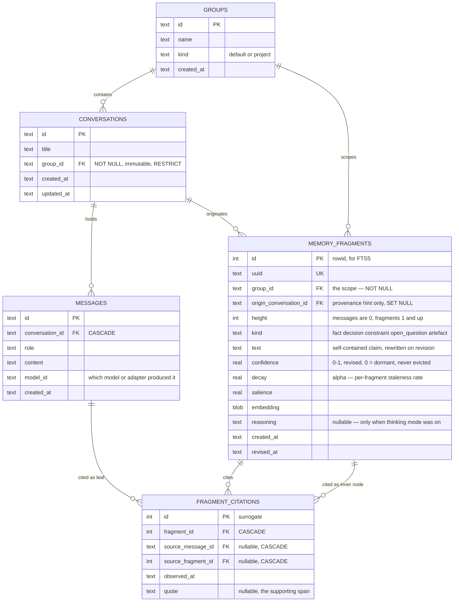
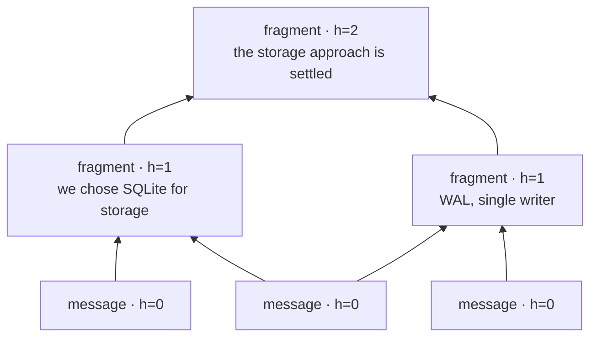
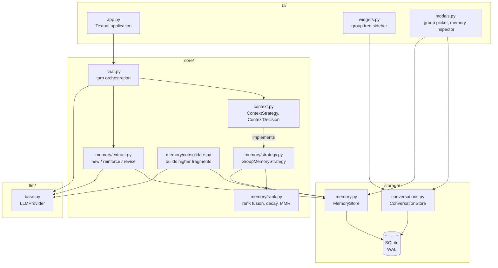
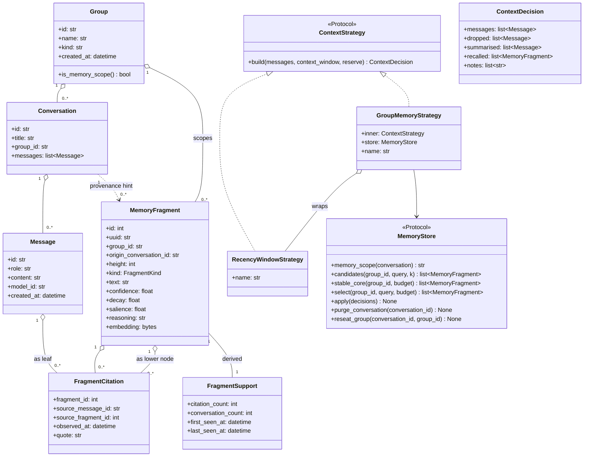
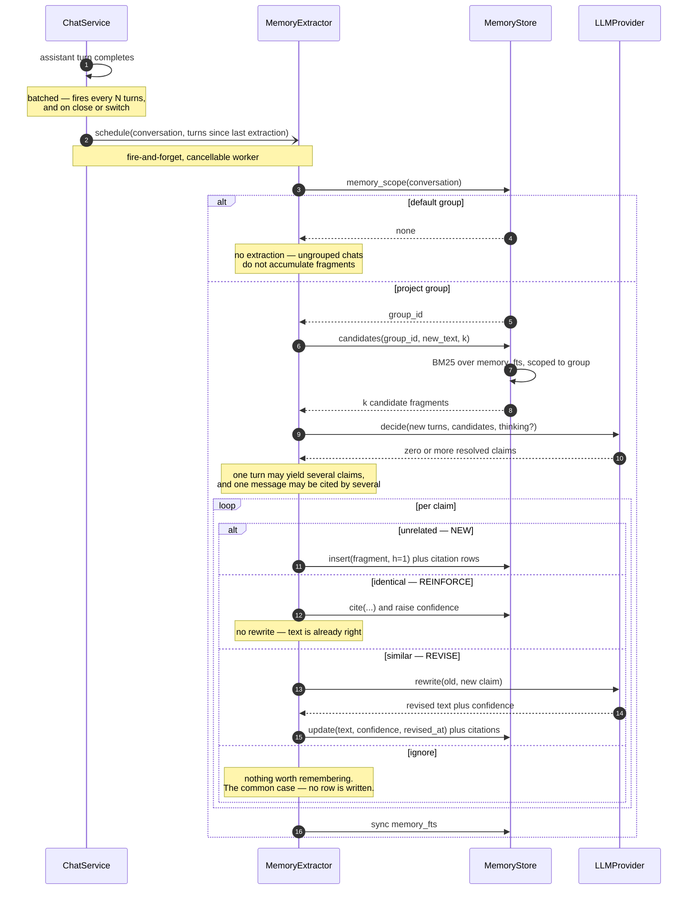
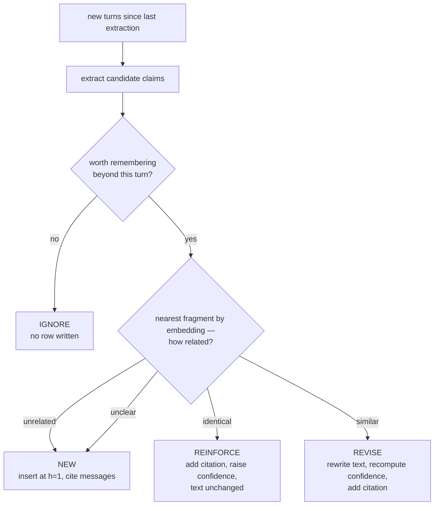
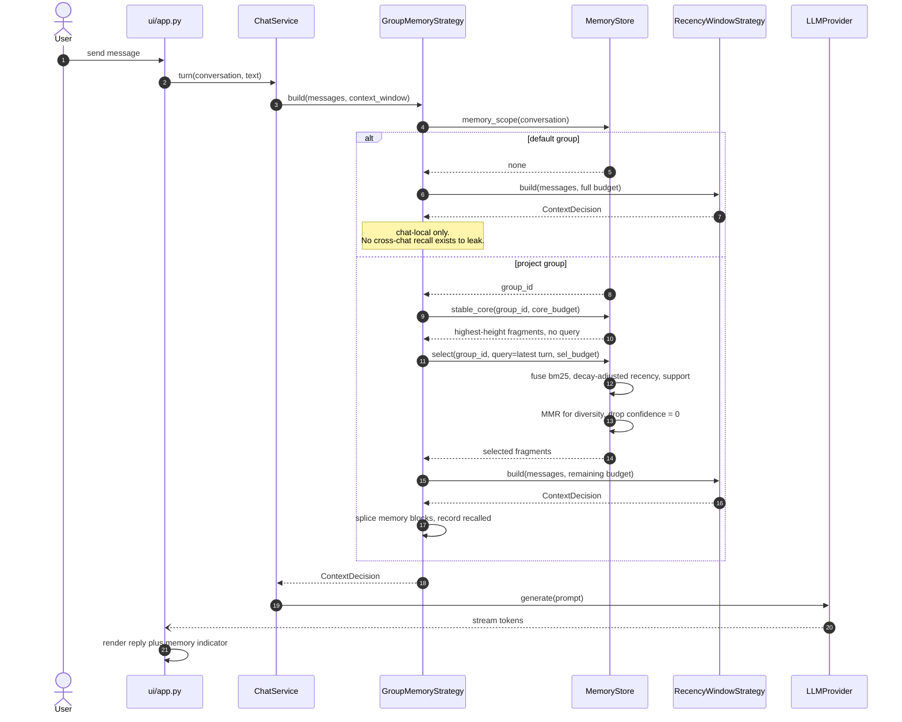
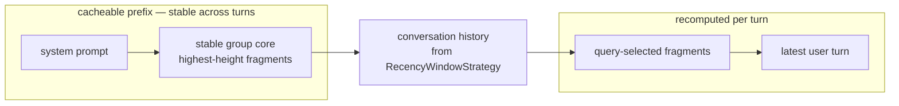
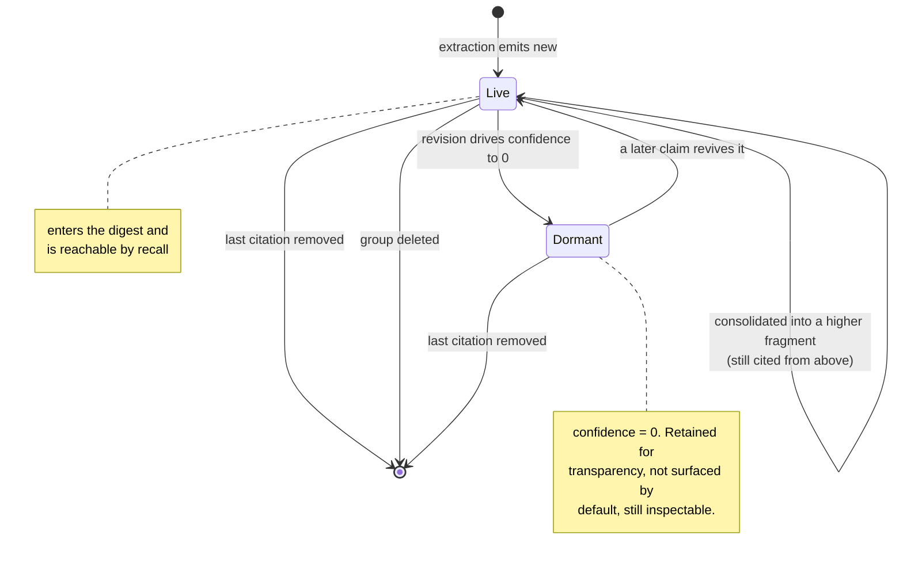
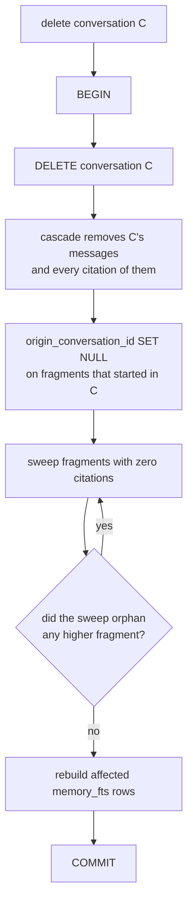

# Memory & Groups — implementation model

**Status: v4 — confidence-based revision, immutable group binding, memory hierarchy.**
**Stage: prototype, single user. Schema changes are free; see "Relationship to plan 001".**

Scope: the **chat memory mechanism** (NFR-S-02) and the **grouping** it is scoped
by (NFR-CTX-02). This is memory over the user's own conversations.

Explicitly *not* in scope, and not to be merged into these tables:

- **Persona extraction** — mining communication signals (Enron, `corpus/`) for what
  a message reveals about its sender and receiver. Different input, keyed by
  person, outlives every group. See `system_vision.md`.
- **Adaptive RAG** (NFR-RAG-\*) — retrieval over user-provided documents through a
  judge/rewriter loop. Memory shares its *primitives* (SQLite, FTS5, embeddings,
  rank fusion) but not its pipeline: an always-on, every-turn memory lookup must
  not pay for a judge loop.

## How to work with this file

Same protocol as `system_vision.md`. Report deltas, not full states — a few rough
sentences are enough and the model gets redrafted around them. ⏸ marks
"deliberately not deciding yet"; § 7 is the list. Every redraft gets a changelog
entry.

## Relationship to plan 001

`2026-08-10-001-feat-conversation-switching-plan.md` shipped `SqliteStore` with
`conversations.group_id TEXT` — nullable, no FK, no `groups` table — and deferred
memory scoping to follow-up work. This model supersedes that schema.

**No migration path is written, deliberately.** This is a prototype with a single
user, so the schema is free to change: the resolution is to drop the development
database and recreate it, not to version and migrate it. There is no
`PRAGMA user_version` and none is proposed. If that stops being true — a second
user, or data anyone minds losing — this is the first thing that has to change.

Two knock-on corrections to shipped code:

- `conversations.group_id` becomes NOT NULL with an FK to `groups`, so the
  database cannot represent a state I-1 forbids.
- `ConversationStore.list_conversations(group_id=None)` currently overloads null to
  mean "every conversation". That is the nullable ambiguity I-1 exists to remove;
  the unfiltered case wants its own method rather than a null argument.

---

# 1 — Static models

## 1.1 Data model



## 1.1.1 The memory hierarchy

Citations are polymorphic: a fragment cites **either** a message **or** a
lower-height fragment. `CHECK` enforces exactly one of the two source columns is
non-null. Messages are leaves at height 0; fragments are inner nodes.



**monotonic id ordering.** A fragment may only cite nodes with a
strictly smaller creation id. Since ids are assigned monotonically, creation
satisfies this automatically and revision needs one comparison. No column, no
maintenance, no recomputation, and it is a total order so it is strictly stronger
than needed — which costs nothing, because nothing wants to cite *forward* in time
anyway.

- **The orphan sweep is transitive.** Deleting a message can sweep the fragments
  resting on it, which can sweep the fragments resting on *those*. Iterate to a
  fixpoint (or one recursive CTE), not a single pass.
- **`stable_core` is the consolidated layer** rather than an ephemeral
  summarisation pass — which resolves § 7 #4 regardless of how the layer is
  identified.

Because `source_message_id` and `source_fragment_id` are nullable, a composite
primary key would not dedupe (SQLite treats NULLs as distinct in unique indexes).
I-7 is therefore enforced by two partial unique indexes — one per source column,
each `WHERE … IS NOT NULL` — over a surrogate key.

`FRAGMENT_CITATIONS` is an **associative entity resolving a many-to-many**: one
message can support many fragments, and one fragment can cite many messages. The
composite primary key means a given pair appears at most once.

Both directions carry meaning and they are not the same signal:

| Direction | Reading |
|---|---|
| many messages → one fragment | the claim was **corroborated** — stronger evidence |
| one message → many fragments | the message was **dense** — richer turn, not stronger claims |

Only the first feeds ranking. § 6 explains why the second must not.

Renamed from `fragment_sources` in v2. "Source" reads as an entity — the thing
being cited — which is what made the old class diagram look like fragment
ownership. "Citation" reads as the edge it is. Revert if you prefer the old name;
nothing else depends on it.

Plus a derived view and an FTS index, which carry no state of their own:

| Object | Purpose |
|---|---|
| `fragment_support` (view) | `citation_count`, `conversation_count`, `first_seen_at`, `last_seen_at` — aggregated from `fragment_citations` |
| `memory_fts` (FTS5) | external-content index over `memory_fragments.text`, BM25 ranking |

**Two modelling rules the diagram encodes.**

*Derive what is mutable, copy what is immutable.* `observed_at` is copied onto the
citation row because a message timestamp never changes. As of v4, `group_id` is
copied onto the fragment **for the same reason** — a conversation is bound to its
group for life (§ 2.5), so membership is now immutable and the copy cannot drift.

This reverses v1, which derived `group_id` by JOIN precisely because chats could
move. Two v4 decisions force the change together: immutable binding makes the copy
*safe*, and the hierarchy makes it *necessary* — a fragment at h ≥ 2 consolidating
claims from four conversations has no meaningful origin conversation, so
`conversation_id` cannot carry scope at every height. `group_id` is now the only
scope key that works for all fragments.

*Scope versus provenance versus evidence.* Three distinct jobs that v1 conflated
into `conversation_id`:

| Column | Job |
|---|---|
| `group_id` | the scope. What NFR-S-02 bounds recall by. NOT NULL at every height. |
| `origin_conversation_id` | provenance hint for the UI — "this started in *Picker rewrite*". Nullable, `SET NULL` on delete, carries no cascade. |
| `fragment_citations` | the evidence. What the fragment lives or dies by (I-4). |

Splitting them is what lets § 2.4 drop the re-homing step: the cascade runs through
citations, so a fragment survives exactly when it still has evidence, rather than
because someone repointed an ownership column.

## 1.2 Module placement

Dependency direction stays one-way: `ui → core → llm/storage`. Nothing new
crosses it.



`memory/` is a new package under `core/`. It is the only place that knows what a
fragment is; `chat.py` sees a `ContextStrategy` and a fire-and-forget extractor.

## 1.3 Domain and protocol model



`FragmentCitation` hangs off `MemoryFragment` **and** off either a `Message` or a
lower-height `MemoryFragment` — that is the polymorphic many-to-many of § 1.1.1.
No parent owns it.

`origin_conversation_id`, `reasoning`, `embedding`, `quote`, `source_message_id`,
`source_fragment_id` and `model_id` are nullable; Mermaid has no notation for it.
`ContextDecision.recalled` is the one addition to the existing dataclass — without
it the UI cannot show what memory contributed, which NFR-CTX-05 asks for and § 8
designs.

---

# 2 — Dynamic models

## 2.1 Write path — extraction

Runs **after** the assistant turn completes and **off** the reply path. Memory
extraction must never sit between the user pressing Enter and the first token.



One LLM call resolves every claim against its candidates; only the `revise` branch
pays a second call, because only it rewrites text.

### When extraction runs

Extraction is **batched over a configurable number of turns**
(`AGENTCHAT_MEMORY_EXTRACT_EVERY`, turns since the last run) rather than firing on
every turn. Per-turn extraction pays an LLM call for turns that usually carry no
durable claim; too large a batch makes the extractor hold many claims at once and
delays recall of things just said.

A counter alone is not sufficient — it loses the tail. Extraction must **also flush
on conversation switch and on close**, or the last N-1 turns before you navigate
away are never extracted. The counter is an optimisation; the flush is what makes
the invariant "every turn in a project group is eventually extracted" true.

Batching does not weaken provenance: the many-to-many in § 1.1 lets a claim drawn
from a five-turn window cite every message that supports it.

### What the four outcomes are decided on

Extraction is two steps. First, pull candidate **claims** out of the new turns.
Then resolve each claim against the fragments retrieved from the same group by
embedding similarity. The branch is per claim — a batch can produce several, or
none at all.



These are GUM's three reranker labels — *unrelated / identical / similar* — plus
`ignore`. **There is no supersede.** A contradiction is a `similar` match whose
revision lowers confidence; nothing is evicted. Confidence-0 fragments stay in the
table and simply stop surfacing.

**Why `identical` does not rewrite.** GUM rewrites on every revision. Here, a claim
restated verbatim in another chat has nothing to add to the text, and repeated
LLM rewrites of the same sentence drift semantically — each rewrite is a lossy
re-encoding, and twenty of them compound. Reinforcement therefore only touches
confidence and citations, which also keeps `memory_fts` from re-indexing on every
corroboration.

**The errors no longer cost the same, and the worst one is gone:**

| Error | Consequence | Recoverable |
|---|---|---|
| false `new` | a duplicate fragment | yes — a later revise can absorb it |
| false `reinforce` | confidence inflated on a claim that wasn't really restated | yes — decays back |
| false `revise` | two claims blended into one text | partly — old text is gone, citations remain |

Losing supersede removes the only outcome that silently dropped a true claim. The
unclear edge still routes to `new`, since a duplicate is the cheapest mistake.

**One rule survives:** at most one resolution per claim. If several candidates
match, take the highest-ranked; do not revise against each.

### Reasoning traces follow the thinking toggle

GUM generates a rationale *before* each proposition, for explainability and
accuracy. Here that is bound to the existing `Ctrl+T` thinking mode: when thinking
is on, extraction generates a reasoning trace and stores it in
`memory_fragments.reasoning`; when off, it goes straight to the claim and
`reasoning` is null.

This reuses whatever mechanism the generation path already uses per model — native
via the chat template for `qwen3-14b`, prompted for `phi-4-mini` — rather than
inventing a second one, and it fits NFR-U-08's principle that expensive modes are
user-controlled.

Two consequences to accept deliberately:

- **Memory quality becomes coupled to a generation setting.** Someone toggling
  thinking off for faster replies also degrades extraction, invisibly and in the
  background. Worth surfacing in § 8's extraction indicator.
- **The "why" display degrades with it.** Fragments captured with thinking off can
  never explain themselves in the inspector, so the transcript will be mixed.

### Prior art: the GUM pipeline

Shaikh et al., *Creating General User Models from Computer Use*, UIST '25
([doi:10.1145/3746059.3747722](https://doi.org/10.1145/3746059.3747722),
<https://generalusermodels.github.io>). Their architecture is
**Observe → Audit → Propose → Retrieve → Revise**, and it maps onto this design
closely enough to be worth following deliberately rather than reinventing.

| GUM | Here | Notes |
|---|---|---|
| observation | message | GUM's are unstructured (screenshots); ours are already text |
| proposition + grounding | fragment + citations | same many-to-many |
| **Audit** | *dropped* | a privacy gate answering Nissenbaum's contextual-integrity questions. Ours is memory over the user's own chats, so there is no third-party disclosure to gate. Becomes relevant again for the persona pipeline over Enron. |
| **Propose** | claim extraction | GUM generates a reasoning trace *before* the proposition, then confidence, then decay |
| **Retrieve** | `candidates()` | BM25 → LLM rerank as identical / similar / unrelated. Their footnote 5 explicitly sanctions swapping BM25 for neural embeddings |
| **Revise** | reinforce / revise | adopted in v4 — see below |

**Adopted from GUM in v4.** No hard supersede: revision rewrites and regenerates
confidence, contradiction lowers it, and nothing is ever evicted. Per-fragment
decay (§ 6). MMR for diversity (§ 6). Reasoning traces (§ 2.1, gated on thinking
mode). Propositions built on propositions — the hierarchy of § 1.1.1.

**Where the analogy is weaker.** GUM *infers* about a user from indirect
observation, so confidence carries real weight there. Chat memory mostly records
what was explicitly said, and a claim the user stated outright is not uncertain —
expect confidence to cluster high and do less work than it does for GUM. Its value
here is mostly as the *mechanism* that replaces eviction, not as a signal.

The default-group branch does **no** extraction, and as of v4 that is settled
rather than parked: a chat cannot later be filed into a project (§ 2.5), so
fragments extracted from a default-group chat could never become reachable.

## 2.2 Read path — context assembly



**Prompt layout matters here.** The stable core changes only when fragments
change; the query-selected block changes every turn. Putting them in one block
would invalidate the KV cache on every message.



Two blocks, two jobs: the stable core is context **compression** (NFR-CTX-01), the
query-selected block is context **selection by relevance** (NFR-CTX-03). Both are
MUSTs, so both blocks are needed regardless of the cache argument.

**Height splits them cleanly.** The stable core wants consolidated, general
fragments — the h ≥ 2 layer, which literally *is* compression, built by folding
lower nodes together. The query-selected block wants specific ones — the h = 1
layer, closest to what was actually said. So the two blocks draw from different
heights rather than competing for the same rows.

## 2.3 Fragment lifecycle



Dormancy replaces the v3 `Superseded` state. The difference that matters: it is
**reversible and continuous** rather than a one-way flag, so a wrong call costs
confidence rather than destroying a claim.

Deleting one message can weaken many fragments at once and kill any resting on it
alone. With the hierarchy that fan-out now propagates *upward* too — a swept h=1
fragment can orphan the h=2 fragment built on it — which is why the sweep in § 2.4
iterates to a fixpoint rather than running once.

## 2.4 Deleting a conversation

Simpler than v3, because nothing owns a fragment any more. Deletion removes
evidence; fragments die when they run out of it.



**The re-homing step is gone.** v3 needed it because `conversation_id` owned the
cascade, so deleting the origin conversation would take a still-corroborated
fragment with it. Splitting scope (`group_id`) from provenance
(`origin_conversation_id`) removes the problem at the source: the cascade now runs
through citations only, and a fragment survives exactly when evidence for it
survives.

That also settles ⚠ § 7 #2. The lenient reading is no longer a judgement call
someone has to defend — it falls out of the model. "Every reference to the deleted
conversation is removed, and claims still supported by surviving messages remain
supported" is a sentence that answers NFR-S-04 directly.

The loop is the one new cost: the hierarchy means a sweep can orphan the layer
above, so it iterates to a fixpoint. One recursive CTE does it in a single
statement.

## 2.5 Conversations do not move between groups

A conversation is assigned to its group at creation and **bound to it for life**.
There is no move operation, so v3's § 2.5 flowchart is deleted rather than revised.

What this buys:

- I-3 (citations stay inside the group) holds **by construction**. No pruning step,
  no cross-group citation to detect.
- `group_id` on the fragment becomes immutable and therefore safe to copy (§ 1.1).
- § 7 #1 resolves: a default-group chat can never be promoted into a project, so
  extracting fragments from one could never pay off.

What it costs, stated plainly: **you cannot retroactively file a chat into a
project.** Starting a conversation, realising three turns in that it belongs to an
existing project, and moving it there is a thing both ChatGPT and Claude support
and this design does not. The mitigation is at creation time — the new-conversation
flow has to make the group choice obvious and cheap, because it is the only chance
to get it right.

---

# 3 — Invariants

| ID | Invariant | Enforced by |
|---|---|---|
| I-1 | Every conversation belongs to exactly one group. `group_id` is NOT NULL. | Schema |
| I-2 | The default group is not a memory scope. Fragments never cross it. | `memory_scope()`, single decision point |
| I-3 | A fragment's citations all lie within the fragment's own group. | By construction — conversations never move (§ 2.5) |
| I-4 | A fragment with zero citations does not exist. | Transitive sweep in § 2.4 |
| I-5 | Fragment text is self-contained — no unresolved pronouns or references. | Extraction prompt; unenforceable in schema |
| I-6 | Memory code never reads persona data, and persona code never reads fragments. | Package boundary; if they ever meet it is at prompt assembly, explicitly |
| I-7 | A (fragment, source) pair is cited at most once. | Two partial unique indexes (§ 1.1.1) |
| I-8 | The citation graph is acyclic. | § 1.1.1 — mechanism still open |
| I-9 | A fragment cites either a message or a fragment, never both and never neither. | `CHECK` on the citation row |
| I-10 | Confidence-0 fragments are retained, not deleted. | Sweep keys on citations only, never on confidence |

I-2 is the one that earns its keep. Making the default group a real memory scope
would pool every unrelated one-off chat into one invisible digest — a leak that is
worse for being invisible, and precisely what NFR-CTX-02 prohibits.

I-5 is the most common quiet failure. A fragment reading "she prefers it" is
worthless once detached from its turn, and nothing in the schema can catch it.

---

# 4 — Requirement traceability

| Decision | Requirement | Priority |
|---|---|---|
| `group_id` on the fragment, immutable | NFR-S-02 | MUST |
| Default group is not a memory scope (I-2) | NFR-CTX-02 | MUST |
| Transitive orphan sweep; fragments live only while cited | NFR-S-04 | SHOULD |
| Consolidation into higher fragments — real compression, not truncation | NFR-CTX-01 | MUST |
| Confidence replaces eviction; nothing is destroyed by a wrong call | NFR-S-04, NFR-CTX-05 | SHOULD |
| Reasoning traces gated on the existing thinking toggle | NFR-U-08 | MUST |
| Recall shown inline; extraction shown in the status line (§ 8) | NFR-CTX-05, NFR-Q-01 | SHOULD / MUST |
| Symbols not colour alone for memory actions (§ 8) | NFR-P-04 | SHOULD |
| SQLite, single file, inspectable | NFR-S-01, NFR-S-03 | MUST / SHOULD |
| Stable group core | NFR-CTX-01 | MUST |
| Query-selected block, ranked not recency-only | NFR-CTX-03 | MUST |
| Budgeted assembly, survives model switch to a smaller window | NFR-CTX-04 | MUST |
| `ContextDecision.recalled` plus memory indicator in the UI | NFR-CTX-05, NFR-Q-01 | SHOULD / MUST |
| Citation rows with quotes — evidence is attributable to its message | NFR-CTX-05 | SHOULD |
| Extraction off the reply path, cancellable worker | NFR-U-04 | MUST |
| Group picker as a modal, no drag-and-drop | NFR-P-03 | MUST |
| Move-to-default on group delete, with confirmation | NFR-U-06 | SHOULD |

---

# 5 — Beyond requirements

Nothing in this section is demanded by any NFR. It is real engineering, and it is
what to cut first if the schedule tightens. Listed most-cuttable first.

| Feature | What is lost by cutting it |
|---|---|
| `quote` on the citation row | The memory inspector can name the message but not highlight the span. Cheap to keep. |
| `reasoning` traces | Fragments cannot explain themselves in the inspector. Only costs tokens when thinking is on. |
| MMR diversity | One dense message can dominate the digest. Only bites once messages are commonly multi-cited. |
| Support-count rank fusion | Corroboration stops influencing ranking. BM25 + decay alone still satisfies NFR-CTX-03. |
| Per-fragment decay | Falls back to a flat recency ordinal. Noticeably worse once a group mixes durable decisions with transient status. |
| **The hierarchy** (fragments citing fragments) | `stable_core` degenerates to top-N truncation, which is selection wearing compression's clothes — NFR-CTX-01 is a MUST, so something has to fill the gap. This is the largest single cut available and the one to think hardest about. |
| Cross-conversation citations | Fragments become conversation-local and corroboration collapses to within-chat repetition. |
| KV-cache-aware prompt split | Slower per turn. Both blocks are still required; only their placement is an optimisation. |

Cutting the hierarchy removes § 1.1.1 entirely, along with the transitive sweep,
I-8 and I-9, and the height-splits-the-two-blocks argument in § 2.2. It does
**not** collapse the many-to-many: one message can support several fragments
within a single conversation too.

---

# 6 — Ranking

Fusion over ranks, not scores. BM25 values are unbounded and corpus-dependent, so
weights tuned on one group are wrong for the next.

```
score(f) = 1/(k + rank_bm25(f)) + 1/(k + rank_recency(f)) + 1/(k + rank_support(f))
k ≈ 60
```

- `rank_recency` orders by `fragment_support.last_seen_at`, not `created_at`. A
  backfilled three-month-old chat is extracted today; ranking on extraction time
  would make its stale claims look freshest.
- **Decay is per fragment, not global** — GUM's move, and a better one than a flat
  recency ordinal. "We decided SQLite" decays slowly; "I'm debugging the picker
  right now" decays fast. With a per-fragment decay rate `α`, relevance becomes
  `r̃ᵢ = rᵢ · exp(−αᵢ · k · age(dᵢ))` with `k = 2` and age in days, and
  `rank_recency` is the ordering of `r̃`. `kind` already correlates with decay
  (`decision` slow, `open_question` fast), so `α` can start as a per-kind constant
  before asking the model for it.
- `rank_support` orders by `conversation_count`, not `citation_count`, and
  saturates: `log(1 + conversation_count)`. Two messages five turns apart in one
  session is usually the user rephrasing, not independent confirmation.
- **Confidence gates rather than ranks.** Fragments at confidence 0 are excluded
  outright (I-10 keeps the rows; the query drops them). Between 0 and 1 it is a
  weak signal here — see the GUM caveat in § 2.1 — so it does not get a fusion
  term of its own until there's evidence it separates anything.
- The fusion is deterministic and each term is inspectable, which is what makes
  the recall indicator in § 8 able to explain itself (NFR-CTX-05).

**Message density is deliberately not a ranking signal.** The many-to-many makes
"how many fragments does this message support" cheap to compute, and it is
tempting to read a dense message as an important one. It is not the same quantity
as corroboration: density measures how much was packed into one turn, not how well
a claim is supported. Feeding it into `rank_support` would let a single verbose
message outrank a claim independently confirmed across three conversations.

**Diversity via MMR.** Because one message can support several fragments, an
unconstrained selection can fill the digest with claims all resting on the same
turn — the model then sees one piece of evidence three times and weights it as
three. Use Maximum Marginal Relevance rather than an ad-hoc cap:

```
MMR(dᵢ, S) = λ · r̃ᵢ − (1 − λ) · max sim(dᵢ, dⱼ)   for dⱼ ∈ S,   λ = 0.5
```

Select iteratively until the budget is reached. This is GUM's approach (§ 2.1),
which makes it citable rather than invented, and it subsumes the shared-citation
problem: fragments resting on the same message are textually similar, so the
diversity term suppresses them without needing a separate rule.

---

# 8 — Making memory visible

Two things the user has to be able to see: **what memory went into this prompt**,
and **what memory came out of that turn**. They are different problems and want
different affordances — one is per-turn and synchronous, the other is batched and
asynchronous.

## 8.1 Recall — what enriched the prompt

Proposed: a dim, collapsed line between the user's message and the assistant's
reply, expandable in place.

```
  you  Should we use WAL?

  ▸ 3 memories recalled                                    ← dim, collapsed
  ────────────────────────────────────────────────
  assistant  Yes — you settled on SQLite in *Storage plan*…
```

Expanded, each line shows the fragment text, its confidence, and the conversation
it came from, so the jump to the source is one keypress.

Three reasons for collapsed-by-default rather than the always-visible grey block:

- **Only half of it changes per turn.** The stable core is identical on every turn
  of the group (§ 2.2), so rendering it inline each time is pure repetition. Show
  the *query-selected* fragments per turn; show the stable core once, in the
  conversation header or the memory inspector.
- **NFR-U-02** says rendering cost must not grow with history. An expanded block on
  every turn of a 200-turn conversation is exactly that growth.
- Recall is background reassurance most of the time and forensic detail
  occasionally. Collapsed serves the first, one keypress serves the second.

Textual's `Collapsible` does this natively. ⏸ Whether the collapsed line appears on
turns where nothing was recalled — an explicit "0 memories" is honest and makes
absence visible, but adds a line to every turn in a default-group chat where recall
never happens. § 7 #13.

## 8.2 Extraction — what changed in the store

Extraction is batched and runs off the reply path, so it finishes at an
unpredictable moment, possibly after the user has navigated elsewhere. That rules
out attaching it to a turn.

Proposed: a **status-line indicator** for the event, plus a **persistent log** in
the memory inspector, since a transient toast is unreadable if it fires while the
user is reading something else.

```
  memory · +2 new  ↑1 reinforced  ~1 revised            [M to inspect]
```

| Symbol | Action | Confidence shown as |
|---|---|---|
| `+` | new | the initial value |
| `↑` | reinforce | the delta, e.g. `0.6 → 0.8` |
| `~` | revise | the delta, and `→ 0` reads as dormant |

**Symbols, not colour alone.** NFR-P-04 requires graceful degradation across
terminal colour capabilities, so encoding new/reinforce/revise purely as
green/blue/amber fails on a monochrome terminal. Colour can reinforce the symbol;
it cannot carry the meaning.

Revisions are the ones worth surfacing hardest — a revise silently rewrites text
the user never approved, and `→ 0` is the closest thing left to a deletion. The
inspector should let a revision be read as a diff against the previous text.

This is also where the thinking-mode coupling from § 2.1 should surface: if
extraction ran without reasoning traces, the indicator should say so, or the user
has no way to know their memory is being built in a degraded mode.

---

# 7 — Open decisions

| # | Question | Blocks |
|---|---|---|
| ⏸ 13 | Does the recall line appear on turns where nothing was recalled? Explicit "0 memories" makes absence visible but adds a line to every turn in a default-group chat. | § 8.1 |
| ⏸ 14 | What triggers consolidation into a higher fragment — a fragment-count threshold, a schedule, or `stable_core` overflowing its budget? Demand-driven has the most natural trigger. | § 1.1.1, § 2.2 |
| ⏸ 3 | Salience: model-assigned at extraction, or derived from support and recency alone? A derived value is one less thing for a small model to get wrong. Now overlaps confidence — possibly one of the two should go. | § 6 |
| ⏸ 5 | Backfill trigger. Chats predating the feature and failed extractions both need one; is it manual or on-open? | § 2.1 |
| ⏸ 7 | Does the extractor get told which messages it already cited for a candidate fragment? Without it, reinforce decisions may re-cite the same message — harmless (I-7 dedupes) but wasteful of prompt budget. | § 2.1 |
| ⏸ 11 | Is `α` (decay rate) a per-`kind` constant or model-generated per fragment? Per-kind is free and has no failure mode; model-generated is more expressive and is what GUM does. | § 6 |
| ✔ 1 | *Resolved.* Ungrouped chats do not accumulate fragments. Since conversations never move (§ 2.5), a default-group chat can never be promoted, so its fragments could never become reachable. | § 2.1 |
| ✔ 2 | *Resolved.* The strict/lenient question dissolved. Splitting scope from provenance means the cascade runs through citations alone, so "a claim survives while evidence for it survives" is structural rather than a judgement call. | § 2.4 |
| ✔ 4 | *Resolved.* `stable_core` is the consolidated layer — stored higher fragments, not an ephemeral summarisation pass. | § 1.1.1, § 2.2 |
| ✔ 9 | *Resolved.* `superseded_by` is replaced by confidence-based revision. Nothing is evicted; confidence 0 is dormant and reversible. | § 2.1, § 2.3 |
| ✔ 10 | *Resolved.* Reasoning traces are adopted, gated on the `Ctrl+T` thinking toggle. | § 2.1 |
| ✔ 8 | *Resolved.* Subject matching is a vector comparison over fragment embeddings, following GUM's retrieve-then-rerank. The pipeline is intended to generalise later to persona artefact extraction — separate store, shared machinery, per I-6. | § 2.1 |
| ✔ 6 | *Resolved.* Open decision #4 in `requirements.md` — memory and the persona/profile store are **separate mechanisms** sharing storage primitives only. Fold this back into `requirements.md`. | — |

---

## Changelog

- **2026-08-10** — v4. Four decisions and their knock-ons.
  (1) `superseded_by` replaced by confidence-based revision — outcomes are now
  new / reinforce / revise / ignore, nothing is evicted, and the worst failure mode
  is gone. (2) Reasoning traces adopted, gated on the `Ctrl+T` thinking toggle.
  (3) Conversations are bound to their group for life; § 2.5's move flowchart
  deleted, and `group_id` moved *onto* the fragment now that it is immutable.
  (4) Fragments may cite lower fragments — a consolidation hierarchy whose top
  layer is `stable_core`. Splitting scope from provenance let § 2.4 drop re-homing
  entirely. Added § 8 on making recall and extraction visible. Resolved #1, #2,
  #4, #9, #10; new #12–#14. **The height mechanism (#12) is explicitly open** —
  acyclicity is the requirement, and monotonic id ordering may serve it better.
- **2026-08-10** — v3. Aligned the write path with Shaikh et al.'s GUM pipeline
  (UIST '25). Resolved § 7 #8: subject matching is a vector comparison, following
  their retrieve-then-rerank, with the pipeline intended to generalise later to
  persona extraction. Added batched extraction on a configurable turn count with a
  mandatory flush on switch/close. Replaced the ad-hoc diversity cap with MMR and
  the recency ordinal with per-fragment decay. Recorded that GUM's Audit step is a
  privacy gate and is deliberately dropped here. New parked items #9–#11.
- **2026-08-10** — v2.2. Specified what new/merge/supersede are actually decided
  on — § 2.1 had the writes but never the judgement. Added the fourth outcome
  (`ignore`, the common case), a decision flowchart, the error-cost asymmetry that
  biases unclear cases to `new`, and the one-resolution-per-claim and
  merge-never-rewrites rules. New parked item § 7 #8 on an explicit `subject`.
- **2026-08-10** — v2.1. Recorded the relationship to plan 001: this model
  supersedes its `conversations` schema, and no migration path is written because
  the project is a single-user prototype. Noted the
  `list_conversations(group_id=None)` overload as a knock-on correction.
- **2026-08-10** — v2. Fragment↔message corrected to an explicit many-to-many: the
  v1 class diagram showed citations as fragment-owned, which was wrong. Renamed
  `fragment_sources` → `fragment_citations` so the associative entity reads as an
  edge. Added the nullable `quote` span, a diversity cap in § 6, invariant I-7, and
  an explicit warning against using message density as a ranking signal. New
  parked item § 7 #7.
- **2026-08-10** — v1. First full static and dynamic model. Settled: default group
  as a non-scope, origin-versus-support fragment ownership, derive-mutable /
  copy-immutable, ordered delete transaction, rank fusion over BM25 + recency +
  support. Resolved `requirements.md` open decision #4 (memory separate from the
  persona pipeline). Five items parked in § 7.
